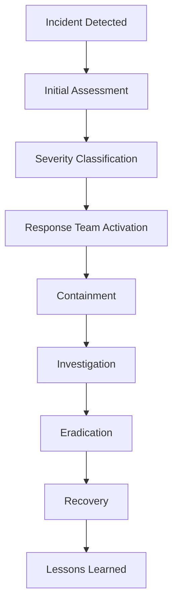

# Security Guide

This document provides comprehensive security guidelines and best practices for the Token Nexus Platform, covering both system administration and development security requirements.

## Table of Contents

1. [Overview](#overview)
2. [Security Architecture](#security-architecture)
3. [Authentication & Authorization](#authentication--authorization)
4. [Data Protection](#data-protection)
5. [Network Security](#network-security)
6. [Blockchain Security](#blockchain-security)
7. [Application Security](#application-security)
8. [Infrastructure Security](#infrastructure-security)
9. [Compliance & Governance](#compliance--governance)
10. [Incident Response](#incident-response)
11. [Security Monitoring](#security-monitoring)
12. [Best Practices](#best-practices)

## Overview

The Token Nexus Platform implements a multi-layered security approach to protect user data, organizational assets, and blockchain operations. This guide outlines security measures, best practices, and requirements for all stakeholders.

### Security Principles

1. **Defense in Depth**: Multiple security layers
2. **Least Privilege**: Minimal required access
3. **Zero Trust**: Verify everything, trust nothing
4. **Data Minimization**: Collect only necessary data
5. **Transparency**: Clear security policies
6. **Continuous Monitoring**: Ongoing security assessment

### Threat Model

**Primary Threats**:
- Unauthorized access to user accounts
- Data breaches and information disclosure
- Smart contract vulnerabilities
- Man-in-the-middle attacks
- Insider threats
- DDoS and availability attacks

**Assets to Protect**:
- User personal information
- Organization data and configurations
- Smart contracts and blockchain assets
- API keys and credentials
- Application source code
- Infrastructure components

## Security Architecture

### Platform Security Layers

```
┌─────────────────────────────────────────┐
│              User Interface             │
├─────────────────────────────────────────┤
│           API Gateway & WAF             │
├─────────────────────────────────────────┤
│        Application Layer (Parse)        │
├─────────────────────────────────────────┤
│           Database Layer                │
├─────────────────────────────────────────┤
│         Infrastructure Layer            │
├─────────────────────────────────────────┤
│        Blockchain Networks              │
└─────────────────────────────────────────┘
```

### Security Components

**Frontend Security**:
- Content Security Policy (CSP)
- XSS protection
- CSRF protection
- Secure session management
- Input validation

**Backend Security**:
- API authentication
- Rate limiting
- SQL injection prevention
- Secure coding practices
- Error handling

**Infrastructure Security**:
- Network segmentation
- Firewall configuration
- SSL/TLS encryption
- Monitoring and logging
- Backup security

## Authentication & Authorization

### User Authentication

#### Password Requirements

**Minimum Standards**:
- Minimum 8 characters
- At least one uppercase letter
- At least one lowercase letter
- At least one number
- At least one special character
- No common passwords or dictionary words

**Implementation**:
```javascript
// Password validation regex
const passwordRegex = /^(?=.*[a-z])(?=.*[A-Z])(?=.*\d)(?=.*[@$!%*?&])[A-Za-z\d@$!%*?&]{8,}$/;

// Password strength checking
function validatePassword(password) {
  if (!passwordRegex.test(password)) {
    throw new Error('Password does not meet security requirements');
  }
  
  // Check against common passwords
  if (isCommonPassword(password)) {
    throw new Error('Password is too common');
  }
  
  return true;
}
```

#### Multi-Factor Authentication (MFA)

**Required For**:
- System administrators
- Organization administrators
- Users with elevated privileges

**Supported Methods**:
- TOTP (Time-based One-Time Password)
- SMS-based codes
- Email-based codes
- Hardware security keys (FIDO2/WebAuthn)

**Implementation**:
```javascript
// MFA setup
const setupMFA = async (user, method) => {
  const secret = generateTOTPSecret();
  const qrCode = generateQRCode(secret, user.email);
  
  // Store encrypted secret
  await user.set('mfaSecret', encrypt(secret));
  await user.save();
  
  return { qrCode, backupCodes: generateBackupCodes() };
};
```

#### Session Management

**Session Security**:
- Secure session tokens
- Session timeout (24 hours default)
- Concurrent session limits
- Session invalidation on password change

**Implementation**:
```javascript
// Secure session configuration
const sessionConfig = {
  cookieSecure: true,
  cookieHttpOnly: true,
  cookieSameSite: 'strict',
  maxAge: 24 * 60 * 60 * 1000, // 24 hours
  regenerateOnLogin: true
};
```

### Authorization Framework

#### Role-Based Access Control (RBAC)

**System Roles**:
- **System Admin**: Full platform access
- **Organization Admin**: Organization management
- **User**: Standard user access
- **Viewer**: Read-only access

**Permission Structure**:
```javascript
const permissions = {
  'dashboard:read': 'View dashboard',
  'dashboard:write': 'Modify dashboard',
  'users:read': 'View users',
  'users:write': 'Manage users',
  'tokens:read': 'View tokens',
  'tokens:write': 'Create/modify tokens',
  'apps:install': 'Install applications',
  'system:admin': 'System administration'
};
```

#### Attribute-Based Access Control (ABAC)

**Dynamic Permissions**:
```javascript
// Context-aware authorization
const checkPermission = (user, resource, action, context) => {
  return {
    user: user.roles,
    resource: resource.type,
    action: action,
    environment: {
      time: context.timestamp,
      location: context.ipAddress,
      organization: context.orgId
    }
  };
};
```

## Data Protection

### Encryption Standards

#### Data at Rest

**Database Encryption**:
- AES-256 encryption for sensitive fields
- Encrypted database storage
- Key rotation every 90 days

**File Storage Encryption**:
```javascript
// File encryption implementation
const encryptFile = async (fileData, key) => {
  const cipher = crypto.createCipher('aes-256-gcm', key);
  const encrypted = Buffer.concat([
    cipher.update(fileData),
    cipher.final()
  ]);
  
  return {
    data: encrypted,
    tag: cipher.getAuthTag(),
    iv: cipher.getIV()
  };
};
```

#### Data in Transit

**TLS Configuration**:
- TLS 1.2 minimum (TLS 1.3 preferred)
- Perfect Forward Secrecy
- HSTS headers
- Certificate pinning

**API Security**:
```javascript
// Secure API headers
const securityHeaders = {
  'Strict-Transport-Security': 'max-age=31536000; includeSubDomains',
  'Content-Security-Policy': "default-src 'self'",
  'X-Frame-Options': 'DENY',
  'X-Content-Type-Options': 'nosniff',
  'Referrer-Policy': 'strict-origin-when-cross-origin'
};
```

### Data Classification

**Data Sensitivity Levels**:

**Public**: Publicly available information
- Organization names (if public)
- Public app descriptions
- Documentation

**Internal**: Organization-internal data
- User lists
- Internal configurations
- Usage statistics

**Confidential**: Sensitive business data
- User personal information
- Financial information
- Private configurations

**Restricted**: Highly sensitive data
- Authentication credentials
- Private keys
- Payment information

### Data Handling Requirements

**Personal Identifiable Information (PII)**:
- Encryption at rest and in transit
- Access logging
- Data minimization
- Regular purging of unused data

**Financial Data**:
- PCI DSS compliance where applicable
- Encrypted storage
- Audit trails
- Limited access

**Blockchain Data**:
- Private key security
- Secure key generation
- Key escrow procedures
- Multi-signature requirements

## Network Security

### Network Architecture

**Security Zones**:
```
Internet
    │
    ▼
┌─────────────┐
│     WAF     │ (Web Application Firewall)
└─────────────┘
    │
    ▼
┌─────────────┐
│ Load Balancer│
└─────────────┘
    │
    ▼
┌─────────────┐
│  App Servers │ (DMZ)
└─────────────┘
    │
    ▼
┌─────────────┐
│  Database   │ (Private Network)
└─────────────┘
```

### Firewall Configuration

**Default Deny Policy**:
```bash
# Inbound rules (restrictive)
- Allow HTTPS (443) from internet
- Allow SSH (22) from management network only
- Allow database (5432) from app servers only
- Deny all other inbound traffic

# Outbound rules
- Allow HTTPS (443) to internet
- Allow DNS (53) to DNS servers
- Allow NTP (123) to time servers
- Deny all other outbound traffic
```

### DDoS Protection

**Mitigation Strategies**:
- Rate limiting per IP
- Geographic blocking
- Challenge-response mechanisms
- CDN-based protection

**Implementation**:
```javascript
// Rate limiting middleware
const rateLimit = require('express-rate-limit');

const apiLimiter = rateLimit({
  windowMs: 15 * 60 * 1000, // 15 minutes
  max: 100, // Limit each IP to 100 requests per windowMs
  message: 'Too many requests from this IP',
  standardHeaders: true,
  legacyHeaders: false
});
```

## Blockchain Security

### Smart Contract Security

#### Development Best Practices

**Secure Coding Patterns**:
```solidity
// Reentrancy protection
contract SecureContract {
    bool private locked;
    
    modifier noReentrant() {
        require(!locked, "Reentrant call");
        locked = true;
        _;
        locked = false;
    }
    
    // Integer overflow protection
    function safeAdd(uint256 a, uint256 b) internal pure returns (uint256) {
        uint256 c = a + b;
        require(c >= a, "SafeMath: addition overflow");
        return c;
    }
}
```

**Security Checklist**:
- [ ] Reentrancy protection
- [ ] Integer overflow/underflow checks
- [ ] Access control implementation
- [ ] Input validation
- [ ] Gas limit considerations
- [ ] External call safety

#### Contract Auditing

**Audit Requirements**:
- Third-party security audit
- Automated security analysis
- Formal verification where applicable
- Bug bounty programs

**Tools Used**:
- Slither (static analysis)
- MythX (security analysis)
- Echidna (fuzzing)
- Manticore (symbolic execution)

### Private Key Management

#### Key Generation

**Requirements**:
- Cryptographically secure random number generation
- Sufficient entropy sources
- Hardware security modules (HSM) for high-value keys

**Implementation**:
```javascript
// Secure key generation
const crypto = require('crypto');
const secp256k1 = require('secp256k1');

const generatePrivateKey = () => {
  let privateKey;
  do {
    privateKey = crypto.randomBytes(32);
  } while (!secp256k1.privateKeyVerify(privateKey));
  
  return privateKey;
};
```

#### Key Storage

**Storage Options**:
- **Hot Wallets**: For operational use, encrypted storage
- **Cold Storage**: For long-term storage, offline devices
- **Multi-Signature**: For high-value operations

**Encryption Standards**:
```javascript
// Key encryption implementation
const encryptPrivateKey = (privateKey, password) => {
  const salt = crypto.randomBytes(32);
  const key = crypto.pbkdf2Sync(password, salt, 100000, 32, 'sha256');
  const cipher = crypto.createCipher('aes-256-cbc', key);
  
  return {
    encrypted: cipher.update(privateKey, 'hex', 'hex') + cipher.final('hex'),
    salt: salt.toString('hex'),
    iv: cipher.getIV().toString('hex')
  };
};
```

#### Transaction Security

**Multi-Signature Requirements**:
- Administrative operations require 2-of-3 signatures
- High-value transactions require additional approvals
- Time-locked transactions for sensitive operations

**Gas Management**:
```javascript
// Secure gas estimation
const estimateGas = async (transaction) => {
  const estimate = await web3.eth.estimateGas(transaction);
  const gasPrice = await web3.eth.getGasPrice();
  
  // Add 20% buffer and check against maximum
  const gasLimit = Math.min(estimate * 1.2, MAX_GAS_LIMIT);
  const maxCost = gasLimit * gasPrice;
  
  if (maxCost > MAX_TRANSACTION_COST) {
    throw new Error('Transaction cost exceeds maximum allowed');
  }
  
  return { gasLimit, gasPrice };
};
```

## Application Security

### Input Validation

#### Server-Side Validation

**Validation Framework**:
```javascript
const joi = require('joi');

// Input validation schemas
const userSchema = joi.object({
  email: joi.string().email().required(),
  password: joi.string().min(8).pattern(passwordRegex).required(),
  firstName: joi.string().alphanum().min(1).max(50).required(),
  lastName: joi.string().alphanum().min(1).max(50).required()
});

// Validation middleware
const validateInput = (schema) => {
  return (req, res, next) => {
    const { error } = schema.validate(req.body);
    if (error) {
      return res.status(400).json({
        error: 'Validation failed',
        details: error.details
      });
    }
    next();
  };
};
```

#### XSS Prevention

**Content Security Policy**:
```javascript
const cspOptions = {
  directives: {
    defaultSrc: ["'self'"],
    scriptSrc: ["'self'", "'unsafe-inline'"],
    styleSrc: ["'self'", "'unsafe-inline'"],
    imgSrc: ["'self'", "data:", "https:"],
    connectSrc: ["'self'"],
    fontSrc: ["'self'"],
    objectSrc: ["'none'"],
    mediaSrc: ["'self'"],
    frameSrc: ["'none'"]
  }
};
```

**Output Encoding**:
```javascript
// HTML encoding
const escapeHtml = (text) => {
  const map = {
    '&': '&amp;',
    '<': '&lt;',
    '>': '&gt;',
    '"': '&quot;',
    "'": '&#039;'
  };
  
  return text.replace(/[&<>"']/g, (m) => map[m]);
};
```

### CSRF Protection

**Token-Based Protection**:
```javascript
const csrf = require('csurf');

// CSRF middleware
const csrfProtection = csrf({
  cookie: {
    httpOnly: true,
    secure: true,
    sameSite: 'strict'
  }
});

// Token validation
app.use(csrfProtection);
app.use((req, res, next) => {
  res.locals.csrfToken = req.csrfToken();
  next();
});
```

### SQL Injection Prevention

**Parameterized Queries**:
```javascript
// Safe database queries
const getUserById = async (userId) => {
  const query = 'SELECT * FROM users WHERE id = $1';
  const result = await db.query(query, [userId]);
  return result.rows[0];
};

// Input sanitization
const sanitizeInput = (input) => {
  return input.replace(/[<>\"'%;()&+]/g, '');
};
```

### File Upload Security

**Secure File Handling**:
```javascript
const multer = require('multer');
const path = require('path');

// File upload configuration
const upload = multer({
  storage: multer.diskStorage({
    destination: (req, file, cb) => {
      cb(null, '/secure/uploads/');
    },
    filename: (req, file, cb) => {
      const uniqueSuffix = Date.now() + '-' + Math.round(Math.random() * 1E9);
      cb(null, uniqueSuffix + path.extname(file.originalname));
    }
  }),
  limits: {
    fileSize: 10 * 1024 * 1024, // 10MB limit
    files: 5 // Maximum 5 files
  },
  fileFilter: (req, file, cb) => {
    // Allow only specific file types
    const allowedTypes = ['.jpg', '.jpeg', '.png', '.pdf', '.doc', '.docx'];
    const fileExt = path.extname(file.originalname).toLowerCase();
    
    if (allowedTypes.includes(fileExt)) {
      cb(null, true);
    } else {
      cb(new Error('File type not allowed'), false);
    }
  }
});
```

## Infrastructure Security

### Server Hardening

#### Operating System Security

**Security Configuration**:
```bash
# Disable unnecessary services
systemctl disable telnet
systemctl disable ftp
systemctl disable rsh

# Configure secure SSH
# /etc/ssh/sshd_config
Protocol 2
PermitRootLogin no
PasswordAuthentication no
PubkeyAuthentication yes
MaxAuthTries 3
ClientAliveInterval 300
ClientAliveCountMax 2

# Enable firewall
ufw enable
ufw default deny incoming
ufw default allow outgoing
ufw allow ssh
ufw allow https
```

#### Database Security

**PostgreSQL Security Configuration**:
```sql
-- Create application user with limited privileges
CREATE USER app_user WITH PASSWORD 'strong_password';
GRANT CONNECT ON DATABASE app_db TO app_user;
GRANT USAGE ON SCHEMA public TO app_user;
GRANT SELECT, INSERT, UPDATE, DELETE ON ALL TABLES IN SCHEMA public TO app_user;

-- Enable SSL
ssl = on
ssl_cert_file = 'server.crt'
ssl_key_file = 'server.key'
ssl_ca_file = 'ca.crt'

-- Configure logging
log_statement = 'all'
log_connections = on
log_disconnections = on
```

### Container Security

**Docker Security Best Practices**:
```dockerfile
# Use official, minimal base images
FROM node:18-alpine

# Create non-root user
RUN addgroup -g 1001 -S nodejs
RUN adduser -S nextjs -u 1001

# Set secure ownership
COPY --chown=nextjs:nodejs . .

# Switch to non-root user
USER nextjs

# Expose only necessary ports
EXPOSE 3000

# Health check
HEALTHCHECK --interval=30s --timeout=3s --start-period=5s --retries=3 \
  CMD curl -f http://localhost:3000/health || exit 1
```

**Kubernetes Security**:
```yaml
apiVersion: v1
kind: Pod
metadata:
  name: app-pod
spec:
  securityContext:
    runAsNonRoot: true
    runAsUser: 1001
    fsGroup: 1001
  containers:
  - name: app
    image: app:latest
    securityContext:
      allowPrivilegeEscalation: false
      readOnlyRootFilesystem: true
      capabilities:
        drop:
        - ALL
```

### Monitoring and Logging

#### Security Event Logging

**Log Format**:
```json
{
  "timestamp": "2023-12-01T15:30:00.000Z",
  "level": "SECURITY",
  "event_type": "LOGIN_ATTEMPT",
  "user_id": "user123",
  "ip_address": "192.168.1.100",
  "user_agent": "Mozilla/5.0...",
  "result": "SUCCESS",
  "details": {
    "organization": "org456",
    "mfa_used": true,
    "location": "New York, US"
  }
}
```

**Events to Log**:
- Authentication attempts (success/failure)
- Permission changes
- Data access and modifications
- Administrative actions
- Security policy violations
- System errors and exceptions

#### SIEM Integration

**Security Information and Event Management**:
```javascript
// SIEM event forwarding
const forwardToSIEM = (event) => {
  const siemEvent = {
    source: 'token-nexus',
    facility: 'security',
    severity: getSeverity(event.type),
    message: formatMessage(event),
    structured_data: event.details
  };
  
  // Forward to SIEM system
  syslog.send(siemEvent);
};
```

## Compliance & Governance

### Regulatory Compliance

#### GDPR Compliance

**Data Subject Rights**:
- Right to access personal data
- Right to rectification
- Right to erasure ("right to be forgotten")
- Right to data portability
- Right to object to processing

**Implementation**:
```javascript
// GDPR data export
const exportUserData = async (userId) => {
  const userData = await User.findById(userId);
  const userTokens = await Token.find({ createdBy: userId });
  const userActivity = await ActivityLog.find({ userId });
  
  return {
    profile: userData.toJSON(),
    tokens: userTokens.map(t => t.toJSON()),
    activity: userActivity.map(a => a.toJSON()),
    exported_at: new Date().toISOString()
  };
};

// GDPR data deletion
const deleteUserData = async (userId) => {
  // Anonymize instead of delete where retention required
  await User.findByIdAndUpdate(userId, {
    email: `deleted-${userId}@example.com`,
    firstName: 'Deleted',
    lastName: 'User',
    deletedAt: new Date()
  });
  
  // Delete non-essential data
  await ActivityLog.deleteMany({ userId });
  await UserPreferences.deleteMany({ userId });
};
```

#### SOC 2 Compliance

**Control Objectives**:
- Security: Protection against unauthorized access
- Availability: System availability for operation and use
- Processing Integrity: System processing completeness and accuracy
- Confidentiality: Protection of confidential information
- Privacy: Protection of personal information

### Data Governance

#### Data Classification Framework

**Classification Levels**:
```javascript
const dataClassification = {
  PUBLIC: {
    level: 1,
    description: 'Publicly available information',
    handling: 'Standard security controls'
  },
  INTERNAL: {
    level: 2,
    description: 'Internal organizational data',
    handling: 'Access controls and encryption'
  },
  CONFIDENTIAL: {
    level: 3,
    description: 'Sensitive business information',
    handling: 'Strict access controls and encryption'
  },
  RESTRICTED: {
    level: 4,
    description: 'Highly sensitive data',
    handling: 'Maximum security controls'
  }
};
```

#### Data Retention Policies

**Retention Schedules**:
```javascript
const retentionPolicies = {
  audit_logs: '7 years',
  user_activity: '2 years',
  session_data: '30 days',
  error_logs: '1 year',
  security_events: '7 years',
  user_profiles: 'Until account deletion + 30 days'
};
```

## Incident Response

### Incident Classification

**Severity Levels**:

**Critical (P1)**:
- Data breach with PII exposure
- Complete system compromise
- Active attacks in progress

**High (P2)**:
- Partial system compromise
- Unauthorized access detected
- Security control failures

**Medium (P3)**:
- Security policy violations
- Suspicious activity detected
- Non-critical vulnerabilities

**Low (P4)**:
- Security awareness issues
- Minor configuration problems
- Information requests

### Incident Response Process

#### Response Workflow



#### Response Team Structure

**Incident Commander**: Overall incident coordination
**Security Analyst**: Technical investigation
**Communications Lead**: Internal/external communications
**Legal Counsel**: Legal and regulatory guidance
**Development Team**: System remediation

### Communication Procedures

#### Internal Communication

**Notification Matrix**:
```javascript
const notificationMatrix = {
  P1: {
    immediate: ['CISO', 'CTO', 'CEO'],
    within_1h: ['Security Team', 'Development Team'],
    within_4h: ['All Staff']
  },
  P2: {
    immediate: ['CISO', 'Security Team'],
    within_2h: ['CTO', 'Development Team'],
    within_8h: ['Management Team']
  }
};
```

#### External Communication

**Regulatory Notifications**:
- GDPR: 72 hours for data protection authorities
- SOX: Immediate for material weaknesses
- Industry regulations as applicable

**Customer Notifications**:
- Security incidents affecting customer data
- Service availability issues
- Recommended protective actions

## Security Monitoring

### Continuous Monitoring

#### Real-Time Alerting

**Alert Categories**:
```javascript
const alertTypes = {
  AUTHENTICATION: {
    failed_logins: { threshold: 5, window: '5m' },
    impossible_travel: { threshold: 1, window: '1h' },
    new_device_login: { threshold: 1, immediate: true }
  },
  DATA_ACCESS: {
    bulk_download: { threshold: 100, window: '10m' },
    privileged_access: { threshold: 1, immediate: true },
    off_hours_access: { threshold: 1, window: '1h' }
  },
  SYSTEM: {
    error_rate: { threshold: '5%', window: '5m' },
    response_time: { threshold: '2s', window: '1m' },
    resource_usage: { threshold: '90%', window: '5m' }
  }
};
```

#### Threat Detection

**Behavioral Analytics**:
```javascript
// Anomaly detection
const detectAnomalies = (userActivity) => {
  const baseline = getUserBaseline(userActivity.userId);
  const currentPattern = analyzePattern(userActivity);
  
  const anomalies = [];
  
  // Check for unusual access patterns
  if (currentPattern.accessTime.deviation > 2) {
    anomalies.push({
      type: 'unusual_access_time',
      severity: 'medium',
      details: currentPattern.accessTime
    });
  }
  
  // Check for unusual data access volume
  if (currentPattern.dataVolume > baseline.dataVolume * 3) {
    anomalies.push({
      type: 'unusual_data_access',
      severity: 'high',
      details: currentPattern.dataVolume
    });
  }
  
  return anomalies;
};
```

### Security Metrics

#### Key Performance Indicators

**Security KPIs**:
```javascript
const securityMetrics = {
  meanTimeToDetection: {
    target: '< 1 hour',
    current: calculateMTTD(),
    trend: 'improving'
  },
  meanTimeToResponse: {
    target: '< 4 hours',
    current: calculateMTTR(),
    trend: 'stable'
  },
  falsePositiveRate: {
    target: '< 5%',
    current: calculateFPR(),
    trend: 'improving'
  },
  securityTrainingCompletion: {
    target: '100%',
    current: getTrainingCompletion(),
    trend: 'stable'
  }
};
```

## Best Practices

### Development Security

#### Secure Development Lifecycle

**Phase Integration**:
1. **Requirements**: Security requirements definition
2. **Design**: Threat modeling and security architecture
3. **Implementation**: Secure coding practices
4. **Testing**: Security testing and code review
5. **Deployment**: Security configuration verification
6. **Maintenance**: Vulnerability management

#### Code Review Checklist

**Security Review Points**:
- [ ] Input validation implemented
- [ ] Authentication/authorization checks
- [ ] Sensitive data handling
- [ ] Error handling and logging
- [ ] Cryptographic implementations
- [ ] Third-party dependencies reviewed

### Operational Security

#### Security Awareness Training

**Training Topics**:
- Password security and MFA
- Phishing and social engineering
- Data handling procedures
- Incident reporting
- Physical security
- Remote work security

**Training Schedule**:
- New employee onboarding
- Annual refresher training
- Quarterly security updates
- Incident-driven training

#### Vulnerability Management

**Process Workflow**:
1. **Discovery**: Automated scanning and manual testing
2. **Assessment**: Risk evaluation and prioritization
3. **Remediation**: Patch development and deployment
4. **Verification**: Fix validation and testing
5. **Reporting**: Management and compliance reporting

**SLA Requirements**:
- Critical vulnerabilities: 24 hours
- High vulnerabilities: 7 days
- Medium vulnerabilities: 30 days
- Low vulnerabilities: 90 days

### Third-Party Security

#### Vendor Assessment

**Security Questionnaire**:
- Information security policies
- Data protection measures
- Access controls
- Incident response procedures
- Compliance certifications
- Security testing practices

#### Supply Chain Security

**Requirements**:
- Software bill of materials (SBOM)
- Vulnerability scanning of dependencies
- Secure development practices
- Incident notification procedures
- Right to audit

## Emergency Procedures

### Security Incident Hotline

**24/7 Security Hotline**: +1-XXX-XXX-XXXX  
**Email**: security-incident@tokennexus.com  
**Secure Portal**: https://security.tokennexus.com/report

### Emergency Contacts

**Internal Contacts**:
- CISO: +1-XXX-XXX-XXXX
- CTO: +1-XXX-XXX-XXXX
- Legal: +1-XXX-XXX-XXXX

**External Contacts**:
- Law Enforcement: Contact local authorities
- Cyber Insurance: Policy #XXXXX
- External Legal Counsel: +1-XXX-XXX-XXXX

### Business Continuity

**Recovery Time Objectives**:
- Critical systems: 4 hours
- Important systems: 24 hours
- Standard systems: 72 hours

**Recovery Point Objectives**:
- Financial data: 15 minutes
- User data: 1 hour
- Configuration data: 4 hours

---

*This security guide is reviewed and updated quarterly.*  
*Last updated: [Date]*  
*For security questions, contact: security@tokennexus.com*