# 🏗️ Token Nexus Platform - Application Deployment Infrastructure Completion Plan

## 📊 **CURRENT STATUS SUMMARY**

**Completed (~70%)**:
- ✅ Database schema and models
- ✅ Core backend cloud functions (app store management)
- ✅ Frontend UI components and state management
- ✅ Basic app lifecycle (submit → approve → publish)

**Critical Gaps (~30%)**:
- ❌ API bridge between frontend expectations and backend reality
- ❌ System admin management interfaces
- ❌ App runtime framework for execution
- ❌ Comprehensive testing coverage

## 🎯 **REVISED SCOPE**

Based on requirements analysis, we'll focus on these three phases:
1. **Phase 1**: Missing cloud functions and API bridge
2. **Phase 2**: System admin UI for app store management  
3. **Phase 3**: App runtime framework with hybrid web worker approach

## 🎯 **PHASE 1: CRITICAL API BRIDGE & MISSING CLOUD FUNCTIONS**

### **Problem Analysis**
The frontend expects specific cloud functions that don't exist, causing API mismatches:

```mermaid
graph TD
    A[Frontend API Calls] --> B{Cloud Function Exists?}
    B -->|No| C[❌ fetchAppDefinitions]
    B -->|No| D[❌ fetchOrgAppInstallations] 
    B -->|No| E[❌ installApp]
    B -->|No| F[❌ uninstallApp]
    B -->|No| G[❌ updateAppSettings]
    B -->|Yes| H[✅ listAppsForAdmin]
    B -->|Yes| I[✅ installAppInOrg]
    B -->|Yes| J[✅ getInstalledAppsForOrg]
```



### **1.1 Create Missing Cloud Functions**

**File**: `parse-server/src/cloud/marketplace.js`

```javascript
// New functions to match frontend expectations:

Parse.Cloud.define("fetchAppDefinitions", async (request) => {
  // Transform listAppsForAdmin for public marketplace
  // Filter only published apps
  // Return AppDefinitionForMarketplace format
  const { user } = request;
  const { category, search } = request.params;
  
  try {
    const query = new Parse.Query("AppDefinition");
    query.equalTo("status", "active");
    query.include(["latestPublishedVersion"]);
    
    if (category && category !== 'all') {
      query.equalTo("category", category);
    }
    
    if (search) {
      query.matches("name", search, "i");
    }
    
    const results = await query.find({ useMasterKey: true });
    
    return results.map(appDef => ({
      id: appDef.id,
      objectId: appDef.id,
      name: appDef.get("name"),
      description: appDef.get("description"),
      publisherName: appDef.get("publisherName"),
      category: appDef.get("category"),
      iconUrl: appDef.get("iconUrl"),
      tags: appDef.get("tags"),
      overallRating: appDef.get("overallRating"),
      reviewCount: appDef.get("reviewCount"),
      isFeatured: appDef.get("isFeatured"),
      status: appDef.get("status")
    }));
  } catch (error) {
    throw new Parse.Error(Parse.Error.INTERNAL_SERVER_ERROR, "Failed to fetch app definitions");
  }
});

Parse.Cloud.define("fetchOrgAppInstallations", async (request) => {
  // Wrapper around getInstalledAppsForOrg
  // Ensure consistent response format
  const { user } = request;
  const { organizationId } = request.params;
  
  try {
    const result = await Parse.Cloud.run("getInstalledAppsForOrg", {
      orgId: organizationId
    });
    
    return result;
  } catch (error) {
    throw new Parse.Error(Parse.Error.INTERNAL_SERVER_ERROR, "Failed to fetch org app installations");
  }
});

Parse.Cloud.define("installApp", async (request) => {
  // Wrapper around installAppInOrg
  // Handle version resolution automatically
  const { user } = request;
  const { appDefinitionId, versionId, appSpecificConfig } = request.params;
  
  if (!user) {
    throw new Parse.Error(Parse.Error.INVALID_SESSION_TOKEN, "User must be authenticated");
  }
  
  // Get user's current organization
  const fullUser = await new Parse.Query(Parse.User).include("orgId").get(user.id, { useMasterKey: true });
  const userOrgPointer = fullUser.get("orgId");
  
  if (!userOrgPointer) {
    throw new Parse.Error(Parse.Error.OPERATION_FORBIDDEN, "User is not associated with an organization");
  }
  
  try {
    const result = await Parse.Cloud.run("installAppInOrg", {
      orgId: userOrgPointer.id,
      appDefinitionId,
      versionId,
      appSpecificConfig
    });
    
    return result;
  } catch (error) {
    throw new Parse.Error(Parse.Error.INTERNAL_SERVER_ERROR, "Failed to install app");
  }
});

Parse.Cloud.define("uninstallApp", async (request) => {
  // Wrapper around uninstallAppFromOrg
  // Accept appDefinitionId instead of installationId
  const { user } = request;
  const { appDefinitionId } = request.params;
  
  if (!user) {
    throw new Parse.Error(Parse.Error.INVALID_SESSION_TOKEN, "User must be authenticated");
  }
  
  // Get user's current organization
  const fullUser = await new Parse.Query(Parse.User).include("orgId").get(user.id, { useMasterKey: true });
  const userOrgPointer = fullUser.get("orgId");
  
  if (!userOrgPointer) {
    throw new Parse.Error(Parse.Error.OPERATION_FORBIDDEN, "User is not associated with an organization");
  }
  
  try {
    // Find the installation record
    const query = new Parse.Query("OrgAppInstallation");
    query.equalTo("organization", userOrgPointer);
    query.equalTo("appDefinition", Parse.Object.extend("AppDefinition").createWithoutData(appDefinitionId));
    
    const installation = await query.first({ useMasterKey: true });
    
    if (!installation) {
      throw new Parse.Error(Parse.Error.OBJECT_NOT_FOUND, "App installation not found");
    }
    
    const result = await Parse.Cloud.run("uninstallAppFromOrg", {
      orgAppInstallationId: installation.id
    });
    
    return result;
  } catch (error) {
    throw new Parse.Error(Parse.Error.INTERNAL_SERVER_ERROR, "Failed to uninstall app");
  }
});

Parse.Cloud.define("updateAppSettings", async (request) => {
  // New function for updating app configurations
  const { user } = request;
  const { appDefinitionId, settings } = request.params;
  
  if (!user) {
    throw new Parse.Error(Parse.Error.INVALID_SESSION_TOKEN, "User must be authenticated");
  }
  
  // Get user's current organization
  const fullUser = await new Parse.Query(Parse.User).include("orgId").get(user.id, { useMasterKey: true });
  const userOrgPointer = fullUser.get("orgId");
  
  if (!userOrgPointer) {
    throw new Parse.Error(Parse.Error.OPERATION_FORBIDDEN, "User is not associated with an organization");
  }
  
  try {
    // Find the installation record
    const query = new Parse.Query("OrgAppInstallation");
    query.equalTo("organization", userOrgPointer);
    query.equalTo("appDefinition", Parse.Object.extend("AppDefinition").createWithoutData(appDefinitionId));
    
    const installation = await query.first({ useMasterKey: true });
    
    if (!installation) {
      throw new Parse.Error(Parse.Error.OBJECT_NOT_FOUND, "App installation not found");
    }
    
    // Update the configuration
    installation.set("appSpecificConfig", settings);
    await installation.save(null, { useMasterKey: true });
    
    return {
      success: true,
      message: "App settings updated successfully",
      installation: installation.toJSON()
    };
  } catch (error) {
    throw new Parse.Error(Parse.Error.INTERNAL_SERVER_ERROR, "Failed to update app settings");
  }
});
```

### **1.2 Fix API Response Formats**

**Files to Update**:
- `src/services/api/appMarketplace.ts` - Update to use new functions
- `src/store/slices/appSlice.ts` - Fix response handling
- `parse-server/src/cloud/orgAppInstallations.js` - Standardize responses

### **1.3 Data Transformation Layer**

Create consistent data transformation between Parse objects and frontend types:


## 🎯 **PHASE 2: SYSTEM ADMIN UI FOR APP STORE MANAGEMENT**

### **2.1 App Store Management Dashboard**

**New File**: `src/pages/system-admin/app-store.tsx`


### **2.2 App Review Interface**

**New Components**:
- `src/components/system-admin/AppReviewQueue.tsx`
- `src/components/system-admin/AppVersionReviewer.tsx`
- `src/components/system-admin/AppDefinitionManager.tsx`

**AppReviewQueue Component Structure**:
```typescript
interface AppReviewQueueProps {
  pendingVersions: AppVersionForMarketplace[];
  onApprove: (versionId: string) => void;
  onReject: (versionId: string, reason: string) => void;
  onViewDetails: (versionId: string) => void;
}

const AppReviewQueue: React.FC<AppReviewQueueProps> = ({
  pendingVersions,
  onApprove,
  onReject,
  onViewDetails
}) => {
  // Queue interface with filtering, sorting, bulk actions
  // Version comparison tools
  // Security scan results
  // Automated checks status
};
```

### **2.3 App Analytics Dashboard**

**Features**:
- Installation metrics per app
- Revenue tracking (if applicable)
- User engagement analytics
- Performance monitoring
- Security incident tracking

**Analytics Components**:
```typescript
interface AppAnalytics {
  totalInstallations: number;
  activeInstallations: number;
  installationTrend: TimeSeriesData[];
  topCategories: CategoryStats[];
  userEngagement: EngagementMetrics;
  securityEvents: SecurityEvent[];
}
```

## 🎯 **PHASE 3: APP RUNTIME FRAMEWORK (HYBRID APPROACH)**

### **3.1 Architecture Overview**


### **3.2 Core Components**

**App Runtime Manager**: `src/app-framework/AppRuntimeManager.ts`
```typescript
interface AppConfig {
  id: string;
  manifest: AppManifest;
  permissions: Permission[];
  resourceLimits: ResourceLimits;
}

interface AppInstance {
  id: string;
  worker: Worker;
  permissions: Permission[];
  state: 'loading' | 'running' | 'paused' | 'error';
  resourceUsage: ResourceUsage;
}

class AppRuntimeManager {
  private instances: Map<string, AppInstance> = new Map();
  private permissionManager: PermissionManager;
  private apiProxy: APIProxy;

  async loadApp(appId: string, config: AppConfig): Promise<AppInstance> {
    // Create isolated web worker
    // Load app bundle
    // Initialize permission context
    // Set up message handlers
    // Monitor resource usage
  }

  async unloadApp(appId: string): Promise<void> {
    // Cleanup resources
    // Terminate worker
    // Clear permissions
    // Save state if needed
  }

  async sendMessage(appId: string, message: any): Promise<any> {
    // Validate message
    // Route to appropriate app instance
    // Handle response
  }

  enforcePermissions(appId: string, action: string): boolean {
    // Check app permissions
    // Validate resource limits
    // Log access attempts
  }
}
```

**Web Worker Sandbox**: `src/app-framework/AppWorker.ts`
```typescript
// App Worker Template (runs in isolated context)
class AppWorkerRuntime {
  private appId: string;
  private permissions: Permission[];
  private apiProxy: WorkerAPIProxy;

  constructor(appId: string, manifest: AppManifest) {
    this.appId = appId;
    this.permissions = manifest.permissions;
    this.setupMessageHandlers();
    this.initializeApp(manifest);
  }

  private setupMessageHandlers(): void {
    self.onmessage = (event) => {
      const { type, payload } = event.data;
      
      switch (type) {
        case 'API_CALL':
          this.handleAPICall(payload);
          break;
        case 'UI_EVENT':
          this.handleUIEvent(payload);
          break;
        case 'SHUTDOWN':
          this.cleanup();
          break;
      }
    };
  }

  private async handleAPICall(payload: any): Promise<void> {
    // Validate permissions
    // Proxy to host application
    // Return response
  }

  private handleUIEvent(payload: any): void {
    // Process UI interactions
    // Update app state
    // Send UI updates to host
  }
}
```

**API Proxy Layer**: `src/app-framework/APIProxy.ts`
```typescript
interface APIRequest {
  appId: string;
  endpoint: string;
  method: string;
  data?: any;
  headers?: Record<string, string>;
}

interface APIResponse {
  success: boolean;
  data?: any;
  error?: string;
  usage: ResourceUsage;
}

class APIProxy {
  private permissionManager: PermissionManager;
  private usageTracker: UsageTracker;

  async validatePermission(appId: string, endpoint: string): Promise<boolean> {
    // Check app permissions for endpoint
    // Validate rate limits
    // Check resource quotas
  }

  async proxyRequest(appId: string, request: APIRequest): Promise<APIResponse> {
    // Validate permissions
    // Transform request if needed
    // Execute request
    // Track usage
    // Transform response
  }

  logAPIUsage(appId: string, endpoint: string, usage: ResourceUsage): void {
    // Track API usage
    // Update quotas
    // Generate analytics
  }
}
```

### **3.3 App Manifest System**

**App Manifest Schema**:
```typescript
interface AppManifest {
  id: string;
  name: string;
  version: string;
  description: string;
  
  // Entry points
  entryPoint: string; // Main app file
  workerScript?: string; // Custom worker script
  
  // Permissions
  permissions: Permission[];
  
  // Dependencies
  dependencies: Dependency[];
  
  // Resource limits
  resources: ResourceLimits;
  
  // UI configuration
  ui: UIConfiguration;
  
  // Security settings
  security: SecurityConfiguration;
}

interface Permission {
  type: 'api' | 'data' | 'ui' | 'network';
  resource: string;
  actions: string[];
  conditions?: PermissionCondition[];
}

interface ResourceLimits {
  memory: number; // MB
  cpu: number; // % of single core
  storage: number; // MB
  network: number; // requests per minute
  apiCalls: number; // calls per minute
}

interface UIConfiguration {
  container: 'modal' | 'sidebar' | 'fullscreen' | 'embedded';
  dimensions?: { width: number; height: number };
  resizable?: boolean;
  theme?: 'light' | 'dark' | 'auto';
}
```

### **3.4 Security & Isolation**

**Permission System**:
```typescript
enum PermissionType {
  API_ACCESS = 'api_access',
  DATA_READ = 'data_read',
  DATA_WRITE = 'data_write',
  UI_CONTROL = 'ui_control',
  NETWORK_ACCESS = 'network_access',
  FILE_ACCESS = 'file_access'
}

interface SecurityConfiguration {
  sandboxLevel: 'strict' | 'moderate' | 'permissive';
  allowedDomains: string[];
  blockedAPIs: string[];
  dataEncryption: boolean;
  auditLogging: boolean;
}
```

**Resource Monitoring**:
```typescript
interface ResourceUsage {
  memory: number;
  cpu: number;
  storage: number;
  networkRequests: number;
  apiCalls: number;
  timestamp: Date;
}

class ResourceMonitor {
  private usage: Map<string, ResourceUsage[]> = new Map();
  
  trackUsage(appId: string, usage: ResourceUsage): void {
    // Record usage metrics
    // Check against limits
    // Trigger alerts if needed
  }
  
  enforceLimit(appId: string, resource: keyof ResourceUsage): boolean {
    // Check current usage against limits
    // Return whether action is allowed
  }
  
  generateReport(appId: string, timeRange: TimeRange): UsageReport {
    // Generate usage analytics
    // Identify trends and anomalies
  }
}
```

## 🧪 **COMPREHENSIVE TESTING STRATEGY**

### **Testing Pyramid**


### **Test Coverage Areas**

1. **Cloud Function Tests**
   - API contract validation
   - Permission enforcement
   - Error handling
   - Data transformation

2. **UI Component Tests**
   - App marketplace browsing
   - Installation workflows
   - Admin interfaces
   - Error states

3. **Integration Tests**
   - End-to-end app installation
   - Admin approval workflows
   - App runtime execution
   - Permission enforcement

4. **Security Tests**
   - App isolation validation
   - Permission bypass attempts
   - Resource limit enforcement
   - API access control

### **Test Implementation**

**Cloud Function Tests**: `parse-server/tests/cloud-functions/marketplace.test.js`
```javascript
describe('Marketplace Cloud Functions', () => {
  describe('fetchAppDefinitions', () => {
    it('should return published apps only', async () => {
      // Test implementation
    });
    
    it('should filter by category', async () => {
      // Test implementation
    });
    
    it('should handle search queries', async () => {
      // Test implementation
    });
  });
  
  describe('installApp', () => {
    it('should install app for user organization', async () => {
      // Test implementation
    });
    
    it('should prevent duplicate installations', async () => {
      // Test implementation
    });
    
    it('should enforce permissions', async () => {
      // Test implementation
    });
  });
});
```

**App Runtime Tests**: `src/app-framework/__tests__/AppRuntimeManager.test.ts`
```typescript
describe('AppRuntimeManager', () => {
  let runtimeManager: AppRuntimeManager;
  
  beforeEach(() => {
    runtimeManager = new AppRuntimeManager();
  });
  
  describe('loadApp', () => {
    it('should create isolated app instance', async () => {
      // Test implementation
    });
    
    it('should enforce resource limits', async () => {
      // Test implementation
    });
    
    it('should validate permissions', async () => {
      // Test implementation
    });
  });
  
  describe('security', () => {
    it('should prevent cross-app data access', async () => {
      // Test implementation
    });
    
    it('should enforce API access controls', async () => {
      // Test implementation
    });
  });
});
```

## 📋 **IMPLEMENTATION TIMELINE**

### **Phase 1: API Bridge (Week 1-2)**
- **Day 1-3**: Create missing cloud functions
  - Implement `fetchAppDefinitions`
  - Implement `fetchOrgAppInstallations`
  - Implement `installApp` wrapper
  - Implement `uninstallApp` wrapper
  - Implement `updateAppSettings`

- **Day 4-6**: Fix API response formats
  - Update existing cloud functions for consistency
  - Standardize error handling
  - Add proper data transformation

- **Day 7-10**: Update frontend integration
  - Update `appMarketplace.ts` service
  - Fix `appSlice.ts` response handling
  - Test all API endpoints

- **Day 11-14**: Testing and validation
  - Write comprehensive API tests
  - Test error scenarios
  - Validate data consistency

### **Phase 2: System Admin UI (Week 3-4)**
- **Day 1-5**: App store management dashboard
  - Create main dashboard layout
  - Implement app definitions management
  - Add category management
  - Create app creation/editing forms

- **Day 6-8**: App review interface
  - Build review queue component
  - Implement version reviewer
  - Add approval/rejection workflows
  - Create bulk action tools

- **Day 9-12**: Analytics dashboard
  - Implement usage analytics
  - Add performance metrics
  - Create security monitoring
  - Build reporting tools

- **Day 13-14**: Integration and testing
  - Connect all components
  - Test admin workflows
  - Validate permissions

### **Phase 3: App Runtime Framework (Week 5-7)**
- **Day 1-7**: Core runtime architecture
  - Implement `AppRuntimeManager`
  - Create app manifest system
  - Build permission framework
  - Set up resource monitoring

- **Day 8-12**: Web worker sandbox implementation
  - Create worker template
  - Implement message bus
  - Add UI integration
  - Build app lifecycle management

- **Day 13-16**: API proxy and permissions
  - Implement `APIProxy` class
  - Add permission validation
  - Create usage tracking
  - Build security controls

- **Day 17-21**: Testing and security validation
  - Write comprehensive tests
  - Perform security audit
  - Test resource limits
  - Validate isolation

## 🎯 **SUCCESS CRITERIA**

### **Phase 1 Complete When:**
- ✅ All frontend API calls work without errors
- ✅ App installation/uninstallation flows functional
- ✅ Data consistency between frontend and backend
- ✅ Comprehensive API tests passing
- ✅ Error handling robust and user-friendly

### **Phase 2 Complete When:**
- ✅ System admins can manage app store completely
- ✅ App review workflow fully functional
- ✅ Analytics dashboard provides actionable insights
- ✅ All admin operations properly tested
- ✅ Permission system prevents unauthorized access

### **Phase 3 Complete When:**
- ✅ Apps run in isolated web workers
- ✅ Permission system enforces security policies
- ✅ API proxy controls access properly
- ✅ Resource limits prevent abuse
- ✅ Full security audit passes
- ✅ Performance meets requirements

## 🚀 **DEPLOYMENT STRATEGY**

### **Incremental Rollout**
1. **Phase 1**: Deploy API fixes to staging, test with existing UI
2. **Phase 2**: Deploy admin UI to limited admin users
3. **Phase 3**: Deploy runtime framework with pilot apps

### **Rollback Plan**
- Feature flags for each phase
- Database migration scripts
- API versioning for backward compatibility
- Monitoring and alerting for each component

### **Performance Monitoring**
- API response times
- App loading performance
- Resource usage tracking
- User experience metrics

---

This comprehensive plan provides a clear roadmap for completing the Token Nexus Platform's application deployment infrastructure. Each phase builds upon the previous one, ensuring a stable and secure foundation for the app marketplace ecosystem.