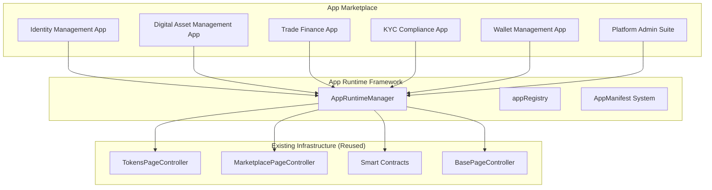
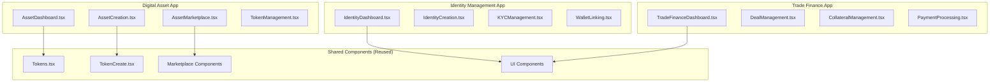
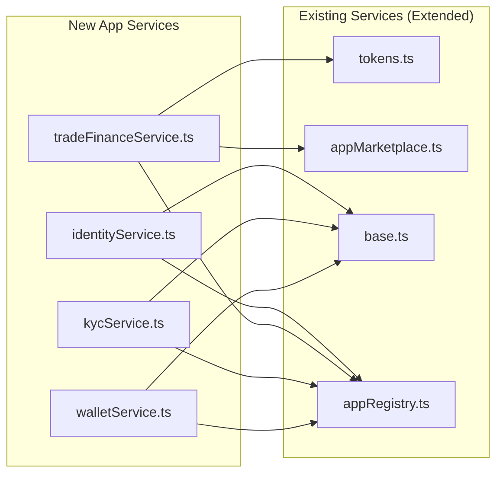

# Nomyx Platform Standard Applications - Implementation Plan

## Overview

This document outlines the comprehensive plan for implementing the Nomyx platform's standard application set as installable apps that leverage the existing infrastructure and app framework. Each application is packaged as a complete [`AppManifest`](../src/types/app-framework.d.ts) that integrates with the platform's marketplace, runtime manager, and existing controllers.

## Architecture Overview

The Nomyx standard applications follow a three-tier architecture that builds upon existing infrastructure:



## Core Integration Strategy

### 1. Reuse Existing Infrastructure
- **Token Management**: Leverage [`TokensPageController`](../src/controllers/TokensPageController.ts) actions and [`Tokens`](../src/components/pages/Tokens.tsx) components
- **Marketplace**: Extend [`MarketplacePageController`](../src/controllers/MarketplacePageController.ts) functionality
- **Smart Contracts**: Integrate with deployed contracts ([`IdentityFactory`](../src/config/evm-deployments/basesep/IdentityFactory.json), [`DiamondFactory`](../src/config/evm-deployments/basesep/DiamondFactory.json), various facets)
- **App Framework**: Use [`AppRuntimeManager`](../src/app-framework/AppRuntimeManager.ts) and [`appRegistry`](../src/services/appRegistry.ts)

### 2. App-Centric Architecture
- Each standard application is a complete [`AppManifest`](../src/types/app-framework.d.ts) package
- Apps can be installed independently via the marketplace
- Proper dependency management between apps
- Configuration-driven customization per organization

## Standard Applications

### 1. Identity Management App

**App ID**: `nomyx-identity-management`

**Core Features**:
- EVM identity creation via [`IdentityFactory`](../src/config/evm-deployments/basesep/IdentityFactory.json)
- KYC verification workflows
- Credential management and issuance
- Wallet linking with Dfns integration
- Social recovery mechanisms

**Smart Contract Integration**:
- [`IdentityFactory.json`](../src/config/evm-deployments/basesep/IdentityFactory.json) - Identity creation
- [`IdentityRegistryFacet.json`](../src/config/evm-deployments/basesep/IdentityRegistryFacet.json) - Identity registry
- [`ClaimTopicsRegistryFacet.json`](../src/config/evm-deployments/basesep/ClaimTopicsRegistryFacet.json) - KYC claims
- [`TrustedIssuersRegistryFacet.json`](../src/config/evm-deployments/basesep/TrustedIssuersRegistryFacet.json) - Trusted issuers

**App Manifest Structure**:
```typescript
export const identityManagementManifest: AppManifest = {
  id: 'nomyx-identity-management',
  name: 'Identity Management',
  version: '1.0.0',
  description: 'Complete digital identity and credential management system',
  publisher: 'Nomyx Platform',
  
  adminUI: {
    enabled: true,
    routes: [
      {
        path: '/',
        component: 'IdentityDashboard',
        title: 'Identity Dashboard'
      },
      {
        path: '/create',
        component: 'IdentityCreation',
        title: 'Create Identity'
      },
      {
        path: '/kyc',
        component: 'KYCManagement',
        title: 'KYC Management'
      }
    ],
    navigation: [
      { label: 'Identities', icon: '🆔', path: '/', order: 1 },
      { label: 'Create Identity', icon: '➕', path: '/create', order: 2 },
      { label: 'KYC', icon: '✅', path: '/kyc', order: 3 }
    ],
    permissions: ['identity:read', 'identity:write', 'identity:manage']
  },
  
  backend: {
    cloudFunctions: [
      'createIdentity',
      'verifyIdentity', 
      'linkWallet',
      'recoverIdentity',
      'manageCredentials'
    ],
    schemas: ['Identity', 'Credential', 'VerificationRequest']
  },
  
  dependencies: {
    platform: '1.0.0',
    permissions: ['blockchain:read', 'blockchain:write', 'dfns:manage']
  }
};
```

### 2. Digital Asset Management App

**App ID**: `nomyx-digital-assets`

**Core Features**:
- Asset tokenization and NFT minting
- Integration with existing [`TokensPageController`](../src/controllers/TokensPageController.ts)
- Marketplace functionality via [`MarketplacePageController`](../src/controllers/MarketplacePageController.ts)
- Royalty management and fee distribution
- Multi-chain asset support

**Smart Contract Integration**:
- [`ERC721PermissionedTokenFacet.json`](../src/config/evm-deployments/basesep/ERC721PermissionedTokenFacet.json) - NFT functionality
- [`GemforceMinterFacet.json`](../src/config/evm-deployments/basesep/GemforceMinterFacet.json) - Token minting
- [`MarketplaceFacet.json`](../src/config/evm-deployments/basesep/MarketplaceFacet.json) - Marketplace operations
- [`FeeDistributorFacet.json`](../src/config/evm-deployments/basesep/FeeDistributorFacet.json) - Royalty distribution

**Component Integration**:
```typescript
// Reuses existing token infrastructure
export const AssetDashboard: React.FC<AppComponentProps> = ({ 
  appId, config, organization, user, permissions 
}) => {
  const tokenController = new TokensPageController();
  
  const handleAssetCreation = async (assetData: any) => {
    return await appFramework.api.callAPI('/createAsset', 'POST', assetData);
  };
  
  return (
    <div>
      {/* Reuse existing Tokens component */}
      <Tokens />
      {/* Add asset-specific features */}
      <AssetCreationPanel onCreateAsset={handleAssetCreation} />
    </div>
  );
};
```

### 3. Trade Finance App

**App ID**: `nomyx-trade-finance`

**Core Features**:
- Trade deal creation and management
- Collateral tokenization
- DeFi-style lending protocols
- Automated payment processing
- Risk assessment and reporting

**Smart Contract Integration**:
- [`TradeDealFacet.json`](../src/config/evm-deployments/basesep/TradeDealFacet.json) - Trade deal management
- [`CollateralTokenFactoryFacet.json`](../src/config/evm-deployments/basesep/CollateralTokenFactoryFacet.json) - Collateral tokenization
- [`MultiSaleFacet.json`](../src/config/evm-deployments/basesep/MultiSaleFacet.json) - Multi-sale functionality
- [`FeeDistributorFacet.json`](../src/config/evm-deployments/basesep/FeeDistributorFacet.json) - Payment distribution

**Scheduled Jobs**:
```typescript
scheduledJobs: [
  {
    id: 'interest-calculation',
    name: 'Daily Interest Calculation',
    description: 'Calculate and compound interest on active loans',
    schedule: '0 0 * * *',
    function: 'calculateInterest',
    enabled: true
  },
  {
    id: 'payment-processing',
    name: 'Automated Payment Processing',
    description: 'Process scheduled payments and escrow releases',
    schedule: '0 */6 * * *',
    function: 'processScheduledPayments',
    enabled: true
  }
]
```

### 4. KYC Compliance App

**App ID**: `nomyx-kyc-compliance`

**Core Features**:
- Multi-provider KYC integration
- Compliance monitoring and reporting
- Risk scoring and sanctions screening
- Document verification workflows
- Regulatory reporting automation

### 5. Wallet Management App

**App ID**: `nomyx-wallet-management`

**Core Features**:
- Dfns wallet integration
- Multi-signature wallet creation
- Transaction signing workflows
- Security monitoring and alerts
- Recovery procedures

### 6. Platform Admin Suite

**App ID**: `nomyx-platform-admin`

**Core Features**:
- Organization onboarding and management
- App marketplace curation
- Compliance oversight and monitoring
- Billing and usage analytics
- Platform-wide security management

## Implementation Architecture

### Component Structure



### Service Layer Integration



## File Structure

```
src/
├── app-manifests/
│   ├── identity-management-manifest.ts      # New
│   ├── digital-asset-manifest.ts            # New
│   ├── trade-finance-manifest.ts            # New
│   ├── kyc-compliance-manifest.ts           # New
│   ├── wallet-management-manifest.ts        # New
│   └── platform-admin-manifest.ts           # New
├── components/
│   ├── apps/
│   │   ├── identity-management/
│   │   │   ├── IdentityDashboard.tsx        # New
│   │   │   ├── IdentityCreation.tsx         # New
│   │   │   ├── KYCManagement.tsx            # New
│   │   │   └── WalletLinking.tsx            # New
│   │   ├── digital-assets/
│   │   │   ├── AssetDashboard.tsx           # New (extends Tokens.tsx)
│   │   │   ├── AssetCreation.tsx            # New (extends TokenCreate.tsx)
│   │   │   ├── AssetMarketplace.tsx         # New
│   │   │   └── TokenManagement.tsx          # New
│   │   ├── trade-finance/
│   │   │   ├── TradeFinanceDashboard.tsx    # New
│   │   │   ├── DealManagement.tsx           # New
│   │   │   ├── CollateralManagement.tsx     # New
│   │   │   └── PaymentProcessing.tsx        # New
│   │   ├── kyc-compliance/
│   │   │   ├── KYCDashboard.tsx             # New
│   │   │   ├── VerificationWorkflow.tsx     # New
│   │   │   └── ComplianceReporting.tsx      # New
│   │   ├── wallet-management/
│   │   │   ├── WalletDashboard.tsx          # New
│   │   │   ├── WalletCreation.tsx           # New
│   │   │   └── TransactionSigning.tsx       # New
│   │   └── platform-admin/
│   │       ├── AdminDashboard.tsx           # New
│   │       ├── OrganizationManagement.tsx   # New
│   │       └── AppCuration.tsx              # New
│   └── pages/
│       ├── Tokens.tsx                       # Reused/Extended
│       ├── TokenCreate.tsx                  # Reused/Extended
│       └── marketplace.tsx                  # Reused/Extended
├── services/
│   ├── standardApps.ts                      # New - App registration
│   ├── api/
│   │   ├── identity.ts                      # New
│   │   ├── tradeFinance.ts                  # New
│   │   ├── kyc.ts                           # New
│   │   ├── wallet.ts                        # New
│   │   ├── tokens.ts                        # Extended
│   │   └── appMarketplace.ts                # Extended
│   └── appRegistry.ts                       # Extended
├── cloud-functions/
│   ├── identity-management/
│   │   ├── createIdentity.js                # New
│   │   ├── verifyIdentity.js                # New
│   │   └── linkWallet.js                    # New
│   ├── digital-assets/
│   │   ├── createAsset.js                   # New
│   │   ├── mintTokens.js                    # New
│   │   └── transferAsset.js                 # New
│   ├── trade-finance/
│   │   ├── createTradeDeal.js               # New
│   │   ├── fundDeal.js                      # New
│   │   └── processPayments.js               # New
│   ├── kyc-compliance/
│   │   ├── initiateKYC.js                   # New
│   │   ├── verifyDocuments.js               # New
│   │   └── generateComplianceReport.js      # New
│   └── wallet-management/
│       ├── createWallet.js                  # New
│       ├── signTransaction.js               # New
│       └── recoverWallet.js                 # New
└── controllers/
    ├── TokensPageController.ts              # Extended
    ├── MarketplacePageController.ts         # Extended
    └── base/
        └── BasePageController.ts            # Reused
```

## Cloud Function Integration

### App-Specific Cloud Functions

Each app includes cloud functions that integrate with existing infrastructure:

```javascript
// Identity Management App Cloud Functions
Parse.Cloud.define('createIdentity', async (request) => {
  const { orgId, userData } = request.params;
  
  // Use existing IdentityFactory contract
  const identityFactory = await getContract('IdentityFactory');
  const result = await identityFactory.createIdentity(userData);
  
  // Store in Parse
  const Identity = Parse.Object.extend('Identity');
  const identity = new Identity();
  identity.set('address', result.address);
  identity.set('organizationId', orgId);
  identity.set('userData', userData);
  
  return await identity.save();
});

// Digital Asset App Cloud Functions
Parse.Cloud.define('createAsset', async (request) => {
  const { tokenData } = request.params;
  
  // Reuse existing token creation logic
  const tokenController = new TokensPageController();
  const result = await tokenController.actions.get('createToken').execute(
    tokenData, 
    request.context
  );
  
  // Add asset-specific metadata
  const DigitalAsset = Parse.Object.extend('DigitalAsset');
  const asset = new DigitalAsset();
  asset.set('tokenId', result.data.token.id);
  asset.set('metadata', tokenData.metadata);
  
  return await asset.save();
});

// Trade Finance App Cloud Functions
Parse.Cloud.define('createTradeDeal', async (request) => {
  const { dealData } = request.params;
  
  // Use TradeDealFacet contract
  const tradeDealFacet = await getContract('TradeDealFacet');
  const result = await tradeDealFacet.createDeal(dealData);
  
  // Store deal metadata
  const TradeDeal = Parse.Object.extend('TradeDeal');
  const deal = new TradeDeal();
  deal.set('contractAddress', result.address);
  deal.set('dealData', dealData);
  
  return await deal.save();
});
```

## App Registration Process

### Standard Apps Registration

```typescript
// src/services/standardApps.ts
import { identityManagementManifest } from '@/app-manifests/identity-management-manifest';
import { digitalAssetManifest } from '@/app-manifests/digital-asset-manifest';
import { tradeFinanceManifest } from '@/app-manifests/trade-finance-manifest';
import { kycComplianceManifest } from '@/app-manifests/kyc-compliance-manifest';
import { walletManagementManifest } from '@/app-manifests/wallet-management-manifest';
import { platformAdminManifest } from '@/app-manifests/platform-admin-manifest';

export const registerStandardApps = async () => {
  const appRegistry = AppRegistryService.getInstance();
  
  const standardApps = [
    {
      manifest: identityManagementManifest,
      components: new Map([
        ['IdentityDashboard', IdentityDashboard],
        ['IdentityCreation', IdentityCreation],
        ['KYCManagement', KYCManagement],
        ['WalletLinking', WalletLinking]
      ])
    },
    {
      manifest: digitalAssetManifest,
      components: new Map([
        ['AssetDashboard', AssetDashboard],
        ['AssetCreation', AssetCreation],
        ['AssetMarketplace', AssetMarketplace],
        ['TokenManagement', TokenManagement]
      ])
    },
    {
      manifest: tradeFinanceManifest,
      components: new Map([
        ['TradeFinanceDashboard', TradeFinanceDashboard],
        ['DealManagement', DealManagement],
        ['CollateralManagement', CollateralManagement],
        ['PaymentProcessing', PaymentProcessing]
      ])
    },
    {
      manifest: kycComplianceManifest,
      components: new Map([
        ['KYCDashboard', KYCDashboard],
        ['VerificationWorkflow', VerificationWorkflow],
        ['ComplianceReporting', ComplianceReporting]
      ])
    },
    {
      manifest: walletManagementManifest,
      components: new Map([
        ['WalletDashboard', WalletDashboard],
        ['WalletCreation', WalletCreation],
        ['TransactionSigning', TransactionSigning]
      ])
    },
    {
      manifest: platformAdminManifest,
      components: new Map([
        ['AdminDashboard', AdminDashboard],
        ['OrganizationManagement', OrganizationManagement],
        ['AppCuration', AppCuration]
      ])
    }
  ];
  
  for (const app of standardApps) {
    const installation: OrgAppInstallation = {
      objectId: `${app.manifest.id}-installation`,
      organization: { objectId: 'org-1', __type: 'Pointer', className: 'Organization' },
      appDefinition: {
        id: app.manifest.id,
        objectId: app.manifest.id,
        name: app.manifest.name,
        description: app.manifest.description,
        publisherName: app.manifest.publisher,
        category: 'platform',
        status: 'published'
      },
      installedVersion: {
        id: `${app.manifest.id}-v${app.manifest.version}`,
        objectId: `${app.manifest.id}-v${app.manifest.version}`,
        versionString: app.manifest.version,
        status: 'published',
        createdAt: new Date().toISOString(),
        updatedAt: new Date().toISOString()
      },
      installationDate: new Date().toISOString(),
      status: 'active',
      appSpecificConfig: app.manifest.configuration?.defaultValues || {},
      installedBy: { objectId: 'system', __type: 'Pointer', className: '_User' }
    };
    
    appRegistry.registerApp(app.manifest, installation, app.components);
  }
};
```

## Marketplace Integration

### App Marketplace Entries

Each standard app becomes available in the marketplace:

```typescript
const standardAppDefinitions: AppDefinitionForMarketplace[] = [
  {
    id: 'nomyx-identity-management',
    name: 'Identity Management',
    description: 'Complete digital identity and credential management system',
    publisherName: 'Nomyx Platform',
    category: 'identity',
    status: 'published',
    features: [
      'EVM Identity Creation',
      'KYC Integration',
      'Credential Management',
      'Wallet Linking',
      'Social Recovery'
    ],
    pricing: {
      model: 'subscription',
      price: 99,
      currency: 'USD',
      period: 'monthly'
    }
  },
  {
    id: 'nomyx-digital-assets',
    name: 'Digital Asset Management',
    description: 'Complete tokenization and digital asset management platform',
    publisherName: 'Nomyx Platform',
    category: 'assets',
    status: 'published',
    features: [
      'Asset Tokenization',
      'NFT Minting',
      'Marketplace Integration',
      'Royalty Management',
      'Multi-chain Support'
    ],
    pricing: {
      model: 'subscription',
      price: 149,
      currency: 'USD',
      period: 'monthly'
    }
  },
  {
    id: 'nomyx-trade-finance',
    name: 'Trade Finance Platform',
    description: 'Complete trade finance and lending platform with DeFi integration',
    publisherName: 'Nomyx Platform',
    category: 'finance',
    status: 'published',
    features: [
      'Trade Deal Creation',
      'Collateral Tokenization',
      'DeFi Integration',
      'Automated Payments',
      'Risk Assessment'
    ],
    pricing: {
      model: 'subscription',
      price: 299,
      currency: 'USD',
      period: 'monthly'
    }
  },
  {
    id: 'nomyx-kyc-compliance',
    name: 'KYC Compliance Suite',
    description: 'Comprehensive KYC and compliance management platform',
    publisherName: 'Nomyx Platform',
    category: 'compliance',
    status: 'published',
    features: [
      'Multi-provider KYC',
      'Compliance Monitoring',
      'Risk Scoring',
      'Document Verification',
      'Regulatory Reporting'
    ],
    pricing: {
      model: 'subscription',
      price: 199,
      currency: 'USD',
      period: 'monthly'
    }
  },
  {
    id: 'nomyx-wallet-management',
    name: 'Wallet Management',
    description: 'Secure wallet creation and management with Dfns integration',
    publisherName: 'Nomyx Platform',
    category: 'security',
    status: 'published',
    features: [
      'Dfns Integration',
      'Multi-sig Wallets',
      'Transaction Signing',
      'Security Monitoring',
      'Recovery Procedures'
    ],
    pricing: {
      model: 'subscription',
      price: 79,
      currency: 'USD',
      period: 'monthly'
    }
  },
  {
    id: 'nomyx-platform-admin',
    name: 'Platform Administration',
    description: 'Complete platform administration and management suite',
    publisherName: 'Nomyx Platform',
    category: 'administration',
    status: 'published',
    features: [
      'Organization Management',
      'App Curation',
      'Compliance Oversight',
      'Usage Analytics',
      'Security Management'
    ],
    pricing: {
      model: 'enterprise',
      price: 999,
      currency: 'USD',
      period: 'monthly'
    }
  }
];
```

## Implementation Phases

### Phase 1: Foundation Setup (Weeks 1-2)
1. **Create App Manifests**
   - Define all six standard app manifests
   - Configure routes, navigation, and permissions
   - Set up dependencies and configuration schemas

2. **Set Up File Structure**
   - Create app-specific component directories
   - Set up service layer extensions
   - Prepare cloud function structure

3. **Basic Registration**
   - Implement `registerStandardApps()` function
   - Test app registration with [`appRegistry`](../src/services/appRegistry.ts)
   - Verify marketplace integration

### Phase 2: Core Applications (Weeks 3-6)
1. **Identity Management App**
   - Implement identity creation via [`IdentityFactory`](../src/config/evm-deployments/basesep/IdentityFactory.json)
   - Build KYC verification workflows
   - Create credential management system
   - Integrate Dfns wallet linking

2. **Digital Asset Management App**
   - Extend [`TokensPageController`](../src/controllers/TokensPageController.ts) functionality
   - Integrate [`ERC721PermissionedTokenFacet`](../src/config/evm-deployments/basesep/ERC721PermissionedTokenFacet.json)
   - Build asset marketplace using existing components
   - Implement royalty management

### Phase 3: Advanced Applications (Weeks 7-10)
1. **Trade Finance App**
   - Implement [`TradeDealFacet`](../src/config/evm-deployments/basesep/TradeDealFacet.json) integration
   - Build collateral tokenization system
   - Create automated payment processing
   - Implement risk assessment tools

2. **KYC Compliance App**
   - Multi-provider KYC integration
   - Compliance monitoring dashboard
   - Regulatory reporting automation
   - Risk scoring algorithms

### Phase 4: Management Applications (Weeks 11-12)
1. **Wallet Management App**
   - Dfns integration and wallet creation
   - Multi-signature wallet support
   - Transaction signing workflows
   - Security monitoring and alerts

2. **Platform Admin Suite**
   - Organization management tools
   - App marketplace curation
   - Platform-wide analytics
   - Compliance oversight dashboard

### Phase 5: Integration & Testing (Weeks 13-14)
1. **End-to-End Testing**
   - Test app installation and configuration
   - Verify inter-app dependencies
   - Test marketplace functionality
   - Performance optimization

2. **Documentation & Training**
   - Complete user documentation
   - Admin training materials
   - API documentation
   - Deployment guides

## Benefits of This Architecture

### 1. Infrastructure Reuse
- **Leverages Existing Controllers**: Reuses [`TokensPageController`](../src/controllers/TokensPageController.ts), [`MarketplacePageController`](../src/controllers/MarketplacePageController.ts)
- **Smart Contract Integration**: Direct integration with deployed contracts
- **Component Reuse**: Extends existing [`Tokens`](../src/components/pages/Tokens.tsx) and marketplace components
- **Service Layer Extension**: Builds upon existing API services

### 2. App Framework Integration
- **Marketplace Ready**: Each app can be installed via existing marketplace
- **Runtime Management**: Managed by [`AppRuntimeManager`](../src/app-framework/AppRuntimeManager.ts)
- **Configuration Driven**: Uses app configuration system for customization
- **Dependency Management**: Proper inter-app dependencies

### 3. Scalability & Modularity
- **Independent Installation**: Apps can be installed separately
- **Configurable Features**: Per-organization customization
- **Extensible Architecture**: Easy to add new apps or features
- **Version Management**: Proper versioning and updates

### 4. Business Model Support
- **Subscription Pricing**: Different pricing tiers per app
- **Feature Gating**: Premium features based on subscription
- **Usage Analytics**: Track app usage and performance
- **Customer Success**: Monitor adoption and engagement

## Conclusion

This implementation plan provides a comprehensive, app-centric architecture for the Nomyx standard applications that:

- **Maximally Reuses Existing Infrastructure**: Leverages controllers, components, smart contracts, and services
- **Follows App Framework Patterns**: Uses [`AppManifest`](../src/types/app-framework.d.ts) system and marketplace integration
- **Provides Complete Functionality**: Covers identity, assets, trade finance, compliance, and administration
- **Supports Business Goals**: Enables subscription-based revenue and customer success tracking
- **Maintains Modularity**: Each app is independently installable and configurable

The result is a robust, scalable platform that provides comprehensive digital tokenization, identity management, and trade finance capabilities while building upon the existing Nomyx infrastructure.