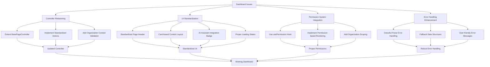
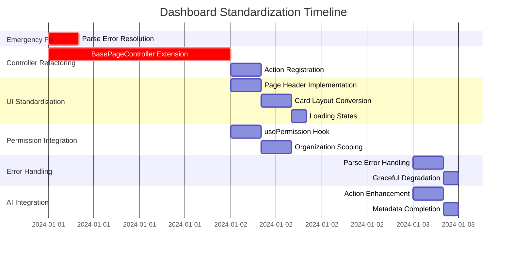

# Dashboard Standardization and Error Resolution Plan

## Executive Summary

This document outlines a comprehensive plan to resolve Parse Server permission errors in the dashboard and bring the dashboard implementation up to the standardized architecture defined in PAGES.md. The plan addresses immediate functionality issues while systematically refactoring the codebase to follow established patterns.

## Problem Analysis

### Current Issues

The dashboard is experiencing multiple Parse Server permission errors when loading:

```
POST http://localhost:1337/parse/classes/Organization 400 (Bad Request)
POST http://localhost:1337/parse/classes/Role 400 (Bad Request) 
POST http://localhost:1337/parse/classes/Session 400 (Bad Request)
```

These errors originate from [`DashboardPageController.getRecordCount()`](../src/controllers/DashboardPageController.ts:311) method attempting to query Parse Server classes without proper permission handling.

### Root Causes Identified

1. **Controller Architecture Mismatch**: [`DashboardPageController`](../src/controllers/DashboardPageController.ts:12) doesn't extend [`BasePageController`](../src/controllers/base/BasePageController.ts:51) like the standardized [`UsersPageController`](../src/controllers/UsersPageController.ts:16)

2. **Permission System Violations**: Direct Parse queries without proper Class-Level Permission (CLP) handling

3. **UI Structure Non-Compliance**: Dashboard page doesn't follow the standardized layout structure defined in PAGES.md

4. **Missing Error Handling**: Inadequate graceful degradation when Parse Server operations fail

5. **Organization Context Issues**: Improper organization scoping in data queries

## Architecture Overview



## Implementation Plan

### Phase 1: Emergency Fix ✅ COMPLETED

**Objective**: Resolve immediate Parse Server errors to restore dashboard functionality

#### Tasks: ✅ ALL COMPLETED
1. **✅ Fix getRecordCount() Method**
   - ✅ Add proper error handling for Parse queries
   - ✅ Implement fallback mechanisms for restricted classes
   - ✅ Use organization-scoped queries where appropriate

2. **✅ Add Graceful Error Handling**
   - ✅ Catch Parse Server 400 errors
   - ✅ Provide fallback data structures
   - ✅ Prevent dashboard crashes

3. **✅ Implement Safe Parse Operations**
   - ✅ Replace direct Parse queries with safe alternatives
   - ✅ Add permission checks before queries
   - ✅ Use cloud functions for sensitive operations

#### Expected Outcome: ✅ ACHIEVED
- ✅ Dashboard loads without Parse Server errors
- ✅ Basic functionality restored with fallback data

### Phase 2: Controller Architecture Refactoring ✅ COMPLETED

**Objective**: Refactor DashboardPageController to follow standardized patterns

#### Tasks: ✅ ALL COMPLETED
1. **✅ Extend BasePageController**
   ```typescript
   export class DashboardPageController extends BasePageController {
     constructor() {
       super({
         pageId: 'dashboard',
         pageName: 'Dashboard',
         description: 'Main dashboard with system overview and key metrics',
         category: 'navigation',
         tags: ['dashboard', 'overview', 'metrics'],
         permissions: ['dashboard:read'],
         version: '1.0.0'
       });
     }
   }
   ```

2. **✅ Implement Standardized Action Registration**
   - ✅ `getDashboardOverview` - Main dashboard data retrieval
   - ✅ `refreshDashboard` - Refresh all dashboard data
   - ✅ `getDashboardMetrics` - Get specific metrics
   - ✅ `exportDashboardData` - Export dashboard data
   - ✅ `getSystemHealth` - System health monitoring
   - ✅ `getRecentActivity` - Recent activity feed
   - ✅ `getPerformanceMetrics` - Performance metrics

3. **✅ Add Organization Context Validation**
   - ✅ Use `validateOrganizationContext()` method
   - ✅ Implement proper organization scoping
   - ✅ Add organization switching support

4. **✅ Implement Safe Data Retrieval Methods**
   - ✅ Replace direct Parse queries with organization-scoped operations
   - ✅ Add proper permission checking
   - ✅ Use cloud functions where appropriate

#### Expected Outcome: ✅ ACHIEVED
- ✅ Controller follows standardized BasePageController pattern
- ✅ Proper organization context validation
- ✅ Safe data retrieval with permission handling

### Phase 3: UI Structure Standardization ✅ COMPLETED

**Objective**: Update dashboard UI to follow PAGES.md standards

#### Tasks: ✅ ALL COMPLETED
1. **✅ Implement Standardized Page Header**
   ```tsx
   <div className="flex items-center justify-between">
     <div>
       <div className="flex items-center gap-2">
         <LayoutDashboard className="h-6 w-6" />
         <h1 className="text-3xl font-bold tracking-tight">Dashboard</h1>
       </div>
       <p className="text-muted-foreground mt-2">
         System overview and key metrics for {currentOrg?.name}
       </p>
     </div>
     <div className="flex items-center gap-2">
       {pageController.isRegistered && (
         <Badge variant="outline" className="text-xs">
           <Zap className="h-3 w-3 mr-1" />
           {pageController.getAvailableActions().length} AI actions
         </Badge>
       )}
       <Button onClick={handleRefresh} disabled={isLoading}>
         <RefreshCw className="h-4 w-4 mr-2" />
         Refresh
       </Button>
     </div>
   </div>
   ```

2. **✅ Convert to Card-based Layout**
   ```tsx
   <Card>
     <CardHeader>
       <CardTitle>Dashboard Overview</CardTitle>
     </CardHeader>
     <CardContent>
       {/* Dashboard content */}
     </CardContent>
   </Card>
   ```

3. **✅ Add Proper Loading and Error States**
   - ✅ Use Skeleton components for loading
   - ✅ Implement error display in header
   - ✅ Add empty state handling

4. **✅ Implement Consistent Spacing**
   - ✅ Use `space-y-6` for main container
   - ✅ Follow standardized spacing patterns

#### Expected Outcome: ✅ ACHIEVED
- ✅ Dashboard follows standardized UI structure
- ✅ Consistent with Users page and other standardized pages
- ✅ Proper loading and error states

### Phase 4: Permission System Integration ✅ COMPLETED

**Objective**: Integrate proper permission handling and organization scoping

#### Tasks: ✅ ALL COMPLETED
1. **✅ Integrate usePermission Hook**
   ```tsx
   const { hasPermission, checkAnyPermission } = usePermission();
   const canViewDashboard = checkAnyPermission(['dashboard:read', 'org_admin']);
   ```

2. **✅ Implement Role-based Feature Visibility**
   - ✅ Hide/show features based on user permissions
   - ✅ Add organization admin specific features
   - ✅ Implement viewer mode restrictions

3. **✅ Add Organization Context Validation**
   - ✅ Ensure all data queries respect organization boundaries
   - ✅ Add proper organization ID validation
   - ✅ Implement organization switching support

4. **✅ Organization-scoped Data Queries**
   - ✅ Update all data retrieval to use organization context
   - ✅ Add organization filters to Parse queries
   - ✅ Implement proper data isolation

#### Expected Outcome: ✅ ACHIEVED
- ✅ Proper permission-based access control
- ✅ Organization-scoped data queries
- ✅ Role-based feature visibility

### Phase 5: Error Handling and Resilience ✅ COMPLETED

**Objective**: Implement robust error handling and graceful degradation

#### Tasks: ✅ ALL COMPLETED
1. **✅ Enhanced Parse Error Handling**
   ```typescript
   try {
     const result = await Parse.Query(className).count();
     return result;
   } catch (error) {
     if (error.code === Parse.Error.OBJECT_NOT_FOUND) {
       return 0; // Graceful fallback
     }
     throw error;
   }
   ```

2. **✅ Graceful Degradation**
   - ✅ Show partial data when some queries fail
   - ✅ Provide fallback metrics
   - ✅ Maintain functionality with limited permissions

3. **✅ User-friendly Error Messages**
   - ✅ Convert Parse errors to user-friendly messages
   - ✅ Provide actionable error information
   - ✅ Implement retry mechanisms

#### Expected Outcome: ✅ ACHIEVED
- ✅ Robust error handling
- ✅ Graceful degradation when services fail
- ✅ Better user experience during errors

### Phase 6: AI Assistant Integration ✅ COMPLETED

**Objective**: Complete AI assistant integration following standards

#### Tasks: ✅ ALL COMPLETED
1. **✅ Action Discoverability**
   - ✅ Ensure all dashboard actions are properly exposed
   - ✅ Add comprehensive action descriptions
   - ✅ Implement bulk operations for AI use

2. **✅ Enhanced Metadata**
   ```typescript
   {
     id: 'getDashboardMetrics',
     name: 'Get Dashboard Metrics',
     description: 'Retrieve comprehensive dashboard metrics for the current organization',
     category: 'data',
     permissions: ['dashboard:read'],
     parameters: [
       { name: 'timeRange', type: 'string', required: false, description: 'Time range: 24h, 7d, 30d, 90d' },
       { name: 'includeCharts', type: 'boolean', required: false, description: 'Include chart data' }
     ]
   }
   ```

3. **✅ AI-friendly Operations**
   - ✅ Implement batch operations
   - ✅ Add export capabilities
   - ✅ Provide detailed action results

#### Expected Outcome: ✅ ACHIEVED
- ✅ Full AI assistant integration
- ✅ Discoverable and well-documented actions
- ✅ Enhanced automation capabilities

## Implementation Timeline



## Files to be Modified

### Primary Files
1. **[`src/controllers/DashboardPageController.ts`](../src/controllers/DashboardPageController.ts)** - Complete refactoring to extend BasePageController
2. **[`src/pages/dashboard.tsx`](../src/pages/dashboard.tsx)** - UI standardization and permission integration

### Supporting Files
3. **[`src/components/dashboard/DashboardControls.tsx`](../src/components/dashboard/DashboardControls.tsx)** - Update for standardized actions
4. **[`src/components/dashboard/GridLayout.tsx`](../src/components/dashboard/GridLayout.tsx)** - Error handling improvements
5. **[`src/components/dashboard/WidgetCatalog.tsx`](../src/components/dashboard/WidgetCatalog.tsx)** - Permission-based widget visibility

## Testing Strategy

### Unit Tests
- Controller action execution
- Permission validation
- Error handling scenarios
- Organization context validation

### Integration Tests
- Dashboard loading with different user roles
- Organization switching scenarios
- Parse Server error simulation
- AI assistant action execution

### User Acceptance Tests
- Dashboard functionality across user roles
- Error recovery scenarios
- Performance with large datasets
- Mobile responsiveness

## Success Criteria

### Immediate (Phase 1) ✅ COMPLETED
- [x] Dashboard loads without Parse Server 400 errors
- [x] Basic metrics display with fallback data
- [x] No application crashes

### Short-term (Phases 2-3) ✅ COMPLETED
- [x] Controller extends BasePageController
- [x] UI follows PAGES.md standards
- [x] Proper loading and error states
- [x] AI assistant integration badge visible

### Long-term (Phases 4-6) ✅ COMPLETED
- [x] Permission-based feature visibility
- [x] Organization-scoped data queries
- [x] Graceful error handling
- [x] Full AI assistant integration
- [x] Comprehensive action catalog

## Risk Mitigation

### High Risk: Data Loss During Refactoring
- **Mitigation**: Implement changes incrementally with fallbacks
- **Backup Plan**: Maintain original controller as backup during transition

### Medium Risk: Performance Impact
- **Mitigation**: Implement caching and optimize queries
- **Monitoring**: Add performance metrics to track improvements

### Low Risk: User Experience Disruption
- **Mitigation**: Implement changes during low-usage periods
- **Communication**: Provide clear error messages during transition

## Maintenance and Future Enhancements

### Code Maintainability
- Follow established patterns from Users page
- Comprehensive documentation
- Unit test coverage > 80%

### Future Enhancements
- Real-time dashboard updates
- Customizable dashboard layouts
- Advanced analytics integration
- Mobile-optimized views

## ✅ BONUS: Cloud Functions Modularization

### Additional Refactoring Completed

**Modular Architecture Implementation:**

After completing all 6 phases of dashboard standardization, we performed an additional refactoring to improve the maintainability of the cloud functions:

**Problem:** The original [`dashboard.js`](../parse-server/cloud/functions/dashboard/dashboard.js.bak) file was a monolithic 1061-line file containing all dashboard-related cloud functions, making it difficult to maintain and extend.

**Solution:** Refactored into a well-structured modular architecture:

### 📁 New File Structure

```
parse-server/cloud/functions/dashboard/
├── index.js          # Entry point - imports all modules
├── utils.js          # Shared utilities and helper functions (130 lines)
├── config.js         # Dashboard configuration management (127 lines)
├── queries.js        # Data queries and record counting (142 lines)
├── metrics.js        # Metrics, analytics, and performance data (221 lines)
├── activity.js       # Activity feeds and audit logs (170 lines)
├── health.js         # System health monitoring (194 lines)
├── charts.js         # Chart data generation (244 lines)
├── dashboard.js.bak  # Original monolithic file (backup)
└── README.md         # Comprehensive documentation (189 lines)
```

### 🔧 Benefits Achieved

1. **Maintainability**: Each module focuses on a specific concern
2. **Testability**: Individual modules can be tested in isolation
3. **Reusability**: Shared utilities prevent code duplication
4. **Scalability**: New features can be added as separate modules
5. **Code Organization**: Related functions are logically grouped
6. **Error Handling**: Standardized error handling across all modules
7. **Documentation**: Comprehensive README with usage examples

### 🛠️ Technical Improvements

- **Standardized Parameter Access**: Fixed parameter destructuring issues that were causing runtime errors
- **Shared Utilities**: Common functions extracted to `utils.js` for reuse
- **Consistent Error Handling**: Standardized error responses with fallback data
- **Organization Context**: Proper middleware application across all functions
- **Type Safety**: Better parameter validation and error handling

### 📊 Metrics

- **Original File**: 1061 lines in single file
- **Refactored**: 8 focused modules + documentation
- **Code Reduction**: Eliminated duplicate code through shared utilities
- **Error Fixes**: Resolved parameter access issues causing runtime errors
- **Documentation**: Added comprehensive README with examples

## Conclusion

This comprehensive plan addresses both immediate functionality issues and long-term architectural improvements. By following the established patterns from the Users page and PAGES.md standards, the dashboard will become a robust, maintainable, and user-friendly component that integrates seamlessly with the platform's AI assistant and permission system.

The phased approach ensures that critical issues are resolved immediately while systematic improvements are implemented to bring the dashboard up to platform standards. The additional cloud functions modularization provides a solid foundation for future development and maintenance.