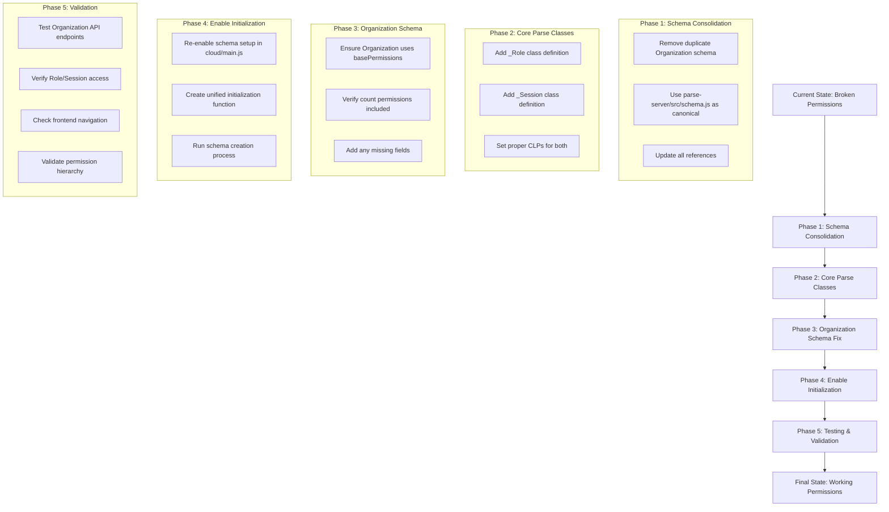

# Parse Server Permission Fix Plan

## Problem Analysis

Based on the error logs and code investigation, the Parse Server has critical permission issues stemming from a fragmented schema initialization system:

### Primary Issues Identified

1. **Organization Class Permission Errors**:
   - `Permission denied for action count on class Organization` (Error 119)
   - Multiple 400 status responses when accessing `/classes/Organization`

2. **Missing Core Parse Classes**:
   - `This user is not allowed to access non-existent class: Role` (Error 119)
   - `This user is not allowed to access non-existent class: Session` (Error 119)

3. **Schema Definition Conflicts**:
   - Duplicate Organization schema in [`parse-server/src/schema.js`](parse-server/src/schema.js:81) and [`parse-server/cloud/schema/Organization.js`](parse-server/cloud/schema/Organization.js:5)
   - Conflicting Class-Level Permissions (CLPs) between the two definitions

4. **Disabled Schema Initialization**:
   - Schema setup is commented out in [`parse-server/cloud/main.js`](parse-server/cloud/main.js:16)

### Root Cause

The application has two competing schema systems:
- **Primary System**: [`parse-server/src/schema.js`](parse-server/src/schema.js:29) with comprehensive `basePermissions` including `count: { '*': true }`
- **Secondary System**: [`parse-server/cloud/schema/Organization.js`](parse-server/cloud/schema/Organization.js:24) with `find: { '*': true }` but missing `count` permissions

The schema initialization is disabled, so neither system is properly creating the required classes and permissions.

## Implementation Plan



## Detailed Implementation Steps

### Phase 1: Schema Consolidation

**Objective**: Eliminate duplicate schema definitions and establish single source of truth

**Actions**:
1. **Delete conflicting schema**: Remove [`parse-server/cloud/schema/Organization.js`](parse-server/cloud/schema/Organization.js:5)
2. **Use canonical source**: Establish [`parse-server/src/schema.js`](parse-server/src/schema.js:29) as the primary schema source
3. **Update imports**: Ensure all references point to the canonical schema

**Rationale**: The [`parse-server/src/schema.js`](parse-server/src/schema.js:29) file has:
- Comprehensive `basePermissions` including `count: { '*': true }`
- Complete field definitions
- Consistent permission structure

### Phase 2: Core Parse Classes Setup

**Objective**: Create missing `_Role` and `_Session` classes with proper permissions

**Actions**:
1. **Add _Role class definition**:
   ```javascript
   {
     className: '_Role',
     classLevelPermissions: {
       find: { requiresAuthentication: true },
       count: { requiresAuthentication: true },
       get: { requiresAuthentication: true },
       create: { requiresAuthentication: true },
       update: { requiresAuthentication: true },
       delete: { requiresAuthentication: true }
     }
   }
   ```

2. **Add _Session class definition**:
   ```javascript
   {
     className: '_Session',
     classLevelPermissions: {
       find: { requiresAuthentication: true },
       count: { requiresAuthentication: true },
       get: { requiresAuthentication: true },
       create: { requiresAuthentication: true },
       update: { requiresAuthentication: true },
       delete: { requiresAuthentication: true }
     }
   }
   ```

### Phase 3: Organization Schema Fix

**Objective**: Ensure Organization class has proper permissions

**Actions**:
1. **Verify basePermissions**: Confirm Organization schema uses `basePermissions` which includes:
   ```javascript
   const basePermissions = {
     find: { '*': true },
     count: { '*': true },  // This was missing in the duplicate schema
     get: { '*': true },
     create: { '*': true },
     update: { requiresAuthentication: true },
     delete: { requiresAuthentication: true },
     addField: { '*': true },
   };
   ```

2. **Update Organization definition**: Ensure it uses `classLevelPermissions: basePermissions`

### Phase 4: Enable Schema Initialization

**Objective**: Re-enable and run schema setup process

**Actions**:
1. **Re-enable setup in cloud/main.js**:
   ```javascript
   // Change from:
   // require('./setup');  // DISABLED
   
   // To:
   require('./setup');
   ```

2. **Update setup.js**: Ensure it uses the canonical schema definitions from [`parse-server/src/schema.js`](parse-server/src/schema.js:40)

3. **Run initialization**: Execute schema creation process to establish all classes and CLPs

### Phase 5: Testing & Validation

**Objective**: Verify all systems work correctly

**Test Cases**:
1. **Organization API Access**:
   - `GET /classes/Organization` should return 200
   - Count operations should work without permission errors

2. **Role/Session Access**:
   - `GET /classes/Role` should return 200 (with authentication)
   - `GET /classes/Session` should return 200 (with authentication)

3. **Frontend Navigation**:
   - Organization members page should load without errors
   - All navigation components should work

4. **Permission Hierarchy**:
   - Authenticated users can access appropriate resources
   - Unauthenticated requests are properly blocked

## Files to Modify

### Primary Changes

1. **[`parse-server/cloud/schema/Organization.js`](parse-server/cloud/schema/Organization.js:5)** - DELETE
   - Remove this file entirely to eliminate conflicts

2. **[`parse-server/src/schema.js`](parse-server/src/schema.js:40)** - UPDATE
   - Add `_Role` and `_Session` class definitions
   - Ensure Organization uses `basePermissions`

3. **[`parse-server/cloud/main.js`](parse-server/cloud/main.js:16)** - UPDATE
   - Re-enable schema setup: `require('./setup');`

4. **[`parse-server/cloud/setup.js`](parse-server/cloud/setup.js:270)** - UPDATE
   - Import and use canonical schema definitions
   - Ensure proper initialization sequence

### Secondary Changes

5. **Update any imports** that reference the deleted Organization schema file
6. **Verify cloud function references** use consistent schema approach

## Expected Outcomes

After implementation:

✅ **Organization Class**: Proper `count` permissions, no more 400 errors  
✅ **Core Parse Classes**: `_Role` and `_Session` classes exist with appropriate CLPs  
✅ **Unified Schema System**: Single source of truth for all schema definitions  
✅ **Working Frontend**: Navigation pages load without permission errors  
✅ **Proper Security**: Organization-scoped permissions work correctly  
✅ **Clean Logs**: No more "Permission denied" errors in server logs  

## Implementation Notes

- **No Data Loss Risk**: Since there's no production data, we can make aggressive changes
- **Development Environment**: Safe to test all changes without backup concerns
- **User Recreation**: Users are automatically recreated when DB is empty
- **Incremental Testing**: Each phase can be tested independently

## Success Criteria

The fix is successful when:
1. All error logs from the original issue are resolved
2. Frontend navigation works without permission errors
3. Organization API endpoints return proper responses
4. Role and Session classes are accessible with authentication
5. No duplicate schema definitions exist in the codebase

---

*This plan addresses the critical Parse Server permission issues by consolidating the fragmented schema system and ensuring proper initialization of all required classes and permissions.*