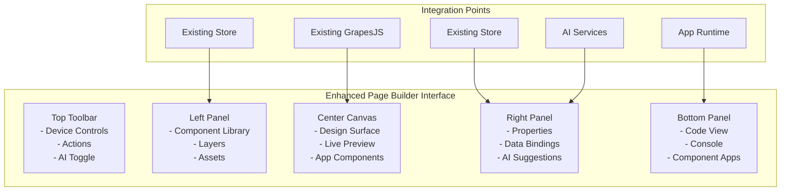
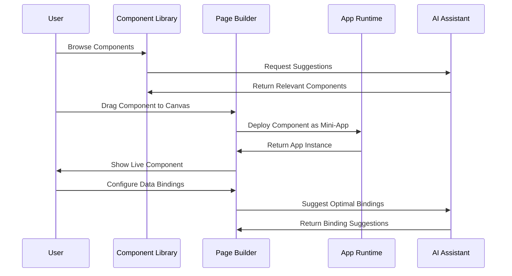

# World-Class Visual Page Builder & Component Library Enhancement Plan

## 📋 Executive Summary

This plan enhances the existing Token Nexus Platform's visual page builder and component library into a revolutionary, Figma/Webflow-inspired interface that seamlessly integrates with the platform's app runtime framework. The solution maintains strict adherence to existing coding conventions while delivering full drag-and-drop integration, AI-powered suggestions, automatic data binding, and components that execute as mini-apps within the secure runtime environment.

## 🎯 Design Vision & Integration Strategy

### Core Principles
1. **Existing System Integration**: Build upon current GrapesJS implementation and PageBuilderPageController
2. **Convention Adherence**: Strict compliance with established coding conventions and patterns
3. **Unified Experience**: Seamless integration between page builder and component library
4. **Professional Yet Accessible**: Figma/Webflow-inspired interface for all user types
5. **App Framework Integration**: Components as executable mini-apps using existing runtime
6. **AI-Enhanced Workflow**: Intelligent suggestions and automatic data binding

## 🏗️ Current System Analysis

### Existing Architecture Review
Based on code analysis, the current system includes:

#### **Existing Components**
- [`GrapesEditorPro`](src/components/page-builder/enhanced/GrapesEditorPro.tsx) - Enhanced GrapesJS editor
- [`PageBuilderPageController`](src/controllers/PageBuilderPageController.ts) - Controller with CRUD operations
- [`pageBuilderStore`](src/store/pageBuilderStore.ts) - Zustand store for state management
- Component library infrastructure with mock data

#### **Existing Patterns to Maintain**
- **Controller Architecture**: Extend existing PageBuilderPageController pattern
- **Store Management**: Zustand for local state, Redux for global state
- **Component Structure**: React.FC with TypeScript interfaces
- **API Services**: Parse Server integration with standardized error handling
- **File Organization**: Feature-based directory structure with `@/` imports

## 🔧 Enhanced Technical Implementation Plan

### Phase 1: Foundation Enhancement & Code Review (Weeks 1-2)

#### 1.1 Comprehensive Code Review & Convention Alignment
```typescript
// Follow existing controller pattern from PageBuilderPageController.ts
interface EnhancedPageBuilderController extends PageController {
  // Extend existing actions with new functionality
  actions: Map<string, ActionDefinition>;
  
  // Add component library integration actions
  initializeComponentLibraryActions(): void;
  
  // Add AI assistant actions
  initializeAIActions(): void;
}
```

#### 1.2 Enhanced Store Architecture (Following Existing Patterns)
```typescript
// Extend existing pageBuilderStore.ts pattern
interface EnhancedPageBuilderState extends PageBuilderState {
  // Component library integration
  componentLibrary: {
    components: CustomComponent[];
    categories: ComponentCategory[];v
    selectedComponent: CustomComponent | null;
    searchQuery: string;
    filters: ComponentFilter[];
  };
  
  // AI assistant state
  aiAssistant: {
    isActive: boolean;
    suggestions: ComponentSuggestion[];
    autoBindingEnabled: boolean;
    layoutOptimizations: LayoutSuggestion[];
  };
  
  // Enhanced UI state
  ui: {
    leftPanelWidth: number;
    rightPanelWidth: number;
    showComponentLibrary: boolean;
    showAIAssistant: boolean;
    currentView: 'design' | 'code' | 'preview';
    deviceMode: 'desktop' | 'tablet' | 'mobile';
  };
}
```

#### 1.3 Component Library Service (Following API Service Patterns)
```typescript
// Follow existing API service pattern from services/api/
export interface ComponentLibraryApiService {
  getComponents(params?: GetComponentsParams): Promise<ApiResponse<CustomComponent[]>>;
  createComponent(data: CreateComponentData): Promise<ApiResponse<CustomComponent>>;
  updateComponent(id: string, data: UpdateComponentData): Promise<ApiResponse<CustomComponent>>;
  deleteComponent(id: string): Promise<ApiResponse<void>>;
  deployAsApp(componentId: string): Promise<ApiResponse<AppDeployment>>;
}

export const componentLibraryApi: ComponentLibraryApiService = {
  async getComponents(params = {}) {
    try {
      const result = await Parse.Cloud.run('getCustomComponents', params);
      return { data: result, success: true };
    } catch (error: any) {
      console.error('Failed to fetch components:', error);
      toast.error(error.message || 'Failed to fetch components');
      throw error;
    }
  },
  // ... other methods following same pattern
};
```

### Phase 2: Enhanced UI Components (Weeks 3-4)

#### 2.1 Enhanced GrapesJS Integration (Extending Existing)
```typescript
// Enhance existing GrapesEditorPro.tsx
interface EnhancedGrapesEditorProps extends GrapesEditorProProps {
  // Component library integration
  componentLibrary: ComponentLibraryManager;
  
  // AI assistant integration
  aiAssistant: AIDesignAssistant;
  
  // Enhanced callbacks
  onComponentDrop?: (component: CustomComponent, position: Position) => void;
  onAISuggestion?: (suggestion: ComponentSuggestion) => void;
  onLayoutOptimization?: (optimization: LayoutSuggestion) => void;
}

const EnhancedGrapesEditorPro: React.FC<EnhancedGrapesEditorProps> = ({
  componentLibrary,
  aiAssistant,
  onComponentDrop,
  onAISuggestion,
  onLayoutOptimization,
  ...existingProps
}) => {
  // Follow existing component structure pattern
  const [editorState, setEditorState] = useState<EditorState>(initialState);
  
  // Event handlers following existing pattern
  const handleComponentDrop = useCallback((component: CustomComponent, position: Position) => {
    // Implementation
    onComponentDrop?.(component, position);
  }, [onComponentDrop]);
  
  // ... rest following existing GrapesEditorPro pattern
};
```

#### 2.2 Smart Component Library Panel
```typescript
// New component following existing component structure
interface ComponentLibraryPanelProps {
  isVisible: boolean;
  onComponentSelect: (component: CustomComponent) => void;
  onComponentDrag: (component: CustomComponent) => void;
  searchQuery: string;
  onSearchChange: (query: string) => void;
  categories: ComponentCategory[];
  selectedCategory: string | null;
  onCategorySelect: (category: string | null) => void;
}

const ComponentLibraryPanel: React.FC<ComponentLibraryPanelProps> = ({
  isVisible,
  onComponentSelect,
  onComponentDrag,
  searchQuery,
  onSearchChange,
  categories,
  selectedCategory,
  onCategorySelect
}) => {
  // Follow existing component structure from CODING_CONVENTIONS.md
  const [filteredComponents, setFilteredComponents] = useState<CustomComponent[]>([]);
  const [isLoading, setIsLoading] = useState(false);
  
  const handleComponentClick = useCallback((component: CustomComponent) => {
    onComponentSelect(component);
  }, [onComponentSelect]);
  
  const handleDragStart = useCallback((component: CustomComponent) => {
    onComponentDrag(component);
  }, [onComponentDrag]);
  
  // Early returns for loading/error states
  if (!isVisible) return null;
  if (isLoading) return <LoadingSpinner />;
  
  // Main render following Tailwind CSS conventions
  return (
    <div className="w-64 border-r bg-card flex flex-col h-full">
      {/* Search and filters */}
      <div className="p-4 border-b">
        <Input
          placeholder="Search components..."
          value={searchQuery}
          onChange={(e) => onSearchChange(e.target.value)}
          className="mb-3"
        />
        {/* Category filters */}
      </div>
      
      {/* Component grid */}
      <ScrollArea className="flex-1">
        <div className="p-4 space-y-2">
          {filteredComponents.map((component) => (
            <ComponentCard
              key={component.id}
              component={component}
              onClick={() => handleComponentClick(component)}
              onDragStart={() => handleDragStart(component)}
              draggable
            />
          ))}
        </div>
      </ScrollArea>
    </div>
  );
};

export default ComponentLibraryPanel;
```

### Phase 3: AI Integration & Advanced Features (Weeks 5-6)

#### 3.1 AI Design Assistant Service
```typescript
// Follow existing service pattern
export interface AIDesignAssistantService {
  suggestComponents(context: DesignContext): Promise<ApiResponse<ComponentSuggestion[]>>;
  optimizeLayout(elements: PageElement[]): Promise<ApiResponse<LayoutSuggestion[]>>;
  generateContent(type: ContentType, context: any): Promise<ApiResponse<GeneratedContent>>;
  suggestDataBindings(component: CustomComponent, availableData: DataSource[]): Promise<ApiResponse<BindingSuggestion[]>>;
}

export const aiDesignAssistantApi: AIDesignAssistantService = {
  async suggestComponents(context) {
    try {
      const result = await Parse.Cloud.run('aiSuggestComponents', { context });
      return { data: result, success: true };
    } catch (error: any) {
      console.error('AI suggestion failed:', error);
      toast.error(error.message || 'Failed to get AI suggestions');
      throw error;
    }
  },
  // ... other methods
};
```

#### 3.2 Enhanced Data Binding Engine
```typescript
// Follow existing patterns for data integration
interface DataBindingEngineProps {
  availableObjects: CustomObject[];
  selectedComponent: CustomComponent | null;
  onBindingCreate: (binding: DataBinding) => void;
  onBindingUpdate: (binding: DataBinding) => void;
  onBindingDelete: (bindingId: string) => void;
}

const DataBindingEngine: React.FC<DataBindingEngineProps> = ({
  availableObjects,
  selectedComponent,
  onBindingCreate,
  onBindingUpdate,
  onBindingDelete
}) => {
  // Follow existing component structure
  const [bindings, setBindings] = useState<DataBinding[]>([]);
  const [previewData, setPreviewData] = useState<any>(null);
  
  // Event handlers
  const handleCreateBinding = useCallback((sourceField: string, targetProperty: string) => {
    const binding: DataBinding = {
      id: uuidv4(),
      componentId: selectedComponent?.id || '',
      sourceObject: availableObjects[0]?.apiName || '',
      sourceField,
      targetProperty,
      transformFunction: null,
      isActive: true
    };
    
    onBindingCreate(binding);
    setBindings(prev => [...prev, binding]);
  }, [selectedComponent, availableObjects, onBindingCreate]);
  
  // ... rest of implementation
};
```

### Phase 4: App Framework Integration (Weeks 7-8)

#### 4.1 Component-as-App Architecture
```typescript
// Extend existing app framework integration
interface ComponentAppManager {
  // Deploy component as mini-app
  deployComponent(component: CustomComponent): Promise<AppDeployment>;
  
  // Execute component in runtime
  executeComponent(deployment: AppDeployment, context: PageContext): Promise<ComponentInstance>;
  
  // Manage component permissions
  configurePermissions(deployment: AppDeployment, permissions: AppPermissions): void;
  
  // Monitor component resources
  monitorResources(instance: ComponentInstance): ResourceMetrics;
}

// Follow existing app runtime patterns
export const componentAppManager: ComponentAppManager = {
  async deployComponent(component) {
    try {
      // Use existing app runtime framework
      const appManifest = convertComponentToAppManifest(component);
      const deployment = await appRuntimeManager.deployApp(appManifest);
      
      return deployment;
    } catch (error: any) {
      console.error('Component deployment failed:', error);
      toast.error(error.message || 'Failed to deploy component');
      throw error;
    }
  },
  
  // ... other methods following existing patterns
};
```

#### 4.2 Secure Component Execution
```typescript
// Integrate with existing app runtime security
interface SecureComponentExecutor {
  executeInSandbox(component: ComponentApp, context: ExecutionContext): Promise<ComponentInstance>;
  enforcePermissions(component: ComponentApp, action: string): boolean;
  monitorResourceUsage(instance: ComponentInstance): ResourceUsage;
  handleComponentCommunication(message: AppMessage): Promise<AppMessage>;
}

// Implementation following existing security patterns
export const secureComponentExecutor: SecureComponentExecutor = {
  async executeInSandbox(component, context) {
    // Use existing web worker isolation
    const worker = new Worker('/component-runtime-worker.js');
    
    // Apply existing permission system
    const permissions = await permissionManager.getComponentPermissions(component.id);
    
    // Execute with monitoring
    const instance = await executeWithMonitoring(worker, component, context, permissions);
    
    return instance;
  },
  
  // ... other methods
};
```

## 🎨 Enhanced User Interface Design

### Layout Architecture (Following Existing Patterns)


### Component Integration Flow


## 📊 Implementation Timeline & Milestones

### **Phase 1: Foundation & Code Review (Weeks 1-2)**
- **Week 1**: Comprehensive code review and convention documentation
- **Week 2**: Enhanced store architecture and controller extensions
- **Deliverables**: Updated architecture documentation, enhanced stores

### **Phase 2: Enhanced UI Components (Weeks 3-4)**
- **Week 3**: Enhanced GrapesJS integration and component library panel
- **Week 4**: Advanced properties panel and data binding interface
- **Deliverables**: New UI components following existing patterns

### **Phase 3: AI Integration (Weeks 5-6)**
- **Week 5**: AI design assistant service and suggestion engine
- **Week 6**: Automatic data binding and layout optimization
- **Deliverables**: AI-powered features integrated with existing services

### **Phase 4: App Framework Integration (Weeks 7-8)**
- **Week 7**: Component-as-app architecture and deployment system
- **Week 8**: Secure execution environment and resource monitoring
- **Deliverables**: Full app framework integration

### **Phase 5: Testing & Polish (Weeks 9-10)**
- **Week 9**: Comprehensive testing and performance optimization
- **Week 10**: Documentation updates and final polish
- **Deliverables**: Production-ready enhanced page builder

## 🔒 Security & Performance Considerations

### Security (Following Existing Patterns)
- **Component Isolation**: Use existing web worker sandbox
- **Permission System**: Extend existing app permission framework
- **Data Security**: Follow existing Parse Server security patterns
- **Code Validation**: Implement component code validation

### Performance (Following Existing Patterns)
- **Lazy Loading**: Components load only when needed
- **Caching**: Use existing caching strategies
- **Bundle Optimization**: Follow existing build optimization
- **Memory Management**: Implement proper cleanup patterns

## 📈 Success Metrics & Quality Gates

### Code Quality (Following Existing Standards)
- **TypeScript Coverage**: Maintain 94%+ coverage
- **Test Coverage**: Achieve 80%+ test coverage
- **ESLint Compliance**: Zero linting errors
- **Convention Adherence**: 100% compliance with coding conventions

### Performance Metrics
- **Page Load Time**: < 2 seconds
- **Component Render Time**: < 500ms
- **Memory Usage**: < 100MB per page
- **Bundle Size**: Minimal increase from current size

### User Experience Metrics
- **Time to Create Page**: < 5 minutes
- **Component Discovery**: < 30 seconds
- **User Satisfaction**: > 4.5/5 rating

## 🔄 Integration Checkpoints

### Pre-Implementation Checklist
- [ ] Complete code review of existing system
- [ ] Document all existing patterns and conventions
- [ ] Identify integration points with app runtime framework
- [ ] Plan backward compatibility strategy
- [ ] Define testing strategy for existing functionality

### Implementation Checkpoints
- [ ] **Week 2**: Architecture review and approval
- [ ] **Week 4**: UI component integration testing
- [ ] **Week 6**: AI service integration validation
- [ ] **Week 8**: App framework integration testing
- [ ] **Week 10**: Final system integration testing

### Quality Gates
- [ ] All existing tests continue to pass
- [ ] New features have 80%+ test coverage
- [ ] Performance metrics meet or exceed current benchmarks
- [ ] Security audit passes with no critical issues
- [ ] Code review approval from technical lead

## 📚 Documentation Updates Required

### Technical Documentation
- [ ] Update architecture diagrams
- [ ] Document new API endpoints
- [ ] Update component library documentation
- [ ] Create AI integration guide

### User Documentation
- [ ] Enhanced page builder user guide
- [ ] Component library usage documentation
- [ ] AI assistant feature guide
- [ ] Data binding tutorial

## 🚀 Deployment Strategy

### Staging Deployment
- [ ] Deploy to staging environment
- [ ] Run comprehensive integration tests
- [ ] Performance benchmarking
- [ ] User acceptance testing

### Production Deployment
- [ ] Feature flag rollout
- [ ] Gradual user migration
- [ ] Performance monitoring
- [ ] Rollback plan ready

---

This enhanced plan maintains strict adherence to the existing Token Nexus Platform architecture and coding conventions while delivering a world-class visual page builder and component library experience. The implementation leverages existing patterns and infrastructure to ensure seamless integration and maintainability.