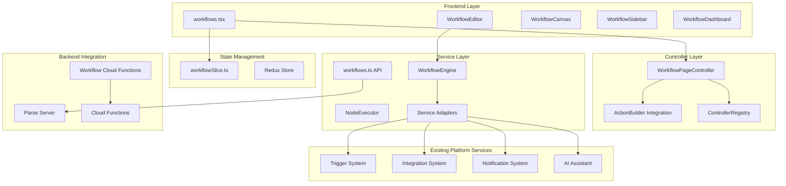

# Visual Workflow Management System - Complete Implementation Guide

## Overview

This document provides a comprehensive implementation guide for integrating a visual workflow management system into the token-nexus-platform. The system follows established platform patterns and conventions, ensuring seamless integration with existing services.

## Architecture Overview



## Implementation Timeline

### Phase 1: Foundation (Week 1-2)
- Type definitions and interfaces
- Redux store integration
- Page controller setup
- Basic API service structure

### Phase 2: Core Components (Week 3-4)
- Main workflows page
- Visual workflow editor
- Node system foundation
- Service adapters

### Phase 3: Advanced Features (Week 5-6)
- Workflow execution engine
- Real-time monitoring
- Template system
- Deep service integration

### Phase 4: Polish & Testing (Week 7-8)
- Performance optimization
- Comprehensive testing
- Documentation
- Deployment preparation

## Detailed Implementation

### Phase 1: Foundation Components

#### 1.1 Type Definitions

**File: `src/types/workflows.ts`**

```typescript
export type WorkflowStatus = 'draft' | 'active' | 'paused' | 'error' | 'archived';
export type NodeCategory = 'trigger' | 'action' | 'logic' | 'integration';
export type ExecutionStatus = 'pending' | 'running' | 'completed' | 'failed' | 'cancelled';

export interface WorkflowNode {
  id: string;
  type: string;
  category: NodeCategory;
  name: string;
  description?: string;
  position: { x: number; y: number };
  data: {
    label: string;
    config: Record<string, any>;
    serviceIntegration?: {
      controllerId?: string;
      actionId?: string;
      triggerId?: string;
      integrationId?: string;
      cloudFunctionId?: string;
    };
  };
  metadata?: {
    tags?: string[];
    version?: string;
    documentation?: string;
  };
}

export interface WorkflowEdge {
  id: string;
  source: string;
  target: string;
  sourceHandle?: string;
  targetHandle?: string;
  type?: string;
  data?: {
    condition?: string;
    label?: string;
  };
}

export interface Workflow {
  id: string;
  name: string;
  description?: string;
  status: WorkflowStatus;
  nodes: WorkflowNode[];
  edges: WorkflowEdge[];
  organizationId: string;
  createdBy: string;
  updatedBy?: string;
  createdAt: string;
  updatedAt: string;
  version: number;
  tags?: string[];
  metadata?: {
    category?: string;
    isTemplate?: boolean;
    templateId?: string;
    executionCount?: number;
    lastExecuted?: string;
    averageExecutionTime?: number;
  };
}

export interface WorkflowExecution {
  id: string;
  workflowId: string;
  status: ExecutionStatus;
  startTime: Date;
  endTime?: Date;
  duration?: number;
  triggeredBy: 'manual' | 'schedule' | 'webhook' | 'trigger';
  triggerData?: any;
  nodeExecutions: NodeExecution[];
  error?: string;
  result?: any;
  organizationId: string;
  userId?: string;
}

export interface NodeExecution {
  id: string;
  nodeId: string;
  nodeName: string;
  status: ExecutionStatus;
  startTime: Date;
  endTime?: Date;
  duration?: number;
  input?: any;
  output?: any;
  error?: string;
  retryCount?: number;
}

export interface WorkflowState {
  workflows: Workflow[];
  selectedWorkflowId: string | null;
  isLoading: boolean;
  error: string | null;
  executions: WorkflowExecution[];
  templates: Workflow[];
  nodeTypes: WorkflowNodeType[];
}

export interface WorkflowNodeType {
  type: string;
  category: NodeCategory;
  name: string;
  description: string;
  icon: string;
  color: string;
  inputs: NodeInput[];
  outputs: NodeOutput[];
  configSchema: any;
  serviceIntegration?: {
    service: string;
    method: string;
    requiredPermissions: string[];
  };
}

export interface NodeInput {
  id: string;
  name: string;
  type: 'string' | 'number' | 'boolean' | 'object' | 'array';
  required: boolean;
  description?: string;
  defaultValue?: any;
}

export interface NodeOutput {
  id: string;
  name: string;
  type: 'string' | 'number' | 'boolean' | 'object' | 'array';
  description?: string;
}

export interface CreateWorkflowRequest {
  name: string;
  description?: string;
  templateId?: string;
  tags?: string[];
}

export interface UpdateWorkflowRequest {
  id: string;
  name?: string;
  description?: string;
  nodes?: WorkflowNode[];
  edges?: WorkflowEdge[];
  status?: WorkflowStatus;
  tags?: string[];
}

export interface ExecuteWorkflowRequest {
  workflowId: string;
  triggerData?: any;
  dryRun?: boolean;
}
```

#### 1.2 Redux Store Integration

**File: `src/store/slices/workflowSlice.ts`**

```typescript
import { createSlice, createAsyncThunk, PayloadAction } from '@reduxjs/toolkit';
import { v4 as uuidv4 } from 'uuid';
import { 
  Workflow, 
  WorkflowState, 
  CreateWorkflowRequest, 
  UpdateWorkflowRequest,
  WorkflowExecution,
  ExecuteWorkflowRequest,
  WorkflowStatus 
} from '@/types/workflows';

const initialState: WorkflowState = {
  workflows: [],
  selectedWorkflowId: null,
  isLoading: false,
  error: null,
  executions: [],
  templates: [],
  nodeTypes: []
};

// Async thunks following existing patterns
export const fetchWorkflows = createAsyncThunk(
  'workflow/fetchWorkflows',
  async (params?: { status?: string; tags?: string[] }, { rejectWithValue }) => {
    try {
      const response = await fetch('/api/workflows?' + new URLSearchParams(params as any));
      if (!response.ok) throw new Error('Failed to fetch workflows');
      return await response.json();
    } catch (error) {
      return rejectWithValue(error instanceof Error ? error.message : 'Failed to fetch workflows');
    }
  }
);

export const createWorkflow = createAsyncThunk(
  'workflow/createWorkflow',
  async (workflowData: CreateWorkflowRequest, { rejectWithValue }) => {
    try {
      const response = await fetch('/api/workflows', {
        method: 'POST',
        headers: { 'Content-Type': 'application/json' },
        body: JSON.stringify(workflowData)
      });
      if (!response.ok) throw new Error('Failed to create workflow');
      return await response.json();
    } catch (error) {
      return rejectWithValue(error instanceof Error ? error.message : 'Failed to create workflow');
    }
  }
);

export const updateWorkflow = createAsyncThunk(
  'workflow/updateWorkflow',
  async (updateData: UpdateWorkflowRequest, { rejectWithValue }) => {
    try {
      const response = await fetch(`/api/workflows/${updateData.id}`, {
        method: 'PUT',
        headers: { 'Content-Type': 'application/json' },
        body: JSON.stringify(updateData)
      });
      if (!response.ok) throw new Error('Failed to update workflow');
      return await response.json();
    } catch (error) {
      return rejectWithValue(error instanceof Error ? error.message : 'Failed to update workflow');
    }
  }
);

export const executeWorkflow = createAsyncThunk(
  'workflow/executeWorkflow',
  async (request: ExecuteWorkflowRequest, { rejectWithValue }) => {
    try {
      const response = await fetch(`/api/workflows/${request.workflowId}/execute`, {
        method: 'POST',
        headers: { 'Content-Type': 'application/json' },
        body: JSON.stringify(request)
      });
      if (!response.ok) throw new Error('Failed to execute workflow');
      return await response.json();
    } catch (error) {
      return rejectWithValue(error instanceof Error ? error.message : 'Failed to execute workflow');
    }
  }
);

export const deleteWorkflow = createAsyncThunk(
  'workflow/deleteWorkflow',
  async (workflowId: string, { rejectWithValue }) => {
    try {
      const response = await fetch(`/api/workflows/${workflowId}`, {
        method: 'DELETE'
      });
      if (!response.ok) throw new Error('Failed to delete workflow');
      return { workflowId };
    } catch (error) {
      return rejectWithValue(error instanceof Error ? error.message : 'Failed to delete workflow');
    }
  }
);

export const workflowSlice = createSlice({
  name: 'workflow',
  initialState,
  reducers: {
    setSelectedWorkflow: (state, action: PayloadAction<string | null>) => {
      state.selectedWorkflowId = action.payload;
    },
    
    updateWorkflowNodes: (state, action: PayloadAction<{ workflowId: string; nodes: any[]; edges: any[] }>) => {
      const { workflowId, nodes, edges } = action.payload;
      const workflowIndex = state.workflows.findIndex(w => w.id === workflowId);
      
      if (workflowIndex >= 0) {
        state.workflows[workflowIndex].nodes = nodes;
        state.workflows[workflowIndex].edges = edges;
        state.workflows[workflowIndex].updatedAt = new Date().toISOString();
        state.workflows[workflowIndex].version += 1;
      }
    },
    
    setWorkflowStatus: (state, action: PayloadAction<{ id: string; status: WorkflowStatus }>) => {
      const { id, status } = action.payload;
      const workflowIndex = state.workflows.findIndex(w => w.id === id);
      
      if (workflowIndex >= 0) {
        state.workflows[workflowIndex].status = status;
        state.workflows[workflowIndex].updatedAt = new Date().toISOString();
      }
    },
    
    addExecution: (state, action: PayloadAction<WorkflowExecution>) => {
      state.executions.unshift(action.payload);
      
      // Update workflow execution metadata
      const workflowIndex = state.workflows.findIndex(w => w.id === action.payload.workflowId);
      if (workflowIndex >= 0) {
        const workflow = state.workflows[workflowIndex];
        if (!workflow.metadata) workflow.metadata = {};
        workflow.metadata.executionCount = (workflow.metadata.executionCount || 0) + 1;
        workflow.metadata.lastExecuted = action.payload.startTime.toISOString();
      }
    },
    
    updateExecution: (state, action: PayloadAction<Partial<WorkflowExecution> & { id: string }>) => {
      const executionIndex = state.executions.findIndex(e => e.id === action.payload.id);
      if (executionIndex >= 0) {
        state.executions[executionIndex] = { ...state.executions[executionIndex], ...action.payload };
      }
    },
    
    setError: (state, action: PayloadAction<string | null>) => {
      state.error = action.payload;
    },
    
    clearError: (state) => {
      state.error = null;
    }
  },
  
  extraReducers: (builder) => {
    builder
      // Fetch workflows
      .addCase(fetchWorkflows.pending, (state) => {
        state.isLoading = true;
        state.error = null;
      })
      .addCase(fetchWorkflows.fulfilled, (state, action) => {
        state.isLoading = false;
        state.workflows = action.payload.data.workflows || [];
        state.templates = action.payload.data.templates || [];
        state.nodeTypes = action.payload.data.nodeTypes || [];
      })
      .addCase(fetchWorkflows.rejected, (state, action) => {
        state.isLoading = false;
        state.error = action.payload as string;
      })
      
      // Create workflow
      .addCase(createWorkflow.pending, (state) => {
        state.isLoading = true;
        state.error = null;
      })
      .addCase(createWorkflow.fulfilled, (state, action) => {
        state.isLoading = false;
        state.workflows.unshift(action.payload.data.workflow);
        state.selectedWorkflowId = action.payload.data.workflow.id;
      })
      .addCase(createWorkflow.rejected, (state, action) => {
        state.isLoading = false;
        state.error = action.payload as string;
      })
      
      // Update workflow
      .addCase(updateWorkflow.fulfilled, (state, action) => {
        const workflowIndex = state.workflows.findIndex(w => w.id === action.payload.data.workflow.id);
        if (workflowIndex >= 0) {
          state.workflows[workflowIndex] = action.payload.data.workflow;
        }
      })
      
      // Delete workflow
      .addCase(deleteWorkflow.fulfilled, (state, action) => {
        state.workflows = state.workflows.filter(w => w.id !== action.payload.workflowId);
        if (state.selectedWorkflowId === action.payload.workflowId) {
          state.selectedWorkflowId = null;
        }
      })
      
      // Execute workflow
      .addCase(executeWorkflow.pending, (state) => {
        state.error = null;
      })
      .addCase(executeWorkflow.fulfilled, (state, action) => {
        state.executions.unshift(action.payload.data.execution);
      })
      .addCase(executeWorkflow.rejected, (state, action) => {
        state.error = action.payload as string;
      });
  }
});

export const {
  setSelectedWorkflow,
  updateWorkflowNodes,
  setWorkflowStatus,
  addExecution,
  updateExecution,
  setError,
  clearError
} = workflowSlice.actions;

export default workflowSlice.reducer;
```

**Update: `src/store/store.ts`**

```typescript
// Add to imports
import workflowReducer from './slices/workflowSlice';

// Add to rootReducer
const rootReducer = combineReducers({
  // ... existing reducers
  workflow: workflowReducer,
});
```

### Phase 2: Page Controller Integration

**File: `src/controllers/WorkflowPageController.ts`**

```typescript
import { BasePageController, ActionConfig } from './base/BasePageController';
import { ActionContext, ActionResult } from './types/ActionTypes';
import { createAction } from './base/ActionBuilder';
import Parse from 'parse';

export class WorkflowPageController extends BasePageController {
  constructor() {
    super({
      pageId: 'workflows',
      pageName: 'Workflow Management',
      description: 'Visual workflow automation and orchestration system',
      category: 'automation',
      tags: ['workflow', 'automation', 'visual', 'integration', 'orchestration'],
      permissions: ['workflow:read', 'workflow:write', 'workflow:execute', 'workflow:manage'],
      version: '1.0.0'
    });
  }

  protected initializeActions(): void {
    // Create Workflow Action
    this.registerAction({
      id: 'createWorkflow',
      name: 'Create Workflow',
      description: 'Create a new visual workflow',
      category: 'data',
      permissions: ['workflow:write'],
      parameters: [
        { name: 'name', type: 'string', required: true, description: 'Workflow name' },
        { name: 'description', type: 'string', required: false, description: 'Workflow description' },
        { name: 'templateId', type: 'string', required: false, description: 'Template to base workflow on' },
        { name: 'tags', type: 'array', required: false, description: 'Workflow tags' }
      ],
      metadata: {
        tags: ['workflow', 'create'],
        examples: [{
          params: { name: 'User Onboarding', description: 'Automated user onboarding process' },
          description: 'Create a basic user onboarding workflow'
        }]
      }
    }, this.handleCreateWorkflow.bind(this));

    // Update Workflow Action
    this.registerAction({
      id: 'updateWorkflow',
      name: 'Update Workflow',
      description: 'Update an existing workflow',
      category: 'data',
      permissions: ['workflow:write'],
      parameters: [
        { name: 'workflowId', type: 'string', required: true, description: 'Workflow ID' },
        { name: 'name', type: 'string', required: false, description: 'Updated name' },
        { name: 'description', type: 'string', required: false, description: 'Updated description' },
        { name: 'nodes', type: 'array', required: false, description: 'Workflow nodes' },
        { name: 'edges', type: 'array', required: false, description: 'Workflow edges' },
        { name: 'status', type: 'string', required: false, description: 'Workflow status' }
      ]
    }, this.handleUpdateWorkflow.bind(this));

    // Execute Workflow Action
    this.registerAction({
      id: 'executeWorkflow',
      name: 'Execute Workflow',
      description: 'Execute a workflow manually or programmatically',
      category: 'external',
      permissions: ['workflow:execute'],
      parameters: [
        { name: 'workflowId', type: 'string', required: true, description: 'Workflow ID to execute' },
        { name: 'triggerData', type: 'object', required: false, description: 'Data to pass to workflow' },
        { name: 'dryRun', type: 'boolean', required: false, description: 'Validate without executing' }
      ]
    }, this.handleExecuteWorkflow.bind(this));

    // Get Workflows Action
    this.registerAction({
      id: 'getWorkflows',
      name: 'Get Workflows',
      description: 'Retrieve workflows for the organization',
      category: 'data',
      permissions: ['workflow:read'],
      parameters: [
        { name: 'status', type: 'string', required: false, description: 'Filter by status' },
        { name: 'tags', type: 'array', required: false, description: 'Filter by tags' },
        { name: 'limit', type: 'number', required: false, description: 'Limit results' },
        { name: 'skip', type: 'number', required: false, description: 'Skip results for pagination' }
      ]
    }, this.handleGetWorkflows.bind(this));

    // Get Node Types Action
    this.registerAction({
      id: 'getNodeTypes',
      name: 'Get Node Types',
      description: 'Get available workflow node types and their configurations',
      category: 'data',
      permissions: ['workflow:read'],
      parameters: [
        { name: 'category', type: 'string', required: false, description: 'Filter by node category' }
      ]
    }, this.handleGetNodeTypes.bind(this));
  }

  private async handleCreateWorkflow(params: Record<string, unknown>, context: ActionContext): Promise<any> {
    const { name, description, templateId, tags } = params;
    const orgId = this.getOrganizationId(context);

    if (!orgId) {
      throw new Error('Organization ID is required');
    }

    try {
      const result = await Parse.Cloud.run('createWorkflow', {
        name,
        description,
        templateId,
        tags,
        organizationId: orgId,
        createdBy: context.user.userId
      });

      return {
        workflow: result.workflow,
        message: `Workflow "${name}" created successfully`
      };
    } catch (error) {
      throw new Error(`Failed to create workflow: ${error instanceof Error ? error.message : 'Unknown error'}`);
    }
  }

  private async handleUpdateWorkflow(params: Record<string, unknown>, context: ActionContext): Promise<any> {
    const { workflowId, ...updateData } = params;
    const orgId = this.getOrganizationId(context);

    try {
      const result = await Parse.Cloud.run('updateWorkflow', {
        workflowId,
        updateData,
        organizationId: orgId,
        updatedBy: context.user.userId
      });

      return {
        workflow: result.workflow,
        message: 'Workflow updated successfully'
      };
    } catch (error) {
      throw new Error(`Failed to update workflow: ${error instanceof Error ? error.message : 'Unknown error'}`);
    }
  }

  private async handleExecuteWorkflow(params: Record<string, unknown>, context: ActionContext): Promise<any> {
    const { workflowId, triggerData, dryRun } = params;
    const orgId = this.getOrganizationId(context);

    try {
      const result = await Parse.Cloud.run('executeWorkflow', {
        workflowId,
        triggerData,
        dryRun,
        organizationId: orgId,
        userId: context.user.userId
      });

      return {
        execution: result.execution,
        message: dryRun ? 'Workflow validation completed' : 'Workflow execution started'
      };
    } catch (error) {
      throw new Error(`Failed to execute workflow: ${error instanceof Error ? error.message : 'Unknown error'}`);
    }
  }

  private async handleGetWorkflows(params: Record<string, unknown>, context: ActionContext): Promise<any> {
    const { status, tags, limit, skip } = params;
    const orgId = this.getOrganizationId(context);

    try {
      const result = await Parse.Cloud.run('getWorkflows', {
        organizationId: orgId,
        status,
        tags,
        limit: limit || 50,
        skip: skip || 0
      });

      return {
        workflows: result.workflows,
        pagination: result.pagination,
        templates: result.templates,
        nodeTypes: result.nodeTypes
      };
    } catch (error) {
      throw new Error(`Failed to fetch workflows: ${error instanceof Error ? error.message : 'Unknown error'}`);
    }
  }

  private async handleGetNodeTypes(params: Record<string, unknown>, context: ActionContext): Promise<any> {
    const { category } = params;

    try {
      const result = await Parse.Cloud.run('getNodeTypes', {
        category
      });

      return {
        nodeTypes: result.nodeTypes
      };
    } catch (error) {
      throw new Error(`Failed to fetch node types: ${error instanceof Error ? error.message : 'Unknown error'}`);
    }
  }
}

// Export singleton instance
export const workflowPageController = new WorkflowPageController();
```

**Update: `src/controllers/registerControllers.ts`**

```typescript
// Add import
import { workflowPageController } from './WorkflowPageController';

// Add to registerAllControllers function
export function registerAllControllers(): void {
  console.log('Registering all page controllers...');

  try {
    // ... existing registrations
    controllerRegistry.registerPageController(workflowPageController);
    
    console.log('All page controllers registered successfully');
    // ... rest of function
  } catch (error) {
    console.error('Error registering controllers:', error);
    throw error;
  }
}
```

### Phase 3: API Service Integration

**File: `src/services/api/workflows.ts`**

```typescript
import Parse from 'parse';
import { apiService, mockResponse } from './base';
import { 
  Workflow, 
  CreateWorkflowRequest, 
  UpdateWorkflowRequest, 
  ExecuteWorkflowRequest,
  WorkflowExecution,
  WorkflowNodeType 
} from '@/types/workflows';

const workflowsApi = {
  getWorkflows: async (params?: {
    status?: string;
    tags?: string[];
    limit?: number;
    skip?: number;
  }): Promise<{ data: { workflows: Workflow[]; templates: Workflow[]; nodeTypes: WorkflowNodeType[]; pagination: any } }> => {
    try {
      const result = await Parse.Cloud.run('getWorkflows', params || {});
      
      return {
        data: {
          workflows: result.workflows || [],
          templates: result.templates || [],
          nodeTypes: result.nodeTypes || [],
          pagination: result.pagination || {}
        }
      };
    } catch (error: any) {
      console.debug('[Workflows API] Error calling getWorkflows cloud function:', error);
      throw new Error(error.message || 'Failed to fetch workflows');
    }
  },

  createWorkflow: async (params: CreateWorkflowRequest): Promise<{ data: { workflow: Workflow } }> => {
    try {
      const result = await Parse.Cloud.run('createWorkflow', params);
      
      return {
        data: {
          workflow: result.workflow
        }
      };
    } catch (error: any) {
      console.debug('[Workflows API] Error calling createWorkflow cloud function:', error);
      throw new Error(error.message || 'Failed to create workflow');
    }
  },

  updateWorkflow: async (params: UpdateWorkflowRequest): Promise<{ data: { workflow: Workflow } }> => {
    try {
      const result = await Parse.Cloud.run('updateWorkflow', params);
      
      return {
        data: {
          workflow: result.workflow
        }
      };
    } catch (error: any) {
      console.debug('[Workflows API] Error calling updateWorkflow cloud function:', error);
      throw new Error(error.message || 'Failed to update workflow');
    }
  },

  deleteWorkflow: async (workflowId: string): Promise<{ data: { success: boolean } }> => {
    try {
      const result = await Parse.Cloud.run('deleteWorkflow', { workflowId });
      
      return {
        data: {
          success: result.success
        }
      };
    } catch (error: any) {
      console.debug('[Workflows API] Error calling deleteWorkflow cloud function:', error);
      throw new Error(error.message || 'Failed to delete workflow');
    }
  },

  executeWorkflow: async (params: ExecuteWorkflowRequest): Promise<{ data: { execution: WorkflowExecution } }> => {
    try {
      const result = await Parse.Cloud.run('executeWorkflow', params);
      
      return {
        data: {
          execution: result.execution
        }
      };
    } catch (error: any) {
      console.debug('[Workflows API] Error calling executeWorkflow cloud function:', error);
      throw new Error(error.message || 'Failed to execute workflow');
    }
  },

  getWorkflowExecutions: async (params?: {
    workflowId?: string;
    status?: string;
    limit?: number;
    skip?: number;
  }): Promise<{ data: { executions: WorkflowExecution[]; pagination: any } }> => {
    try {
      const result = await Parse.Cloud.run('getWorkflowExecutions', params || {});
      
      return {
        data: {
          executions: result.executions || [],
          pagination: result.pagination || {}
        }
      };
    } catch (error: any) {
      console.debug('[Workflows API] Error calling getWorkflowExecutions cloud function:', error);
      throw new Error(error.message || 'Failed to fetch workflow executions');
    }
  },

  getNodeTypes: async (params?: {
    category?: string;
  }): Promise<{ data: { nodeTypes: WorkflowNodeType[] } }> => {
    try {
      const result = await Parse.Cloud.run('getNodeTypes', params || {});
      
      return {
        data: {
          nodeTypes: result.nodeTypes || []
        }
      };
    } catch (error: any) {
      console.debug('[Workflows API] Error calling getNodeTypes cloud function:', error);
      throw new Error(error.message || 'Failed to fetch node types');
    }
  },

  cloneWorkflow: async (params: {
    sourceWorkflowId: string;
    name: string;
    description?: string;
  }): Promise<{ data: { workflow: Workflow } }> => {
    try {
      const result = await Parse.Cloud.run('cloneWorkflow', params);
      
      return {
        data: {
          workflow: result.workflow
        }
      };
    } catch (error: any) {
      console.debug('[Workflows API] Error calling cloneWorkflow cloud function:', error);
      throw new Error(error.message || 'Failed to clone workflow');
    }
  }
};

// Mock implementations for development
const mockWorkflowsApis = {
  getWorkflows: () => {
    return mockResponse({
      workflows: [
        {
          id: 'wf-1',
          name: 'User Onboarding',
          description: 'Automated user onboarding process',
          status: 'active',
          nodes: [],
          edges: [],
          organizationId: 'org-1',
          createdBy: 'user-1',
          createdAt: new Date().toISOString(),
          updatedAt: new Date().toISOString(),
          version: 1,
          tags: ['onboarding', 'automation'],
          metadata: {
            category: 'user-management',
            executionCount: 25,
            lastExecuted: new Date().toISOString()
          }
        },
        {