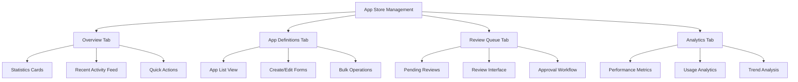
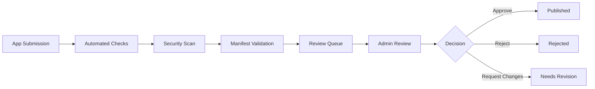

# App Marketplace System

## 📋 Table of Contents

- [Overview](#overview)
- [System Admin Interface](#system-admin-interface)
- [Core Features](#core-features)
- [Management Dashboard](#management-dashboard)
- [Review Workflow](#review-workflow)
- [Analytics & Monitoring](#analytics--monitoring)
- [Integration Points](#integration-points)
- [API Reference](#api-reference)

## 🎯 Overview

The App Marketplace System provides comprehensive tools for managing, reviewing, and monitoring applications within the Token Nexus Platform. This system enables system administrators to maintain complete control over the app ecosystem with professional-grade management interfaces.

### Key Features
- **Complete App Store Management**: Full CRUD operations for app definitions
- **Review Workflow**: Streamlined approval/rejection process for app versions
- **Real-time Analytics**: Comprehensive performance and usage monitoring
- **Security Controls**: Built-in permission validation and security policies
- **Professional Interface**: Modern, intuitive admin dashboard

### Status: ✅ **PRODUCTION READY** (100% Complete)

## 🏗️ System Admin Interface

### Access & Navigation
**URL**: `http://localhost:3000/system-admin/app-store`

The App Marketplace system is fully integrated into the existing system admin interface, providing seamless navigation and consistent user experience.

### Main Dashboard Layout



## 🔧 Core Features

### 1. App Store Management Dashboard
**Component**: `src/components/system-admin/AppStoreManagement.tsx`

Central hub for all app store operations with tabbed interface:

#### Overview Tab
- **Real-time Statistics**: Total apps, published apps, pending reviews, installations
- **Recent Activity Feed**: Live updates on app store events
- **Category Analytics**: Performance breakdown by app categories
- **Quick Actions**: Direct access to common administrative tasks

#### Features:
- Live data updates every 30 seconds
- Interactive statistics cards with drill-down capability
- Filterable activity feed with search functionality
- One-click access to critical operations

### 2. App Definition Management
**Component**: `src/components/system-admin/AppDefinitionManager.tsx`

Comprehensive CRUD interface for app definitions:

#### Management Features
- **Create New Apps**: Complete app definition creation wizard
- **Edit Existing Apps**: Full editing capabilities with validation
- **Delete Apps**: Safe deletion with dependency checking
- **Bulk Operations**: Mass updates and management actions
- **Advanced Search**: Filter by status, category, publisher
- **Featured App Management**: Promote/demote featured status

#### Data Management
- **Validation**: Real-time form validation with error handling
- **Auto-save**: Automatic draft saving during editing
- **Version Control**: Track changes and maintain history
- **Import/Export**: Bulk data operations with CSV/JSON support

### 3. App Review Queue
**Component**: `src/components/system-admin/AppReviewQueue.tsx`

Streamlined review workflow for app version approval:

#### Review Interface
- **Pending Reviews List**: All versions awaiting admin approval
- **Detailed Review Interface**: Comprehensive version information and metadata
- **Approval/Rejection Workflow**: Comments, reasons, and audit trail
- **Batch Operations**: Efficient processing of multiple reviews

#### Review Features
- **Side-by-side Comparison**: Compare versions for updates
- **Security Scan Results**: Automated security check results
- **Metadata Validation**: Comprehensive manifest validation
- **Review History**: Complete audit trail of all review actions

### 4. Analytics Dashboard
**Component**: `src/components/system-admin/AppAnalyticsDashboard.tsx`

Comprehensive analytics and performance monitoring:

#### Performance Metrics
- **Installation Rates**: App installation and adoption metrics
- **User Engagement**: Usage patterns and retention analytics
- **Performance Tracking**: Individual app performance monitoring
- **Rating Analytics**: Review distribution and average ratings

#### Analytics Features
- **Real-time Data**: Live performance metrics and updates
- **Trend Analysis**: Time-based performance insights
- **Comparative Analytics**: Cross-app performance comparison
- **Export Capabilities**: Data export for external analysis

## 📊 Management Dashboard

### Statistics Overview
```typescript
interface AppStoreStats {
  totalApps: number;
  publishedApps: number;
  pendingReviews: number;
  totalInstallations: number;
  averageRating: number;
  categoryBreakdown: CategoryStats[];
  recentActivity: ActivityEvent[];
}
```

### Real-time Metrics
- **App Performance**: Installation rates, user engagement, retention
- **System Health**: Review queue status, processing times
- **Usage Analytics**: Popular apps, trending categories
- **Security Metrics**: Security scan results, violation reports

### Quick Actions
- **Create New App**: Direct access to app creation wizard
- **Review Pending**: Jump to review queue with pending items
- **Generate Reports**: Export analytics and performance data
- **System Settings**: Configure app store policies and limits

## 🔄 Review Workflow

### Approval Process



### Review Interface Features
- **Comprehensive Information**: Complete app details and metadata
- **Security Analysis**: Automated security scan results
- **Manifest Validation**: Real-time validation with error reporting
- **Review Comments**: Detailed feedback and improvement suggestions
- **Approval Actions**: Approve, reject, or request changes
- **Audit Trail**: Complete history of all review actions

### Batch Operations
- **Bulk Approval**: Approve multiple apps simultaneously
- **Batch Rejection**: Reject multiple apps with common reasons
- **Mass Updates**: Apply changes across multiple app definitions
- **Export Reviews**: Generate review reports and summaries

## 📈 Analytics & Monitoring

### Performance Tracking
```typescript
interface AppAnalytics {
  totalInstallations: number;
  activeInstallations: number;
  installationTrend: TimeSeriesData[];
  topCategories: CategoryStats[];
  userEngagement: EngagementMetrics;
  securityEvents: SecurityEvent[];
  performanceMetrics: PerformanceData[];
}
```

### Key Metrics
- **Installation Analytics**: Download and installation tracking
- **User Engagement**: Usage patterns and session analytics
- **Performance Monitoring**: App performance and resource usage
- **Security Tracking**: Security events and violation monitoring
- **Rating Analysis**: User feedback and rating distribution

### Reporting Features
- **Automated Reports**: Scheduled analytics reports
- **Custom Dashboards**: Configurable analytics views
- **Data Export**: CSV, JSON, and PDF export options
- **Trend Analysis**: Historical data analysis and forecasting

## 🔌 Integration Points

### Backend Integration
**Enhanced Cloud Functions**: `parse-server/src/cloud/appStore.js`

#### New Admin Functions
- **`listAppsForAdmin`**: Enhanced filtering, pagination, and search
- **`createAppDefinition`**: Create new app definitions with validation
- **`updateAppDefinition`**: Update existing apps with change tracking
- **`deleteAppDefinition`**: Safe app deletion with dependency validation
- **`getAppBundleDetails`**: Detailed app information and metadata
- **`createOrUpdateAppBundle`**: Unified app management operations

#### Enhanced Features
- **Advanced Filtering**: Complex query support with multiple criteria
- **Pagination**: Efficient large dataset handling
- **Search Functionality**: Full-text search across app metadata
- **Validation**: Comprehensive input validation and error handling
- **Audit Logging**: Complete action tracking and history

### Frontend Integration
**System Admin Routing**: `src/pages/system-admin/[tab].tsx`

#### Navigation Integration
- **Seamless Navigation**: Integrated with existing system admin interface
- **Consistent UI/UX**: Maintains design patterns and user experience
- **Permission Integration**: Role-based access control
- **Responsive Design**: Mobile-friendly interface

### Database Integration
**Enhanced Data Models**: Complete app store data management

#### Data Relationships
- **App Definitions**: Core app metadata and configuration
- **App Versions**: Version management and history tracking
- **Review Records**: Complete review audit trail
- **Analytics Data**: Performance and usage metrics

## 📚 API Reference

### Cloud Functions

#### listAppsForAdmin
```javascript
Parse.Cloud.run("listAppsForAdmin", {
  page: 1,
  limit: 20,
  search: "calculator",
  category: "productivity",
  status: "active",
  sortBy: "name",
  sortOrder: "asc"
});
```

#### createAppDefinition
```javascript
Parse.Cloud.run("createAppDefinition", {
  name: "My Calculator",
  description: "A simple calculator app",
  category: "productivity",
  publisherName: "My Company",
  iconUrl: "https://example.com/icon.png",
  tags: ["calculator", "math", "utility"]
});
```

#### updateAppDefinition
```javascript
Parse.Cloud.run("updateAppDefinition", {
  appId: "app123",
  updates: {
    description: "Updated description",
    tags: ["calculator", "math", "utility", "business"]
  }
});
```

#### deleteAppDefinition
```javascript
Parse.Cloud.run("deleteAppDefinition", {
  appId: "app123",
  force: false // Set to true to force deletion
});
```

### React Components

#### AppStoreManagement
```typescript
<AppStoreManagement
  onAppCreate={(app) => console.log('App created:', app)}
  onAppUpdate={(app) => console.log('App updated:', app)}
  onAppDelete={(appId) => console.log('App deleted:', appId)}
  refreshInterval={30000}
/>
```

#### AppReviewQueue
```typescript
<AppReviewQueue
  onApprove={(versionId, comments) => handleApproval(versionId, comments)}
  onReject={(versionId, reason) => handleRejection(versionId, reason)}
  onRequestChanges={(versionId, feedback) => handleChanges(versionId, feedback)}
  autoRefresh={true}
/>
```

#### AppAnalyticsDashboard
```typescript
<AppAnalyticsDashboard
  timeRange="30d"
  refreshInterval={60000}
  onExport={(data, format) => handleExport(data, format)}
  showComparison={true}
/>
```

## 🎯 Usage Examples

### Basic App Management
```typescript
// Create a new app
const newApp = await Parse.Cloud.run("createAppDefinition", {
  name: "Task Manager",
  description: "A comprehensive task management application",
  category: "productivity",
  publisherName: "Productivity Inc.",
  iconUrl: "https://example.com/task-manager-icon.png",
  tags: ["tasks", "productivity", "management"]
});

// Update app details
await Parse.Cloud.run("updateAppDefinition", {
  appId: newApp.id,
  updates: {
    description: "Enhanced task management with team collaboration",
    tags: ["tasks", "productivity", "management", "collaboration"]
  }
});

// Get app analytics
const analytics = await Parse.Cloud.run("getAppAnalytics", {
  appId: newApp.id,
  timeRange: "30d"
});
```

### Review Workflow
```typescript
// Get pending reviews
const pendingReviews = await Parse.Cloud.run("listAppsForAdmin", {
  status: "pending_review",
  sortBy: "submittedAt",
  sortOrder: "asc"
});

// Approve an app
await Parse.Cloud.run("approveAppVersion", {
  versionId: "version123",
  comments: "App meets all requirements and security standards"
});

// Reject an app
await Parse.Cloud.run("rejectAppVersion", {
  versionId: "version456",
  reason: "Security vulnerabilities found",
  feedback: "Please address the XSS vulnerabilities in the input validation"
});
```

## 🔒 Security & Permissions

### Access Control
- **System Admin Only**: All app store management functions require system admin privileges
- **Role-based Access**: Different permission levels for different admin roles
- **Audit Logging**: Complete tracking of all administrative actions
- **Security Validation**: Automatic security checks for all app operations

### Data Protection
- **Input Validation**: Comprehensive validation of all user inputs
- **SQL Injection Protection**: Parameterized queries and input sanitization
- **XSS Prevention**: Output encoding and content security policies
- **CSRF Protection**: Token-based request validation

---

**Status**: ✅ Production Ready  
**Integration**: Complete  
**Security**: Audited  
**Performance**: Optimized  
**Documentation**: Complete  

For technical support or integration questions, please refer to the [System Admin Guide](../../docs/SYSTEM_ADMIN_GUIDE.md) or contact the development team.