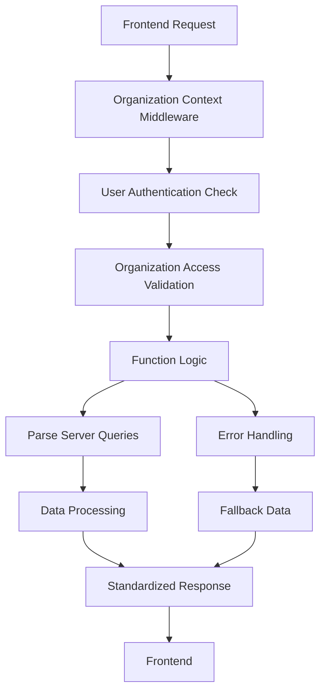

# Dashboard Cloud Functions

This directory contains the modular dashboard cloud functions, refactored from the original monolithic `dashboard.js` file for better maintainability and organization.

## Architecture

The dashboard functions are organized into logical modules:

### 📁 File Structure

```
dashboard/
├── index.js          # Entry point - imports all modules
├── utils.js          # Shared utilities and helper functions
├── config.js         # Dashboard configuration management
├── queries.js        # Data queries and record counting
├── metrics.js        # Metrics, analytics, and performance data
├── activity.js       # Activity feeds and audit logs
├── health.js         # System health monitoring
├── charts.js         # Chart data generation
├── dashboard.js.bak  # Original monolithic file (backup)
└── README.md         # This documentation
```

## 🔧 Modules Overview

### **index.js** - Entry Point
- Imports and registers all dashboard modules
- Maintains compatibility with existing Parse Server setup

### **utils.js** - Shared Utilities
- `withOrganizationContext` - Organization context middleware
- `checkUserOrgAccess` - User organization access validation
- `calculateGrowthPercentage` - Growth calculation helper
- `createOrgPointer` - Parse pointer creation
- `parseTimeRangeToDays` - Time range parsing
- `calculateStartDate` - Date calculation utilities
- `generateDateRange` - Date range generation
- `handleDashboardError` - Standardized error handling
- `createSuccessResponse` - Standardized success responses

### **config.js** - Configuration Management
**Cloud Functions:**
- `getDashboardConfig` - Get user dashboard configuration
- `saveDashboardConfig` - Save dashboard layout and widgets
- `getDashboardLayout` - Get dashboard layout (legacy compatibility)

### **queries.js** - Data Queries
**Cloud Functions:**
- `getOrganizationRecordCount` - Count organization records by class
- `getCloudFunctionCount` - Get available cloud function count
- `getIntegrationCount` - Count active integrations
- `getRecentTokens` - Get recent tokens for widgets

### **metrics.js** - Metrics & Analytics
**Cloud Functions:**
- `getDashboardMetrics` - Get comprehensive dashboard metrics
- `getPerformanceMetrics` - Get system performance data
- `getDashboardChartData` - Get chart data (legacy compatibility)

**Helper Functions:**
- `getUserGrowthData` - Calculate user growth over time
- `getTokenActivityData` - Calculate token activity metrics
- `getAppUsageData` - Get application usage data

### **activity.js** - Activity & Audit
**Cloud Functions:**
- `getDashboardActivity` - Get dashboard activity feed
- `getRecentActivity` - Get filtered recent activity
- `getActivitySummary` - Get activity summary for widgets

### **health.js** - System Health
**Cloud Functions:**
- `getSystemHealth` - Get basic system health status
- `getSystemStatus` - Get detailed system status with checks
- `getServiceAvailability` - Get service availability metrics
- `getResourceUsage` - Get system resource usage

**Helper Functions:**
- `performHealthChecks` - Execute health check routines

### **charts.js** - Chart Data
**Cloud Functions:**
- `getUserGrowthChart` - User growth chart data
- `getRecordActivityChart` - Record activity chart data
- `getFunctionUsageChart` - Function usage chart data
- `getTokenActivityChart` - Token activity chart data
- `getApiUsageChart` - API usage chart data
- `getStorageUsageChart` - Storage usage chart data

## 🚀 Usage

### Import in Parse Server
```javascript
// In your main Parse Server setup
require('./cloud/functions/dashboard');
```

### Calling Functions
```javascript
// From frontend
const result = await Parse.Cloud.run('getDashboardMetrics', {
  organizationId: 'your-org-id',
  timeRange: '30d'
});
```

## 🔒 Security Features

- **Organization Context Middleware**: All functions use `withOrganizationContext` for proper organization scoping
- **User Authentication**: All functions require authenticated users
- **Permission Validation**: Functions validate user access to organizations
- **ACL Management**: Proper Access Control Lists for dashboard configurations
- **Error Handling**: Standardized error handling with fallback data

## 📊 Data Flow



## 🔄 Migration from Original File

The original `dashboard.js` file has been refactored into this modular structure:

### Benefits:
- **Maintainability**: Easier to find and modify specific functionality
- **Testability**: Individual modules can be tested in isolation
- **Reusability**: Shared utilities can be used across modules
- **Scalability**: New features can be added as separate modules
- **Code Organization**: Related functions are grouped together

### Compatibility:
- All original cloud function names are preserved
- Function signatures remain unchanged
- Response formats are maintained
- Error handling is improved with fallbacks

## 🧪 Testing

Each module can be tested independently:

```javascript
// Example test structure
describe('Dashboard Metrics', () => {
  test('getDashboardMetrics returns valid data', async () => {
    const result = await Parse.Cloud.run('getDashboardMetrics', {
      organizationId: 'test-org'
    });
    expect(result.success).toBe(true);
    expect(result.metrics).toBeDefined();
  });
});
```

## 📈 Performance Considerations

- **Caching**: Consider implementing caching for frequently accessed data
- **Query Optimization**: Use appropriate indexes for Parse Server queries
- **Batch Operations**: Group related queries where possible
- **Fallback Data**: Graceful degradation when services are unavailable

## 🔮 Future Enhancements

- Real-time dashboard updates using Parse Server Live Queries
- Advanced analytics with time-series data
- Custom dashboard widget framework
- Enhanced monitoring and alerting
- Performance metrics collection and analysis

## 📝 Contributing

When adding new dashboard functionality:

1. Choose the appropriate module or create a new one
2. Follow the established patterns for error handling
3. Use the shared utilities from `utils.js`
4. Include proper organization context validation
5. Add comprehensive error handling with fallbacks
6. Update this README with new functions

## 🐛 Troubleshooting

### Common Issues:

1. **Organization Context Missing**: Ensure `withOrganizationContext` is applied
2. **Permission Errors**: Verify user has access to the organization
3. **Parse Query Failures**: Check Class-Level Permissions (CLPs)
4. **Fallback Data**: Functions return fallback data when queries fail

### Debug Mode:
Enable detailed logging by setting environment variable:
```bash
DEBUG=dashboard:*