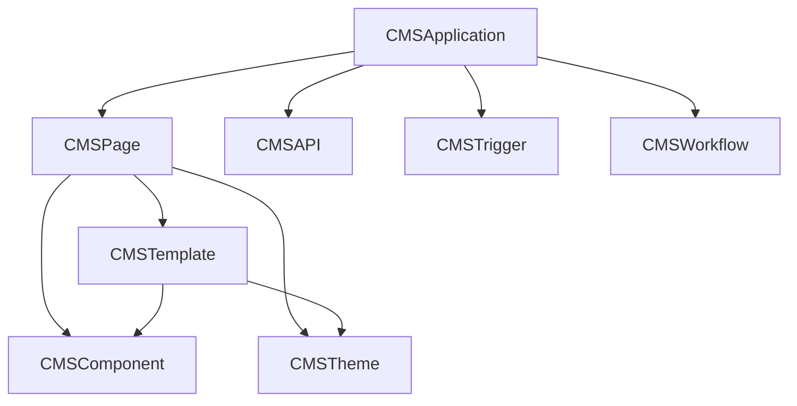

# CMS System Architecture

A flexible and powerful Content Management System built on Parse Server, providing a complete
solution for building and managing web applications.

## Core Classes

### CMSApplication

Manages applications and their components:

- Pages, APIs, triggers, workflows
- Application-level settings and configuration
- Navigation and routing
- Access control and permissions

### CMSAPI

Handles API endpoints and integrations:

- Custom API endpoints
- Request/response handling
- Authentication and rate limiting
- Data transformation and caching

### CMSComponent

Manages reusable UI components:

- Component definition and schema
- Property validation
- Data binding and state management
- Server-side rendering

### CMSPage

Handles page creation and management:

- Page layout and structure
- Component composition
- SEO configuration
- Analytics tracking

### CMSTemplate

Provides reusable page templates:

- Layout definition
- Component placement
- Variable interpolation
- Content placeholders

### CMSTheme

Manages application styling:

- Color schemes
- Typography
- Spacing and layout
- Component styling
- CSS variable generation

### CMSTrigger

Handles event-based actions:

- Event listening and processing
- Action execution
- Error handling
- Retry policies

### CMSWorkflow

Manages business processes:

- Multi-step operations
- Decision flows
- Parallel processing
- State management

## System Architecture



## Usage

### Initialization

```javascript
const { initializeCMS } = require('./classes');

// Initialize CMS with Parse Server
await initializeCMS(Parse);
```

### Creating an Application

```javascript
const { CMSApplication } = require('./classes');

const app = await CMSApplication.initialize({
  name: 'My App',
  description: 'My awesome application',
  organization: organization,
  owner: user,
});
```

### Creating Components

```javascript
const { CMSComponent } = require('./classes');

const component = await CMSComponent.initialize({
  name: 'Button',
  type: 'button',
  schema: {
    label: { type: 'string', required: true },
    onClick: { type: 'function' },
  },
  implementation: {
    client: {
      template: '<button>${label}</button>',
    },
  },
});
```

### Creating Pages

```javascript
const { CMSPage } = require('./classes');

const page = await CMSPage.initialize({
  name: 'Home',
  title: 'Home Page',
  slug: 'home',
  application: app,
  layout: {
    type: 'grid',
    components: [
      // Component configurations
    ],
  },
});
```

### Using Templates

```javascript
const { CMSTemplate } = require('./classes');

const template = await CMSTemplate.initialize({
  name: 'Blog Post',
  type: 'page',
  application: app,
  layout: {
    type: 'grid',
    rows: 12,
    columns: 12,
  },
});

const page = await template.createPage({
  name: 'My Blog Post',
  slug: 'my-blog-post',
  variables: {
    title: 'My First Post',
  },
});
```

### Applying Themes

```javascript
const { CMSTheme } = require('./classes');

const theme = await CMSTheme.initialize({
  name: 'Light Theme',
  application: app,
  colors: {
    primary: {
      main: '#1976d2',
    },
  },
});

// Generate CSS
const css = theme.generateCSS();
```

### Creating APIs

```javascript
const { CMSAPI } = require('./classes');

const api = await CMSAPI.initialize({
  name: 'User API',
  endpoint: '/users',
  method: 'GET',
  implementation: {
    type: 'code',
    code: 'return Parse.User.current();',
  },
});
```

### Setting up Triggers

```javascript
const { CMSTrigger } = require('./classes');

const trigger = await CMSTrigger.initialize({
  name: 'New User Welcome',
  type: 'event',
  config: {
    event: {
      type: 'user.created',
    },
  },
  actions: [
    {
      type: 'email',
      config: {
        template: 'welcome-email',
      },
    },
  ],
});
```

### Creating Workflows

```javascript
const { CMSWorkflow } = require('./classes');

const workflow = await CMSWorkflow.initialize({
  name: 'Content Approval',
  steps: [
    {
      id: 'submit',
      type: 'task',
      next: ['review'],
    },
    {
      id: 'review',
      type: 'decision',
      next: ['approve', 'reject'],
    },
  ],
});
```

## Best Practices

1. **Component Reusability**

   - Create generic, reusable components
   - Use proper schema validation
   - Implement proper data binding

2. **Page Organization**

   - Use templates for consistent layouts
   - Implement proper SEO
   - Consider performance optimization

3. **API Design**

   - Follow REST principles
   - Implement proper error handling
   - Use rate limiting and caching

4. **Security**

   - Implement proper access control
   - Validate user input
   - Use secure defaults

5. **Performance**
   - Use caching where appropriate
   - Optimize database queries
   - Implement proper indexing

## Contributing

1. Fork the repository
2. Create your feature branch
3. Commit your changes
4. Push to the branch
5. Create a Pull Request

## License

This project is licensed under the MIT License.
