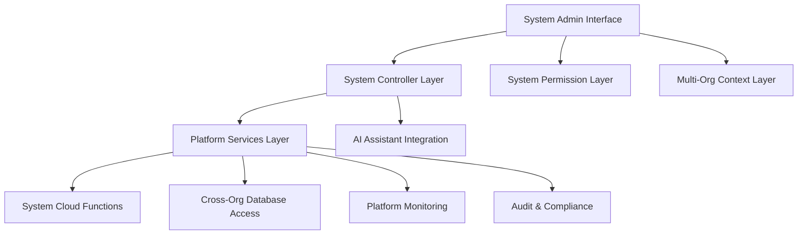

# System-Level Pages - Standards and Conventions

This document defines the standards and conventions for creating system-level administrative pages within the Token Nexus Platform. System-level pages provide platform-wide administrative functionality and require the highest level of security and access control.

## Table of Contents

1. [Architecture Overview](#architecture-overview)
2. [Access Control and Security](#access-control-and-security)
3. [Page Controller Standards](#page-controller-standards)
4. [Component Structure Standards](#component-structure-standards)
5. [System Data Management](#system-data-management)
6. [Multi-Organization Context](#multi-organization-context)
7. [Platform Monitoring Integration](#platform-monitoring-integration)
8. [Security and Audit Requirements](#security-and-audit-requirements)
9. [AI Assistant Integration](#ai-assistant-integration)
10. [Implementation Checklist](#implementation-checklist)
11. [Examples and Templates](#examples-and-templates)

## Architecture Overview

System-level pages operate at the platform level and provide administrative functionality across all organizations:



### Core Principles

1. **Platform-Wide Access**: System pages can access data across all organizations
2. **Highest Security**: Requires system administrator privileges
3. **Comprehensive Auditing**: All actions must be logged with full context
4. **Multi-Organization Awareness**: Must handle data from multiple organizations
5. **AI-First Design**: All functionality accessible through AI assistant
6. **Performance Monitoring**: Must include performance and health metrics

## Access Control and Security

### System Administrator Requirements

System-level pages are restricted to users with system administrator privileges:

```typescript
// System admin validation
interface SystemUser extends User {
  isAdmin: boolean;
  systemPermissions: string[];
  lastAdminActivity: Date;
  adminSessionExpiry: Date;
}

// Required permission check
const isSystemAdmin = (user: User): user is SystemUser => {
  return user.isAdmin === true && 
         user.systemPermissions?.includes('system_admin') &&
         new Date() < user.adminSessionExpiry;
};
```

### Multi-Factor Authentication

System pages must enforce additional security measures:

```typescript
// Enhanced security validation
interface SystemPageContext {
  user: SystemUser;
  mfaVerified: boolean;
  sessionStartTime: Date;
  lastActivity: Date;
  ipAddress: string;
  userAgent: string;
}

const validateSystemAccess = (context: SystemPageContext): boolean => {
  // Check MFA verification
  if (!context.mfaVerified) {
    throw new SecurityError('Multi-factor authentication required');
  }
  
  // Check session timeout (shorter for system pages)
  const sessionTimeout = 30 * 60 * 1000; // 30 minutes
  if (Date.now() - context.lastActivity.getTime() > sessionTimeout) {
    throw new SecurityError('Session expired');
  }
  
  return true;
};
```

### Permission Hierarchy

```typescript
enum SystemPermission {
  SYSTEM_ADMIN = 'system_admin',
  PLATFORM_MONITOR = 'platform_monitor',
  USER_MANAGER = 'user_manager',
  ORG_MANAGER = 'org_manager',
  SECURITY_ADMIN = 'security_admin',
  BILLING_ADMIN = 'billing_admin',
  SUPPORT_ADMIN = 'support_admin'
}
```

## Page Controller Standards

### System Controller Base Class

All system-level page controllers must extend [`BaseSystemController`](../src/controllers/base/BaseSystemController.ts):

```typescript
// Example: SystemUsersPageController.ts
import { BaseSystemController } from '../base/BaseSystemController';
import { SystemActionDefinition, SystemActionContext, SystemActionResult } from '../types/systemActionDefinitions';

export class SystemUsersPageController extends BaseSystemController {
  constructor() {
    super({
      pageId: 'system-users',
      pageName: 'System User Management',
      description: 'Manage all users across the platform',
      category: 'system-administration',
      tags: ['users', 'system', 'administration', 'security'],
      permissions: ['system_admin', 'user_manager'],
      version: '1.0.0',
      systemLevel: true, // Required for system pages
      requiresMFA: true,
      auditLevel: 'high'
    });
  }

  protected initializeActions(): void {
    this.registerViewAllUsersAction();
    this.registerSearchUsersAction();
    this.registerManageUserSystemRolesAction();
    this.registerSuspendUserAction();
    this.registerViewUserActivityAction();
    this.registerBulkUserOperationsAction();
    this.registerExportUserDataAction();
  }

  // System-level validation with enhanced security
  protected validateSystemAccess(context: SystemActionContext): { success: boolean; error?: string } {
    if (!context.user.isAdmin) {
      return {
        success: false,
        error: 'System administrator privileges required'
      };
    }

    if (!context.mfaVerified) {
      return {
        success: false,
        error: 'Multi-factor authentication required for system operations'
      };
    }

    return { success: true };
  }
}
```

### System Action Registration Pattern

System actions require enhanced security and auditing:

```typescript
private registerViewAllUsersAction(): void {
  this.registerAction(
    {
      id: 'viewAllUsers',
      name: 'View All Platform Users',
      description: 'Retrieve and display all users across all organizations',
      category: 'system-data',
      permissions: ['system_admin', 'user_manager'],
      requiresMFA: true,
      auditLevel: 'high',
      parameters: [
        { 
          name: 'organizationFilter', 
          type: 'string', 
          description: 'Filter users by organization ID', 
          required: false 
        },
        { 
          name: 'statusFilter', 
          type: 'string', 
          description: 'Filter by user status (active, suspended, pending)', 
          required: false,
          options: ['active', 'suspended', 'pending', 'all']
        },
        { 
          name: 'limit', 
          type: 'number', 
          description: 'Maximum number of users to return', 
          required: false,
          defaultValue: 100,
          validation: { min: 1, max: 1000 }
        }
      ],
      metadata: {
        tags: ['users', 'system', 'administration'],
        riskLevel: 'medium',
        examples: [
          {
            params: { statusFilter: 'suspended' },
            description: 'Get all suspended users across the platform'
          },
          {
            params: { organizationFilter: 'org_123', statusFilter: 'active' },
            description: 'Get active users in a specific organization'
          }
        ]
      }
    },
    async (params, context) => {
      const startTime = Date.now();
      const auditData = {
        action: 'viewAllUsers',
        userId: context.user.id,
        timestamp: new Date(),
        parameters: params,
        ipAddress: context.ipAddress,
        userAgent: context.userAgent
      };
      
      try {
        // Enhanced system access validation
        const accessValidation = this.validateSystemAccess(context);
        if (!accessValidation.success) {
          await this.auditService.logSecurityEvent({
            ...auditData,
            result: 'access_denied',
            reason: accessValidation.error
          });
          
          return {
            success: false,
            error: accessValidation.error,
            metadata: { executionTime: Date.now() - startTime }
          };
        }

        const filters = {
          organizationId: params.organizationFilter as string,
          status: params.statusFilter as string || 'all',
          limit: params.limit as number || 100
        };

        // Call system service with cross-organization access
        const result = await this.systemApiService.getAllUsers(filters);

        // Log successful access
        await this.auditService.logSystemAction({
          ...auditData,
          result: 'success',
          recordsAccessed: result.data.users.length,
          organizationsAccessed: result.data.organizationCount
        });

        return {
          success: true,
          data: {
            users: result.data.users,
            totalCount: result.data.totalCount,
            organizationCount: result.data.organizationCount,
            filters: filters
          },
          message: `Retrieved ${result.data.users.length} users from ${result.data.organizationCount} organizations`,
          metadata: {
            executionTime: Date.now() - startTime,
            recordsAccessed: result.data.users.length,
            auditId: auditData.timestamp.getTime()
          }
        };
      } catch (error) {
        // Log error with full context
        await this.auditService.logSystemError({
          ...auditData,
          result: 'error',
          error: error instanceof Error ? error.message : 'Unknown error',
          stackTrace: error instanceof Error ? error.stack : undefined
        });

        return {
          success: false,
          error: error instanceof Error ? error.message : 'Failed to retrieve users',
          metadata: {
            executionTime: Date.now() - startTime,
            errorType: error.constructor.name,
            auditId: auditData.timestamp.getTime()
          }
        };
      }
    }
  );
}
```

### Required Actions for System Pages

Every system-level page must implement these standard actions:

1. **View/List Action** - Display platform-wide data
2. **Search/Filter Action** - Search across all organizations
3. **Export Action** - Export system data with proper security
4. **Audit Action** - View audit logs for the page
5. **Health Check Action** - Monitor system health

Optional but recommended actions:

1. **Bulk Operations** - Batch operations across organizations
2. **Analytics Action** - Platform-wide analytics
3. **Configuration Action** - System configuration management
4. **Monitoring Action** - Real-time system monitoring

## Component Structure Standards

### System Page Component Template

```typescript
// Example: SystemUsersPage.tsx
import React, { useState, useEffect } from 'react';
import { useAppDispatch, useAppSelector } from '@/store/hooks';
import { useSystemPageController } from '@/hooks/useSystemPageController';
import { useSystemPermission } from '@/hooks/useSystemPermission';
import { useSystemAuth } from '@/hooks/useSystemAuth';
import { Card, CardContent, CardHeader, CardTitle } from '@/components/ui/card';
import { Button } from '@/components/ui/button';
import { Badge } from '@/components/ui/badge';
import { Alert, AlertDescription } from '@/components/ui/alert';
import { toast } from 'sonner';

export const SystemUsersPage: React.FC = () => {
  // System-level hooks
  const { isSystemAdmin, mfaVerified, requireMFA } = useSystemAuth();
  const { hasSystemPermission } = useSystemPermission();
  const dispatch = useAppDispatch();
  
  // System page controller integration
  const pageController = useSystemPageController({
    pageId: 'system-users',
    pageName: 'System User Management',
    description: 'Manage all users across the platform',
    category: 'system-administration',
    permissions: ['system_admin', 'user_manager'],
    requiresMFA: true
  });

  // Local state
  const [controllerError, setControllerError] = useState<string | null>(null);
  const [searchTerm, setSearchTerm] = useState('');
  const [isLoading, setIsLoading] = useState(false);
  const [selectedOrganization, setSelectedOrganization] = useState<string>('all');
  const [statusFilter, setStatusFilter] = useState<string>('all');

  // Redux state
  const { 
    users, 
    organizations, 
    isLoadingUsers, 
    error,
    totalCount,
    organizationCount 
  } = useAppSelector(state => state.systemUsers);

  // Permission checks
  const canManageUsers = hasSystemPermission('system_admin') || hasSystemPermission('user_manager');
  const canViewUsers = hasSystemPermission('system_admin') || hasSystemPermission('user_manager');

  // System access validation
  useEffect(() => {
    if (!isSystemAdmin) {
      setControllerError('System administrator privileges required');
      return;
    }
    
    if (!mfaVerified) {
      requireMFA();
      return;
    }
    
    if (canViewUsers) {
      loadUsers();
    }
  }, [isSystemAdmin, mfaVerified, canViewUsers]);

  // Data loading
  const loadUsers = async () => {
    if (!pageController.isRegistered || !isSystemAdmin || !mfaVerified) return;
    
    setIsLoading(true);
    setControllerError(null);
    
    try {
      const result = await pageController.executeAction('viewAllUsers', { 
        organizationFilter: selectedOrganization === 'all' ? undefined : selectedOrganization,
        statusFilter: statusFilter,
        limit: 100
      });
      
      if (result.success) {
        dispatch(setSystemUsers(result.data.users));
        dispatch(setSystemUserStats({
          totalCount: result.data.totalCount,
          organizationCount: result.data.organizationCount
        }));
      } else {
        setControllerError(result.error || 'Failed to load users');
      }
    } catch (error) {
      setControllerError('Failed to load users');
    } finally {
      setIsLoading(false);
    }
  };

  // Action handlers
  const handleRefreshUsers = async () => {
    await loadUsers();
    toast.success('User list refreshed');
  };

  const handleSuspendUser = async (userId: string) => {
    if (!pageController.isRegistered) return;
    
    try {
      const result = await pageController.executeAction('suspendUser', {
        userId: userId,
        reason: 'Administrative action'
      });
      
      if (result.success) {
        toast.success('User suspended successfully');
        await loadUsers(); // Refresh the list
      } else {
        toast.error(result.error || 'Failed to suspend user');
      }
    } catch (error) {
      toast.error('Failed to suspend user');
    }
  };

  const handleExportUsers = async () => {
    if (!pageController.isRegistered) return;
    
    try {
      const result = await pageController.executeAction('exportUserData', {
        format: 'csv',
        includeOrganizations: true
      });
      
      if (result.success) {
        // Handle file download
        const blob = new Blob([result.data.csvData], { type: 'text/csv' });
        const url = window.URL.createObjectURL(blob);
        const a = document.createElement('a');
        a.href = url;
        a.download = `platform-users-${new Date().toISOString().split('T')[0]}.csv`;
        a.click();
        window.URL.revokeObjectURL(url);
        
        toast.success('User data exported successfully');
      } else {
        toast.error(result.error || 'Failed to export user data');
      }
    } catch (error) {
      toast.error('Failed to export user data');
    }
  };

  // Early returns for security validation
  if (!isSystemAdmin) {
    return (
      <div className="flex items-center justify-center min-h-screen">
        <Alert className="max-w-md">
          <AlertTriangle className="h-4 w-4" />
          <AlertDescription>
            System administrator privileges required to access this page.
          </AlertDescription>
        </Alert>
      </div>
    );
  }

  if (!mfaVerified) {
    return (
      <div className="flex items-center justify-center min-h-screen">
        <Alert className="max-w-md">
          <Shield className="h-4 w-4" />
          <AlertDescription>
            Multi-factor authentication required for system administration.
          </AlertDescription>
        </Alert>
      </div>
    );
  }

  if (!canViewUsers) {
    return (
      <div className="flex items-center justify-center min-h-screen">
        <Alert className="max-w-md">
          <Lock className="h-4 w-4" />
          <AlertDescription>
            You don't have permission to view system users.
          </AlertDescription>
        </Alert>
      </div>
    );
  }

  return (
    <div className="space-y-6">
      {/* System Page Header */}
      <div className="flex flex-col sm:flex-row sm:items-center sm:justify-between gap-4">
        <div className="flex items-center gap-3">
          <Shield className="h-8 w-8 text-red-600" />
          <div>
            <h1 className="text-2xl font-bold tracking-tight text-red-600">
              System User Management
            </h1>
            <p className="text-muted-foreground">
              Platform-wide user administration and monitoring
            </p>
          </div>
        </div>
        
        <div className="flex items-center gap-2">
          {/* Security Status Indicators */}
          <Badge variant="outline" className="text-xs border-green-500 text-green-700">
            <Shield className="h-3 w-3 mr-1" />
            MFA Verified
          </Badge>
          
          {/* AI Assistant Integration Badge */}
          {pageController.isRegistered && (
            <Badge variant="outline" className="text-xs">
              <Zap className="h-3 w-3 mr-1" />
              {pageController.getAvailableActions().length} AI actions
            </Badge>
          )}
          
          {/* Action Buttons */}
          <Button variant="outline" onClick={handleRefreshUsers} disabled={isLoading}>
            <RefreshCw className={`h-4 w-4 mr-2 ${isLoading ? 'animate-spin' : ''}`} />
            Refresh
          </Button>
          
          <Button variant="outline" onClick={handleExportUsers}>
            <Download className="h-4 w-4 mr-2" />
            Export
          </Button>
        </div>
      </div>

      {/* System Stats */}
      <div className="grid grid-cols-1 md:grid-cols-3 gap-4">
        <Card>
          <CardHeader className="pb-2">
            <CardTitle className="text-sm font-medium">Total Users</CardTitle>
          </CardHeader>
          <CardContent>
            <div className="text-2xl font-bold">{totalCount?.toLocaleString() || 0}</div>
          </CardContent>
        </Card>
        
        <Card>
          <CardHeader className="pb-2">
            <CardTitle className="text-sm font-medium">Organizations</CardTitle>
          </CardHeader>
          <CardContent>
            <div className="text-2xl font-bold">{organizationCount?.toLocaleString() || 0}</div>
          </CardContent>
        </Card>
        
        <Card>
          <CardHeader className="pb-2">
            <CardTitle className="text-sm font-medium">Active Sessions</CardTitle>
          </CardHeader>
          <CardContent>
            <div className="text-2xl font-bold">
              {users?.filter(u => u.isOnline).length || 0}
            </div>
          </CardContent>
        </Card>
      </div>

      {/* Error Display */}
      {controllerError && (
        <Alert variant="destructive">
          <AlertTriangle className="h-4 w-4" />
          <AlertDescription>{controllerError}</AlertDescription>
        </Alert>
      )}

      {/* Main Content */}
      <Card>
        <CardHeader>
          <CardTitle>Platform Users</CardTitle>
        </CardHeader>
        <CardContent>
          {/* Filters */}
          <div className="flex items-center gap-4 mb-6">
            <div className="relative flex-1">
              <Search className="absolute left-3 top-1/2 transform -translate-y-1/2 h-4 w-4 text-muted-foreground" />
              <Input
                placeholder="Search users across all organizations..."
                value={searchTerm}
                onChange={(e) => setSearchTerm(e.target.value)}
                className="pl-10"
              />
            </div>
            
            <Select value={selectedOrganization} onValueChange={setSelectedOrganization}>
              <SelectTrigger className="w-48">
                <SelectValue placeholder="All Organizations" />
              </SelectTrigger>
              <SelectContent>
                <SelectItem value="all">All Organizations</SelectItem>
                {organizations?.map(org => (
                  <SelectItem key={org.id} value={org.id}>
                    {org.name}
                  </SelectItem>
                ))}
              </SelectContent>
            </Select>
            
            <Select value={statusFilter} onValueChange={setStatusFilter}>
              <SelectTrigger className="w-32">
                <SelectValue placeholder="Status" />
              </SelectTrigger>
              <SelectContent>
                <SelectItem value="all">All Status</SelectItem>
                <SelectItem value="active">Active</SelectItem>
                <SelectItem value="suspended">Suspended</SelectItem>
                <SelectItem value="pending">Pending</SelectItem>
              </SelectContent>
            </Select>
          </div>

          {/* Data Display */}
          {isLoading ? (
            <div className="space-y-4">
              {[...Array(10)].map((_, i) => (
                <Skeleton key={i} className="h-16 w-full" />
              ))}
            </div>
          ) : users.length === 0 ? (
            <div className="text-center py-8">
              <Users className="h-12 w-12 mx-auto text-muted-foreground mb-4" />
              <h3 className="text-lg font-medium mb-2">No users found</h3>
              <p className="text-muted-foreground">
                {searchTerm ? 'No users match your search criteria.' : 'No users in the system.'}
              </p>
            </div>
          ) : (
            <SystemUserTable 
              users={users}
              searchTerm={searchTerm}
              onUserAction={handleUserAction}
              canManageUsers={canManageUsers}
              onSuspendUser={handleSuspendUser}
            />
          )}
        </CardContent>
      </Card>
    </div>
  );
};
```

### Required Component Structure for System Pages

1. **Security Validation** - Multiple layers of access control
2. **MFA Verification** - Multi-factor authentication checks
3. **System Status Indicators** - Security and system health badges
4. **Platform Statistics** - High-level platform metrics
5. **Enhanced Error Handling** - Security-focused error messages
6. **Audit Integration** - All actions logged with full context
7. **Cross-Organization Filters** - Organization selection and filtering

## System Data Management

### Cross-Organization Data Access

```typescript
// System service for cross-organization operations
interface SystemDataService {
  getAllUsers(filters: SystemUserFilters): Promise<SystemUserResponse>;
  getAllOrganizations(filters: OrgFilters): Promise<OrganizationResponse>;
  getSystemMetrics(): Promise<SystemMetrics>;
  getAuditLogs(filters: AuditFilters): Promise<AuditLogResponse>;
}

// Example implementation
const systemApiService = {
  async getAllUsers(filters: SystemUserFilters) {
    // System-level API call with enhanced security
    return await apiClient.post('/system/users', filters, {
      headers: {
        'X-System-Admin': 'true',
        'X-MFA-Token': getMFAToken(),
        'X-Audit-Context': JSON.stringify({
          action: 'getAllUsers',
          timestamp: new Date().toISOString()
        })
      }
    });
  }
};
```

### Data Aggregation Patterns

```typescript
// System-level data aggregation
interface SystemMetrics {
  userMetrics: {
    totalUsers: number;
    activeUsers: number;
    newUsersToday: number;
    suspendedUsers: number;
  };
  organizationMetrics: {
    totalOrganizations: number;
    activeOrganizations: number;
    newOrganizationsToday: number;
  };
  platformMetrics: {
    totalApiCalls: number;
    errorRate: number;
    averageResponseTime: number;
    uptime: number;
  };
}
```

## Multi-Organization Context

### Organization Selection and Filtering

```typescript
// Multi-organization context management
const useMultiOrgContext = () => {
  const [selectedOrganizations, setSelectedOrganizations] = useState<string[]>(['all']);
  const [organizationData, setOrganizationData] = useState<Organization[]>([]);
  
  const filterByOrganizations = (data: any[], orgField: string = 'organizationId') => {
    if (selectedOrganizations.includes('all')) {
      return data;
    }
    
    return data.filter(item => 
      selectedOrganizations.includes(item[orgField])
    );
  };
  
  return {
    selectedOrganizations,
    setSelectedOrganizations,
    organizationData,
    filterByOrganizations
  };
};
```

### Cross-Organization Operations

```typescript
// Bulk operations across organizations
const handleBulkUserOperation = async (operation: string, userIds: string[]) => {
  if (!pageController.isRegistered) return;
  
  try {
    const result = await pageController.executeAction('bulkUserOperation', {
      operation: operation,
      userIds: userIds,
      reason: 'System administration'
    });
    
    if (result.success) {
      toast.success(`${operation} completed for ${userIds.length} users`);
      await loadUsers();
    } else {
      toast.error(result.error || `Failed to ${operation} users`);
    }
  } catch (error) {
    toast.error(`Failed to ${operation} users`);
  }
};
```

## Platform Monitoring Integration

### Real-Time System Health

```typescript
// System health monitoring
const useSystemHealth = () => {
  const [healthMetrics, setHealthMetrics] = useState<SystemHealth | null>(null);
  const [isHealthy, setIsHealthy] = useState(true);
  
  useEffect(() => {
    const interval = setInterval(async () => {
      try {
        const health = await systemApiService.getSystemHealth();
        setHealthMetrics(health);
        setIsHealthy(health.overall === 'healthy');
      } catch (error) {
        setIsHealthy(false);
      }
    }, 30000); // Check every 30 seconds
    
    return () => clearInterval(interval);
  }, []);
  
  return { healthMetrics, isHealthy };
};
```

### Performance Metrics Display

```typescript
// Performance metrics component
const SystemMetricsCard: React.FC = () => {
  const { healthMetrics, isHealthy } = useSystemHealth();
  
  return (
    <Card>
      <CardHeader>
        <CardTitle className="flex items-center gap-2">
          <Activity className="h-5 w-5" />
          System Health
          <Badge variant={isHealthy ? "default" : "destructive"}>
            {isHealthy ? "Healthy" : "Issues Detected"}
          </Badge>
        </CardTitle>
      </CardHeader>
      <CardContent>
        <div className="grid grid-cols-2 gap-4">
          <div>
            <div className="text-sm text-muted-foreground">Response Time</div>
            <div className="text-lg font-semibold">
              {healthMetrics?.averageResponseTime || 0}ms
            </div>
          </div>
          <div>
            <div className="text-sm text-muted-foreground">Error Rate</div>
            <div className="text-lg font-semibold">
              {healthMetrics?.errorRate || 0}%
            </div>
          </div>
          <div>
            <div className="text-sm text-muted-foreground">Uptime</div>
            <div className="text-lg font-semibold">
              {healthMetrics?.uptime || 0}%
            </div>
          </div>
          <div>
            <div className="text-sm text-muted-foreground">Active Sessions</div>
            <div className="text-lg font-semibold">
              {healthMetrics?.activeSessions || 0}
            </div>
          </div>
        </div>
      </CardContent>
    </Card>
  );
};
```

## Security and Audit Requirements

### Enhanced Audit Logging

```typescript
// System-level audit logging
interface SystemAuditLog {
  id: string;
  timestamp: Date;
  userId: string;
  action: string;
  resource: string;
  resourceId?: string;
  organizationId?: string;
  ipAddress: string;
  userAgent: string;
  mfaVerified: boolean;
  result: 'success' | 'failure' | 'error';
  details: Record<string, any>;
  riskLevel: 'low' | 'medium' | 'high' | 'critical';
}

// Automatic audit logging for all system actions
const auditSystemAction = async (auditData: Partial<SystemAuditLog>) => {
  await systemApiService.createAuditLog({
    ...auditData,
    timestamp: new Date(),
    systemLevel: true
  });
};
```

### Security Event Monitoring

```typescript
// Security event detection
const monitorSecurityEvents = () => {
  useEffect(() => {
    const eventSource = new EventSource('/api/system/security-events');
    
    eventSource.onmessage = (event) => {
      const securityEvent = JSON.parse(event.data);
      
      if (securityEvent.severity === 'high' || securityEvent.severity === 'critical') {
        toast.error(`Security Alert: ${securityEvent.message}`);
      }
    };
    
    return () => eventSource.close();
  }, []);
};
```

## AI Assistant Integration

### System-Level AI Actions

```typescript
// AI assistant integration for system operations
const systemAIActions = [
  {
    id: 'analyzeUserActivity',
    name: 'Analyze User Activity Patterns',
    description: 'Analyze user activity patterns across the platform',
    category: 'analytics',
    permissions: ['system_admin'],
    parameters: [
      { name: 'timeRange', type: 'string', description: 'Time range for analysis' },
      { name: 'organizationId', type: 'string', description: 'Specific organization to analyze', required: false }
    ]
  },
  {
    id: 'detectAnomalies',
    name: 'Detect System Anomalies',
    description: 'Detect unusual patterns or potential security issues',
    category: 'security',
    permissions: ['system_admin', 'security_admin'],
    parameters: [
      { name: 'severity', type: 'string', description: 'Minimum severity level to detect' }
    ]
  }
];
```

## Implementation