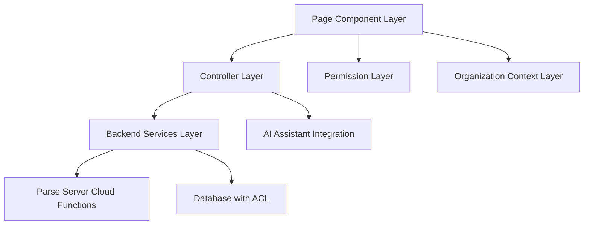

# Organization-Centric Pages - Standards and Conventions

This document defines the standards and conventions for creating organization-scoped pages within the Token Nexus Platform. Organization-centric pages are the primary interface for organization members to interact with platform functionality and must follow strict multi-tenant security and architectural patterns.

## Table of Contents

1. [Architecture Overview](#architecture-overview)
2. [Page Controller Standards](#page-controller-standards)
3. [Component Structure Standards](#component-structure-standards)
4. [Permission System Integration](#permission-system-integration)
5. [Organization Context Management](#organization-context-management)
6. [Data Management Patterns](#data-management-patterns)
7. [UI/UX Standards](#uiux-standards)
8. [Security Requirements](#security-requirements)
9. [AI Assistant Integration](#ai-assistant-integration)
10. [Implementation Checklist](#implementation-checklist)
11. [Examples and Templates](#examples-and-templates)

## Architecture Overview

Organization-centric pages follow a three-layer architecture that ensures security, maintainability, and AI integration:



### Core Principles

1. **Organization Isolation**: All data and operations must be scoped to the current organization
2. **Permission-Based Access**: Every action must validate user permissions
3. **AI-First Design**: All functionality must be accessible through AI assistant
4. **Audit Trail**: All operations must be logged for compliance
5. **Responsive Design**: Pages must work across all device sizes

## Page Controller Standards

### Controller Base Class

All organization-centric page controllers must extend [`BasePageController`](../src/controllers/base/BasePageController.ts) and implement the organization validation pattern:

```typescript
// Example: OrganizationUsersPageController.ts
import { BasePageController } from '../base/BasePageController';
import { ActionDefinition, ActionContext, ActionResult } from '../types/actionDefinitions';

export class OrganizationUsersPageController extends BasePageController {
  constructor() {
    super({
      pageId: 'org-users',
      pageName: 'Organization Users',
      description: 'Manage users within the current organization',
      category: 'organization-management',
      tags: ['users', 'organization', 'permissions', 'roles'],
      permissions: ['org_admin', 'user_manager', 'users:read'],
      version: '1.0.0',
      organizationScoped: true // Required for org-centric pages
    });
  }

  protected initializeActions(): void {
    this.registerViewUsersAction();
    this.registerInviteUserAction();
    this.registerManageUserRolesAction();
    this.registerRemoveUserAction();
    this.registerBulkOperationsAction();
  }

  // Organization context validation is automatically handled by BasePageController
  protected validateOrganizationContext(context: ActionContext): { success: boolean; error?: string } {
    const orgId = this.getOrganizationId(context);
    if (!orgId) {
      return {
        success: false,
        error: 'Organization context is required for this operation'
      };
    }
    return { success: true };
  }
}
```

### Action Registration Pattern

Each action must follow the standardized registration pattern with organization validation:

```typescript
private registerViewUsersAction(): void {
  this.registerAction(
    {
      id: 'viewUsers',
      name: 'View Organization Users',
      description: 'Retrieve and display all users in the current organization',
      category: 'data',
      permissions: ['org_admin', 'user_manager', 'users:read'],
      parameters: [
        { 
          name: 'orgId', 
          type: 'string', 
          description: 'Organization ID (auto-detected if not provided)', 
          required: false 
        },
        { 
          name: 'filters', 
          type: 'object', 
          description: 'Filter criteria for user search', 
          required: false 
        }
      ],
      metadata: {
        tags: ['users', 'organization'],
        examples: [
          {
            params: { filters: { role: 'developer' } },
            description: 'Get all developers in the organization'
          }
        ]
      }
    },
    async (params, context) => {
      const startTime = Date.now();
      
      try {
        // Organization context validation (automatic)
        const orgValidation = this.validateOrganizationContext(context);
        if (!orgValidation.success) {
          return {
            success: false,
            error: orgValidation.error,
            metadata: { executionTime: Date.now() - startTime }
          };
        }

        const orgId = params.orgId as string || this.getOrganizationId(context);
        const filters = params.filters as Record<string, any> || {};

        // Call backend service with organization context
        const result = await this.apiService.getOrgUsers({ orgId, ...filters });

        return {
          success: true,
          data: {
            users: result.data.users,
            totalCount: result.data.totalCount,
            orgId: orgId
          },
          message: `Retrieved ${result.data.users.length} users from organization`,
          metadata: {
            executionTime: Date.now() - startTime,
            orgId: orgId,
            filterCount: Object.keys(filters).length
          }
        };
      } catch (error) {
        return {
          success: false,
          error: error instanceof Error ? error.message : 'Failed to retrieve users',
          metadata: {
            executionTime: Date.now() - startTime,
            errorType: error.constructor.name
          }
        };
      }
    }
  );
}
```

### Required Actions for Organization Pages

Every organization-centric page must implement these standard actions:

1. **View/List Action** - Display organization-scoped data
2. **Search/Filter Action** - Search within organization data
3. **Refresh Action** - Reload current data
4. **Export Action** - Export organization data (if applicable)

Optional but recommended actions:

1. **Create Action** - Create new organization-scoped resources
2. **Update Action** - Modify existing resources
3. **Delete Action** - Remove resources (with proper validation)
4. **Bulk Operations** - Batch operations on multiple items

## Component Structure Standards

### Page Component Template

```typescript
// Example: OrganizationUsersPage.tsx
import React, { useState, useEffect } from 'react';
import { useAppDispatch, useAppSelector } from '@/store/hooks';
import { usePageController } from '@/hooks/usePageController';
import { usePermission } from '@/hooks/usePermission';
import { useOrganization } from '@/hooks/useOrganization';
import { Card, CardContent, CardHeader, CardTitle } from '@/components/ui/card';
import { Button } from '@/components/ui/button';
import { Badge } from '@/components/ui/badge';
import { toast } from 'sonner';

export const OrganizationUsersPage: React.FC = () => {
  // Hooks - Order matters for proper initialization
  const { currentOrg, isOrgLoading } = useOrganization();
  const { hasPermission, checkAnyPermission } = usePermission();
  const dispatch = useAppDispatch();
  
  // Page controller integration
  const pageController = usePageController({
    pageId: 'org-users',
    pageName: 'Organization Users',
    description: 'Manage users within the current organization',
    category: 'organization-management',
    permissions: ['org_admin', 'user_manager', 'users:read'],
    tags: ['users', 'organization', 'permissions']
  });

  // Local state
  const [controllerError, setControllerError] = useState<string | null>(null);
  const [searchTerm, setSearchTerm] = useState('');
  const [isLoading, setIsLoading] = useState(false);

  // Redux state
  const { users, isLoadingUsers, error } = useAppSelector(state => state.orgUsers);

  // Permission checks
  const canManageUsers = hasPermission('org_admin') || hasPermission('user_manager');
  const canViewUsers = checkAnyPermission(['org_admin', 'user_manager', 'users:read']);

  // Organization context validation
  useEffect(() => {
    if (!isOrgLoading && !currentOrg) {
      setControllerError('No organization context available');
      return;
    }
    
    if (currentOrg && canViewUsers) {
      loadUsers();
    }
  }, [currentOrg, isOrgLoading, canViewUsers]);

  // Data loading
  const loadUsers = async () => {
    if (!currentOrg || !pageController.isRegistered) return;
    
    setIsLoading(true);
    setControllerError(null);
    
    try {
      const result = await pageController.executeAction('viewUsers', { 
        orgId: currentOrg.id 
      });
      
      if (result.success) {
        // Update Redux state or local state as needed
        dispatch(setUsers(result.data.users));
      } else {
        setControllerError(result.error || 'Failed to load users');
      }
    } catch (error) {
      setControllerError('Failed to load users');
    } finally {
      setIsLoading(false);
    }
  };

  // Action handlers
  const handleRefreshUsers = async () => {
    await loadUsers();
    toast.success('User list refreshed');
  };

  const handleInviteUser = async () => {
    if (!pageController.isRegistered || !currentOrg) return;
    
    try {
      const result = await pageController.executeAction('inviteUser', {
        orgId: currentOrg.id,
        // Additional parameters would come from a form/modal
      });
      
      if (result.success) {
        toast.success('User invited successfully');
        await loadUsers(); // Refresh the list
      } else {
        toast.error(result.error || 'Failed to invite user');
      }
    } catch (error) {
      toast.error('Failed to invite user');
    }
  };

  // Early returns for loading and permission states
  if (isOrgLoading) {
    return <div>Loading organization context...</div>;
  }

  if (!currentOrg) {
    return <div>No organization context available</div>;
  }

  if (!canViewUsers) {
    return <div>You don't have permission to view users</div>;
  }

  return (
    <div className="space-y-6">
      {/* Page Header */}
      <div className="flex flex-col sm:flex-row sm:items-center sm:justify-between gap-4">
        <div className="flex items-center gap-3">
          <UsersIcon className="h-8 w-8 text-primary" />
          <div>
            <h1 className="text-2xl font-bold tracking-tight">Organization Users</h1>
            <p className="text-muted-foreground">
              Manage users and permissions for {currentOrg.name}
            </p>
          </div>
        </div>
        
        <div className="flex items-center gap-2">
          {/* AI Assistant Integration Badge */}
          {pageController.isRegistered && (
            <Badge variant="outline" className="text-xs">
              <Zap className="h-3 w-3 mr-1" />
              {pageController.getAvailableActions().length} AI actions
            </Badge>
          )}
          
          {/* Action Buttons */}
          <Button variant="outline" onClick={handleRefreshUsers} disabled={isLoading}>
            <RefreshCw className={`h-4 w-4 mr-2 ${isLoading ? 'animate-spin' : ''}`} />
            Refresh
          </Button>
          
          {canManageUsers && (
            <Button onClick={handleInviteUser}>
              <UserPlus className="h-4 w-4 mr-2" />
              Invite User
            </Button>
          )}
        </div>
      </div>

      {/* Error Display */}
      {controllerError && (
        <div className="bg-destructive/15 text-destructive px-4 py-3 rounded-md">
          {controllerError}
        </div>
      )}

      {/* Main Content */}
      <Card>
        <CardHeader>
          <CardTitle>Users in {currentOrg.name}</CardTitle>
        </CardHeader>
        <CardContent>
          {/* Search and Filter Bar */}
          <div className="flex items-center gap-4 mb-6">
            <div className="relative flex-1">
              <Search className="absolute left-3 top-1/2 transform -translate-y-1/2 h-4 w-4 text-muted-foreground" />
              <Input
                placeholder="Search users..."
                value={searchTerm}
                onChange={(e) => setSearchTerm(e.target.value)}
                className="pl-10"
              />
            </div>
            <Button variant="outline">
              <Filter className="h-4 w-4 mr-2" />
              Filters
            </Button>
          </div>

          {/* Data Display */}
          {isLoading ? (
            <div className="space-y-4">
              {[...Array(5)].map((_, i) => (
                <Skeleton key={i} className="h-16 w-full" />
              ))}
            </div>
          ) : users.length === 0 ? (
            <div className="text-center py-8">
              <Users className="h-12 w-12 mx-auto text-muted-foreground mb-4" />
              <h3 className="text-lg font-medium mb-2">No users found</h3>
              <p className="text-muted-foreground mb-4">
                {searchTerm ? 'No users match your search criteria.' : 'This organization has no users yet.'}
              </p>
              {canManageUsers && !searchTerm && (
                <Button onClick={handleInviteUser}>
                  <UserPlus className="h-4 w-4 mr-2" />
                  Invite First User
                </Button>
              )}
            </div>
          ) : (
            <UserTable 
              users={users}
              searchTerm={searchTerm}
              onUserAction={handleUserAction}
              canManageUsers={canManageUsers}
            />
          )}
        </CardContent>
      </Card>
    </div>
  );
};
```

### Required Component Structure

1. **Hooks Section** - All hooks at the top in proper order
2. **Permission Checks** - Validate user permissions early
3. **Organization Context** - Validate organization context
4. **Page Header** - Consistent header with title, description, and actions
5. **Error Display** - Dedicated error display area
6. **Main Content** - Card-based content layout
7. **Loading States** - Skeleton loaders for all async operations
8. **Empty States** - Clear messaging when no data is available

## Permission System Integration

### Permission Hook Usage

```typescript
const { hasPermission, checkAnyPermission, checkAllPermissions } = usePermission();

// Single permission check
const canManageUsers = hasPermission('org_admin');

// Multiple permissions (any)
const canViewUsers = checkAnyPermission(['org_admin', 'user_manager', 'users:read']);

// Multiple permissions (all required)
const canDeleteUsers = checkAllPermissions(['org_admin', 'users:delete']);
```

### Permission-Based Rendering

```typescript
// Conditional rendering based on permissions
{canManageUsers && (
  <Button onClick={handleInviteUser}>
    <UserPlus className="h-4 w-4 mr-2" />
    Invite User
  </Button>
)}

// Conditional features in components
<UserTable 
  users={users}
  canEdit={canManageUsers}
  canDelete={hasPermission('org_admin')}
  canViewDetails={canViewUsers}
/>
```

### Permission Hierarchy for Organization Pages

1. **System Admin** (`user.isAdmin === true`) - Full access to all organizations
2. **Organization Admin** (`org_admin`) - Full access within their organization
3. **Role-based Permissions** - Specific permissions like `user_manager`, `users:read`
4. **Organization Member** - Basic access to organization features

## Organization Context Management

### Organization Hook Usage

```typescript
const { 
  currentOrg, 
  isOrgLoading, 
  orgError, 
  switchOrganization,
  refreshOrganization 
} = useOrganization();

// Organization validation
useEffect(() => {
  if (!isOrgLoading && !currentOrg) {
    setError('No organization context available');
    return;
  }
  
  if (currentOrg) {
    // Load organization-specific data
    loadData();
  }
}, [currentOrg, isOrgLoading]);
```

### Organization Context Validation

```typescript
// In page controllers
protected getOrganizationId(context: ActionContext): string | null {
  return context.user.organizationId || 
         context.organization?.id || 
         context.params?.orgId as string || 
         null;
}

// In components
const validateOrgContext = (): boolean => {
  if (!currentOrg) {
    setError('Organization context is required');
    return false;
  }
  return true;
};
```

## Data Management Patterns

### Redux Integration

```typescript
// For global organization data
const dispatch = useAppDispatch();
const { users, isLoading, error } = useAppSelector(state => state.orgUsers);

// Load data through Redux
useEffect(() => {
  if (currentOrg) {
    dispatch(fetchOrgUsers({ orgId: currentOrg.id }));
  }
}, [currentOrg, dispatch]);
```

### React Query Integration

```typescript
// For server state management
const { 
  data: users, 
  isLoading, 
  error, 
  refetch 
} = useQuery({
  queryKey: ['orgUsers', currentOrg?.id],
  queryFn: () => apiService.getOrgUsers({ orgId: currentOrg!.id }),
  enabled: !!currentOrg,
  staleTime: 5 * 60 * 1000, // 5 minutes
});
```

### Data Fetching Best Practices

1. **Organization Scoping** - Always include organization ID in API calls
2. **Permission Validation** - Check permissions before making API calls
3. **Error Handling** - Provide meaningful error messages
4. **Loading States** - Show appropriate loading indicators
5. **Caching** - Use appropriate caching strategies

## UI/UX Standards

### Layout Standards

```typescript
// Standard page layout
<div className="space-y-6">
  {/* Page Header */}
  <div className="flex flex-col sm:flex-row sm:items-center sm:justify-between gap-4">
    {/* Title and description */}
    {/* Action buttons */}
  </div>
  
  {/* Error display */}
  {error && <ErrorDisplay error={error} />}
  
  {/* Main content */}
  <Card>
    <CardHeader>
      <CardTitle>Content Title</CardTitle>
    </CardHeader>
    <CardContent>
      {/* Content */}
    </CardContent>
  </Card>
</div>
```

### Responsive Design Requirements

1. **Mobile First** - Design for mobile, enhance for desktop
2. **Breakpoint Standards** - Use Tailwind's standard breakpoints
3. **Touch Targets** - Minimum 44px touch targets on mobile
4. **Navigation** - Collapsible navigation on mobile

### Accessibility Requirements

1. **ARIA Labels** - Proper ARIA labels for all interactive elements
2. **Keyboard Navigation** - Full keyboard accessibility
3. **Screen Readers** - Semantic HTML and proper headings
4. **Color Contrast** - WCAG AA compliance

## Security Requirements

### Data Security

1. **Organization Isolation** - All data must be scoped to organization
2. **Permission Validation** - Validate permissions on every operation
3. **Input Sanitization** - Sanitize all user inputs
4. **XSS Prevention** - Prevent cross-site scripting attacks

### API Security

```typescript
// Example secure API call
const apiCall = async (data: any) => {
  // Validate organization context
  if (!currentOrg) {
    throw new Error('Organization context required');
  }
  
  // Validate permissions
  if (!hasPermission('required_permission')) {
    throw new Error('Insufficient permissions');
  }
  
  // Include organization context in API call
  return apiService.secureCall({
    ...data,
    orgId: currentOrg.id
  });
};
```

### Audit Logging

All organization operations must be logged:

```typescript
// Automatic audit logging through page controllers
const result = await pageController.executeAction('actionName', params);
// Audit log is automatically created with:
// - User ID
// - Organization ID  
// - Action performed
// - Timestamp
// - Result status
```

## AI Assistant Integration

### Action Discoverability

```typescript
// Actions are automatically discoverable by AI assistant
const pageController = usePageController({
  pageId: 'org-users',
  // ... other config
});

// AI can execute actions like:
// "Show me all developers in the organization"
// "Invite a new user to the organization"
// "Remove user john@example.com from the organization"
```

### AI-Friendly Action Design

```typescript
// Design actions with clear, descriptive names and parameters
{
  id: 'inviteUserToOrganization',
  name: 'Invite User to Organization',
  description: 'Send an invitation to a new user to join the current organization',
  parameters: [
    { 
      name: 'email', 
      type: 'string', 
      description: 'Email address of the user to invite',
      required: true,
      validation: 'email'
    },
    { 
      name: 'role', 
      type: 'string', 
      description: 'Role to assign to the user (developer, viewer, admin)',
      required: false,
      defaultValue: 'viewer',
      options: ['developer', 'viewer', 'admin']
    }
  ],
  metadata: {
    examples: [
      {
        params: { email: 'john@example.com', role: 'developer' },
        description: 'Invite John as a developer'
      }
    ]
  }
}
```

## Implementation Checklist

### Planning Phase
- [ ] Define page purpose and scope
- [ ] Identify required permissions
- [ ] Plan organization context requirements
- [ ] Design data model and API requirements
- [ ] Plan AI assistant integration

### Controller Implementation
- [ ] Create page controller extending BasePageController
- [ ] Set organizationScoped: true in constructor
- [ ] Implement all required actions (view, search, refresh)
- [ ] Add permission validation to all actions
- [ ] Include organization context in all operations
- [ ] Add comprehensive error handling
- [ ] Register controller in registerControllers.ts

### Component Implementation
- [ ] Create page component with standard structure
- [ ] Integrate usePageController hook
- [ ] Integrate usePermission hook
- [ ] Integrate useOrganization hook
- [ ] Implement permission-based rendering
- [ ] Add organization context validation
- [ ] Implement loading and error states
- [ ] Add responsive design
- [ ] Include AI assistant integration badge

### Security Implementation
- [ ] Validate organization context in all operations
- [ ] Check permissions before rendering UI elements
- [ ] Sanitize all user inputs
- [ ] Implement proper error handling
- [ ] Add audit logging for sensitive operations

### Testing Implementation
- [ ] Unit tests for controller actions
- [ ] Component tests with different permission levels
- [ ] Integration tests with organization context
- [ ] Security tests for permission validation
- [ ] AI assistant integration tests

### Documentation
- [ ] Document all actions and parameters
- [ ] Provide usage examples
- [ ] Document permission requirements
- [ ] Create user documentation
- [ ] Add troubleshooting guide

## Examples and Templates

### Minimal Organization Page Template

```typescript
// MinimalOrgPage.tsx
import React, { useEffect, useState } from 'react';
import { usePageController } from '@/hooks/usePageController';
import { usePermission } from '@/hooks/usePermission';
import { useOrganization } from '@/hooks/useOrganization';

export const MinimalOrgPage: React.FC = () => {
  const { currentOrg, isOrgLoading } = useOrganization();
  const { hasPermission } = usePermission();
  const [error, setError] = useState<string | null>(null);
  
  const pageController = usePageController({
    pageId: 'minimal-org-page',
    pageName: 'Minimal Organization Page',
    description: 'Template for organization-scoped pages',
    category: 'organization',
    permissions: ['org_member'],
    tags: ['template']
  });

  useEffect(() => {
    if (!isOrgLoading && !currentOrg) {
      setError('Organization context required');
    }
  }, [currentOrg, isOrgLoading]);

  if (isOrgLoading) return <div>Loading...</div>;
  if (!currentOrg) return <div>No organization context</div>;
  if (!hasPermission('org_member')) return <div>Access denied</div>;

  return (
    <div className="space-y-6">
      <h1>Organization: {currentOrg.name}</h1>
      {/* Your content here */}
    </div>
  );
};
```

### Complete CRUD Page Example

See the Users page implementation in [`src/components/pages/Users.tsx`](../src/components/pages/Users.tsx) for a complete example of an organization-centric CRUD page.

---

**Note**: This document provides the foundation for all organization-centric page development. Always refer to the latest version and follow the implementation checklist to ensure compliance with platform standards.