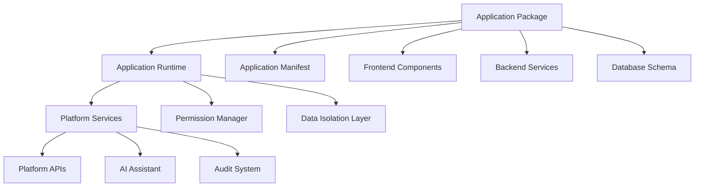

# Installable Applications - Standards and Conventions

This document defines the standards and conventions for creating installable applications within the Token Nexus Platform. Installable applications are self-contained packages that extend platform functionality and can be installed, configured, and managed through the platform's application runtime framework.

## Table of Contents

1. [Architecture Overview](#architecture-overview)
2. [Application Package Structure](#application-package-structure)
3. [Application Manifest Standards](#application-manifest-standards)
4. [Installation and Lifecycle Management](#installation-and-lifecycle-management)
5. [Permission and Security Model](#permission-and-security-model)
6. [Data Isolation and Storage](#data-isolation-and-storage)
7. [API Integration Patterns](#api-integration-patterns)
8. [UI Component Integration](#ui-component-integration)
9. [Configuration Management](#configuration-management)
10. [AI Assistant Integration](#ai-assistant-integration)
11. [Testing and Quality Assurance](#testing-and-quality-assurance)
12. [Implementation Checklist](#implementation-checklist)
13. [Examples and Templates](#examples-and-templates)

## Architecture Overview

Installable applications follow a modular architecture that ensures security, isolation, and seamless integration with the platform:



### Core Principles

1. **Self-Contained**: Applications must be fully self-contained packages
2. **Secure by Default**: All applications run in isolated environments
3. **Platform Integration**: Seamless integration with platform services
4. **AI-First**: All functionality accessible through AI assistant
5. **Multi-Tenant**: Support for organization-level isolation
6. **Lifecycle Management**: Complete installation, update, and removal lifecycle

## Application Package Structure

### Standard Directory Structure

```
my-application/
├── manifest.json                 # Application manifest (required)
├── package.json                  # Node.js package configuration
├── README.md                     # Application documentation
├── CHANGELOG.md                  # Version history
├── LICENSE                       # License information
├── src/                          # Source code
│   ├── controllers/              # Page controllers
│   │   ├── index.ts             # Controller exports
│   │   └── MyAppController.ts   # Main controller
│   ├── components/               # React components
│   │   ├── index.ts             # Component exports
│   │   ├── pages/               # Page components
│   │   ├── widgets/             # Dashboard widgets
│   │   └── shared/              # Shared components
│   ├── services/                 # Business logic services
│   │   ├── index.ts             # Service exports
│   │   └── MyAppService.ts      # Main service
│   ├── cloud-functions/          # Parse Server cloud functions
│   │   ├── index.ts             # Function exports
│   │   └── triggers.ts          # Database triggers
│   ├── database/                 # Database schema and migrations
│   │   ├── schema.ts            # Parse Server schema
│   │   └── migrations/          # Database migrations
│   ├── assets/                   # Static assets
│   │   ├── icons/               # Application icons
│   │   ├── images/              # Images and graphics
│   │   └── styles/              # CSS/SCSS files
│   └── types/                    # TypeScript type definitions
│       └── index.ts             # Type exports
├── config/                       # Configuration files
│   ├── development.json         # Development configuration
│   ├── production.json          # Production configuration
│   └── permissions.json         # Permission definitions
├── tests/                        # Test files
│   ├── unit/                    # Unit tests
│   ├── integration/             # Integration tests
│   └── e2e/                     # End-to-end tests
├── docs/                         # Documentation
│   ├── installation.md         # Installation guide
│   ├── configuration.md        # Configuration guide
│   └── api.md                   # API documentation
└── dist/                         # Built application (generated)
    └── bundle.js                # Compiled application
```

### Required Files

1. **[`manifest.json`](#application-manifest-standards)** - Application metadata and configuration
2. **[`package.json`](#package-configuration)** - Node.js package configuration
3. **[`README.md`](#documentation-requirements)** - Application documentation
4. **[`src/controllers/index.ts`](#controller-exports)** - Controller exports
5. **[`src/components/index.ts`](#component-exports)** - Component exports

## Application Manifest Standards

### Manifest Schema

The [`manifest.json`](../src/types/applicationManifest.ts) file defines the application's metadata, capabilities, and requirements:

```json
{
  "id": "my-application",
  "name": "My Application",
  "version": "1.0.0",
  "description": "A sample installable application for the Token Nexus Platform",
  "author": {
    "name": "Developer Name",
    "email": "developer@example.com",
    "url": "https://developer.example.com"
  },
  "license": "MIT",
  "homepage": "https://github.com/developer/my-application",
  "repository": {
    "type": "git",
    "url": "https://github.com/developer/my-application.git"
  },
  "keywords": ["productivity", "organization", "management"],
  "category": "productivity",
  "platform": {
    "minVersion": "1.0.0",
    "maxVersion": "2.0.0",
    "compatibility": ["web", "mobile"]
  },
  "capabilities": {
    "pages": [
      {
        "id": "my-app-dashboard",
        "name": "My App Dashboard",
        "path": "/my-app",
        "component": "MyAppDashboard",
        "permissions": ["my_app:read"],
        "scope": "organization",
        "category": "productivity"
      }
    ],
    "widgets": [
      {
        "id": "my-app-summary",
        "name": "My App Summary",
        "component": "MyAppSummaryWidget",
        "permissions": ["my_app:read"],
        "defaultSize": { "width": 2, "height": 1 },
        "configurableSize": true
      }
    ],
    "cloudFunctions": [
      {
        "name": "myAppFunction",
        "trigger": "beforeSave",
        "className": "MyAppData",
        "permissions": ["my_app:write"]
      }
    ],
    "scheduledJobs": [
      {
        "name": "myAppCleanup",
        "schedule": "0 2 * * *",
        "function": "cleanupOldData",
        "permissions": ["my_app:admin"]
      }
    ],
    "workflows": [
      {
        "id": "my-app-approval",
        "name": "My App Approval Workflow",
        "trigger": "manual",
        "permissions": ["my_app:workflow"]
      }
    ],
    "routes": [
      {
        "path": "/api/my-app/:action",
        "method": "POST",
        "function": "handleApiRequest",
        "permissions": ["my_app:api"]
      }
    ]
  },
  "permissions": {
    "required": [
      {
        "id": "my_app:read",
        "name": "Read My App Data",
        "description": "Allows reading application data",
        "scope": "organization",
        "category": "data"
      },
      {
        "id": "my_app:write",
        "name": "Write My App Data",
        "description": "Allows creating and updating application data",
        "scope": "organization",
        "category": "data"
      },
      {
        "id": "my_app:admin",
        "name": "Administer My App",
        "description": "Full administrative access to the application",
        "scope": "organization",
        "category": "admin"
      }
    ],
    "optional": [
      {
        "id": "my_app:export",
        "name": "Export My App Data",
        "description": "Allows exporting application data",
        "scope": "organization",
        "category": "data"
      }
    ]
  },
  "dependencies": {
    "platform": {
      "authentication": "^1.0.0",
      "database": "^1.0.0",
      "ui-components": "^1.0.0"
    },
    "external": {
      "lodash": "^4.17.21",
      "date-fns": "^2.29.0"
    }
  },
  "configuration": {
    "schema": {
      "type": "object",
      "properties": {
        "apiEndpoint": {
          "type": "string",
          "description": "External API endpoint",
          "default": "https://api.example.com"
        },
        "refreshInterval": {
          "type": "number",
          "description": "Data refresh interval in minutes",
          "default": 30,
          "minimum": 5,
          "maximum": 1440
        },
        "enableNotifications": {
          "type": "boolean",
          "description": "Enable push notifications",
          "default": true
        }
      },
      "required": ["apiEndpoint"]
    },
    "ui": {
      "apiEndpoint": {
        "type": "text",
        "label": "API Endpoint",
        "placeholder": "https://api.example.com",
        "validation": "url"
      },
      "refreshInterval": {
        "type": "number",
        "label": "Refresh Interval (minutes)",
        "min": 5,
        "max": 1440
      },
      "enableNotifications": {
        "type": "checkbox",
        "label": "Enable Notifications"
      }
    }
  },
  "database": {
    "classes": [
      {
        "className": "MyAppData",
        "fields": {
          "title": { "type": "String", "required": true },
          "description": { "type": "String" },
          "status": { "type": "String", "default": "active" },
          "organizationId": { "type": "String", "required": true },
          "createdBy": { "type": "Pointer", "targetClass": "_User" }
        },
        "indexes": [
          { "organizationId": 1, "status": 1 },
          { "createdBy": 1, "createdAt": -1 }
        ],
        "classLevelPermissions": {
          "find": { "requiresAuthentication": true },
          "create": { "requiresAuthentication": true },
          "update": { "requiresAuthentication": true },
          "delete": { "requiresAuthentication": true }
        }
      }
    ]
  },
  "ai": {
    "actions": [
      {
        "id": "createMyAppItem",
        "name": "Create My App Item",
        "description": "Create a new item in My App",
        "parameters": [
          { "name": "title", "type": "string", "required": true },
          { "name": "description", "type": "string", "required": false }
        ],
        "examples": [
          {
            "input": "Create a new task called 'Review documentation'",
            "params": { "title": "Review documentation" }
          }
        ]
      }
    ]
  },
  "build": {
    "entry": "src/index.ts",
    "output": "dist/bundle.js",
    "externals": ["react", "react-dom", "@platform/ui"],
    "assets": ["src/assets/**/*"]
  },
  "installation": {
    "preInstall": ["validateEnvironment", "checkDependencies"],
    "postInstall": ["createDefaultData", "setupPermissions"],
    "preUninstall": ["backupData", "confirmUninstall"],
    "postUninstall": ["cleanupData"]
  }
}
```

### Manifest Validation

Applications must validate their manifest against the platform schema:

```typescript
// Manifest validation
import { validateApplicationManifest } from '@platform/validation';

const manifest = require('./manifest.json');

const validation = validateApplicationManifest(manifest);
if (!validation.valid) {
  console.error('Manifest validation failed:', validation.errors);
  process.exit(1);
}
```

## Installation and Lifecycle Management

### Installation Process

```typescript
// Application installation handler
export class ApplicationInstaller {
  async install(packagePath: string, organizationId: string): Promise<InstallationResult> {
    const startTime = Date.now();
    
    try {
      // 1. Validate package
      const manifest = await this.validatePackage(packagePath);
      
      // 2. Check dependencies
      await this.checkDependencies(manifest.dependencies);
      
      // 3. Validate permissions
      await this.validatePermissions(manifest.permissions, organizationId);
      
      // 4. Run pre-install hooks
      await this.runPreInstallHooks(manifest.installation.preInstall);
      
      // 5. Install database schema
      await this.installDatabaseSchema(manifest.database);
      
      // 6. Register components
      await this.registerComponents(manifest.capabilities);
      
      // 7. Setup permissions
      await this.setupPermissions(manifest.permissions, organizationId);
      
      // 8. Run post-install hooks
      await this.runPostInstallHooks(manifest.installation.postInstall);
      
      // 9. Create installation record
      const installation = await this.createInstallationRecord({
        applicationId: manifest.id,
        version: manifest.version,
        organizationId: organizationId,
        installedAt: new Date(),
        status: 'active'
      });
      
      return {
        success: true,
        installationId: installation.id,
        message: `Application ${manifest.name} installed successfully`,
        metadata: {
          executionTime: Date.now() - startTime,
          version: manifest.version
        }
      };
    } catch (error) {
      return {
        success: false,
        error: error instanceof Error ? error.message : 'Installation failed',
        metadata: {
          executionTime: Date.now() - startTime
        }
      };
    }
  }
}
```

### Lifecycle Hooks

```typescript
// Application lifecycle hooks
export interface ApplicationLifecycleHooks {
  preInstall?: () => Promise<void>;
  postInstall?: () => Promise<void>;
  preUpdate?: (oldVersion: string, newVersion: string) => Promise<void>;
  postUpdate?: (oldVersion: string, newVersion: string) => Promise<void>;
  preUninstall?: () => Promise<void>;
  postUninstall?: () => Promise<void>;
}

// Example lifecycle implementation
export class MyApplicationLifecycle implements ApplicationLifecycleHooks {
  async preInstall(): Promise<void> {
    // Validate environment requirements
    await this.validateEnvironment();
  }
  
  async postInstall(): Promise<void> {
    // Create default configuration
    await this.createDefaultConfiguration();
    
    // Setup initial data
    await this.setupInitialData();
  }
  
  async preUpdate(oldVersion: string, newVersion: string): Promise<void> {
    // Backup existing data
    await this.backupData();
    
    // Run migration scripts
    await this.runMigrations(oldVersion, newVersion);
  }
  
  async postUpdate(oldVersion: string, newVersion: string): Promise<void> {
    // Update configuration schema
    await this.updateConfiguration();
    
    // Refresh cached data
    await this.refreshCache();
  }
  
  async preUninstall(): Promise<void> {
    // Confirm uninstallation
    const confirmed = await this.confirmUninstallation();
    if (!confirmed) {
      throw new Error('Uninstallation cancelled by user');
    }
    
    // Backup data before removal
    await this.backupData();
  }
  
  async postUninstall(): Promise<void> {
    // Clean up temporary files
    await this.cleanupTempFiles();
    
    // Remove cached data
    await this.clearCache();
  }
}
```

## Permission and Security Model

### Permission Definition

```typescript
// Application permission system
interface ApplicationPermission {
  id: string;
  name: string;
  description: string;
  scope: 'system' | 'organization' | 'user';
  category: 'data' | 'admin' | 'api' | 'ui';
  dependencies?: string[];
  riskLevel: 'low' | 'medium' | 'high';
}

// Permission validation
export class ApplicationPermissionManager {
  async validatePermissions(
    permissions: ApplicationPermission[], 
    organizationId: string
  ): Promise<PermissionValidationResult> {
    const results = [];
    
    for (const permission of permissions) {
      const validation = await this.validateSinglePermission(permission, organizationId);
      results.push(validation);
    }
    
    return {
      valid: results.every(r => r.valid),
      results: results
    };
  }
  
  private async validateSinglePermission(
    permission: ApplicationPermission,
    organizationId: string
  ): Promise<SinglePermissionValidation> {
    // Check if permission already exists
    const existing = await this.getExistingPermission(permission.id);
    if (existing && existing.scope !== permission.scope) {
      return {
        valid: false,
        error: `Permission ${permission.id} already exists with different scope`
      };
    }
    
    // Validate dependencies
    if (permission.dependencies) {
      for (const dep of permission.dependencies) {
        const depExists = await this.permissionExists(dep, organizationId);
        if (!depExists) {
          return {
            valid: false,
            error: `Dependency permission ${dep} not found`
          };
        }
      }
    }
    
    return { valid: true };
  }
}
```

### Security Isolation

```typescript
// Application security context
export class ApplicationSecurityContext {
  constructor(
    private applicationId: string,
    private organizationId: string,
    private userId: string
  ) {}
  
  // Create isolated execution context
  createExecutionContext(): ApplicationExecutionContext {
    return {
      applicationId: this.applicationId,
      organizationId: this.organizationId,
      userId: this.userId,
      permissions: this.getUserPermissions(),
      dataScope: this.getDataScope(),
      apiLimits: this.getApiLimits()
    };
  }
  
  // Validate data access
  async validateDataAccess(className: string, objectId: string): Promise<boolean> {
    const object = await Parse.Object.extend(className).get(objectId);
    
    // Check organization isolation
    if (object.get('organizationId') !== this.organizationId) {
      return false;
    }
    
    // Check application ownership
    if (object.get('applicationId') !== this.applicationId) {
      return false;
    }
    
    return true;
  }
}
```

## Data Isolation and Storage

### Database Schema Management

```typescript
// Application database schema
export class ApplicationDatabaseManager {
  async createSchema(schemaDefinition: DatabaseSchema): Promise<void> {
    for (const classDefinition of schemaDefinition.classes) {
      await this.createClass(classDefinition);
    }
  }
  
  private async createClass(classDefinition: ClassDefinition): Promise<void> {
    const schema = new Parse.Schema(classDefinition.className);
    
    // Add application-specific fields
    schema.addString('applicationId');
    schema.addString('organizationId');
    
    // Add defined fields
    for (const [fieldName, fieldDefinition] of Object.entries(classDefinition.fields)) {
      this.addField(schema, fieldName, fieldDefinition);
    }
    
    // Set class-level permissions
    if (classDefinition.classLevelPermissions) {
      schema.setCLP(classDefinition.classLevelPermissions);
    }
    
    // Create indexes
    if (classDefinition.indexes) {
      for (const index of classDefinition.indexes) {
        schema.addIndex(index);
      }
    }
    
    await schema.save();
  }
  
  private addField(schema: Parse.Schema, fieldName: string, fieldDefinition: FieldDefinition): void {
    switch (fieldDefinition.type) {
      case 'String':
        schema.addString(fieldName);
        break;
      case 'Number':
        schema.addNumber(fieldName);
        break;
      case 'Boolean':
        schema.addBoolean(fieldName);
        break;
      case 'Date':
        schema.addDate(fieldName);
        break;
      case 'Array':
        schema.addArray(fieldName);
        break;
      case 'Object':
        schema.addObject(fieldName);
        break;
      case 'Pointer':
        schema.addPointer(fieldName, fieldDefinition.targetClass!);
        break;
      case 'Relation':
        schema.addRelation(fieldName, fieldDefinition.targetClass!);
        break;
      default:
        throw new Error(`Unsupported field type: ${fieldDefinition.type}`);
    }
  }
}
```

### Data Access Patterns

```typescript
// Application data service
export class ApplicationDataService {
  constructor(
    private applicationId: string,
    private organizationId: string
  ) {}
  
  // Create application-scoped query
  createQuery(className: string): Parse.Query {
    const query = new Parse.Query(className);
    
    // Automatically scope to application and organization
    query.equalTo('applicationId', this.applicationId);
    query.equalTo('organizationId', this.organizationId);
    
    return query;
  }
  
  // Create application-scoped object
  createObject(className: string, data: Record<string, any>): Parse.Object {
    const object = new Parse.Object(className);
    
    // Automatically set application and organization context
    object.set('applicationId', this.applicationId);
    object.set('organizationId', this.organizationId);
    
    // Set provided data
    for (const [key, value] of Object.entries(data)) {
      object.set(key, value);
    }
    
    return object;
  }
  
  // Validate object access
  async validateObjectAccess(object: Parse.Object): Promise<boolean> {
    return object.get('applicationId') === this.applicationId &&
           object.get('organizationId') === this.organizationId;
  }
}
```

## API Integration Patterns

### Platform API Integration

```typescript
// Application API service
export class ApplicationApiService {
  constructor(
    private applicationId: string,
    private securityContext: ApplicationSecurityContext
  ) {}
  
  // Platform API integration
  async callPlatformApi(endpoint: string, data: any): Promise<any> {
    const headers = {
      'X-Application-ID': this.applicationId,
      'X-Organization-ID': this.securityContext.organizationId,
      'Authorization': `Bearer ${this.securityContext.sessionToken}`
    };
    
    const response = await fetch(`/api/platform/${endpoint}`, {
      method: 'POST',
      headers: headers,
      body: JSON.stringify(data)
    });
    
    if (!response.ok) {
      throw new Error(`Platform API error: ${response.statusText}`);
    }
    
    return response.json();
  }
  
  // External API integration with rate limiting
  async callExternalApi(url: string, options: RequestInit): Promise<any> {
    // Check rate limits
    await this.checkRateLimit();
    
    // Add application context to headers
    const headers = {
      ...options.headers,
      'X-Application-ID': this.applicationId,
      'User-Agent': `TokenNexus-App/${this.applicationId}`
    };
    
    const response = await fetch(url, {
      ...options,
      headers: headers
    });
    
    // Update rate limit counters
    await this.updateRateLimit();
    
    return response.json();
  }
  
  private async checkRateLimit(): Promise<void> {
    const limit = await this.getRateLimit();
    if (limit.remaining <= 0) {
      throw new Error('Rate limit exceeded');
    }
  }
}
```

### Custom Route Handlers

```typescript
// Application route handler
export class ApplicationRouteHandler {
  constructor(private applicationId: string) {}
  
  // Register custom routes
  registerRoutes(): void {
    // API routes
    Parse.Cloud.define(`${this.applicationId}_api`, async (request) => {
      return this.handleApiRequest(request);
    });
    
    // Webhook routes
    Parse.Cloud.define(`${this.applicationId}_webhook`, async (request) => {
      return this.handleWebhook(request);
    });
  }
  
  private async handleApiRequest(request: Parse.Cloud.FunctionRequest): Promise<any> {
    const { action, data } = request.params;
    
    // Validate application context
    await this.validateApplicationContext(request);
    
    switch (action) {
      case 'getData':
        return this.getData(data, request);
      case 'updateData':
        return this.updateData(data, request);
      default:
        throw new Error(`Unknown action: ${action}`);
    }
  }
  
  private async validateApplicationContext(request: Parse.Cloud.FunctionRequest): Promise<void> {
    const user = request.user;
    if (!user) {
      throw new Error('Authentication required');
    }
    
    // Validate application permissions
    const hasPermission = await this.checkApplicationPermission(user, 'api_access');
    if (!hasPermission) {
      throw new Error('Insufficient permissions');
    }
  }
}
```

## UI Component Integration

### Component Registration

```typescript
// Application component registry
export class ApplicationComponentRegistry {
  private components: Map<string, React.ComponentType> = new Map();
  
  // Register application components
  registerComponents(manifest: ApplicationManifest): void {
    // Register pages
    if (manifest.capabilities.pages) {
      for (const page of manifest.capabilities.pages) {
        this.registerPage(page);
      }
    }
    
    // Register widgets
    if (manifest.capabilities.widgets) {
      for (const widget of manifest.capabilities.widgets) {
        this.registerWidget(widget);
      }
    }
  }
  
  private registerPage(pageDefinition: PageDefinition): void {
    const component = this.loadComponent(pageDefinition.component);
    
    // Wrap component with application context
    const wrappedComponent = this.wrapWithApplicationContext(
      component,
      pageDefinition
    );
    
    // Register with platform router
    this.platformRouter.registerRoute({
      path: pageDefinition.path,
      component: wrappedComponent,
      permissions: pageDefinition.permissions,
      scope: pageDefinition.scope
    });
  }
  
  private wrapWithApplicationContext(
    Component: React.ComponentType,
    definition: PageDefinition
  ): React.ComponentType {
    return (props: any) => (
      <ApplicationProvider applicationId={this.applicationId}>
        <PermissionProvider permissions={definition.permissions}>
          <Component {...props} />
        </PermissionProvider>
      </ApplicationProvider>
    );
  }
}
```

### Component Standards

```typescript
// Application component base
export interface ApplicationComponentProps {
  applicationId: string;
  organizationId: string;
  userId: string;
  permissions: string[];
  configuration: Record<string, any>;
}

// Example application page component
export const MyApplicationPage: React.FC<ApplicationComponentProps> = ({
  applicationId,
  organizationId,
  userId,
  permissions,
  configuration
}) => {
  // Use application-specific hooks
  const { data, loading, error } = useApplicationData(applicationId, organizationId);
  const { hasPermission } = useApplicationPermissions(permissions);
  const { config } = useApplicationConfig(applicationId, configuration);
  
  // Application-specific state
  const [items, setItems] = useState([]);
  
  useEffect(() => {
    if (data) {
      setItems(data.items);
    }
  }, [data]);
  
  const handleCreateItem = async (itemData: any) => {
    if (!hasPermission('my_app:write')) {
      toast.error('Insufficient permissions');
      return;
    }
    
    try {
      const result = await applicationApi.createItem(itemData);
      setItems(prev => [...prev, result]);
      toast.success('Item created successfully');
    } catch (error) {
      toast.error('Failed to create item');
    }
  };
  
  if (loading) return <ApplicationLoader />;
  if (error) return <ApplicationError error={error} />;
  
  return (
    <div className="application-page">
      <ApplicationHeader 
        title="My Application"
        applicationId={applicationId}
        actions={
          hasPermission('my_app:write') && (
            <Button onClick={() => setShowCreateModal(true)}>
              Create Item
            </Button>
          )
        }
      />
      
      <ApplicationContent>
        <ItemList 
          items={items}
          onItemAction={handleItemAction}
          canEdit={hasPermission('my_app:write')}
          canDelete={hasPermission('my_app:admin')}
        />
      </ApplicationContent>
    </div>
  );
};
```

## Configuration Management

### Configuration Schema

```typescript
// Application configuration manager
export class ApplicationConfigurationManager {
  constructor(
    private applicationId: string,
    private organizationId: string
  ) {}
  
  // Get application configuration
  async getConfiguration(): Promise<ApplicationConfiguration> {
    const query = new Parse.Query('ApplicationConfiguration');
    query.equalTo('applicationId', this.applicationId);
    query.equalTo('organizationId', this.organizationId);
    
    const config = await query.first();
    if (!config) {
      return this.createDefaultConfiguration();
    }
    
    return config.toJSON();
  }
  
  // Update configuration
  async updateConfiguration(updates: Partial<ApplicationConfiguration>): Promise<void> {
    // Validate configuration against schema
    const validation = await this.validateConfiguration(updates);
    if (!validation.valid) {
      throw new Error(`Configuration validation failed: ${validation.errors.join(', ')}`);
    }
    
    const query = new Parse.Query('ApplicationConfiguration');
    query.equalTo('applicationId', this.applicationId);
    query.equalTo('organizationId', this.organizationId);
    
    let config = await query.first();
    if (!config) {
      config = new Parse.Object('ApplicationConfiguration');
      config.set('applicationId', this.applicationId);
      config.set('organizationId', this.organizationId);
    }
    
    // Apply updates
    for (const [key, value] of Object.entries(updates)) {
      config.set(key, value);
    }
    
    await config.save();
  }
  
  private async validateConfiguration(config: any): Promise<ValidationResult> {
    const manifest = await this.getApplicationManifest();
    const schema = manifest.configuration.schema;
    
    // Use JSON Schema validation
    const ajv = new Ajv();
    const validate = ajv.compile(schema);
    const valid = validate(config);