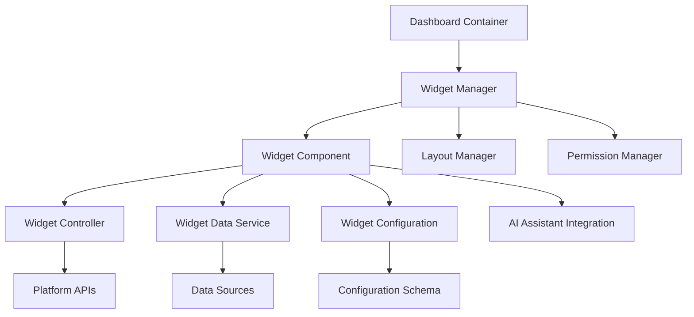

# Dashboard Widgets - Standards and Conventions

This document defines the standards and conventions for creating dashboard widgets within the Token Nexus Platform. Dashboard widgets are modular, reusable components that display information and provide interactive functionality on organization and system dashboards.

## Table of Contents

1. [Architecture Overview](#architecture-overview)
2. [Widget Types and Categories](#widget-types-and-categories)
3. [Widget Component Standards](#widget-component-standards)
4. [Data Management Patterns](#data-management-patterns)
5. [Configuration and Customization](#configuration-and-customization)
6. [Layout and Responsive Design](#layout-and-responsive-design)
7. [Performance Optimization](#performance-optimization)
8. [Security and Permissions](#security-and-permissions)
9. [AI Assistant Integration](#ai-assistant-integration)
10. [Testing Standards](#testing-standards)
11. [Implementation Checklist](#implementation-checklist)
12. [Examples and Templates](#examples-and-templates)

## Architecture Overview

Dashboard widgets follow a component-based architecture that ensures modularity, reusability, and seamless integration:



### Core Principles

1. **Modularity**: Widgets are self-contained, reusable components
2. **Configurability**: All widgets support user customization
3. **Responsive Design**: Widgets adapt to different screen sizes and grid layouts
4. **Performance**: Efficient data loading and rendering
5. **Security**: Permission-based access and data isolation
6. **AI Integration**: All widget functionality accessible through AI assistant

## Widget Types and Categories

### Widget Categories

```typescript
enum WidgetCategory {
  ANALYTICS = 'analytics',
  PRODUCTIVITY = 'productivity',
  COMMUNICATION = 'communication',
  MONITORING = 'monitoring',
  CONTENT = 'content',
  FINANCE = 'finance',
  SYSTEM = 'system',
  CUSTOM = 'custom'
}

enum WidgetType {
  CHART = 'chart',
  TABLE = 'table',
  METRIC = 'metric',
  LIST = 'list',
  FORM = 'form',
  CALENDAR = 'calendar',
  MAP = 'map',
  MEDIA = 'media',
  INTERACTIVE = 'interactive'
}
```

### Widget Size Standards

```typescript
interface WidgetSize {
  width: number;  // Grid columns (1-12)
  height: number; // Grid rows (1-8)
}

const WIDGET_SIZES = {
  SMALL: { width: 1, height: 1 },
  MEDIUM: { width: 2, height: 1 },
  LARGE: { width: 2, height: 2 },
  WIDE: { width: 4, height: 1 },
  TALL: { width: 1, height: 2 },
  EXTRA_LARGE: { width: 4, height: 2 },
  FULL_WIDTH: { width: 12, height: 1 }
} as const;
```

### Widget Metadata Schema

```typescript
interface WidgetMetadata {
  id: string;
  name: string;
  description: string;
  category: WidgetCategory;
  type: WidgetType;
  version: string;
  author: {
    name: string;
    email: string;
    organization?: string;
  };
  permissions: string[];
  defaultSize: WidgetSize;
  minSize: WidgetSize;
  maxSize: WidgetSize;
  configurableSize: boolean;
  refreshInterval?: number;
  tags: string[];
  icon: string;
  preview: string;
  documentation: string;
}
```

## Widget Component Standards

### Base Widget Component

All widgets must extend the [`BaseWidget`](../src/components/widgets/BaseWidget.tsx) component:

```typescript
// BaseWidget.tsx
import React, { useState, useEffect, useCallback } from 'react';
import { Card, CardContent, CardHeader, CardTitle } from '@/components/ui/card';
import { Button } from '@/components/ui/button';
import { Badge } from '@/components/ui/badge';
import { Skeleton } from '@/components/ui/skeleton';

export interface BaseWidgetProps {
  id: string;
  title: string;
  size: WidgetSize;
  configuration: Record<string, any>;
  permissions: string[];
  organizationId: string;
  userId: string;
  onConfigurationChange?: (config: Record<string, any>) => void;
  onSizeChange?: (size: WidgetSize) => void;
  onRemove?: () => void;
  onRefresh?: () => void;
  isEditing?: boolean;
}

export interface WidgetState {
  loading: boolean;
  error: string | null;
  data: any;
  lastUpdated: Date | null;
}

export abstract class BaseWidget<TData = any, TConfig = Record<string, any>> 
  extends React.Component<BaseWidgetProps, WidgetState> {
  
  protected refreshInterval?: NodeJS.Timeout;
  protected abortController?: AbortController;

  constructor(props: BaseWidgetProps) {
    super(props);
    this.state = {
      loading: false,
      error: null,
      data: null,
      lastUpdated: null
    };
  }

  componentDidMount() {
    this.loadData();
    this.setupRefreshInterval();
  }

  componentWillUnmount() {
    this.cleanup();
  }

  componentDidUpdate(prevProps: BaseWidgetProps) {
    if (prevProps.configuration !== this.props.configuration) {
      this.loadData();
    }
  }

  // Abstract methods that must be implemented by widget
  protected abstract loadData(): Promise<void>;
  protected abstract renderContent(): React.ReactNode;
  protected abstract getConfigurationSchema(): any;
  protected abstract validateConfiguration(config: any): { valid: boolean; errors: string[] };

  // Data loading with error handling
  protected async fetchData(): Promise<TData> {
    this.abortController = new AbortController();
    
    try {
      this.setState({ loading: true, error: null });
      
      const data = await this.performDataFetch();
      
      this.setState({ 
        data, 
        loading: false, 
        lastUpdated: new Date() 
      });
      
      return data;
    } catch (error) {
      if (error.name !== 'AbortError') {
        this.setState({ 
          loading: false, 
          error: error instanceof Error ? error.message : 'Failed to load data' 
        });
      }
      throw error;
    }
  }

  protected abstract performDataFetch(): Promise<TData>;

  // Refresh interval management
  private setupRefreshInterval(): void {
    const interval = this.getRefreshInterval();
    if (interval > 0) {
      this.refreshInterval = setInterval(() => {
        this.loadData();
      }, interval * 1000);
    }
  }

  protected getRefreshInterval(): number {
    return this.props.configuration.refreshInterval || 0;
  }

  // Cleanup resources
  private cleanup(): void {
    if (this.refreshInterval) {
      clearInterval(this.refreshInterval);
    }
    if (this.abortController) {
      this.abortController.abort();
    }
  }

  // Configuration management
  protected updateConfiguration(updates: Partial<TConfig>): void {
    const newConfig = { ...this.props.configuration, ...updates };
    const validation = this.validateConfiguration(newConfig);
    
    if (!validation.valid) {
      console.error('Configuration validation failed:', validation.errors);
      return;
    }
    
    this.props.onConfigurationChange?.(newConfig);
  }

  // Error boundary
  componentDidCatch(error: Error, errorInfo: React.ErrorInfo) {
    console.error('Widget error:', error, errorInfo);
    this.setState({ 
      error: 'Widget encountered an error', 
      loading: false 
    });
  }

  render() {
    const { title, isEditing, size } = this.props;
    const { loading, error, lastUpdated } = this.state;

    return (
      <Card className={`widget-container ${this.getWidgetClassName()}`}>
        <CardHeader className="widget-header">
          <div className="flex items-center justify-between">
            <CardTitle className="widget-title">{title}</CardTitle>
            <div className="widget-actions">
              {lastUpdated && (
                <Badge variant="outline" className="text-xs">
                  {this.formatLastUpdated(lastUpdated)}
                </Badge>
              )}
              {isEditing && this.renderEditingActions()}
            </div>
          </div>
        </CardHeader>
        
        <CardContent className="widget-content">
          {loading && this.renderLoadingState()}
          {error && this.renderErrorState(error)}
          {!loading && !error && this.renderContent()}
        </CardContent>
      </Card>
    );
  }

  // Rendering helpers
  protected renderLoadingState(): React.ReactNode {
    return (
      <div className="space-y-2">
        <Skeleton className="h-4 w-full" />
        <Skeleton className="h-4 w-3/4" />
        <Skeleton className="h-4 w-1/2" />
      </div>
    );
  }

  protected renderErrorState(error: string): React.ReactNode {
    return (
      <div className="text-center py-4">
        <div className="text-destructive mb-2">Error loading widget</div>
        <div className="text-sm text-muted-foreground mb-4">{error}</div>
        <Button variant="outline" size="sm" onClick={() => this.loadData()}>
          Retry
        </Button>
      </div>
    );
  }

  protected renderEditingActions(): React.ReactNode {
    return (
      <div className="flex items-center gap-2">
        <Button variant="ghost" size="sm" onClick={this.props.onRefresh}>
          <RefreshCw className="h-4 w-4" />
        </Button>
        <Button variant="ghost" size="sm" onClick={this.openConfigurationModal}>
          <Settings className="h-4 w-4" />
        </Button>
        <Button variant="ghost" size="sm" onClick={this.props.onRemove}>
          <X className="h-4 w-4" />
        </Button>
      </div>
    );
  }

  // Utility methods
  protected getWidgetClassName(): string {
    const { size } = this.props;
    return `widget-${size.width}x${size.height}`;
  }

  protected formatLastUpdated(date: Date): string {
    const now = new Date();
    const diff = now.getTime() - date.getTime();
    const minutes = Math.floor(diff / 60000);
    
    if (minutes < 1) return 'Just now';
    if (minutes < 60) return `${minutes}m ago`;
    
    const hours = Math.floor(minutes / 60);
    if (hours < 24) return `${hours}h ago`;
    
    return date.toLocaleDateString();
  }

  private openConfigurationModal = (): void => {
    // Implementation for opening configuration modal
    // This would be handled by the dashboard container
  };
}
```

### Widget Implementation Example

```typescript
// Example: UserActivityWidget.tsx
import React from 'react';
import { BaseWidget, BaseWidgetProps, WidgetState } from './BaseWidget';
import { BarChart, Bar, XAxis, YAxis, CartesianGrid, Tooltip, ResponsiveContainer } from 'recharts';

interface UserActivityData {
  date: string;
  activeUsers: number;
  newUsers: number;
  totalSessions: number;
}

interface UserActivityConfig {
  timeRange: '7d' | '30d' | '90d';
  showNewUsers: boolean;
  showSessions: boolean;
  refreshInterval: number;
}

export class UserActivityWidget extends BaseWidget<UserActivityData[], UserActivityConfig> {
  protected async performDataFetch(): Promise<UserActivityData[]> {
    const { timeRange } = this.props.configuration as UserActivityConfig;
    
    const response = await fetch('/api/analytics/user-activity', {
      method: 'POST',
      headers: {
        'Content-Type': 'application/json',
        'X-Organization-ID': this.props.organizationId
      },
      body: JSON.stringify({ timeRange }),
      signal: this.abortController?.signal
    });
    
    if (!response.ok) {
      throw new Error('Failed to fetch user activity data');
    }
    
    return response.json();
  }

  protected async loadData(): Promise<void> {
    await this.fetchData();
  }

  protected renderContent(): React.ReactNode {
    const { data } = this.state;
    const config = this.props.configuration as UserActivityConfig;
    
    if (!data || data.length === 0) {
      return (
        <div className="text-center py-8 text-muted-foreground">
          No activity data available
        </div>
      );
    }

    return (
      <div className="h-64">
        <ResponsiveContainer width="100%" height="100%">
          <BarChart data={data}>
            <CartesianGrid strokeDasharray="3 3" />
            <XAxis dataKey="date" />
            <YAxis />
            <Tooltip />
            <Bar dataKey="activeUsers" fill="#8884d8" name="Active Users" />
            {config.showNewUsers && (
              <Bar dataKey="newUsers" fill="#82ca9d" name="New Users" />
            )}
            {config.showSessions && (
              <Bar dataKey="totalSessions" fill="#ffc658" name="Sessions" />
            )}
          </BarChart>
        </ResponsiveContainer>
      </div>
    );
  }

  protected getConfigurationSchema(): any {
    return {
      type: 'object',
      properties: {
        timeRange: {
          type: 'string',
          enum: ['7d', '30d', '90d'],
          default: '30d',
          title: 'Time Range'
        },
        showNewUsers: {
          type: 'boolean',
          default: true,
          title: 'Show New Users'
        },
        showSessions: {
          type: 'boolean',
          default: false,
          title: 'Show Sessions'
        },
        refreshInterval: {
          type: 'number',
          minimum: 0,
          maximum: 3600,
          default: 300,
          title: 'Refresh Interval (seconds)'
        }
      },
      required: ['timeRange']
    };
  }

  protected validateConfiguration(config: any): { valid: boolean; errors: string[] } {
    const errors: string[] = [];
    
    if (!config.timeRange || !['7d', '30d', '90d'].includes(config.timeRange)) {
      errors.push('Invalid time range');
    }
    
    if (typeof config.showNewUsers !== 'boolean') {
      errors.push('showNewUsers must be a boolean');
    }
    
    if (typeof config.showSessions !== 'boolean') {
      errors.push('showSessions must be a boolean');
    }
    
    if (config.refreshInterval < 0 || config.refreshInterval > 3600) {
      errors.push('Refresh interval must be between 0 and 3600 seconds');
    }
    
    return {
      valid: errors.length === 0,
      errors
    };
  }
}

// Widget registration
export const UserActivityWidgetMetadata: WidgetMetadata = {
  id: 'user-activity',
  name: 'User Activity',
  description: 'Display user activity metrics and trends',
  category: WidgetCategory.ANALYTICS,
  type: WidgetType.CHART,
  version: '1.0.0',
  author: {
    name: 'Platform Team',
    email: 'platform@tokennexus.com'
  },
  permissions: ['analytics:read', 'users:read'],
  defaultSize: { width: 2, height: 2 },
  minSize: { width: 2, height: 1 },
  maxSize: { width: 4, height: 3 },
  configurableSize: true,
  refreshInterval: 300,
  tags: ['analytics', 'users', 'activity'],
  icon: 'BarChart3',
  preview: '/assets/widgets/user-activity-preview.png',
  documentation: '/docs/widgets/user-activity'
};
```

## Data Management Patterns

### Data Service Integration

```typescript
// Widget data service
export class WidgetDataService {
  constructor(
    private organizationId: string,
    private userId: string,
    private permissions: string[]
  ) {}

  // Generic data fetching with caching
  async fetchWidgetData<T>(
    widgetId: string,
    endpoint: string,
    params: Record<string, any> = {},
    options: {
      cache?: boolean;
      cacheTTL?: number;
      retries?: number;
    } = {}
  ): Promise<T> {
    const cacheKey = this.generateCacheKey(widgetId, endpoint, params);
    
    // Check cache first
    if (options.cache !== false) {
      const cached = await this.getFromCache<T>(cacheKey);
      if (cached) {
        return cached;
      }
    }
    
    // Fetch data with retries
    const maxRetries = options.retries || 3;
    let lastError: Error;
    
    for (let attempt = 1; attempt <= maxRetries; attempt++) {
      try {
        const data = await this.performFetch<T>(endpoint, params);
        
        // Cache successful response
        if (options.cache !== false) {
          await this.setCache(cacheKey, data, options.cacheTTL || 300);
        }
        
        return data;
      } catch (error) {
        lastError = error as Error;
        
        if (attempt < maxRetries) {
          // Exponential backoff
          await this.delay(Math.pow(2, attempt) * 1000);
        }
      }
    }
    
    throw lastError!;
  }

  private async performFetch<T>(endpoint: string, params: Record<string, any>): Promise<T> {
    const response = await fetch(`/api/widgets/${endpoint}`, {
      method: 'POST',
      headers: {
        'Content-Type': 'application/json',
        'X-Organization-ID': this.organizationId,
        'X-User-ID': this.userId,
        'X-Permissions': this.permissions.join(',')
      },
      body: JSON.stringify(params)
    });
    
    if (!response.ok) {
      throw new Error(`API error: ${response.status} ${response.statusText}`);
    }
    
    return response.json();
  }

  // Real-time data subscription
  subscribeToRealTimeData(
    widgetId: string,
    channel: string,
    callback: (data: any) => void
  ): () => void {
    const eventSource = new EventSource(
      `/api/widgets/realtime/${channel}?organizationId=${this.organizationId}&widgetId=${widgetId}`
    );
    
    eventSource.onmessage = (event) => {
      try {
        const data = JSON.parse(event.data);
        callback(data);
      } catch (error) {
        console.error('Failed to parse real-time data:', error);
      }
    };
    
    eventSource.onerror = (error) => {
      console.error('Real-time connection error:', error);
    };
    
    // Return cleanup function
    return () => {
      eventSource.close();
    };
  }

  // Cache management
  private generateCacheKey(widgetId: string, endpoint: string, params: Record<string, any>): string {
    const paramString = JSON.stringify(params);
    return `widget:${widgetId}:${endpoint}:${btoa(paramString)}`;
  }

  private async getFromCache<T>(key: string): Promise<T | null> {
    try {
      const cached = localStorage.getItem(key);
      if (!cached) return null;
      
      const { data, expiry } = JSON.parse(cached);
      if (Date.now() > expiry) {
        localStorage.removeItem(key);
        return null;
      }
      
      return data;
    } catch {
      return null;
    }
  }

  private async setCache(key: string, data: any, ttlSeconds: number): Promise<void> {
    try {
      const expiry = Date.now() + (ttlSeconds * 1000);
      localStorage.setItem(key, JSON.stringify({ data, expiry }));
    } catch (error) {
      // Cache storage failed, continue without caching
      console.warn('Failed to cache widget data:', error);
    }
  }

  private delay(ms: number): Promise<void> {
    return new Promise(resolve => setTimeout(resolve, ms));
  }
}
```

### Data Aggregation Patterns

```typescript
// Widget data aggregation service
export class WidgetAggregationService {
  // Aggregate data from multiple sources
  async aggregateData(sources: DataSource[]): Promise<AggregatedData> {
    const promises = sources.map(source => this.fetchSourceData(source));
    const results = await Promise.allSettled(promises);
    
    const successfulResults = results
      .filter((result): result is PromiseFulfilledResult<any> => result.status === 'fulfilled')
      .map(result => result.value);
    
    const failedResults = results
      .filter((result): result is PromiseRejectedResult => result.status === 'rejected')
      .map(result => result.reason);
    
    if (failedResults.length > 0) {
      console.warn('Some data sources failed:', failedResults);
    }
    
    return this.combineResults(successfulResults);
  }

  // Time-series data aggregation
  aggregateTimeSeries(
    data: TimeSeriesPoint[],
    interval: 'hour' | 'day' | 'week' | 'month'
  ): TimeSeriesPoint[] {
    const grouped = this.groupByTimeInterval(data, interval);
    
    return Object.entries(grouped).map(([timestamp, points]) => ({
      timestamp: new Date(timestamp),
      value: this.calculateAggregateValue(points),
      count: points.length
    }));
  }

  // Statistical aggregation
  calculateStatistics(data: number[]): Statistics {
    if (data.length === 0) {
      return { mean: 0, median: 0, min: 0, max: 0, stdDev: 0 };
    }
    
    const sorted = [...data].sort((a, b) => a - b);
    const sum = data.reduce((acc, val) => acc + val, 0);
    const mean = sum / data.length;
    
    const variance = data.reduce((acc, val) => acc + Math.pow(val - mean, 2), 0) / data.length;
    const stdDev = Math.sqrt(variance);
    
    return {
      mean,
      median: sorted[Math.floor(sorted.length / 2)],
      min: sorted[0],
      max: sorted[sorted.length - 1],
      stdDev
    };
  }
}
```

## Configuration and Customization

### Configuration Schema System

```typescript
// Widget configuration manager
export class WidgetConfigurationManager {
  // Generate configuration UI from schema
  generateConfigurationUI(schema: any): React.ComponentType<ConfigurationUIProps> {
    return ({ value, onChange, errors }) => {
      return (
        <div className="space-y-4">
          {Object.entries(schema.properties).map(([key, property]: [string, any]) => (
            <div key={key} className="space-y-2">
              <label className="text-sm font-medium">{property.title || key}</label>
              {this.renderConfigurationField(key, property, value[key], onChange, errors[key])}
              {property.description && (
                <p className="text-xs text-muted-foreground">{property.description}</p>
              )}
            </div>
          ))}
        </div>
      );
    };
  }

  private renderConfigurationField(
    key: string,
    property: any,
    value: any,
    onChange: (key: string, value: any) => void,
    error?: string
  ): React.ReactNode {
    switch (property.type) {
      case 'string':
        if (property.enum) {
          return (
            <Select value={value} onValueChange={(val) => onChange(key, val)}>
              <SelectTrigger>
                <SelectValue placeholder={`Select ${property.title || key}`} />
              </SelectTrigger>
              <SelectContent>
                {property.enum.map((option: string) => (
                  <SelectItem key={option} value={option}>
                    {option}
                  </SelectItem>
                ))}
              </SelectContent>
            </Select>
          );
        }
        return (
          <Input
            value={value || ''}
            onChange={(e) => onChange(key, e.target.value)}
            placeholder={property.placeholder}
            className={error ? 'border-destructive' : ''}
          />
        );
      
      case 'number':
        return (
          <Input
            type="number"
            value={value || ''}
            onChange={(e) => onChange(key, parseFloat(e.target.value))}
            min={property.minimum}
            max={property.maximum}
            className={error ? 'border-destructive' : ''}
          />
        );
      
      case 'boolean':
        return (
          <div className="flex items-center space-x-2">
            <Checkbox
              checked={value || false}
              onCheckedChange={(checked) => onChange(key, checked)}
            />
            <span className="text-sm">{property.title || key}</span>
          </div>
        );
      
      case 'array':
        return this.renderArrayField(key, property, value, onChange, error);
      
      default:
        return <div>Unsupported field type: {property.type}</div>;
    }
  }

  private renderArrayField(
    key: string,
    property: any,
    value: any[],
    onChange: (key: string, value: any) => void,
    error?: string
  ): React.ReactNode {
    const items = value || [];
    
    return (
      <div className="space-y-2">
        {items.map((item, index) => (
          <div key={index} className="flex items-center gap-2">
            <Input
              value={item}
              onChange={(e) => {
                const newItems = [...items];
                newItems[index] = e.target.value;
                onChange(key, newItems);
              }}
            />
            <Button
              variant="outline"
              size="sm"
              onClick={() => {
                const newItems = items.filter((_, i) => i !== index);
                onChange(key, newItems);
              }}
            >
              <X className="h-4 w-4" />
            </Button>
          </div>
        ))}
        <Button
          variant="outline"
          size="sm"
          onClick={() => {
            onChange(key, [...items, '']);
          }}
        >
          <Plus className="h-4 w-4 mr-2" />
          Add Item
        </Button>
      </div>
    );
  }
}
```

### Theme and Styling

```typescript
// Widget theme system
export interface WidgetTheme {
  colors: {
    primary: string;
    secondary: string;
    background: string;
    foreground: string;
    muted: string;
    accent: string;
    destructive: string;
  };
  typography: {
    fontFamily: string;
    fontSize: {
      xs: string;
      sm: string;
      base: string;
      lg: string;
      xl: string;
    };
  };
  spacing: {
    xs: string;
    sm: string;
    md: string;
    lg: string;
    xl: string;
  };
  borderRadius: {
    sm: string;
    md: string;
    lg: string;
  };
}

// Theme provider for widgets
export const WidgetThemeProvider: React.FC<{
  theme: WidgetTheme;
  children: React.ReactNode;
}> = ({ theme, children }) => {
  const cssVariables = {
    '--widget-primary': theme.colors.primary,
    '--widget-secondary': theme.colors.secondary,
    '--widget-background': theme.colors.background,
    '--widget-foreground': theme.colors.foreground,
    '--widget-muted': theme.colors.muted,
    '--widget-accent': theme.colors.accent,
    '--widget-destructive': theme.colors.destructive,
    '--widget-font-family': theme.typography.fontFamily,
    '--widget-spacing-xs': theme.spacing.xs,
    '--widget-spacing-sm': theme.spacing.sm,
    '--widget-spacing-md': theme.spacing.md,
    '--widget-spacing-lg': theme.spacing.lg,
    '--widget-spacing-xl': theme.spacing.xl,
    '--widget-radius-sm': theme.borderRadius.sm,
    '--widget-radius-md': theme.borderRadius.md,
    '--widget-radius-lg': theme.borderRadius.lg,
  } as React.CSSProperties;

  return (
    <div className="widget-theme-provider" style={cssVariables}>
      {children}
    </div>
  );
};
```

## Layout and Responsive Design

### Grid Layout System

```typescript
// Dashboard grid layout manager
export class DashboardGridManager {
  private gridColumns = 12;
  private gridRows = 8;
  private gapSize = 16;

  // Calculate widget position and size
  calculateWidgetLayout(widgets: DashboardWidget[]): LayoutItem[] {
    const layout: LayoutItem[] = [];
    let currentRow = 0;
    let currentCol = 0;

    for (const widget of widgets) {
      const size = widget.size;
      
      // Check if widget fits in current row
      if (currentCol + size.width > this.gridColumns) {
        currentRow++;
        currentCol = 0;
      }

      // Check if we need more rows
      if (currentRow + size.height > this.gridRows) {
        // Expand grid or handle overflow
        this.gridRows = Math.max(this.gridRows, currentRow + size.height);
      }

      layout.push({
        id: widget.id,
        x: currentCol,
        y: currentRow,
        w: size.width,
        h: size.height,
        minW: widget.metadata.minSize.width,
        minH: widget.metadata.minSize.height,
        maxW: widget.metadata.maxSize.width,
        maxH: widget.metadata.maxSize.height,
        resizable: widget.metadata.configurableSize
      });

      currentCol += size.width;
    }

    return layout;
  }

  // Responsive breakpoints
  getResponsiveLayout(layout: LayoutItem[], breakpoint: string):