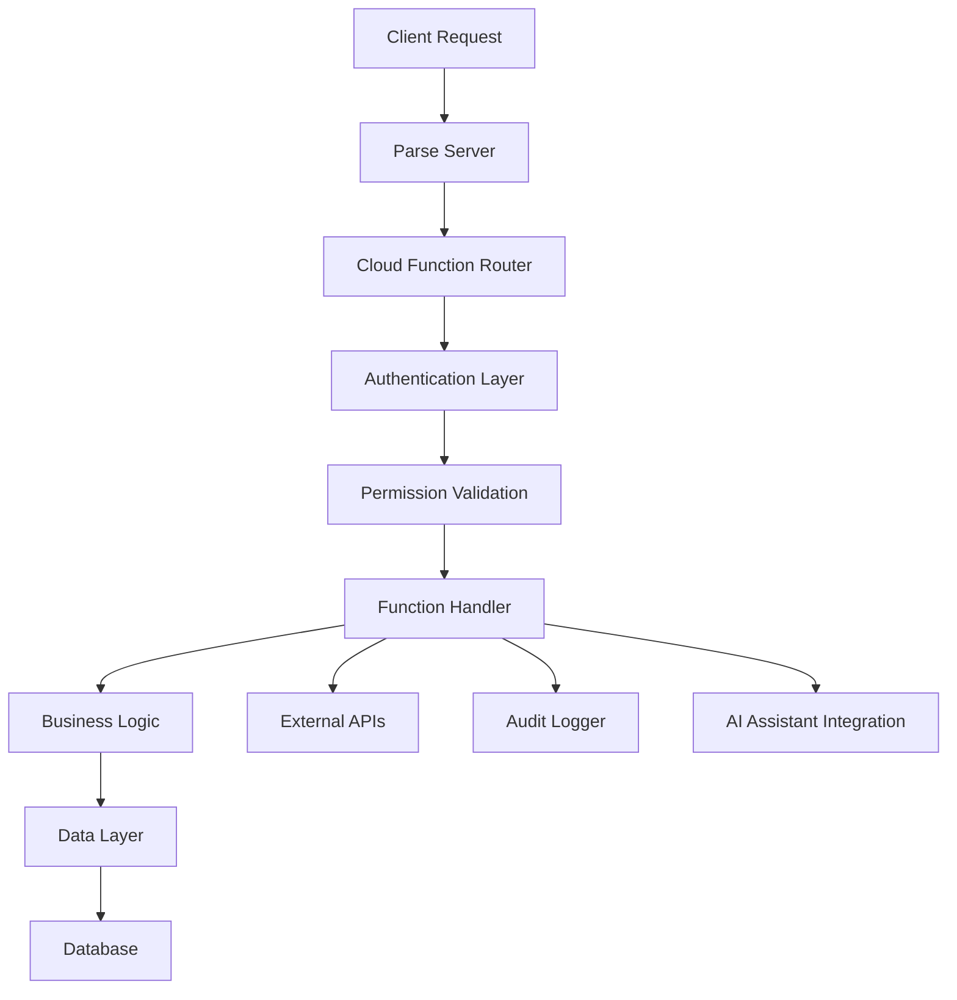

# Cloud Functions - Standards and Conventions

This document defines the standards and conventions for creating Parse Server cloud functions within the Token Nexus Platform. Cloud functions provide server-side business logic, data validation, triggers, and API endpoints that extend platform functionality.

## Table of Contents

1. [Architecture Overview](#architecture-overview)
2. [Function Types and Categories](#function-types-and-categories)
3. [Function Implementation Standards](#function-implementation-standards)
4. [Security and Authentication](#security-and-authentication)
5. [Data Validation and Processing](#data-validation-and-processing)
6. [Error Handling and Logging](#error-handling-and-logging)
7. [Performance and Optimization](#performance-and-optimization)
8. [Testing Standards](#testing-standards)
9. [Deployment and Versioning](#deployment-and-versioning)
10. [AI Assistant Integration](#ai-assistant-integration)
11. [Implementation Checklist](#implementation-checklist)
12. [Examples and Templates](#examples-and-templates)

## Architecture Overview

Cloud functions operate within the Parse Server environment and provide secure, scalable backend functionality:



### Core Principles

1. **Security First**: All functions must validate authentication and permissions
2. **Organization Isolation**: Data access must be scoped to organization context
3. **Comprehensive Logging**: All operations must be audited
4. **Error Resilience**: Robust error handling and graceful degradation
5. **Performance Optimized**: Efficient execution and resource usage
6. **AI Integration**: All functions accessible through AI assistant

## Function Types and Categories

### Function Categories

```typescript
enum CloudFunctionCategory {
  DATA_PROCESSING = 'data-processing',
  AUTHENTICATION = 'authentication',
  BUSINESS_LOGIC = 'business-logic',
  INTEGRATION = 'integration',
  NOTIFICATION = 'notification',
  ANALYTICS = 'analytics',
  WORKFLOW = 'workflow',
  UTILITY = 'utility'
}

enum CloudFunctionType {
  TRIGGER = 'trigger',           // Database triggers
  ENDPOINT = 'endpoint',         // API endpoints
  JOB = 'job',                  // Background jobs
  WEBHOOK = 'webhook',          // External webhooks
  SCHEDULED = 'scheduled'       // Scheduled functions
}
```

### Function Metadata Schema

```typescript
interface CloudFunctionMetadata {
  name: string;
  category: CloudFunctionCategory;
  type: CloudFunctionType;
  description: string;
  version: string;
  permissions: string[];
  organizationScoped: boolean;
  rateLimit?: {
    requests: number;
    window: number; // seconds
  };
  timeout?: number; // seconds
  retryPolicy?: {
    maxRetries: number;
    backoffMultiplier: number;
  };
  dependencies?: string[];
  tags: string[];
}
```

## Function Implementation Standards

### Base Function Structure

All cloud functions must follow the standardized structure:

```typescript
// BasecloudFunction.ts
import { CloudFunctionRequest, CloudFunctionResponse } from '@platform/types';
import { AuthenticationService } from '@platform/services/authentication';
import { PermissionService } from '@platform/services/permission';
import { AuditService } from '@platform/services/audit';
import { ValidationService } from '@platform/services/validation';

export abstract class BaseCloudFunction {
  protected authService: AuthenticationService;
  protected permissionService: PermissionService;
  protected auditService: AuditService;
  protected validationService: ValidationService;

  constructor(protected metadata: CloudFunctionMetadata) {
    this.authService = new AuthenticationService();
    this.permissionService = new PermissionService();
    this.auditService = new AuditService();
    this.validationService = new ValidationService();
  }

  // Main execution method
  async execute(request: CloudFunctionRequest): Promise<CloudFunctionResponse> {
    const startTime = Date.now();
    const auditContext = this.createAuditContext(request);

    try {
      // 1. Validate request structure
      await this.validateRequest(request);

      // 2. Authenticate user
      const user = await this.authenticateUser(request);

      // 3. Validate permissions
      await this.validatePermissions(user, request);

      // 4. Validate organization context
      const organizationId = await this.validateOrganizationContext(user, request);

      // 5. Execute business logic
      const result = await this.executeBusinessLogic(request, user, organizationId);

      // 6. Log successful execution
      await this.auditService.logSuccess({
        ...auditContext,
        result: 'success',
        executionTime: Date.now() - startTime,
        organizationId
      });

      return {
        success: true,
        data: result,
        metadata: {
          executionTime: Date.now() - startTime,
          functionName: this.metadata.name,
          version: this.metadata.version
        }
      };

    } catch (error) {
      // Log error with full context
      await this.auditService.logError({
        ...auditContext,
        result: 'error',
        error: error instanceof Error ? error.message : 'Unknown error',
        stackTrace: error instanceof Error ? error.stack : undefined,
        executionTime: Date.now() - startTime
      });

      return {
        success: false,
        error: this.formatError(error),
        metadata: {
          executionTime: Date.now() - startTime,
          functionName: this.metadata.name,
          version: this.metadata.version
        }
      };
    }
  }

  // Abstract methods to be implemented by specific functions
  protected abstract validateRequest(request: CloudFunctionRequest): Promise<void>;
  protected abstract executeBusinessLogic(
    request: CloudFunctionRequest,
    user: Parse.User,
    organizationId: string
  ): Promise<any>;

  // Authentication and authorization
  protected async authenticateUser(request: CloudFunctionRequest): Promise<Parse.User> {
    const user = request.user;
    if (!user) {
      throw new Error('Authentication required');
    }

    // Validate session token
    const isValidSession = await this.authService.validateSession(user.getSessionToken());
    if (!isValidSession) {
      throw new Error('Invalid or expired session');
    }

    return user;
  }

  protected async validatePermissions(
    user: Parse.User,
    request: CloudFunctionRequest
  ): Promise<void> {
    for (const permission of this.metadata.permissions) {
      const hasPermission = await this.permissionService.checkPermission(user, permission);
      if (!hasPermission) {
        throw new Error(`Insufficient permissions: ${permission}`);
      }
    }
  }

  protected async validateOrganizationContext(
    user: Parse.User,
    request: CloudFunctionRequest
  ): Promise<string> {
    if (!this.metadata.organizationScoped) {
      return '';
    }

    const organizationId = request.params.organizationId || user.get('organizationId');
    if (!organizationId) {
      throw new Error('Organization context required');
    }

    // Validate user belongs to organization
    const belongsToOrg = await this.permissionService.validateOrganizationMembership(
      user,
      organizationId
    );
    if (!belongsToOrg) {
      throw new Error('User does not belong to specified organization');
    }

    return organizationId;
  }

  // Utility methods
  protected createAuditContext(request: CloudFunctionRequest): any {
    return {
      functionName: this.metadata.name,
      userId: request.user?.id,
      timestamp: new Date(),
      ipAddress: request.ip,
      userAgent: request.headers['user-agent'],
      parameters: this.sanitizeParameters(request.params)
    };
  }

  protected sanitizeParameters(params: any): any {
    // Remove sensitive data from audit logs
    const sanitized = { ...params };
    const sensitiveFields = ['password', 'token', 'secret', 'key'];
    
    for (const field of sensitiveFields) {
      if (sanitized[field]) {
        sanitized[field] = '[REDACTED]';
      }
    }
    
    return sanitized;
  }

  protected formatError(error: any): string {
    if (error instanceof Error) {
      return error.message;
    }
    return 'An unexpected error occurred';
  }
}
```

### Data Processing Functions

```typescript
// Example: UserDataProcessor.ts
export class UserDataProcessor extends BaseCloudFunction {
  constructor() {
    super({
      name: 'processUserData',
      category: CloudFunctionCategory.DATA_PROCESSING,
      type: CloudFunctionType.ENDPOINT,
      description: 'Process and validate user data updates',
      version: '1.0.0',
      permissions: ['users:write', 'data:process'],
      organizationScoped: true,
      rateLimit: { requests: 100, window: 60 },
      timeout: 30,
      tags: ['users', 'data-processing', 'validation']
    });
  }

  protected async validateRequest(request: CloudFunctionRequest): Promise<void> {
    const schema = {
      type: 'object',
      properties: {
        userId: { type: 'string', minLength: 1 },
        userData: {
          type: 'object',
          properties: {
            firstName: { type: 'string', minLength: 1, maxLength: 50 },
            lastName: { type: 'string', minLength: 1, maxLength: 50 },
            email: { type: 'string', format: 'email' },
            phone: { type: 'string', pattern: '^\\+?[1-9]\\d{1,14}$' }
          },
          required: ['firstName', 'lastName', 'email']
        },
        organizationId: { type: 'string', minLength: 1 }
      },
      required: ['userId', 'userData', 'organizationId']
    };

    const validation = await this.validationService.validate(request.params, schema);
    if (!validation.valid) {
      throw new Error(`Validation failed: ${validation.errors.join(', ')}`);
    }
  }

  protected async executeBusinessLogic(
    request: CloudFunctionRequest,
    user: Parse.User,
    organizationId: string
  ): Promise<any> {
    const { userId, userData } = request.params;

    // 1. Fetch existing user
    const targetUser = await this.fetchUser(userId, organizationId);

    // 2. Validate data changes
    await this.validateDataChanges(targetUser, userData, user);

    // 3. Process data transformations
    const processedData = await this.processDataTransformations(userData);

    // 4. Update user record
    const updatedUser = await this.updateUserRecord(targetUser, processedData, user);

    // 5. Trigger post-processing workflows
    await this.triggerPostProcessingWorkflows(updatedUser, userData);

    return {
      userId: updatedUser.id,
      updatedFields: Object.keys(processedData),
      timestamp: new Date()
    };
  }

  private async fetchUser(userId: string, organizationId: string): Promise<Parse.User> {
    const query = new Parse.Query(Parse.User);
    query.equalTo('objectId', userId);
    query.equalTo('organizationId', organizationId);

    const user = await query.first({ useMasterKey: true });
    if (!user) {
      throw new Error('User not found or access denied');
    }

    return user;
  }

  private async validateDataChanges(
    targetUser: Parse.User,
    userData: any,
    requestingUser: Parse.User
  ): Promise<void> {
    // Check if user can modify target user
    const canModify = await this.permissionService.canModifyUser(requestingUser, targetUser);
    if (!canModify) {
      throw new Error('Insufficient permissions to modify this user');
    }

    // Validate email uniqueness if email is being changed
    if (userData.email && userData.email !== targetUser.get('email')) {
      const emailExists = await this.checkEmailExists(userData.email, targetUser.get('organizationId'));
      if (emailExists) {
        throw new Error('Email address already in use');
      }
    }
  }

  private async processDataTransformations(userData: any): Promise<any> {
    const processed = { ...userData };

    // Normalize email
    if (processed.email) {
      processed.email = processed.email.toLowerCase().trim();
    }

    // Format phone number
    if (processed.phone) {
      processed.phone = this.formatPhoneNumber(processed.phone);
    }

    // Capitalize names
    if (processed.firstName) {
      processed.firstName = this.capitalizeString(processed.firstName);
    }
    if (processed.lastName) {
      processed.lastName = this.capitalizeString(processed.lastName);
    }

    return processed;
  }

  private async updateUserRecord(
    user: Parse.User,
    processedData: any,
    updatingUser: Parse.User
  ): Promise<Parse.User> {
    // Set updated fields
    for (const [key, value] of Object.entries(processedData)) {
      user.set(key, value);
    }

    // Set audit fields
    user.set('updatedBy', updatingUser);
    user.set('lastModified', new Date());

    // Save with master key for system operations
    await user.save(null, { useMasterKey: true });

    return user;
  }

  private async triggerPostProcessingWorkflows(
    user: Parse.User,
    originalData: any
  ): Promise<void> {
    // Trigger email verification if email changed
    if (originalData.email) {
      await Parse.Cloud.run('sendEmailVerification', {
        userId: user.id,
        email: originalData.email
      });
    }

    // Update search index
    await Parse.Cloud.run('updateUserSearchIndex', {
      userId: user.id
    });

    // Notify relevant systems
    await Parse.Cloud.run('notifyUserDataChange', {
      userId: user.id,
      changes: Object.keys(originalData)
    });
  }

  // Utility methods
  private async checkEmailExists(email: string, organizationId: string): Promise<boolean> {
    const query = new Parse.Query(Parse.User);
    query.equalTo('email', email.toLowerCase());
    query.equalTo('organizationId', organizationId);
    
    const count = await query.count({ useMasterKey: true });
    return count > 0;
  }

  private formatPhoneNumber(phone: string): string {
    // Remove all non-digit characters except +
    const cleaned = phone.replace(/[^\d+]/g, '');
    
    // Add + if not present and number doesn't start with it
    if (!cleaned.startsWith('+')) {
      return `+${cleaned}`;
    }
    
    return cleaned;
  }

  private capitalizeString(str: string): string {
    return str.charAt(0).toUpperCase() + str.slice(1).toLowerCase();
  }
}

// Register the function
Parse.Cloud.define('processUserData', async (request) => {
  const processor = new UserDataProcessor();
  return processor.execute(request);
});
```

### Database Trigger Functions

```typescript
// Example: UserTriggers.ts
export class UserTriggers {
  // Before save trigger
  static async beforeSaveUser(request: Parse.Cloud.TriggerRequest): Promise<void> {
    const user = request.object;
    const isNew = !user.existed();

    try {
      // Validate required fields
      await UserTriggers.validateRequiredFields(user, isNew);

      // Set default values for new users
      if (isNew) {
        await UserTriggers.setDefaultValues(user);
      }

      // Validate data integrity
      await UserTriggers.validateDataIntegrity(user);

      // Set audit fields
      UserTriggers.setAuditFields(user, request.user);

    } catch (error) {
      throw new Parse.Error(Parse.Error.VALIDATION_ERROR, error.message);
    }
  }

  // After save trigger
  static async afterSaveUser(request: Parse.Cloud.TriggerRequest): Promise<void> {
    const user = request.object;
    const isNew = !user.existed();

    try {
      if (isNew) {
        // Create user profile
        await UserTriggers.createUserProfile(user);

        // Send welcome email
        await UserTriggers.sendWelcomeEmail(user);

        // Add to default organization role
        await UserTriggers.assignDefaultRole(user);

        // Log user creation
        await UserTriggers.logUserCreation(user);
      } else {
        // Handle user updates
        await UserTriggers.handleUserUpdate(user, request.original);
      }

      // Update search index
      await UserTriggers.updateSearchIndex(user);

    } catch (error) {
      console.error('Error in afterSaveUser trigger:', error);
      // Don't throw error to avoid blocking the save operation
    }
  }

  // Before delete trigger
  static async beforeDeleteUser(request: Parse.Cloud.TriggerRequest): Promise<void> {
    const user = request.object;

    try {
      // Check if user can be deleted
      await UserTriggers.validateUserDeletion(user, request.user);

      // Backup user data
      await UserTriggers.backupUserData(user);

    } catch (error) {
      throw new Parse.Error(Parse.Error.OPERATION_FORBIDDEN, error.message);
    }
  }

  // After delete trigger
  static async afterDeleteUser(request: Parse.Cloud.TriggerRequest): Promise<void> {
    const user = request.object;

    try {
      // Clean up related data
      await UserTriggers.cleanupRelatedData(user);

      // Remove from search index
      await UserTriggers.removeFromSearchIndex(user);

      // Log user deletion
      await UserTriggers.logUserDeletion(user, request.user);

    } catch (error) {
      console.error('Error in afterDeleteUser trigger:', error);
    }
  }

  // Validation methods
  private static async validateRequiredFields(user: Parse.User, isNew: boolean): Promise<void> {
    const requiredFields = ['email', 'firstName', 'lastName'];
    
    if (isNew) {
      requiredFields.push('organizationId');
    }

    for (const field of requiredFields) {
      if (!user.get(field)) {
        throw new Error(`${field} is required`);
      }
    }

    // Validate email format
    const email = user.get('email');
    if (email && !this.isValidEmail(email)) {
      throw new Error('Invalid email format');
    }
  }

  private static async setDefaultValues(user: Parse.User): Promise<void> {
    // Set default status
    if (!user.get('status')) {
      user.set('status', 'active');
    }

    // Set default role
    if (!user.get('role')) {
      user.set('role', 'member');
    }

    // Set creation timestamp
    user.set('createdAt', new Date());

    // Generate username if not provided
    if (!user.get('username')) {
      const username = await this.generateUniqueUsername(user.get('email'));
      user.set('username', username);
    }
  }

  private static async validateDataIntegrity(user: Parse.User): Promise<void> {
    const email = user.get('email');
    const organizationId = user.get('organizationId');

    // Check email uniqueness within organization
    if (email && organizationId) {
      const query = new Parse.Query(Parse.User);
      query.equalTo('email', email.toLowerCase());
      query.equalTo('organizationId', organizationId);
      query.notEqualTo('objectId', user.id);

      const existingUser = await query.first({ useMasterKey: true });
      if (existingUser) {
        throw new Error('Email already exists in this organization');
      }
    }
  }

  private static setAuditFields(user: Parse.User, requestingUser?: Parse.User): void {
    const now = new Date();

    if (!user.existed()) {
      user.set('createdAt', now);
      if (requestingUser) {
        user.set('createdBy', requestingUser);
      }
    }

    user.set('updatedAt', now);
    if (requestingUser) {
      user.set('updatedBy', requestingUser);
    }
  }

  // Post-save operations
  private static async createUserProfile(user: Parse.User): Promise<void> {
    const UserProfile = Parse.Object.extend('UserProfile');
    const profile = new UserProfile();

    profile.set('user', user);
    profile.set('organizationId', user.get('organizationId'));
    profile.set('displayName', `${user.get('firstName')} ${user.get('lastName')}`);
    profile.set('preferences', {
      theme: 'light',
      notifications: true,
      language: 'en'
    });

    await profile.save(null, { useMasterKey: true });
  }

  private static async sendWelcomeEmail(user: Parse.User): Promise<void> {
    await Parse.Cloud.run('sendEmail', {
      to: user.get('email'),
      template: 'welcome',
      data: {
        firstName: user.get('firstName'),
        organizationName: await this.getOrganizationName(user.get('organizationId'))
      }
    });
  }

  private static async assignDefaultRole(user: Parse.User): Promise<void> {
    const Role = Parse.Object.extend('Role');
    const query = new Parse.Query(Role);
    query.equalTo('name', 'member');
    query.equalTo('organizationId', user.get('organizationId'));

    const role = await query.first({ useMasterKey: true });
    if (role) {
      const relation = role.relation('users');
      relation.add(user);
      await role.save(null, { useMasterKey: true });
    }
  }

  // Utility methods
  private static isValidEmail(email: string): boolean {
    const emailRegex = /^[^\s@]+@[^\s@]+\.[^\s@]+$/;
    return emailRegex.test(email);
  }

  private static async generateUniqueUsername(email: string): Promise<string> {
    const baseUsername = email.split('@')[0].toLowerCase();
    let username = baseUsername;
    let counter = 1;

    while (await this.usernameExists(username)) {
      username = `${baseUsername}${counter}`;
      counter++;
    }

    return username;
  }

  private static async usernameExists(username: string): Promise<boolean> {
    const query = new Parse.Query(Parse.User);
    query.equalTo('username', username);
    
    const count = await query.count({ useMasterKey: true });
    return count > 0;
  }

  private static async getOrganizationName(organizationId: string): Promise<string> {
    const Organization = Parse.Object.extend('Organization');
    const query = new Parse.Query(Organization);
    
    const org = await query.get(organizationId, { useMasterKey: true });
    return org.get('name') || 'Your Organization';
  }
}

// Register triggers
Parse.Cloud.beforeSave(Parse.User, UserTriggers.beforeSaveUser);
Parse.Cloud.afterSave(Parse.User, UserTriggers.afterSaveUser);
Parse.Cloud.beforeDelete(Parse.User, UserTriggers.beforeDeleteUser);
Parse.Cloud.afterDelete(Parse.User, UserTriggers.afterDeleteUser);
```

## Security and Authentication

### Authentication Patterns

```typescript
// Authentication service for cloud functions
export class CloudFunctionAuthService {
  // Validate session token
  async validateSession(sessionToken: string): Promise<boolean> {
    try {
      const query = new Parse.Query(Parse.Session);
      query.equalTo('sessionToken', sessionToken);
      query.include('user');

      const session = await query.first({ useMasterKey: true });
      if (!session) {
        return false;
      }

      // Check if session is expired
      const expiresAt = session.get('expiresAt');
      if (expiresAt && new Date() > expiresAt) {
        return false;
      }

      return true;
    } catch (error) {
      return false;
    }
  }

  // Validate API key for external integrations
  async validateApiKey(apiKey: string, organizationId: string): Promise<boolean> {
    const ApiKey = Parse.Object.extend('ApiKey');
    const query = new Parse.Query(ApiKey);
    query.equalTo('key', apiKey);
    query.equalTo('organizationId', organizationId);
    query.equalTo('status', 'active');

    const keyRecord = await query.first({ useMasterKey: true });
    if (!keyRecord) {
      return false;
    }

    // Update last used timestamp
    keyRecord.set('lastUsed', new Date());
    await keyRecord.save(null, { useMasterKey: true });

    return true;
  }

  // Rate limiting
  async checkRateLimit(
    identifier: string,
    limit: number,
    windowSeconds: number
  ): Promise<{ allowed: boolean; remaining: number; resetTime: Date }> {
    const RateLimit = Parse.Object.extend('RateLimit');
    const query = new Parse.Query(RateLimit);
    query.equalTo('identifier', identifier);

    let rateLimitRecord = await query.first({ useMasterKey: true });
    const now = new Date();
    const windowStart = new Date(now.getTime() - (windowSeconds * 1000));

    if (!rateLimitRecord) {
      // Create new rate limit record
      rateLimitRecord = new RateLimit();
      rateLimitRecord.set('identifier', identifier);
      rateLimitRecord.set('count', 1);
      rateLimitRecord.set('windowStart', now);
      await rateLimitRecord.save(null, { useMasterKey: true });

      return {
        allowed: true,
        remaining: limit - 1,
        resetTime: new Date(now.getTime() + (windowSeconds * 1000))
      };
    }

    const recordWindowStart = rateLimitRecord.get('windowStart');
    
    if (recordWindowStart < windowStart) {
      // Reset window
      rateLimitRecord.set('count', 1);
      rateLimitRecord.set('windowStart', now);
      await rateLimitRecord.save(null, { useMasterKey: true });

      return {
        allowed: true,
        remaining: limit - 1,
        resetTime: new Date(now.getTime() + (windowSeconds * 1000))
      };
    }

    const currentCount = rateLimitRecord.get('count');
    
    if (currentCount >= limit) {
      return {
        allowed: false,
        remaining: 0,
        resetTime: new Date(recordWindowStart.getTime() + (windowSeconds * 1000))
      };
    }

    // Increment count
    rateLimitRecord.increment('count');
    await rateLimitRecord.save(null, { useMasterKey: true });

    return {
      allowed: true,
      remaining: limit - (currentCount + 1),
      resetTime: new Date(recordWindowStart.getTime() + (windowSeconds * 1000))
    };
  }
}
```

### Permission Validation

```typescript
// Permission service for cloud functions
export class CloudFunctionPermissionService {
  // Check user permission
  async checkPermission(user: Parse.User, permission: string): Promise<boolean> {
    try {
      // Check system admin
      if (user.get('isAdmin')) {
        return true;
      }

      // Check direct user permissions
      const userPermissions = user.get('permissions') || [];
      if (userPermissions.includes(permission)) {
        return true;
      }

      // Check role-based permissions
      const rolePermissions = await this.getRolePermissions(user);
      return rolePermissions.includes(permission);

    } catch (error) {
      console.error('Error checking permission:', error);
      return false;
    }
  }

  // Get user's role-based permissions
  private async getRolePermissions(user: Parse.User): Promise<string[]> {
    const Role = Parse.Object.extend('Role');
    const query = new Parse.Query(Role);
    query.equalTo('users', user);
    query.equalTo('organizationId', user.get('organizationId'));

    const roles = await query.find({ useMasterKey: true });
    const permissions: string[] = [];

    for (const role of roles) {
      const rolePermissions = role.get('permissions') || [];
      permissions.push(...rolePermissions);
    }

    return [...new Set(permissions)]; // Remove duplicates
  }

  // Validate organization membership
  async validateOrganizationMembership(
    user: Parse.User,
    organizationId: string
  ): Promise<boolean> {
    const userOrgId = user.get('organizationId');
    
    // Direct organization membership
    if (userOrgId === organizationId) {
      return true;
    }

    // Check if user is system admin
    if (user.get('isAdmin')) {
      return true;
    }

    // Check cross-organization permissions
    const crossOrgPermissions = user.get('crossOrgPermissions') || [];
    return crossOrgPermissions.includes(organizationId);
  }

  // Check object-level permissions
  async checkObjectPermission(
    user: Parse.User,
    object: Parse.Object,
    operation: 'read' | 'write' | 'delete'
  ): Promise<boolean> {
    // Check object ACL
    const acl = object.getACL();
    if (acl) {
      const hasAccess = acl.getReadAccess(user.id) || 
                       acl.getWriteAccess(user.id) ||
                       acl.getPublicReadAccess() ||
                       acl.getPublicWriteAccess();
      
      if (!hasAccess) {
        return false;
      }
    }

    // Check organization isolation
    const objectOrgId = object.get('organizationId');
    const userOrgId = user.get('organizationId');
    
    if (objectOrgId && objectOrgId !== userOrgId && !user.get('isAdmin')) {
      return false;
    }

    return true;
  }
}
```

## Data Validation and Processing

### Validation Service

```typescript
// Data validation service
export class CloudFunctionValidationService {
  private ajv: Ajv;

  constructor() {
    this.ajv = new Ajv({ 
      allErrors: true,
      removeAdditional: true,
      useDefaults: true,
      coerceTypes: true
    });
    
    // Add custom formats
    this.addCustomFormats();
  }

  // Validate data against JSON schema
  async validate(data: any, schema: any): Promise<ValidationResult> {
    const validate = this.ajv.compile(schema);
    const valid = validate(data);

    return {
      valid,
      errors: valid ? [] : (validate.errors?.map(err => err.message) || [