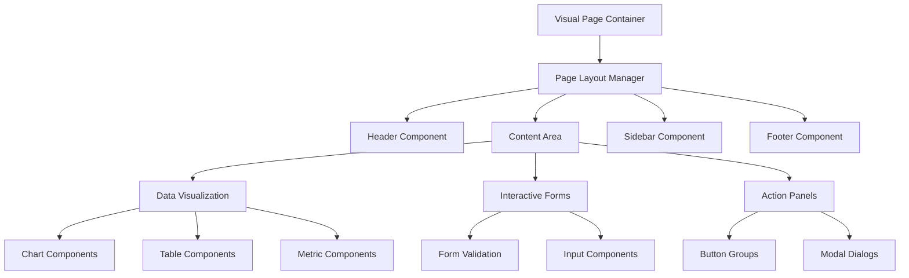

# Visual Pages - Standards and Conventions

This document defines the standards and conventions for creating visual pages within the Token Nexus Platform. Visual pages are custom UI components that provide specialized interfaces for specific business functions, data visualization, and user interactions.

## Table of Contents

1. [Architecture Overview](#architecture-overview)
2. [Page Types and Categories](#page-types-and-categories)
3. [Component Structure Standards](#component-structure-standards)
4. [Layout and Design Patterns](#layout-and-design-patterns)
5. [Data Visualization Standards](#data-visualization-standards)
6. [Interactive Elements](#interactive-elements)
7. [Responsive Design Requirements](#responsive-design-requirements)
8. [Performance Optimization](#performance-optimization)
9. [Accessibility Standards](#accessibility-standards)
10. [AI Assistant Integration](#ai-assistant-integration)
11. [Testing Standards](#testing-standards)
12. [Implementation Checklist](#implementation-checklist)
13. [Examples and Templates](#examples-and-templates)

## Architecture Overview

Visual pages follow a component-based architecture that ensures consistency, reusability, and maintainability:



### Core Principles

1. **Consistency**: All pages follow the same design system and patterns
2. **Modularity**: Pages are built from reusable components
3. **Accessibility**: Full WCAG 2.1 AA compliance
4. **Performance**: Optimized loading and rendering
5. **Responsive**: Adaptive design for all screen sizes
6. **AI Integration**: All functionality accessible through AI assistant

## Page Types and Categories

### Page Categories

```typescript
enum VisualPageCategory {
  DASHBOARD = 'dashboard',
  ANALYTICS = 'analytics',
  FORM = 'form',
  REPORT = 'report',
  WORKFLOW = 'workflow',
  SETTINGS = 'settings',
  PROFILE = 'profile',
  CUSTOM = 'custom'
}

enum VisualPageType {
  OVERVIEW = 'overview',
  DETAIL = 'detail',
  LIST = 'list',
  EDITOR = 'editor',
  VIEWER = 'viewer',
  WIZARD = 'wizard',
  COMPARISON = 'comparison'
}
```

### Page Metadata Schema

```typescript
interface VisualPageMetadata {
  id: string;
  name: string;
  title: string;
  description: string;
  category: VisualPageCategory;
  type: VisualPageType;
  version: string;
  permissions: string[];
  organizationScoped: boolean;
  layout: PageLayout;
  navigation: NavigationConfig;
  seo: SEOConfig;
  tags: string[];
  author: {
    name: string;
    email: string;
    organization?: string;
  };
}

interface PageLayout {
  template: 'full-width' | 'sidebar-left' | 'sidebar-right' | 'two-column' | 'three-column';
  header: boolean;
  footer: boolean;
  breadcrumbs: boolean;
  maxWidth?: string;
}

interface NavigationConfig {
  showInMenu: boolean;
  menuGroup?: string;
  menuOrder?: number;
  breadcrumbTitle?: string;
  parentPage?: string;
}

interface SEOConfig {
  title: string;
  description: string;
  keywords: string[];
  ogImage?: string;
}
```

## Component Structure Standards

### Base Visual Page Component

All visual pages must extend the [`BaseVisualPage`](../src/components/pages/BaseVisualPage.tsx) component:

```typescript
// BaseVisualPage.tsx
import React, { useState, useEffect, useCallback } from 'react';
import { usePageController } from '@/hooks/usePageController';
import { usePermission } from '@/hooks/usePermission';
import { useOrganization } from '@/hooks/useOrganization';
import { PageHeader } from '@/components/layout/PageHeader';
import { PageContent } from '@/components/layout/PageContent';
import { PageSidebar } from '@/components/layout/PageSidebar';
import { PageFooter } from '@/components/layout/PageFooter';
import { Breadcrumbs } from '@/components/navigation/Breadcrumbs';
import { LoadingSpinner } from '@/components/ui/loading-spinner';
import { ErrorBoundary } from '@/components/error/ErrorBoundary';

export interface BaseVisualPageProps {
  metadata: VisualPageMetadata;
  params?: Record<string, string>;
  searchParams?: Record<string, string>;
}

export interface VisualPageState {
  loading: boolean;
  error: string | null;
  data: any;
  initialized: boolean;
}

export abstract class BaseVisualPage<TData = any, TParams = Record<string, any>> 
  extends React.Component<BaseVisualPageProps, VisualPageState> {

  protected pageController: any;
  protected abortController?: AbortController;

  constructor(props: BaseVisualPageProps) {
    super(props);
    this.state = {
      loading: true,
      error: null,
      data: null,
      initialized: false
    };
  }

  componentDidMount() {
    this.initializePage();
  }

  componentWillUnmount() {
    this.cleanup();
  }

  // Abstract methods that must be implemented
  protected abstract initializePageController(): void;
  protected abstract loadPageData(): Promise<TData>;
  protected abstract renderPageContent(): React.ReactNode;
  protected abstract getPageActions(): PageAction[];

  // Optional methods that can be overridden
  protected renderPageHeader(): React.ReactNode {
    return (
      <PageHeader
        title={this.props.metadata.title}
        description={this.props.metadata.description}
        actions={this.getPageActions()}
        breadcrumbs={this.renderBreadcrumbs()}
      />
    );
  }

  protected renderPageSidebar(): React.ReactNode | null {
    return null; // Override to provide sidebar content
  }

  protected renderPageFooter(): React.ReactNode | null {
    return null; // Override to provide footer content
  }

  protected renderBreadcrumbs(): React.ReactNode {
    if (!this.props.metadata.layout.breadcrumbs) {
      return null;
    }

    return (
      <Breadcrumbs
        items={this.getBreadcrumbItems()}
      />
    );
  }

  // Page initialization
  private async initializePage(): Promise<void> {
    try {
      this.setState({ loading: true, error: null });

      // Initialize page controller
      this.initializePageController();

      // Load page data
      const data = await this.loadPageData();

      this.setState({
        data,
        loading: false,
        initialized: true
      });

    } catch (error) {
      this.setState({
        loading: false,
        error: error instanceof Error ? error.message : 'Failed to initialize page'
      });
    }
  }

  // Data loading with error handling
  protected async fetchData<T>(
    fetcher: () => Promise<T>,
    options: {
      showLoading?: boolean;
      retries?: number;
    } = {}
  ): Promise<T> {
    const { showLoading = false, retries = 3 } = options;

    if (showLoading) {
      this.setState({ loading: true });
    }

    this.abortController = new AbortController();

    let lastError: Error;
    for (let attempt = 1; attempt <= retries; attempt++) {
      try {
        const result = await fetcher();
        
        if (showLoading) {
          this.setState({ loading: false });
        }
        
        return result;
      } catch (error) {
        lastError = error as Error;
        
        if (error.name === 'AbortError') {
          throw error;
        }
        
        if (attempt < retries) {
          await this.delay(Math.pow(2, attempt) * 1000);
        }
      }
    }

    if (showLoading) {
      this.setState({ loading: false });
    }

    throw lastError!;
  }

  // Utility methods
  protected delay(ms: number): Promise<void> {
    return new Promise(resolve => setTimeout(resolve, ms));
  }

  protected cleanup(): void {
    if (this.abortController) {
      this.abortController.abort();
    }
  }

  protected getBreadcrumbItems(): BreadcrumbItem[] {
    const items: BreadcrumbItem[] = [
      { label: 'Home', href: '/' }
    ];

    if (this.props.metadata.navigation.parentPage) {
      items.push({
        label: this.props.metadata.navigation.parentPage,
        href: `/${this.props.metadata.navigation.parentPage}`
      });
    }

    items.push({
      label: this.props.metadata.navigation.breadcrumbTitle || this.props.metadata.title,
      href: window.location.pathname,
      current: true
    });

    return items;
  }

  // Error boundary
  componentDidCatch(error: Error, errorInfo: React.ErrorInfo) {
    console.error('Visual page error:', error, errorInfo);
    this.setState({
      error: 'Page encountered an error',
      loading: false
    });
  }

  render() {
    const { metadata } = this.props;
    const { loading, error, initialized } = this.state;

    if (loading && !initialized) {
      return (
        <div className="flex items-center justify-center min-h-screen">
          <LoadingSpinner size="lg" />
        </div>
      );
    }

    if (error) {
      return (
        <div className="flex items-center justify-center min-h-screen">
          <div className="text-center">
            <h2 className="text-xl font-semibold mb-2">Page Error</h2>
            <p className="text-muted-foreground mb-4">{error}</p>
            <button
              onClick={() => this.initializePage()}
              className="px-4 py-2 bg-primary text-primary-foreground rounded-md"
            >
              Retry
            </button>
          </div>
        </div>
      );
    }

    return (
      <ErrorBoundary>
        <div className={`visual-page ${this.getPageClassName()}`}>
          {/* SEO Meta Tags */}
          {this.renderSEOTags()}
          
          {/* Page Layout */}
          <div className={`page-layout ${metadata.layout.template}`}>
            {/* Header */}
            {metadata.layout.header && this.renderPageHeader()}
            
            {/* Main Content Area */}
            <div className="page-main">
              {/* Sidebar */}
              {this.hasSidebar() && (
                <aside className="page-sidebar">
                  {this.renderPageSidebar()}
                </aside>
              )}
              
              {/* Content */}
              <main className="page-content">
                <PageContent maxWidth={metadata.layout.maxWidth}>
                  {this.renderPageContent()}
                </PageContent>
              </main>
            </div>
            
            {/* Footer */}
            {metadata.layout.footer && this.renderPageFooter()}
          </div>
        </div>
      </ErrorBoundary>
    );
  }

  // Helper methods
  private getPageClassName(): string {
    const { metadata } = this.props;
    return [
      `page-${metadata.id}`,
      `category-${metadata.category}`,
      `type-${metadata.type}`,
      `layout-${metadata.layout.template}`
    ].join(' ');
  }

  private hasSidebar(): boolean {
    const template = this.props.metadata.layout.template;
    return template === 'sidebar-left' || template === 'sidebar-right';
  }

  private renderSEOTags(): React.ReactNode {
    const { seo } = this.props.metadata;
    
    return (
      <React.Fragment>
        <title>{seo.title}</title>
        <meta name="description" content={seo.description} />
        <meta name="keywords" content={seo.keywords.join(', ')} />
        {seo.ogImage && <meta property="og:image" content={seo.ogImage} />}
        <meta property="og:title" content={seo.title} />
        <meta property="og:description" content={seo.description} />
      </React.Fragment>
    );
  }
}
```

### Visual Page Implementation Example

```typescript
// Example: ProjectAnalyticsPage.tsx
import React from 'react';
import { BaseVisualPage, BaseVisualPageProps, VisualPageState } from './BaseVisualPage';
import { Card, CardContent, CardHeader, CardTitle } from '@/components/ui/card';
import { Button } from '@/components/ui/button';
import { Badge } from '@/components/ui/badge';
import { BarChart, LineChart, PieChart } from '@/components/charts';
import { DataTable } from '@/components/data-table';
import { MetricCard } from '@/components/metrics/MetricCard';
import { DateRangePicker } from '@/components/ui/date-range-picker';
import { ExportButton } from '@/components/ui/export-button';

interface ProjectAnalyticsData {
  overview: {
    totalProjects: number;
    activeProjects: number;
    completedProjects: number;
    overdueTasks: number;
  };
  charts: {
    projectProgress: ChartData[];
    taskCompletion: ChartData[];
    teamProductivity: ChartData[];
  };
  tables: {
    topProjects: ProjectSummary[];
    recentActivity: ActivityItem[];
  };
}

interface ProjectAnalyticsParams {
  dateRange: DateRange;
  projectFilter: string[];
  teamFilter: string[];
}

export class ProjectAnalyticsPage extends BaseVisualPage<ProjectAnalyticsData, ProjectAnalyticsParams> {
  private dateRange: DateRange = { from: new Date(), to: new Date() };
  private filters: ProjectAnalyticsParams = {
    dateRange: this.dateRange,
    projectFilter: [],
    teamFilter: []
  };

  protected initializePageController(): void {
    this.pageController = usePageController({
      pageId: 'project-analytics',
      pageName: 'Project Analytics',
      description: 'Comprehensive project analytics and insights',
      category: 'analytics',
      permissions: ['projects:read', 'analytics:read'],
      tags: ['projects', 'analytics', 'reports']
    });
  }

  protected async loadPageData(): Promise<ProjectAnalyticsData> {
    return this.fetchData(async () => {
      const [overview, charts, tables] = await Promise.all([
        this.loadOverviewData(),
        this.loadChartData(),
        this.loadTableData()
      ]);

      return { overview, charts, tables };
    });
  }

  protected renderPageContent(): React.ReactNode {
    const { data } = this.state;
    
    if (!data) {
      return <div>No data available</div>;
    }

    return (
      <div className="space-y-6">
        {/* Filters */}
        {this.renderFilters()}
        
        {/* Overview Metrics */}
        {this.renderOverviewMetrics(data.overview)}
        
        {/* Charts Section */}
        {this.renderChartsSection(data.charts)}
        
        {/* Tables Section */}
        {this.renderTablesSection(data.tables)}
      </div>
    );
  }

  protected getPageActions(): PageAction[] {
    return [
      {
        id: 'refresh',
        label: 'Refresh',
        icon: 'RefreshCw',
        onClick: () => this.refreshData(),
        variant: 'outline'
      },
      {
        id: 'export',
        label: 'Export',
        icon: 'Download',
        onClick: () => this.exportData(),
        variant: 'default'
      },
      {
        id: 'configure',
        label: 'Configure',
        icon: 'Settings',
        onClick: () => this.openConfiguration(),
        variant: 'ghost'
      }
    ];
  }

  // Data loading methods
  private async loadOverviewData(): Promise<ProjectAnalyticsData['overview']> {
    const response = await fetch('/api/analytics/projects/overview', {
      method: 'POST',
      headers: { 'Content-Type': 'application/json' },
      body: JSON.stringify(this.filters),
      signal: this.abortController?.signal
    });

    if (!response.ok) {
      throw new Error('Failed to load overview data');
    }

    return response.json();
  }

  private async loadChartData(): Promise<ProjectAnalyticsData['charts']> {
    const response = await fetch('/api/analytics/projects/charts', {
      method: 'POST',
      headers: { 'Content-Type': 'application/json' },
      body: JSON.stringify(this.filters),
      signal: this.abortController?.signal
    });

    if (!response.ok) {
      throw new Error('Failed to load chart data');
    }

    return response.json();
  }

  private async loadTableData(): Promise<ProjectAnalyticsData['tables']> {
    const response = await fetch('/api/analytics/projects/tables', {
      method: 'POST',
      headers: { 'Content-Type': 'application/json' },
      body: JSON.stringify(this.filters),
      signal: this.abortController?.signal
    });

    if (!response.ok) {
      throw new Error('Failed to load table data');
    }

    return response.json();
  }

  // Rendering methods
  private renderFilters(): React.ReactNode {
    return (
      <Card>
        <CardHeader>
          <CardTitle>Filters</CardTitle>
        </CardHeader>
        <CardContent>
          <div className="flex flex-wrap gap-4">
            <DateRangePicker
              value={this.filters.dateRange}
              onChange={(range) => this.updateFilters({ dateRange: range })}
            />
            
            <ProjectFilter
              value={this.filters.projectFilter}
              onChange={(projects) => this.updateFilters({ projectFilter: projects })}
            />
            
            <TeamFilter
              value={this.filters.teamFilter}
              onChange={(teams) => this.updateFilters({ teamFilter: teams })}
            />
            
            <Button
              variant="outline"
              onClick={() => this.resetFilters()}
            >
              Reset Filters
            </Button>
          </div>
        </CardContent>
      </Card>
    );
  }

  private renderOverviewMetrics(overview: ProjectAnalyticsData['overview']): React.ReactNode {
    return (
      <div className="grid grid-cols-1 md:grid-cols-2 lg:grid-cols-4 gap-4">
        <MetricCard
          title="Total Projects"
          value={overview.totalProjects}
          icon="FolderOpen"
          trend={{ value: 12, direction: 'up' }}
        />
        
        <MetricCard
          title="Active Projects"
          value={overview.activeProjects}
          icon="Play"
          trend={{ value: 5, direction: 'up' }}
        />
        
        <MetricCard
          title="Completed Projects"
          value={overview.completedProjects}
          icon="CheckCircle"
          trend={{ value: 8, direction: 'up' }}
        />
        
        <MetricCard
          title="Overdue Tasks"
          value={overview.overdueTasks}
          icon="AlertTriangle"
          trend={{ value: 3, direction: 'down' }}
          variant="warning"
        />
      </div>
    );
  }

  private renderChartsSection(charts: ProjectAnalyticsData['charts']): React.ReactNode {
    return (
      <div className="grid grid-cols-1 lg:grid-cols-2 gap-6">
        <Card>
          <CardHeader>
            <CardTitle>Project Progress</CardTitle>
          </CardHeader>
          <CardContent>
            <BarChart
              data={charts.projectProgress}
              xKey="project"
              yKey="progress"
              height={300}
            />
          </CardContent>
        </Card>
        
        <Card>
          <CardHeader>
            <CardTitle>Task Completion Trend</CardTitle>
          </CardHeader>
          <CardContent>
            <LineChart
              data={charts.taskCompletion}
              xKey="date"
              yKey="completed"
              height={300}
            />
          </CardContent>
        </Card>
        
        <Card className="lg:col-span-2">
          <CardHeader>
            <CardTitle>Team Productivity</CardTitle>
          </CardHeader>
          <CardContent>
            <PieChart
              data={charts.teamProductivity}
              nameKey="team"
              valueKey="productivity"
              height={400}
            />
          </CardContent>
        </Card>
      </div>
    );
  }

  private renderTablesSection(tables: ProjectAnalyticsData['tables']): React.ReactNode {
    return (
      <div className="grid grid-cols-1 lg:grid-cols-2 gap-6">
        <Card>
          <CardHeader>
            <CardTitle>Top Performing Projects</CardTitle>
          </CardHeader>
          <CardContent>
            <DataTable
              data={tables.topProjects}
              columns={[
                { key: 'name', label: 'Project Name' },
                { key: 'progress', label: 'Progress', render: (value) => `${value}%` },
                { key: 'team', label: 'Team' },
                { key: 'status', label: 'Status', render: (value) => (
                  <Badge variant={value === 'on-track' ? 'default' : 'warning'}>
                    {value}
                  </Badge>
                )}
              ]}
              pagination={{ pageSize: 10 }}
            />
          </CardContent>
        </Card>
        
        <Card>
          <CardHeader>
            <CardTitle>Recent Activity</CardTitle>
          </CardHeader>
          <CardContent>
            <div className="space-y-4">
              {tables.recentActivity.map((activity, index) => (
                <div key={index} className="flex items-center gap-3 p-3 border rounded-lg">
                  <div className="w-2 h-2 bg-primary rounded-full" />
                  <div className="flex-1">
                    <p className="text-sm font-medium">{activity.description}</p>
                    <p className="text-xs text-muted-foreground">{activity.timestamp}</p>
                  </div>
                  <Badge variant="outline">{activity.type}</Badge>
                </div>
              ))}
            </div>
          </CardContent>
        </Card>
      </div>
    );
  }

  // Event handlers
  private updateFilters(updates: Partial<ProjectAnalyticsParams>): void {
    this.filters = { ...this.filters, ...updates };
    this.refreshData();
  }

  private resetFilters(): void {
    this.filters = {
      dateRange: { from: new Date(), to: new Date() },
      projectFilter: [],
      teamFilter: []
    };
    this.refreshData();
  }

  private async refreshData(): Promise<void> {
    try {
      const data = await this.loadPageData();
      this.setState({ data });
    } catch (error) {
      console.error('Failed to refresh data:', error);
    }
  }

  private async exportData(): Promise<void> {
    try {
      const response = await fetch('/api/analytics/projects/export', {
        method: 'POST',
        headers: { 'Content-Type': 'application/json' },
        body: JSON.stringify(this.filters)
      });

      if (!response.ok) {
        throw new Error('Export failed');
      }

      const blob = await response.blob();
      const url = window.URL.createObjectURL(blob);
      const a = document.createElement('a');
      a.href = url;
      a.download = `project-analytics-${new Date().toISOString().split('T')[0]}.xlsx`;
      a.click();
      window.URL.revokeObjectURL(url);
    } catch (error) {
      console.error('Export failed:', error);
    }
  }

  private openConfiguration(): void {
    // Open configuration modal
    // Implementation would depend on modal system
  }
}

// Page metadata
export const ProjectAnalyticsPageMetadata: VisualPageMetadata = {
  id: 'project-analytics',
  name: 'ProjectAnalyticsPage',
  title: 'Project Analytics',
  description: 'Comprehensive analytics and insights for project management',
  category: VisualPageCategory.ANALYTICS,
  type: VisualPageType.OVERVIEW,
  version: '1.0.0',
  permissions: ['projects:read', 'analytics:read'],
  organizationScoped: true,
  layout: {
    template: 'full-width',
    header: true,
    footer: false,
    breadcrumbs: true,
    maxWidth: '1400px'
  },
  navigation: {
    showInMenu: true,
    menuGroup: 'Analytics',
    menuOrder: 1,
    breadcrumbTitle: 'Project Analytics'
  },
  seo: {
    title: 'Project Analytics - Token Nexus Platform',
    description: 'Comprehensive project analytics and insights dashboard',
    keywords: ['projects', 'analytics', 'dashboard', 'insights', 'reporting']
  },
  tags: ['projects', 'analytics', 'dashboard'],
  author: {
    name: 'Platform Team',
    email: 'platform@tokennexus.com'
  }
};
```

## Layout and Design Patterns

### Layout Templates

```typescript
// Layout template system
export enum LayoutTemplate {
  FULL_WIDTH = 'full-width',
  SIDEBAR_LEFT = 'sidebar-left',
  SIDEBAR_RIGHT = 'sidebar-right',
  TWO_COLUMN = 'two-column',
  THREE_COLUMN = 'three-column'
}

// Layout component implementations
export const LayoutTemplates = {
  [LayoutTemplate.FULL_WIDTH]: ({ children, header, footer }: LayoutProps) => (
    <div className="layout-full-width">
      {header}
      <main className="flex-1 w-full max-w-full">
        {children}
      </main>
      {footer}
    </div>
  ),

  [LayoutTemplate.SIDEBAR_LEFT]: ({ children, header, footer, sidebar }: LayoutProps) => (
    <div className="layout-sidebar-left">
      {header}
      <div className="flex flex-1">
        <aside className="w-64 flex-shrink-0 border-r">
          {sidebar}
        </aside>
        <main className="flex-1 min-w-0">
          {children}
        </main>
      </div>
      {footer}
    </div>
  ),

  [LayoutTemplate.SIDEBAR_RIGHT]: ({ children, header, footer, sidebar }: LayoutProps) => (
    <div className="layout-sidebar-right">
      {header}
      <div className="flex flex-1">
        <main className="flex-1 min-w-0">
          {children}
        </main>
        <aside className="w-64 flex-shrink-0 border-l">
          {sidebar}
        </aside>
      </div>
      {footer}
    </div>
  ),

  [LayoutTemplate.TWO_COLUMN]: ({ children, header, footer }: LayoutProps) => (
    <div className="layout-two-column">
      {header}
      <main className="flex-1">
        <div className="grid grid-cols-1 lg:grid-cols-2 gap-6">
          {children}
        </div>
      </main>
      {footer}
    </div>
  ),

  [LayoutTemplate.THREE_COLUMN]: ({ children, header, footer }: LayoutProps) => (
    <div className="layout-three-column">
      {header}
      <main className="flex-1">
        <div className="grid grid-cols-1 md:grid-cols-2 lg:grid-cols-3 gap-6">
          {children}
        </div>
      </main>
      {footer}
    </div>
  )
};
```

### Design System Integration

```typescript
// Design system tokens
export const DesignTokens = {
  colors: {
    primary: {
      50: '#eff6ff',
      100: '#dbeafe',
      500: '#3b82f6',
      600: '#2563eb',
      900: '#1e3a8a'
    },
    gray: {
      50: '#f9fafb',
      100: '#f3f4f6',
      500: '#6b7280',
      600: '#4b5563',
      900: '#111827'
    }
  },
  spacing: {
    xs: '0.5rem',
    sm: '1rem',
    md: '1.5rem',
    lg: '2rem',
    xl: '3rem'
  },
  typography: {
    fontFamily: {
      sans: ['Inter', 'system-ui', 'sans-serif'],
      mono: ['JetBrains Mono', 'monospace']
    },
    fontSize: {
      xs: '0.75rem',
      sm: '0.875rem',
      base: '1rem',
      lg: '1.125rem',
      xl: '1.25rem',
      '2xl': '1.5rem',
      '3xl': '1.875rem'
    }
  },
  borderRadius: {
    sm: '0.25rem',
    md: '0.375rem',
    lg: '0.5rem',
    xl: '0.75rem'
  },
  shadows: {
    sm: '0 1px 2px 0 rgb(0 0 0 / 0.05)',
    md: '0 4px 6px -1px rgb(0 0 0 / 0.1)',
    lg: '0 10px 15px -3px rgb(0 0 0 / 0.1)'
  }
};

// Component styling utilities
export const ComponentStyles = {
  card: {
    base: 'bg-white border border-gray-200 rounded-lg shadow-sm',
    header: 'px-6 py-4 border-b border-gray-200',
    content: 'px-6 py-4',
    footer: 'px-6 py-4 border-t border-gray-200'
  },
  button: {
    base: 'inline-flex items-center justify-center rounded-md font-medium transition-colors',
    variants: {
      default: 'bg-primary-600 text-white hover:bg-primary-700',
      outline: 'border border-gray-300 bg-white text-gray-700 hover:bg-gray-50',
      ghost: 'text-gray-700 hover:bg