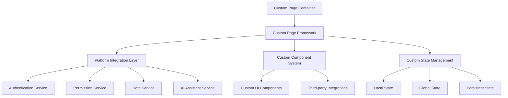

# Custom Pages - Standards and Conventions

This document defines the standards and conventions for creating custom pages within the Token Nexus Platform. Custom pages are specialized interfaces designed for unique business requirements that don't fit standard page templates, providing maximum flexibility while maintaining platform consistency.

## Table of Contents

1. [Architecture Overview](#architecture-overview)
2. [Custom Page Categories](#custom-page-categories)
3. [Development Framework](#development-framework)
4. [Component Architecture](#component-architecture)
5. [State Management Patterns](#state-management-patterns)
6. [API Integration Standards](#api-integration-standards)
7. [Custom Styling and Theming](#custom-styling-and-theming)
8. [Performance Considerations](#performance-considerations)
9. [Security Requirements](#security-requirements)
10. [AI Assistant Integration](#ai-assistant-integration)
11. [Testing and Quality Assurance](#testing-and-quality-assurance)
12. [Implementation Checklist](#implementation-checklist)
13. [Examples and Templates](#examples-and-templates)

## Architecture Overview

Custom pages provide maximum flexibility while maintaining integration with the platform's core systems:



### Core Principles

1. **Maximum Flexibility**: Custom pages can implement any UI/UX pattern
2. **Platform Integration**: Seamless integration with platform services
3. **Performance First**: Optimized for specific use cases
4. **Security Compliance**: Full adherence to platform security standards
5. **AI Accessibility**: All functionality accessible through AI assistant
6. **Maintainability**: Clear structure and documentation

## Custom Page Categories

### Page Categories

```typescript
enum CustomPageCategory {
  SPECIALIZED_WORKFLOW = 'specialized-workflow',
  DATA_VISUALIZATION = 'data-visualization',
  EXTERNAL_INTEGRATION = 'external-integration',
  CUSTOM_FORM = 'custom-form',
  INTERACTIVE_TOOL = 'interactive-tool',
  REPORTING_DASHBOARD = 'reporting-dashboard',
  CONFIGURATION_INTERFACE = 'configuration-interface',
  PROTOTYPE = 'prototype'
}

enum CustomPageComplexity {
  SIMPLE = 'simple',           // Basic custom layout
  MODERATE = 'moderate',       // Custom components and logic
  COMPLEX = 'complex',         // Advanced interactions and integrations
  ENTERPRISE = 'enterprise'    // Full custom application
}
```

### Custom Page Metadata

```typescript
interface CustomPageMetadata {
  id: string;
  name: string;
  title: string;
  description: string;
  category: CustomPageCategory;
  complexity: CustomPageComplexity;
  version: string;
  permissions: string[];
  organizationScoped: boolean;
  customization: CustomizationConfig;
  dependencies: DependencyConfig;
  performance: PerformanceConfig;
  security: SecurityConfig;
  tags: string[];
  author: AuthorInfo;
  documentation: DocumentationConfig;
}

interface CustomizationConfig {
  allowCustomCSS: boolean;
  allowCustomJS: boolean;
  allowThirdPartyLibraries: boolean;
  customComponentsEnabled: boolean;
  advancedLayoutOptions: boolean;
}

interface DependencyConfig {
  platformServices: string[];
  externalAPIs: ExternalAPIConfig[];
  thirdPartyLibraries: LibraryConfig[];
  customModules: string[];
}

interface PerformanceConfig {
  lazyLoading: boolean;
  codesplitting: boolean;
  caching: CachingConfig;
  bundleOptimization: boolean;
}

interface SecurityConfig {
  cspPolicy: string;
  allowedDomains: string[];
  sanitization: SanitizationConfig;
  auditLevel: 'basic' | 'detailed' | 'comprehensive';
}
```

## Development Framework

### Custom Page Base Class

```typescript
// CustomPageBase.tsx
import React, { useState, useEffect, useRef, useCallback } from 'react';
import { CustomPageMetadata, CustomPageProps, CustomPageState } from '@/types/customPages';
import { PlatformIntegrationService } from '@/services/platformIntegration';
import { CustomPageSecurityService } from '@/services/customPageSecurity';
import { CustomPagePerformanceService } from '@/services/customPagePerformance';
import { ErrorBoundary } from '@/components/error/ErrorBoundary';
import { LoadingSpinner } from '@/components/ui/loading-spinner';

export interface CustomPageBaseProps extends CustomPageProps {
  metadata: CustomPageMetadata;
  platformServices: PlatformIntegrationService;
  securityService: CustomPageSecurityService;
  performanceService: CustomPagePerformanceService;
}

export abstract class CustomPageBase<TState = any, TProps = any> 
  extends React.Component<CustomPageBaseProps & TProps, CustomPageState & TState> {

  protected platformServices: PlatformIntegrationService;
  protected securityService: CustomPageSecurityService;
  protected performanceService: CustomPagePerformanceService;
  protected abortController?: AbortController;
  protected performanceObserver?: PerformanceObserver;

  constructor(props: CustomPageBaseProps & TProps) {
    super(props);
    
    this.platformServices = props.platformServices;
    this.securityService = props.securityService;
    this.performanceService = props.performanceService;
    
    this.state = {
      initialized: false,
      loading: true,
      error: null,
      data: null,
      customState: this.getInitialCustomState()
    } as CustomPageState & TState;
  }

  componentDidMount() {
    this.initializePage();
    this.setupPerformanceMonitoring();
  }

  componentWillUnmount() {
    this.cleanup();
  }

  // Abstract methods to be implemented by custom pages
  protected abstract getInitialCustomState(): TState;
  protected abstract initializeCustomPage(): Promise<void>;
  protected abstract renderCustomContent(): React.ReactNode;
  protected abstract getCustomPageActions(): CustomPageAction[];

  // Optional methods that can be overridden
  protected getCustomStyles(): React.CSSProperties {
    return {};
  }

  protected getCustomClassName(): string {
    return '';
  }

  protected setupCustomEventListeners(): void {
    // Override to add custom event listeners
  }

  protected cleanupCustomResources(): void {
    // Override to cleanup custom resources
  }

  // Page initialization
  private async initializePage(): Promise<void> {
    try {
      this.setState({ loading: true, error: null });

      // Security validation
      await this.validatePageSecurity();

      // Initialize platform integration
      await this.initializePlatformIntegration();

      // Custom page initialization
      await this.initializeCustomPage();

      // Setup custom event listeners
      this.setupCustomEventListeners();

      this.setState({
        initialized: true,
        loading: false
      });

    } catch (error) {
      this.setState({
        loading: false,
        error: error instanceof Error ? error.message : 'Failed to initialize custom page'
      });
    }
  }

  // Security validation
  private async validatePageSecurity(): Promise<void> {
    const { metadata } = this.props;

    // Validate permissions
    for (const permission of metadata.permissions) {
      const hasPermission = await this.platformServices.checkPermission(permission);
      if (!hasPermission) {
        throw new Error(`Insufficient permission: ${permission}`);
      }
    }

    // Validate organization context
    if (metadata.organizationScoped) {
      const orgContext = await this.platformServices.getOrganizationContext();
      if (!orgContext) {
        throw new Error('Organization context required');
      }
    }

    // Validate security policies
    await this.securityService.validateSecurityPolicies(metadata.security);
  }

  // Platform integration
  private async initializePlatformIntegration(): Promise<void> {
    const { metadata } = this.props;

    // Initialize required platform services
    for (const service of metadata.dependencies.platformServices) {
      await this.platformServices.initializeService(service);
    }

    // Setup external API integrations
    for (const apiConfig of metadata.dependencies.externalAPIs) {
      await this.platformServices.setupExternalAPI(apiConfig);
    }
  }

  // Performance monitoring
  private setupPerformanceMonitoring(): void {
    if (!this.props.metadata.performance.bundleOptimization) {
      return;
    }

    this.performanceObserver = new PerformanceObserver((list) => {
      const entries = list.getEntries();
      this.performanceService.recordMetrics(entries);
    });

    this.performanceObserver.observe({ 
      entryTypes: ['measure', 'navigation', 'resource'] 
    });
  }

  // Cleanup
  private cleanup(): void {
    if (this.abortController) {
      this.abortController.abort();
    }

    if (this.performanceObserver) {
      this.performanceObserver.disconnect();
    }

    this.cleanupCustomResources();
  }

  // Utility methods for custom pages
  protected async callPlatformAPI<T>(
    endpoint: string,
    data?: any,
    options?: RequestOptions
  ): Promise<T> {
    return this.platformServices.callAPI(endpoint, data, options);
  }

  protected async callExternalAPI<T>(
    apiId: string,
    endpoint: string,
    data?: any,
    options?: RequestOptions
  ): Promise<T> {
    return this.platformServices.callExternalAPI(apiId, endpoint, data, options);
  }

  protected updateCustomState(updates: Partial<TState>): void {
    this.setState(prevState => ({
      ...prevState,
      customState: {
        ...prevState.customState,
        ...updates
      }
    }));
  }

  protected async loadData<T>(
    loader: () => Promise<T>,
    options: {
      showLoading?: boolean;
      cacheKey?: string;
      cacheTTL?: number;
    } = {}
  ): Promise<T> {
    const { showLoading = true, cacheKey, cacheTTL } = options;

    if (showLoading) {
      this.setState({ loading: true });
    }

    try {
      // Check cache first
      if (cacheKey) {
        const cached = await this.performanceService.getFromCache<T>(cacheKey);
        if (cached) {
          if (showLoading) {
            this.setState({ loading: false });
          }
          return cached;
        }
      }

      // Load data
      const result = await loader();

      // Cache result
      if (cacheKey && cacheTTL) {
        await this.performanceService.setCache(cacheKey, result, cacheTTL);
      }

      if (showLoading) {
        this.setState({ loading: false });
      }

      return result;
    } catch (error) {
      if (showLoading) {
        this.setState({ loading: false });
      }
      throw error;
    }
  }

  // Error boundary
  componentDidCatch(error: Error, errorInfo: React.ErrorInfo) {
    console.error('Custom page error:', error, errorInfo);
    this.setState({
      error: 'Custom page encountered an error',
      loading: false
    });

    // Report error to platform
    this.platformServices.reportError(error, {
      pageId: this.props.metadata.id,
      errorInfo
    });
  }

  render() {
    const { metadata } = this.props;
    const { initialized, loading, error } = this.state;

    if (loading && !initialized) {
      return (
        <div className="flex items-center justify-center min-h-screen">
          <LoadingSpinner size="lg" />
        </div>
      );
    }

    if (error) {
      return (
        <div className="flex items-center justify-center min-h-screen">
          <div className="text-center">
            <h2 className="text-xl font-semibold mb-2">Custom Page Error</h2>
            <p className="text-muted-foreground mb-4">{error}</p>
            <button
              onClick={() => this.initializePage()}
              className="px-4 py-2 bg-primary text-primary-foreground rounded-md"
            >
              Retry
            </button>
          </div>
        </div>
      );
    }

    return (
      <ErrorBoundary>
        <div 
          className={`custom-page custom-page-${metadata.id} ${this.getCustomClassName()}`}
          style={this.getCustomStyles()}
        >
          {/* Custom page content */}
          {this.renderCustomContent()}
          
          {/* Platform integration overlay */}
          {this.renderPlatformIntegration()}
        </div>
      </ErrorBoundary>
    );
  }

  private renderPlatformIntegration(): React.ReactNode {
    // Render platform integration elements (AI assistant, notifications, etc.)
    return (
      <div className="platform-integration-overlay">
        {/* AI Assistant integration */}
        {this.renderAIAssistantIntegration()}
        
        {/* Performance monitoring */}
        {this.renderPerformanceMonitoring()}
      </div>
    );
  }

  private renderAIAssistantIntegration(): React.ReactNode {
    const actions = this.getCustomPageActions();
    
    return (
      <div className="ai-assistant-integration" style={{ display: 'none' }}>
        {/* AI assistant will discover these actions */}
        {actions.map(action => (
          <div
            key={action.id}
            data-ai-action={action.id}
            data-ai-description={action.description}
            data-ai-parameters={JSON.stringify(action.parameters)}
          />
        ))}
      </div>
    );
  }

  private renderPerformanceMonitoring(): React.ReactNode {
    if (!this.props.metadata.performance.bundleOptimization) {
      return null;
    }

    return (
      <div className="performance-monitoring" style={{ display: 'none' }}>
        {/* Performance metrics collection */}
      </div>
    );
  }
}
```

### Custom Page Implementation Example

```typescript
// Example: InteractiveDataExplorerPage.tsx
import React from 'react';
import { CustomPageBase, CustomPageBaseProps } from './CustomPageBase';
import { Card, CardContent, CardHeader, CardTitle } from '@/components/ui/card';
import { Button } from '@/components/ui/button';
import { Input } from '@/components/ui/input';
import { Select, SelectContent, SelectItem, SelectTrigger, SelectValue } from '@/components/ui/select';
import { DataGrid } from '@/components/data-grid/DataGrid';
import { ChartContainer } from '@/components/charts/ChartContainer';
import { FilterPanel } from '@/components/filters/FilterPanel';
import { ExportPanel } from '@/components/export/ExportPanel';

interface DataExplorerState {
  dataset: DataSet | null;
  filters: FilterConfig[];
  visualization: VisualizationConfig;
  query: QueryConfig;
  results: QueryResult | null;
  selectedRows: string[];
  chartType: ChartType;
  exportConfig: ExportConfig;
}

interface DataExplorerProps {
  datasetId?: string;
  initialFilters?: FilterConfig[];
  readOnly?: boolean;
}

export class InteractiveDataExplorerPage extends CustomPageBase<DataExplorerState, DataExplorerProps> {
  private queryBuilder: QueryBuilder;
  private visualizationEngine: VisualizationEngine;
  private exportService: ExportService;

  constructor(props: CustomPageBaseProps & DataExplorerProps) {
    super(props);
    
    this.queryBuilder = new QueryBuilder();
    this.visualizationEngine = new VisualizationEngine();
    this.exportService = new ExportService();
  }

  protected getInitialCustomState(): DataExplorerState {
    return {
      dataset: null,
      filters: this.props.initialFilters || [],
      visualization: {
        type: 'table',
        config: {}
      },
      query: {
        select: [],
        where: [],
        groupBy: [],
        orderBy: []
      },
      results: null,
      selectedRows: [],
      chartType: 'bar',
      exportConfig: {
        format: 'csv',
        includeHeaders: true,
        selectedOnly: false
      }
    };
  }

  protected async initializeCustomPage(): Promise<void> {
    // Load dataset
    if (this.props.datasetId) {
      await this.loadDataset(this.props.datasetId);
    } else {
      await this.loadAvailableDatasets();
    }

    // Initialize query builder
    this.queryBuilder.initialize(this.state.customState.dataset);

    // Setup real-time data updates
    this.setupRealTimeUpdates();
  }

  protected renderCustomContent(): React.ReactNode {
    const { dataset, filters, visualization, results, selectedRows } = this.state.customState;

    if (!dataset) {
      return this.renderDatasetSelector();
    }

    return (
      <div className="data-explorer-container h-screen flex flex-col">
        {/* Header */}
        <div className="data-explorer-header border-b p-4">
          <div className="flex items-center justify-between">
            <div>
              <h1 className="text-2xl font-bold">{dataset.name}</h1>
              <p className="text-muted-foreground">{dataset.description}</p>
            </div>
            <div className="flex items-center gap-2">
              <Button
                variant="outline"
                onClick={() => this.refreshData()}
              >
                Refresh
              </Button>
              <Button
                onClick={() => this.openExportDialog()}
              >
                Export
              </Button>
            </div>
          </div>
        </div>

        {/* Main Content */}
        <div className="data-explorer-main flex flex-1 overflow-hidden">
          {/* Sidebar */}
          <div className="data-explorer-sidebar w-80 border-r flex flex-col">
            {/* Query Builder */}
            <Card className="m-4">
              <CardHeader>
                <CardTitle>Query Builder</CardTitle>
              </CardHeader>
              <CardContent>
                {this.renderQueryBuilder()}
              </CardContent>
            </Card>

            {/* Filters */}
            <Card className="m-4 flex-1">
              <CardHeader>
                <CardTitle>Filters</CardTitle>
              </CardHeader>
              <CardContent>
                <FilterPanel
                  dataset={dataset}
                  filters={filters}
                  onChange={(newFilters) => this.updateFilters(newFilters)}
                />
              </CardContent>
            </Card>
          </div>

          {/* Content Area */}
          <div className="data-explorer-content flex-1 flex flex-col">
            {/* Visualization Controls */}
            <div className="visualization-controls border-b p-4">
              <div className="flex items-center gap-4">
                <Select
                  value={visualization.type}
                  onValueChange={(type) => this.updateVisualization({ type })}
                >
                  <SelectTrigger className="w-40">
                    <SelectValue />
                  </SelectTrigger>
                  <SelectContent>
                    <SelectItem value="table">Table</SelectItem>
                    <SelectItem value="chart">Chart</SelectItem>
                    <SelectItem value="map">Map</SelectItem>
                    <SelectItem value="pivot">Pivot Table</SelectItem>
                  </SelectContent>
                </Select>

                {visualization.type === 'chart' && (
                  <Select
                    value={this.state.customState.chartType}
                    onValueChange={(chartType) => this.updateCustomState({ chartType })}
                  >
                    <SelectTrigger className="w-32">
                      <SelectValue />
                    </SelectTrigger>
                    <SelectContent>
                      <SelectItem value="bar">Bar</SelectItem>
                      <SelectItem value="line">Line</SelectItem>
                      <SelectItem value="pie">Pie</SelectItem>
                      <SelectItem value="scatter">Scatter</SelectItem>
                    </SelectContent>
                  </Select>
                )}

                <div className="flex-1" />

                <div className="text-sm text-muted-foreground">
                  {results?.totalRows.toLocaleString()} rows
                  {selectedRows.length > 0 && ` (${selectedRows.length} selected)`}
                </div>
              </div>
            </div>

            {/* Data Visualization */}
            <div className="data-visualization flex-1 p-4 overflow-auto">
              {this.renderDataVisualization()}
            </div>
          </div>
        </div>
      </div>
    );
  }

  protected getCustomPageActions(): CustomPageAction[] {
    return [
      {
        id: 'executeQuery',
        name: 'Execute Query',
        description: 'Execute a custom query on the dataset',
        parameters: [
          { name: 'query', type: 'string', description: 'SQL-like query string' }
        ],
        handler: async (params) => {
          const query = this.queryBuilder.parseQuery(params.query);
          return this.executeQuery(query);
        }
      },
      {
        id: 'addFilter',
        name: 'Add Filter',
        description: 'Add a filter to the current dataset',
        parameters: [
          { name: 'column', type: 'string', description: 'Column name to filter' },
          { name: 'operator', type: 'string', description: 'Filter operator (equals, contains, etc.)' },
          { name: 'value', type: 'string', description: 'Filter value' }
        ],
        handler: async (params) => {
          const filter = {
            column: params.column,
            operator: params.operator,
            value: params.value
          };
          return this.addFilter(filter);
        }
      },
      {
        id: 'exportData',
        name: 'Export Data',
        description: 'Export the current dataset or filtered results',
        parameters: [
          { name: 'format', type: 'string', description: 'Export format (csv, xlsx, json)' },
          { name: 'selectedOnly', type: 'boolean', description: 'Export only selected rows' }
        ],
        handler: async (params) => {
          return this.exportData({
            format: params.format,
            selectedOnly: params.selectedOnly
          });
        }
      },
      {
        id: 'createVisualization',
        name: 'Create Visualization',
        description: 'Create a chart visualization of the data',
        parameters: [
          { name: 'type', type: 'string', description: 'Chart type (bar, line, pie, scatter)' },
          { name: 'xAxis', type: 'string', description: 'X-axis column' },
          { name: 'yAxis', type: 'string', description: 'Y-axis column' }
        ],
        handler: async (params) => {
          return this.createVisualization({
            type: params.type,
            xAxis: params.xAxis,
            yAxis: params.yAxis
          });
        }
      }
    ];
  }

  // Custom methods
  private async loadDataset(datasetId: string): Promise<void> {
    const dataset = await this.loadData(
      () => this.callPlatformAPI<DataSet>(`/api/datasets/${datasetId}`),
      { cacheKey: `dataset-${datasetId}`, cacheTTL: 300 }
    );

    this.updateCustomState({ dataset });
    await this.executeInitialQuery();
  }

  private async loadAvailableDatasets(): Promise<void> {
    const datasets = await this.callPlatformAPI<DataSet[]>('/api/datasets');
    // Show dataset selector
    this.showDatasetSelector(datasets);
  }

  private renderDatasetSelector(): React.ReactNode {
    return (
      <div className="flex items-center justify-center min-h-screen">
        <Card className="w-96">
          <CardHeader>
            <CardTitle>Select Dataset</CardTitle>
          </CardHeader>
          <CardContent>
            <p className="text-muted-foreground mb-4">
              Choose a dataset to explore
            </p>
            <Button
              onClick={() => this.openDatasetSelector()}
              className="w-full"
            >
              Browse Datasets
            </Button>
          </CardContent>
        </Card>
      </div>
    );
  }

  private renderQueryBuilder(): React.ReactNode {
    const { dataset, query } = this.state.customState;

    return (
      <div className="space-y-4">
        {/* SELECT clause */}
        <div>
          <label className="text-sm font-medium">Select Columns</label>
          <Select
            value={query.select.join(',')}
            onValueChange={(value) => this.updateQuery({ 
              select: value ? value.split(',') : [] 
            })}
          >
            <SelectTrigger>
              <SelectValue placeholder="Select columns..." />
            </SelectTrigger>
            <SelectContent>
              {dataset?.columns.map(column => (
                <SelectItem key={column.name} value={column.name}>
                  {column.name} ({column.type})
                </SelectItem>
              ))}
            </SelectContent>
          </Select>
        </div>

        {/* WHERE clause */}
        <div>
          <label className="text-sm font-medium">Conditions</label>
          {/* Query condition builder */}
        </div>

        {/* Execute button */}
        <Button
          onClick={() => this.executeQuery()}
          className="w-full"
        >
          Execute Query
        </Button>
      </div>
    );
  }

  private renderDataVisualization(): React.ReactNode {
    const { visualization, results, chartType } = this.state.customState;

    if (!results) {
      return (
        <div className="flex items-center justify-center h-full">
          <p className="text-muted-foreground">No data to display</p>
        </div>
      );
    }

    switch (visualization.type) {
      case 'table':
        return (
          <DataGrid
            data={results.rows}
            columns={results.columns}
            onSelectionChange={(selectedRows) => this.updateCustomState({ selectedRows })}
            pagination={{ pageSize: 50 }}
            sorting={true}
            filtering={true}
          />
        );

      case 'chart':
        return (
          <ChartContainer
            type={chartType}
            data={results.rows}
            config={visualization.config}
            height={400}
          />
        );

      case 'map':
        return this.renderMapVisualization(results);

      case 'pivot':
        return this.renderPivotTable(results);

      default:
        return <div>Unsupported visualization type</div>;
    }
  }

  private async executeQuery(customQuery?: QueryConfig): Promise<QueryResult> {
    const query = customQuery || this.buildCurrentQuery();
    
    const results = await this.loadData(
      () => this.callPlatformAPI<QueryResult>('/api/datasets/query', {
        datasetId: this.state.customState.dataset?.id,
        query: query
      }),
      { showLoading: true }
    );

    this.updateCustomState({ results });
    return results;
  }

  private buildCurrentQuery(): QueryConfig {
    const { filters, query } = this.state.customState;
    
    return {
      ...query,
      where: [
        ...query.where,
        ...filters.map(filter => ({
          column: filter.column,
          operator: filter.operator,
          value: filter.value
        }))
      ]
    };
  }

  private updateFilters(filters: FilterConfig[]): void {
    this.updateCustomState({ filters });
    this.executeQuery();
  }

  private updateVisualization(updates: Partial<VisualizationConfig>): void {
    const visualization = {
      ...this.state.customState.visualization,
      ...updates
    };
    this.updateCustomState({ visualization });
  }

  private updateQuery(updates: Partial<QueryConfig>): void {
    const query = {
      ...this.state.customState.query,
      ...updates
    };
    this.updateCustomState({ query });
  }

  private async exportData(config: ExportConfig): Promise<void> {
    const { results, selectedRows } = this.state.customState;
    
    if (!results) {
      throw new Error('No data to export');
    }

    const dataToExport = config.selectedOnly 
      ? results.rows.filter((_, index) => selectedRows.includes(index.toString()))
      : results.rows;

    const exportResult = await this.exportService.exportData(dataToExport, config);
    
    // Download file
    const blob = new Blob([exportResult.data], { type: exportResult.mimeType });
    const url = window.URL.createObjectURL(blob);
    const a = document.createElement('a');
    a.href = url;
    a.download = exportResult.filename;
    a.click();
    window.URL.revokeObjectURL(url);
  }

  private setupRealTimeUpdates(): void {
    const { dataset } = this.state.customState;
    
    if (!dataset?.supportsRealTime) {
      return;
    }

    // Setup WebSocket connection for real-time updates
    const ws = new WebSocket(`/api/datasets/${dataset.id}/realtime`);
    
    ws.onmessage = (event) => {
      const update = JSON.parse(event.data);
      this.handleRealTimeUpdate(update);
    };

    // Cleanup on unmount
    this.cleanupCustomResources = () => {
      ws.close();
    };
  }

  private handleRealTimeUpdate(update: DataUpdate): void {
    // Update the current results with real-time data
    const { results } = this.state.customState;
    
    if (results) {
      const updatedResults = this.applyDataUpdate(results, update);
      this.updateCustomState({ results: updatedResults });
    }
  }

  protected getCustomStyles(): React.CSSProperties {
    return {
      '--data-explorer-primary': '#3b82f6',
      '--data-explorer-secondary': '#64748b',
      '--data-explorer-background': '#ffffff',
      '--data-explorer-border': '#e2e8f0'
    } as React.CSSProperties;
  }

  protected getCustomClassName(): string {
    return 'interactive-data-explorer';
  }
}

// Page metadata
export const InteractiveDataExplorerPageMetadata: CustomPageMetadata = {
  id: 'interactive-data-explorer',
  name: 'InteractiveDataExplorerPage',
  title: 'Interactive Data Explorer',
  description: 'Advanced data exploration and visualization tool',
  category: CustomPageCategory.INTERACTIVE_TOOL,
  complexity: CustomPageComplexity.COMPLEX,
  version: '1.0.0',