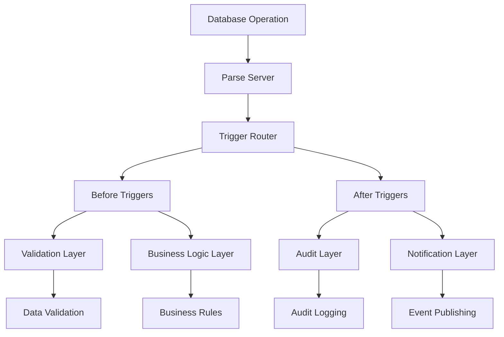

# Database Triggers - Standards and Conventions

This document defines the standards and conventions for creating database triggers within the Token Nexus Platform. Database triggers are automated functions that execute in response to database events, ensuring data integrity, enforcing business rules, and maintaining audit trails.

## Table of Contents

1. [Architecture Overview](#architecture-overview)
2. [Trigger Types and Categories](#trigger-types-and-categories)
3. [Implementation Standards](#implementation-standards)
4. [Data Integrity Patterns](#data-integrity-patterns)
5. [Audit and Logging](#audit-and-logging)
6. [Performance Considerations](#performance-considerations)
7. [Security and Permissions](#security-and-permissions)
8. [Error Handling](#error-handling)
9. [Testing Standards](#testing-standards)
10. [Deployment and Versioning](#deployment-and-versioning)
11. [Implementation Checklist](#implementation-checklist)
12. [Examples and Templates](#examples-and-templates)

## Architecture Overview

Database triggers operate within the Parse Server framework and provide automated data processing capabilities:



### Core Principles

1. **Data Integrity**: Ensure data consistency and validity
2. **Business Rule Enforcement**: Automatically enforce business logic
3. **Audit Trail**: Comprehensive logging of all data changes
4. **Performance Optimization**: Efficient execution without blocking operations
5. **Error Resilience**: Graceful handling of errors and edge cases
6. **Organization Isolation**: Respect multi-tenant data boundaries

## Trigger Types and Categories

### Trigger Types

```typescript
enum TriggerType {
  BEFORE_SAVE = 'beforeSave',
  AFTER_SAVE = 'afterSave',
  BEFORE_DELETE = 'beforeDelete',
  AFTER_DELETE = 'afterDelete',
  BEFORE_FIND = 'beforeFind',
  AFTER_FIND = 'afterFind'
}

enum TriggerCategory {
  VALIDATION = 'validation',
  BUSINESS_LOGIC = 'business-logic',
  AUDIT = 'audit',
  NOTIFICATION = 'notification',
  INTEGRATION = 'integration',
  SECURITY = 'security',
  ANALYTICS = 'analytics'
}
```

### Trigger Metadata Schema

```typescript
interface TriggerMetadata {
  name: string;
  className: string;
  type: TriggerType;
  category: TriggerCategory;
  description: string;
  version: string;
  priority: number; // Execution order (1-100)
  enabled: boolean;
  organizationScoped: boolean;
  conditions?: TriggerCondition[];
  dependencies?: string[];
  performance: PerformanceConfig;
  audit: AuditConfig;
  error: ErrorConfig;
}

interface TriggerCondition {
  field: string;
  operator: 'equals' | 'not_equals' | 'changed' | 'exists' | 'not_exists';
  value?: any;
}

interface PerformanceConfig {
  timeout: number; // milliseconds
  async: boolean;
  batchSize?: number;
  rateLimit?: {
    requests: number;
    window: number;
  };
}

interface AuditConfig {
  logLevel: 'none' | 'basic' | 'detailed' | 'comprehensive';
  includeData: boolean;
  includeChanges: boolean;
  retentionDays: number;
}

interface ErrorConfig {
  retryPolicy: {
    maxRetries: number;
    backoffMultiplier: number;
    maxBackoffTime: number;
  };
  fallbackAction: 'ignore' | 'log' | 'throw';
  notificationThreshold: number;
}
```

## Implementation Standards

### Base Trigger Class

All database triggers must extend the [`BaseTrigger`](../src/triggers/BaseTrigger.ts) class:

```typescript
// BaseTrigger.ts
import { TriggerMetadata, TriggerRequest, TriggerResponse } from '@/types/triggers';
import { AuditService } from '@/services/audit';
import { ValidationService } from '@/services/validation';
import { NotificationService } from '@/services/notification';
import { PerformanceService } from '@/services/performance';

export abstract class BaseTrigger {
  protected auditService: AuditService;
  protected validationService: ValidationService;
  protected notificationService: NotificationService;
  protected performanceService: PerformanceService;

  constructor(protected metadata: TriggerMetadata) {
    this.auditService = new AuditService();
    this.validationService = new ValidationService();
    this.notificationService = new NotificationService();
    this.performanceService = new PerformanceService();
  }

  // Main execution method
  async execute(request: TriggerRequest): Promise<TriggerResponse> {
    const startTime = Date.now();
    const auditContext = this.createAuditContext(request);

    try {
      // Check if trigger should execute
      if (!await this.shouldExecute(request)) {
        return { success: true, skipped: true };
      }

      // Validate organization context
      await this.validateOrganizationContext(request);

      // Execute trigger logic
      const result = await this.executeTriggerLogic(request);

      // Log successful execution
      if (this.metadata.audit.logLevel !== 'none') {
        await this.auditService.logTriggerExecution({
          ...auditContext,
          result: 'success',
          executionTime: Date.now() - startTime,
          data: this.metadata.audit.includeData ? result : undefined
        });
      }

      return {
        success: true,
        data: result,
        metadata: {
          executionTime: Date.now() - startTime,
          triggerName: this.metadata.name,
          version: this.metadata.version
        }
      };

    } catch (error) {
      // Handle error with retry logic
      const shouldRetry = await this.handleError(error, request, auditContext);
      
      if (shouldRetry) {
        return this.retryExecution(request, auditContext);
      }

      // Log error
      await this.auditService.logTriggerError({
        ...auditContext,
        result: 'error',
        error: error instanceof Error ? error.message : 'Unknown error',
        stackTrace: error instanceof Error ? error.stack : undefined,
        executionTime: Date.now() - startTime
      });

      // Handle error based on configuration
      return this.handleFinalError(error);
    }
  }

  // Abstract methods to be implemented by specific triggers
  protected abstract executeTriggerLogic(request: TriggerRequest): Promise<any>;
  protected abstract shouldExecute(request: TriggerRequest): Promise<boolean>;

  // Organization context validation
  protected async validateOrganizationContext(request: TriggerRequest): Promise<void> {
    if (!this.metadata.organizationScoped) {
      return;
    }

    const object = request.object;
    const organizationId = object.get('organizationId');

    if (!organizationId) {
      throw new Error('Organization context required for this trigger');
    }

    // Validate organization exists and is active
    const Organization = Parse.Object.extend('Organization');
    const orgQuery = new Parse.Query(Organization);
    const org = await orgQuery.get(organizationId, { useMasterKey: true });

    if (!org || org.get('status') !== 'active') {
      throw new Error('Invalid or inactive organization');
    }
  }

  // Condition evaluation
  protected async shouldExecute(request: TriggerRequest): Promise<boolean> {
    if (!this.metadata.conditions || this.metadata.conditions.length === 0) {
      return true;
    }

    for (const condition of this.metadata.conditions) {
      if (!await this.evaluateCondition(condition, request)) {
        return false;
      }
    }

    return true;
  }

  private async evaluateCondition(
    condition: TriggerCondition,
    request: TriggerRequest
  ): Promise<boolean> {
    const object = request.object;
    const original = request.original;
    const fieldValue = object.get(condition.field);

    switch (condition.operator) {
      case 'equals':
        return fieldValue === condition.value;
      
      case 'not_equals':
        return fieldValue !== condition.value;
      
      case 'changed':
        if (!original) return true; // New object, consider as changed
        return original.get(condition.field) !== fieldValue;
      
      case 'exists':
        return fieldValue !== undefined && fieldValue !== null;
      
      case 'not_exists':
        return fieldValue === undefined || fieldValue === null;
      
      default:
        return true;
    }
  }

  // Error handling
  protected async handleError(
    error: any,
    request: TriggerRequest,
    auditContext: any
  ): Promise<boolean> {
    const { retryPolicy } = this.metadata.error;
    const currentRetry = auditContext.retryCount || 0;

    if (currentRetry < retryPolicy.maxRetries) {
      // Calculate backoff time
      const backoffTime = Math.min(
        Math.pow(retryPolicy.backoffMultiplier, currentRetry) * 1000,
        retryPolicy.maxBackoffTime
      );

      // Wait before retry
      await this.delay(backoffTime);
      return true;
    }

    return false;
  }

  private async retryExecution(
    request: TriggerRequest,
    auditContext: any
  ): Promise<TriggerResponse> {
    auditContext.retryCount = (auditContext.retryCount || 0) + 1;
    return this.execute(request);
  }

  private handleFinalError(error: any): TriggerResponse {
    switch (this.metadata.error.fallbackAction) {
      case 'ignore':
        return { success: true, warning: 'Trigger failed but was ignored' };
      
      case 'log':
        console.error(`Trigger ${this.metadata.name} failed:`, error);
        return { success: true, warning: 'Trigger failed but was logged' };
      
      case 'throw':
      default:
        throw error;
    }
  }

  // Utility methods
  protected createAuditContext(request: TriggerRequest): any {
    return {
      triggerName: this.metadata.name,
      className: this.metadata.className,
      triggerType: this.metadata.type,
      objectId: request.object.id,
      userId: request.user?.id,
      timestamp: new Date(),
      organizationId: request.object.get('organizationId')
    };
  }

  protected delay(ms: number): Promise<void> {
    return new Promise(resolve => setTimeout(resolve, ms));
  }

  protected async notifyError(error: any, context: any): Promise<void> {
    if (this.metadata.error.notificationThreshold > 0) {
      await this.notificationService.sendErrorNotification({
        triggerName: this.metadata.name,
        error: error.message,
        context: context
      });
    }
  }
}
```

### Validation Trigger Example

```typescript
// UserValidationTrigger.ts
import { BaseTrigger } from './BaseTrigger';
import { TriggerRequest } from '@/types/triggers';

export class UserValidationTrigger extends BaseTrigger {
  constructor() {
    super({
      name: 'userValidation',
      className: '_User',
      type: TriggerType.BEFORE_SAVE,
      category: TriggerCategory.VALIDATION,
      description: 'Validates user data before saving',
      version: '1.0.0',
      priority: 10,
      enabled: true,
      organizationScoped: true,
      performance: {
        timeout: 5000,
        async: false
      },
      audit: {
        logLevel: 'basic',
        includeData: false,
        includeChanges: true,
        retentionDays: 90
      },
      error: {
        retryPolicy: {
          maxRetries: 3,
          backoffMultiplier: 2,
          maxBackoffTime: 10000
        },
        fallbackAction: 'throw',
        notificationThreshold: 5
      }
    });
  }

  protected async executeTriggerLogic(request: TriggerRequest): Promise<any> {
    const user = request.object;
    const isNew = !user.existed();

    // Validate required fields
    await this.validateRequiredFields(user, isNew);

    // Validate data formats
    await this.validateDataFormats(user);

    // Validate business rules
    await this.validateBusinessRules(user, isNew);

    // Set computed fields
    await this.setComputedFields(user, isNew);

    return {
      validated: true,
      fieldsProcessed: this.getProcessedFields(user)
    };
  }

  protected async shouldExecute(request: TriggerRequest): Promise<boolean> {
    // Always execute for user validation
    return true;
  }

  private async validateRequiredFields(user: Parse.User, isNew: boolean): Promise<void> {
    const requiredFields = ['email', 'firstName', 'lastName'];
    
    if (isNew) {
      requiredFields.push('organizationId');
    }

    for (const field of requiredFields) {
      const value = user.get(field);
      if (!value || (typeof value === 'string' && value.trim() === '')) {
        throw new Parse.Error(
          Parse.Error.VALIDATION_ERROR,
          `${field} is required`
        );
      }
    }
  }

  private async validateDataFormats(user: Parse.User): Promise<void> {
    // Validate email format
    const email = user.get('email');
    if (email && !this.isValidEmail(email)) {
      throw new Parse.Error(
        Parse.Error.VALIDATION_ERROR,
        'Invalid email format'
      );
    }

    // Validate phone format
    const phone = user.get('phone');
    if (phone && !this.isValidPhone(phone)) {
      throw new Parse.Error(
        Parse.Error.VALIDATION_ERROR,
        'Invalid phone format'
      );
    }

    // Validate username format
    const username = user.get('username');
    if (username && !this.isValidUsername(username)) {
      throw new Parse.Error(
        Parse.Error.VALIDATION_ERROR,
        'Username must be 3-30 characters and contain only letters, numbers, and underscores'
      );
    }
  }

  private async validateBusinessRules(user: Parse.User, isNew: boolean): Promise<void> {
    const email = user.get('email');
    const organizationId = user.get('organizationId');

    // Check email uniqueness within organization
    if (email && organizationId) {
      const query = new Parse.Query(Parse.User);
      query.equalTo('email', email.toLowerCase());
      query.equalTo('organizationId', organizationId);
      
      if (!isNew) {
        query.notEqualTo('objectId', user.id);
      }

      const existingUser = await query.first({ useMasterKey: true });
      if (existingUser) {
        throw new Parse.Error(
          Parse.Error.DUPLICATE_VALUE,
          'Email already exists in this organization'
        );
      }
    }

    // Validate organization membership limits
    if (isNew && organizationId) {
      await this.validateOrganizationLimits(organizationId);
    }

    // Validate role assignments
    const role = user.get('role');
    if (role) {
      await this.validateRoleAssignment(user, role, organizationId);
    }
  }

  private async setComputedFields(user: Parse.User, isNew: boolean): Promise<void> {
    // Normalize email
    const email = user.get('email');
    if (email) {
      user.set('email', email.toLowerCase().trim());
    }

    // Generate display name
    const firstName = user.get('firstName');
    const lastName = user.get('lastName');
    if (firstName && lastName) {
      user.set('displayName', `${firstName} ${lastName}`);
    }

    // Set default values for new users
    if (isNew) {
      user.set('status', user.get('status') || 'active');
      user.set('emailVerified', false);
      user.set('createdAt', new Date());
      
      // Generate username if not provided
      if (!user.get('username')) {
        const username = await this.generateUniqueUsername(email);
        user.set('username', username);
      }
    }

    // Update modification timestamp
    user.set('updatedAt', new Date());
  }

  // Validation helper methods
  private isValidEmail(email: string): boolean {
    const emailRegex = /^[^\s@]+@[^\s@]+\.[^\s@]+$/;
    return emailRegex.test(email);
  }

  private isValidPhone(phone: string): boolean {
    const phoneRegex = /^\+?[1-9]\d{1,14}$/;
    return phoneRegex.test(phone.replace(/[\s\-\(\)]/g, ''));
  }

  private isValidUsername(username: string): boolean {
    const usernameRegex = /^[a-zA-Z0-9_]{3,30}$/;
    return usernameRegex.test(username);
  }

  private async validateOrganizationLimits(organizationId: string): Promise<void> {
    // Get organization limits
    const Organization = Parse.Object.extend('Organization');
    const orgQuery = new Parse.Query(Organization);
    const org = await orgQuery.get(organizationId, { useMasterKey: true });
    
    const userLimit = org.get('userLimit') || 100;

    // Count current users
    const userQuery = new Parse.Query(Parse.User);
    userQuery.equalTo('organizationId', organizationId);
    userQuery.equalTo('status', 'active');
    
    const currentUserCount = await userQuery.count({ useMasterKey: true });

    if (currentUserCount >= userLimit) {
      throw new Parse.Error(
        Parse.Error.VALIDATION_ERROR,
        'Organization user limit exceeded'
      );
    }
  }

  private async validateRoleAssignment(
    user: Parse.User,
    role: string,
    organizationId: string
  ): Promise<void> {
    // Check if role exists in organization
    const Role = Parse.Object.extend('Role');
    const roleQuery = new Parse.Query(Role);
    roleQuery.equalTo('name', role);
    roleQuery.equalTo('organizationId', organizationId);

    const roleObject = await roleQuery.first({ useMasterKey: true });
    if (!roleObject) {
      throw new Parse.Error(
        Parse.Error.VALIDATION_ERROR,
        `Role '${role}' does not exist in this organization`
      );
    }

    // Check role assignment limits
    const maxUsers = roleObject.get('maxUsers');
    if (maxUsers && maxUsers > 0) {
      const currentAssignments = await this.countRoleAssignments(role, organizationId);
      if (currentAssignments >= maxUsers) {
        throw new Parse.Error(
          Parse.Error.VALIDATION_ERROR,
          `Maximum users for role '${role}' exceeded`
        );
      }
    }
  }

  private async generateUniqueUsername(email: string): Promise<string> {
    const baseUsername = email.split('@')[0].toLowerCase().replace(/[^a-z0-9]/g, '');
    let username = baseUsername;
    let counter = 1;

    while (await this.usernameExists(username)) {
      username = `${baseUsername}${counter}`;
      counter++;
    }

    return username;
  }

  private async usernameExists(username: string): Promise<boolean> {
    const query = new Parse.Query(Parse.User);
    query.equalTo('username', username);
    
    const count = await query.count({ useMasterKey: true });
    return count > 0;
  }

  private async countRoleAssignments(role: string, organizationId: string): Promise<number> {
    const query = new Parse.Query(Parse.User);
    query.equalTo('role', role);
    query.equalTo('organizationId', organizationId);
    query.equalTo('status', 'active');
    
    return query.count({ useMasterKey: true });
  }

  private getProcessedFields(user: Parse.User): string[] {
    const processedFields = [];
    
    if (user.get('email')) processedFields.push('email');
    if (user.get('displayName')) processedFields.push('displayName');
    if (user.get('username')) processedFields.push('username');
    if (user.get('status')) processedFields.push('status');
    
    return processedFields;
  }
}

// Register the trigger
Parse.Cloud.beforeSave(Parse.User, async (request) => {
  const trigger = new UserValidationTrigger();
  const result = await trigger.execute(request);
  
  if (!result.success) {
    throw new Parse.Error(Parse.Error.VALIDATION_ERROR, 'User validation failed');
  }
});
```

### Audit Trigger Example

```typescript
// AuditLogTrigger.ts
import { BaseTrigger } from './BaseTrigger';
import { TriggerRequest } from '@/types/triggers';

export class AuditLogTrigger extends BaseTrigger {
  constructor() {
    super({
      name: 'auditLog',
      className: '*', // Apply to all classes
      type: TriggerType.AFTER_SAVE,
      category: TriggerCategory.AUDIT,
      description: 'Creates audit logs for all data changes',
      version: '1.0.0',
      priority: 90, // Execute late
      enabled: true,
      organizationScoped: true,
      performance: {
        timeout: 10000,
        async: true // Don't block the main operation
      },
      audit: {
        logLevel: 'comprehensive',
        includeData: true,
        includeChanges: true,
        retentionDays: 2555 // 7 years
      },
      error: {
        retryPolicy: {
          maxRetries: 5,
          backoffMultiplier: 2,
          maxBackoffTime: 30000
        },
        fallbackAction: 'log', // Don't fail the main operation
        notificationThreshold: 10
      }
    });
  }

  protected async executeTriggerLogic(request: TriggerRequest): Promise<any> {
    const object = request.object;
    const original = request.original;
    const user = request.user;
    const isNew = !object.existed();

    // Create audit log entry
    const auditLog = await this.createAuditLog({
      object,
      original,
      user,
      isNew,
      operation: isNew ? 'create' : 'update'
    });

    // Create change log entries for modified fields
    if (!isNew && original) {
      await this.createChangeLogEntries(object, original, auditLog);
    }

    return {
      auditLogId: auditLog.id,
      changesLogged: !isNew ? this.getChangedFields(object, original).length : 0
    };
  }

  protected async shouldExecute(request: TriggerRequest): Promise<boolean> {
    const object = request.object;
    const className = object.className;

    // Skip audit logs themselves to prevent recursion
    if (className === 'AuditLog' || className === 'ChangeLog') {
      return false;
    }

    // Skip system classes that don't need auditing
    const skipClasses = ['_Session', '_Installation', '_PushStatus'];
    if (skipClasses.includes(className)) {
      return false;
    }

    return true;
  }

  private async createAuditLog(params: {
    object: Parse.Object;
    original?: Parse.Object;
    user?: Parse.User;
    isNew: boolean;
    operation: string;
  }): Promise<Parse.Object> {
    const { object, original, user, isNew, operation } = params;

    const AuditLog = Parse.Object.extend('AuditLog');
    const auditLog = new AuditLog();

    // Basic audit information
    auditLog.set('className', object.className);
    auditLog.set('objectId', object.id);
    auditLog.set('operation', operation);
    auditLog.set('timestamp', new Date());
    auditLog.set('organizationId', object.get('organizationId'));

    // User information
    if (user) {
      auditLog.set('userId', user.id);
      auditLog.set('userEmail', user.get('email'));
      auditLog.set('userName', user.get('displayName') || user.get('username'));
    }

    // Request context
    auditLog.set('ipAddress', this.getRequestIP());
    auditLog.set('userAgent', this.getRequestUserAgent());

    // Data snapshots
    if (this.metadata.audit.includeData) {
      auditLog.set('currentData', this.sanitizeObjectData(object));
      
      if (original && !isNew) {
        auditLog.set('previousData', this.sanitizeObjectData(original));
      }
    }

    // Change summary
    if (!isNew && original) {
      const changes = this.getChangedFields(object, original);
      auditLog.set('changedFields', changes);
      auditLog.set('changeCount', changes.length);
    }

    // Metadata
    auditLog.set('triggerVersion', this.metadata.version);
    auditLog.set('auditLevel', this.metadata.audit.logLevel);

    await auditLog.save(null, { useMasterKey: true });
    return auditLog;
  }

  private async createChangeLogEntries(
    object: Parse.Object,
    original: Parse.Object,
    auditLog: Parse.Object
  ): Promise<void> {
    const changedFields = this.getChangedFields(object, original);

    const ChangeLog = Parse.Object.extend('ChangeLog');
    const changeLogEntries = [];

    for (const fieldName of changedFields) {
      const changeLog = new ChangeLog();
      
      changeLog.set('auditLogId', auditLog.id);
      changeLog.set('className', object.className);
      changeLog.set('objectId', object.id);
      changeLog.set('fieldName', fieldName);
      changeLog.set('previousValue', this.sanitizeFieldValue(original.get(fieldName)));
      changeLog.set('currentValue', this.sanitizeFieldValue(object.get(fieldName)));
      changeLog.set('timestamp', new Date());
      changeLog.set('organizationId', object.get('organizationId'));

      // Determine change type
      const changeType = this.determineChangeType(
        original.get(fieldName),
        object.get(fieldName)
      );
      changeLog.set('changeType', changeType);

      changeLogEntries.push(changeLog);
    }

    // Batch save change log entries
    if (changeLogEntries.length > 0) {
      await Parse.Object.saveAll(changeLogEntries, { useMasterKey: true });
    }
  }

  private getChangedFields(object: Parse.Object, original: Parse.Object): string[] {
    const changedFields = [];
    const currentAttributes = object.attributes;
    const originalAttributes = original.attributes;

    // Check for modified fields
    for (const [key, value] of Object.entries(currentAttributes)) {
      if (key === 'updatedAt' || key === 'createdAt') {
        continue; // Skip timestamp fields
      }

      const originalValue = originalAttributes[key];
      if (!this.isEqual(value, originalValue)) {
        changedFields.push(key);
      }
    }

    // Check for removed fields
    for (const key of Object.keys(originalAttributes)) {
      if (!(key in currentAttributes) && key !== 'updatedAt' && key !== 'createdAt') {
        changedFields.push(key);
      }
    }

    return changedFields;
  }

  private isEqual(value1: any, value2: any): boolean {
    // Handle null/undefined
    if (value1 === value2) return true;
    if (value1 == null || value2 == null) return false;

    // Handle dates
    if (value1 instanceof Date && value2 instanceof Date) {
      return value1.getTime() === value2.getTime();
    }

    // Handle objects/arrays
    if (typeof value1 === 'object' && typeof value2 === 'object') {
      return JSON.stringify(value1) === JSON.stringify(value2);
    }

    return false;
  }

  private determineChangeType(oldValue: any, newValue: any): string {
    if (oldValue == null && newValue != null) return 'added';
    if (oldValue != null && newValue == null) return 'removed';
    return 'modified';
  }

  private sanitizeObjectData(object: Parse.Object): any {
    const data = { ...object.attributes };
    
    // Remove sensitive fields
    const sensitiveFields = ['password', 'sessionToken', 'authData'];
    for (const field of sensitiveFields) {
      if (data[field]) {
        data[field] = '[REDACTED]';
      }
    }

    return data;
  }

  private sanitizeFieldValue(value: any): any {
    // Handle sensitive data
    if (typeof value === 'string' && value.length > 1000) {
      return value.substring(0, 1000) + '... [TRUNCATED]';
    }

    return value;
  }

  private getRequestIP(): string {
    // Extract IP from request context
    // Implementation depends on Parse Server setup
    return 'unknown';
  }

  private getRequestUserAgent(): string {
    // Extract User-Agent from request context
    // Implementation depends on Parse Server setup
    return 'unknown';
  }
}

// Register the trigger for all classes
Parse.Cloud.afterSave('*', async (request) => {
  const trigger = new AuditLogTrigger();
  
  // Execute asynchronously to not block the main operation
  setImmediate(async () => {
    try {
      await trigger.execute(request);
    } catch (error) {
      console.error('Audit log trigger failed:', error);
    }
  });
});
```

## Data Integrity Patterns

### Referential Integrity

```typescript
// ReferentialIntegrityTrigger.ts
export class ReferentialIntegrityTrigger extends BaseTrigger {
  constructor(className: string, references: ReferenceConfig[]) {
    super({
      name: `referentialIntegrity_${className}`,
      className: className,
      type: TriggerType.BEFORE_SAVE,
      category: TriggerCategory.VALIDATION,
      description: `Ensures referential integrity for ${className}`,
      version: '1.0.0',
      priority: 5,
      enabled: true,
      organizationScoped: true