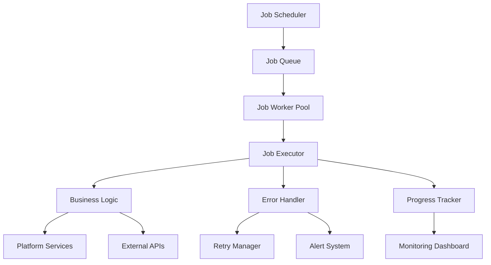

# Scheduled Jobs - Standards and Conventions

This document defines the standards and conventions for creating scheduled jobs within the Token Nexus Platform. Scheduled jobs are automated background tasks that execute at predetermined intervals to perform maintenance, data processing, notifications, and other recurring operations.

## Table of Contents

1. [Architecture Overview](#architecture-overview)
2. [Job Types and Categories](#job-types-and-categories)
3. [Implementation Standards](#implementation-standards)
4. [Scheduling Patterns](#scheduling-patterns)
5. [Error Handling and Retry Logic](#error-handling-and-retry-logic)
6. [Performance and Resource Management](#performance-and-resource-management)
7. [Monitoring and Alerting](#monitoring-and-alerting)
8. [Security and Permissions](#security-and-permissions)
9. [Data Processing Patterns](#data-processing-patterns)
10. [Testing Standards](#testing-standards)
11. [Implementation Checklist](#implementation-checklist)
12. [Examples and Templates](#examples-and-templates)

## Architecture Overview

Scheduled jobs operate within a distributed job processing system that ensures reliability and scalability:



### Core Principles

1. **Reliability**: Jobs must be fault-tolerant and recoverable
2. **Scalability**: Support for distributed execution and load balancing
3. **Observability**: Comprehensive monitoring and logging
4. **Resource Efficiency**: Optimal resource utilization and cleanup
5. **Organization Isolation**: Respect multi-tenant boundaries
6. **Security**: Secure execution with proper authentication

## Job Types and Categories

### Job Categories

```typescript
enum JobCategory {
  MAINTENANCE = 'maintenance',
  DATA_PROCESSING = 'data-processing',
  NOTIFICATION = 'notification',
  ANALYTICS = 'analytics',
  INTEGRATION = 'integration',
  CLEANUP = 'cleanup',
  BACKUP = 'backup',
  MONITORING = 'monitoring'
}

enum JobPriority {
  LOW = 1,
  NORMAL = 5,
  HIGH = 8,
  CRITICAL = 10
}

enum JobExecutionMode {
  SINGLE_INSTANCE = 'single-instance',
  MULTIPLE_INSTANCES = 'multiple-instances',
  ORGANIZATION_SCOPED = 'organization-scoped',
  DISTRIBUTED = 'distributed'
}
```

### Job Metadata Schema

```typescript
interface ScheduledJobMetadata {
  id: string;
  name: string;
  description: string;
  category: JobCategory;
  priority: JobPriority;
  executionMode: JobExecutionMode;
  version: string;
  enabled: boolean;
  schedule: ScheduleConfig;
  timeout: number; // milliseconds
  retryPolicy: RetryPolicy;
  resources: ResourceConfig;
  monitoring: MonitoringConfig;
  security: SecurityConfig;
  dependencies?: string[];
  tags: string[];
}

interface ScheduleConfig {
  type: 'cron' | 'interval' | 'once';
  expression: string; // Cron expression or interval
  timezone?: string;
  startDate?: Date;
  endDate?: Date;
  maxExecutions?: number;
}

interface RetryPolicy {
  maxRetries: number;
  backoffStrategy: 'fixed' | 'exponential' | 'linear';
  initialDelay: number; // milliseconds
  maxDelay: number; // milliseconds
  backoffMultiplier?: number;
}

interface ResourceConfig {
  maxMemory: number; // MB
  maxCpuTime: number; // milliseconds
  maxDiskSpace: number; // MB
  concurrencyLimit: number;
  queueLimit: number;
}

interface MonitoringConfig {
  alertOnFailure: boolean;
  alertOnTimeout: boolean;
  alertOnResourceExceeded: boolean;
  successThreshold: number; // percentage
  performanceThreshold: number; // milliseconds
  retentionDays: number;
}

interface SecurityConfig {
  requiresAuthentication: boolean;
  permissions: string[];
  organizationScoped: boolean;
  allowedEnvironments: string[];
}
```

## Implementation Standards

### Base Scheduled Job Class

All scheduled jobs must extend the [`BaseScheduledJob`](../src/jobs/BaseScheduledJob.ts) class:

```typescript
// BaseScheduledJob.ts
import { ScheduledJobMetadata, JobExecutionContext, JobResult } from '@/types/jobs';
import { JobMonitoringService } from '@/services/jobMonitoring';
import { JobSecurityService } from '@/services/jobSecurity';
import { JobResourceManager } from '@/services/jobResourceManager';
import { NotificationService } from '@/services/notification';

export abstract class BaseScheduledJob {
  protected monitoringService: JobMonitoringService;
  protected securityService: JobSecurityService;
  protected resourceManager: JobResourceManager;
  protected notificationService: NotificationService;
  protected abortController?: AbortController;

  constructor(protected metadata: ScheduledJobMetadata) {
    this.monitoringService = new JobMonitoringService();
    this.securityService = new JobSecurityService();
    this.resourceManager = new JobResourceManager();
    this.notificationService = new NotificationService();
  }

  // Main execution method
  async execute(context: JobExecutionContext): Promise<JobResult> {
    const startTime = Date.now();
    const executionId = this.generateExecutionId();

    try {
      // Initialize execution context
      await this.initializeExecution(context, executionId);

      // Validate security and permissions
      await this.validateSecurity(context);

      // Check resource availability
      await this.checkResourceAvailability();

      // Execute job logic
      const result = await this.executeJobLogic(context);

      // Record successful execution
      await this.recordSuccess(executionId, result, Date.now() - startTime);

      return {
        success: true,
        data: result,
        executionId: executionId,
        executionTime: Date.now() - startTime,
        metadata: {
          jobName: this.metadata.name,
          version: this.metadata.version,
          category: this.metadata.category
        }
      };

    } catch (error) {
      // Handle execution error
      const shouldRetry = await this.handleExecutionError(error, context, executionId);
      
      if (shouldRetry) {
        return this.scheduleRetry(context, executionId, error);
      }

      // Record failure
      await this.recordFailure(executionId, error, Date.now() - startTime);

      return {
        success: false,
        error: error instanceof Error ? error.message : 'Unknown error',
        executionId: executionId,
        executionTime: Date.now() - startTime,
        metadata: {
          jobName: this.metadata.name,
          version: this.metadata.version,
          category: this.metadata.category
        }
      };

    } finally {
      // Cleanup resources
      await this.cleanup(executionId);
    }
  }

  // Abstract methods to be implemented by specific jobs
  protected abstract executeJobLogic(context: JobExecutionContext): Promise<any>;
  protected abstract validateJobSpecificSecurity(context: JobExecutionContext): Promise<void>;

  // Optional methods that can be overridden
  protected async beforeExecution(context: JobExecutionContext): Promise<void> {
    // Override to add pre-execution logic
  }

  protected async afterExecution(context: JobExecutionContext, result: any): Promise<void> {
    // Override to add post-execution logic
  }

  protected async onExecutionError(error: any, context: JobExecutionContext): Promise<void> {
    // Override to add custom error handling
  }

  // Execution initialization
  private async initializeExecution(
    context: JobExecutionContext,
    executionId: string
  ): Promise<void> {
    // Set up abort controller for cancellation
    this.abortController = new AbortController();

    // Register execution with monitoring service
    await this.monitoringService.registerExecution({
      jobId: this.metadata.id,
      executionId: executionId,
      startTime: new Date(),
      context: context
    });

    // Reserve resources
    await this.resourceManager.reserveResources(this.metadata.resources);

    // Run pre-execution hooks
    await this.beforeExecution(context);
  }

  // Security validation
  private async validateSecurity(context: JobExecutionContext): Promise<void> {
    // Check if job is enabled
    if (!this.metadata.enabled) {
      throw new Error('Job is disabled');
    }

    // Validate environment
    const currentEnv = process.env.NODE_ENV || 'development';
    if (this.metadata.security.allowedEnvironments.length > 0 &&
        !this.metadata.security.allowedEnvironments.includes(currentEnv)) {
      throw new Error(`Job not allowed in environment: ${currentEnv}`);
    }

    // Validate authentication if required
    if (this.metadata.security.requiresAuthentication) {
      await this.securityService.validateAuthentication(context);
    }

    // Validate permissions
    for (const permission of this.metadata.security.permissions) {
      const hasPermission = await this.securityService.checkPermission(permission, context);
      if (!hasPermission) {
        throw new Error(`Missing permission: ${permission}`);
      }
    }

    // Job-specific security validation
    await this.validateJobSpecificSecurity(context);
  }

  // Resource availability check
  private async checkResourceAvailability(): Promise<void> {
    const available = await this.resourceManager.checkAvailability(this.metadata.resources);
    if (!available) {
      throw new Error('Insufficient resources available');
    }
  }

  // Error handling
  private async handleExecutionError(
    error: any,
    context: JobExecutionContext,
    executionId: string
  ): Promise<boolean> {
    // Log error
    await this.monitoringService.logError({
      jobId: this.metadata.id,
      executionId: executionId,
      error: error,
      context: context
    });

    // Custom error handling
    await this.onExecutionError(error, context);

    // Check if retry is possible
    const retryCount = context.retryCount || 0;
    if (retryCount < this.metadata.retryPolicy.maxRetries) {
      return true;
    }

    // Send failure notification if configured
    if (this.metadata.monitoring.alertOnFailure) {
      await this.notificationService.sendJobFailureAlert({
        jobName: this.metadata.name,
        error: error.message,
        executionId: executionId
      });
    }

    return false;
  }

  // Retry scheduling
  private async scheduleRetry(
    context: JobExecutionContext,
    executionId: string,
    error: any
  ): Promise<JobResult> {
    const retryCount = (context.retryCount || 0) + 1;
    const delay = this.calculateRetryDelay(retryCount);

    // Schedule retry
    setTimeout(async () => {
      const retryContext = {
        ...context,
        retryCount: retryCount,
        previousError: error
      };

      await this.execute(retryContext);
    }, delay);

    return {
      success: false,
      error: `Execution failed, retry scheduled in ${delay}ms`,
      executionId: executionId,
      retryScheduled: true,
      retryCount: retryCount,
      retryDelay: delay
    };
  }

  // Retry delay calculation
  private calculateRetryDelay(retryCount: number): number {
    const { backoffStrategy, initialDelay, maxDelay, backoffMultiplier } = this.metadata.retryPolicy;

    let delay = initialDelay;

    switch (backoffStrategy) {
      case 'exponential':
        delay = initialDelay * Math.pow(backoffMultiplier || 2, retryCount - 1);
        break;
      
      case 'linear':
        delay = initialDelay * retryCount;
        break;
      
      case 'fixed':
      default:
        delay = initialDelay;
        break;
    }

    return Math.min(delay, maxDelay);
  }

  // Success recording
  private async recordSuccess(
    executionId: string,
    result: any,
    executionTime: number
  ): Promise<void> {
    await this.monitoringService.recordSuccess({
      jobId: this.metadata.id,
      executionId: executionId,
      result: result,
      executionTime: executionTime,
      endTime: new Date()
    });

    // Run post-execution hooks
    await this.afterExecution({} as JobExecutionContext, result);
  }

  // Failure recording
  private async recordFailure(
    executionId: string,
    error: any,
    executionTime: number
  ): Promise<void> {
    await this.monitoringService.recordFailure({
      jobId: this.metadata.id,
      executionId: executionId,
      error: error,
      executionTime: executionTime,
      endTime: new Date()
    });
  }

  // Resource cleanup
  private async cleanup(executionId: string): Promise<void> {
    // Release resources
    await this.resourceManager.releaseResources(this.metadata.resources);

    // Cleanup abort controller
    if (this.abortController) {
      this.abortController.abort();
      this.abortController = undefined;
    }

    // Unregister execution
    await this.monitoringService.unregisterExecution(executionId);
  }

  // Utility methods
  protected generateExecutionId(): string {
    return `${this.metadata.id}_${Date.now()}_${Math.random().toString(36).substr(2, 9)}`;
  }

  protected async sleep(ms: number): Promise<void> {
    return new Promise(resolve => setTimeout(resolve, ms));
  }

  protected checkAborted(): void {
    if (this.abortController?.signal.aborted) {
      throw new Error('Job execution was aborted');
    }
  }

  protected async processInBatches<T, R>(
    items: T[],
    batchSize: number,
    processor: (batch: T[]) => Promise<R[]>
  ): Promise<R[]> {
    const results: R[] = [];
    
    for (let i = 0; i < items.length; i += batchSize) {
      this.checkAborted();
      
      const batch = items.slice(i, i + batchSize);
      const batchResults = await processor(batch);
      results.push(...batchResults);
      
      // Small delay between batches to prevent overwhelming the system
      if (i + batchSize < items.length) {
        await this.sleep(100);
      }
    }
    
    return results;
  }
}
```

### Data Processing Job Example

```typescript
// UserDataCleanupJob.ts
import { BaseScheduledJob } from './BaseScheduledJob';
import { JobExecutionContext } from '@/types/jobs';

export class UserDataCleanupJob extends BaseScheduledJob {
  constructor() {
    super({
      id: 'user-data-cleanup',
      name: 'User Data Cleanup',
      description: 'Cleans up inactive user data and expired sessions',
      category: JobCategory.CLEANUP,
      priority: JobPriority.NORMAL,
      executionMode: JobExecutionMode.SINGLE_INSTANCE,
      version: '1.0.0',
      enabled: true,
      schedule: {
        type: 'cron',
        expression: '0 2 * * *', // Daily at 2 AM
        timezone: 'UTC'
      },
      timeout: 30 * 60 * 1000, // 30 minutes
      retryPolicy: {
        maxRetries: 3,
        backoffStrategy: 'exponential',
        initialDelay: 5 * 60 * 1000, // 5 minutes
        maxDelay: 30 * 60 * 1000, // 30 minutes
        backoffMultiplier: 2
      },
      resources: {
        maxMemory: 512, // 512 MB
        maxCpuTime: 25 * 60 * 1000, // 25 minutes
        maxDiskSpace: 100, // 100 MB
        concurrencyLimit: 1,
        queueLimit: 5
      },
      monitoring: {
        alertOnFailure: true,
        alertOnTimeout: true,
        alertOnResourceExceeded: true,
        successThreshold: 95,
        performanceThreshold: 20 * 60 * 1000, // 20 minutes
        retentionDays: 30
      },
      security: {
        requiresAuthentication: false,
        permissions: ['system:cleanup', 'users:manage'],
        organizationScoped: false,
        allowedEnvironments: ['production', 'staging']
      },
      tags: ['cleanup', 'users', 'maintenance']
    });
  }

  protected async executeJobLogic(context: JobExecutionContext): Promise<any> {
    const results = {
      inactiveUsersProcessed: 0,
      expiredSessionsDeleted: 0,
      orphanedDataCleaned: 0,
      totalProcessingTime: 0
    };

    const startTime = Date.now();

    try {
      // Step 1: Clean up inactive users
      results.inactiveUsersProcessed = await this.cleanupInactiveUsers();
      this.checkAborted();

      // Step 2: Delete expired sessions
      results.expiredSessionsDeleted = await this.deleteExpiredSessions();
      this.checkAborted();

      // Step 3: Clean up orphaned data
      results.orphanedDataCleaned = await this.cleanupOrphanedData();
      this.checkAborted();

      results.totalProcessingTime = Date.now() - startTime;

      return results;

    } catch (error) {
      results.totalProcessingTime = Date.now() - startTime;
      throw error;
    }
  }

  protected async validateJobSpecificSecurity(context: JobExecutionContext): Promise<void> {
    // Additional security validation specific to this job
    const currentHour = new Date().getHours();
    
    // Only allow execution during maintenance hours (1-5 AM UTC)
    if (currentHour < 1 || currentHour > 5) {
      throw new Error('Job can only run during maintenance hours (1-5 AM UTC)');
    }
  }

  private async cleanupInactiveUsers(): Promise<number> {
    const inactiveThreshold = new Date();
    inactiveThreshold.setDate(inactiveThreshold.getDate() - 90); // 90 days ago

    // Find inactive users
    const userQuery = new Parse.Query(Parse.User);
    userQuery.lessThan('lastLoginAt', inactiveThreshold);
    userQuery.equalTo('status', 'inactive');
    userQuery.limit(1000); // Process in batches

    const inactiveUsers = await userQuery.find({ useMasterKey: true });

    let processedCount = 0;

    // Process users in batches
    await this.processInBatches(
      inactiveUsers,
      50, // Batch size
      async (userBatch) => {
        const results = [];
        
        for (const user of userBatch) {
          try {
            // Anonymize user data instead of deleting
            await this.anonymizeUser(user);
            processedCount++;
            results.push({ success: true, userId: user.id });
          } catch (error) {
            console.error(`Failed to process user ${user.id}:`, error);
            results.push({ success: false, userId: user.id, error: error.message });
          }
        }
        
        return results;
      }
    );

    return processedCount;
  }

  private async deleteExpiredSessions(): Promise<number> {
    const expirationThreshold = new Date();
    expirationThreshold.setDate(expirationThreshold.getDate() - 30); // 30 days ago

    // Find expired sessions
    const sessionQuery = new Parse.Query(Parse.Session);
    sessionQuery.lessThan('expiresAt', expirationThreshold);
    sessionQuery.limit(1000);

    const expiredSessions = await sessionQuery.find({ useMasterKey: true });

    let deletedCount = 0;

    // Delete sessions in batches
    await this.processInBatches(
      expiredSessions,
      100, // Batch size
      async (sessionBatch) => {
        try {
          await Parse.Object.destroyAll(sessionBatch, { useMasterKey: true });
          deletedCount += sessionBatch.length;
          return sessionBatch.map(s => ({ success: true, sessionId: s.id }));
        } catch (error) {
          console.error('Failed to delete session batch:', error);
          return sessionBatch.map(s => ({ success: false, sessionId: s.id, error: error.message }));
        }
      }
    );

    return deletedCount;
  }

  private async cleanupOrphanedData(): Promise<number> {
    let cleanedCount = 0;

    // Clean up orphaned user profiles
    cleanedCount += await this.cleanupOrphanedUserProfiles();
    this.checkAborted();

    // Clean up orphaned files
    cleanedCount += await this.cleanupOrphanedFiles();
    this.checkAborted();

    // Clean up orphaned audit logs
    cleanedCount += await this.cleanupOldAuditLogs();
    this.checkAborted();

    return cleanedCount;
  }

  private async cleanupOrphanedUserProfiles(): Promise<number> {
    // Find user profiles without corresponding users
    const profileQuery = new Parse.Query('UserProfile');
    profileQuery.doesNotExist('user');
    profileQuery.limit(500);

    const orphanedProfiles = await profileQuery.find({ useMasterKey: true });

    if (orphanedProfiles.length > 0) {
      await Parse.Object.destroyAll(orphanedProfiles, { useMasterKey: true });
    }

    return orphanedProfiles.length;
  }

  private async cleanupOrphanedFiles(): Promise<number> {
    // This would implement file cleanup logic
    // For now, return 0 as placeholder
    return 0;
  }

  private async cleanupOldAuditLogs(): Promise<number> {
    const retentionThreshold = new Date();
    retentionThreshold.setDate(retentionThreshold.getDate() - 2555); // 7 years

    const auditQuery = new Parse.Query('AuditLog');
    auditQuery.lessThan('createdAt', retentionThreshold);
    auditQuery.limit(1000);

    const oldAuditLogs = await auditQuery.find({ useMasterKey: true });

    let deletedCount = 0;

    // Delete in batches to avoid memory issues
    await this.processInBatches(
      oldAuditLogs,
      100,
      async (logBatch) => {
        try {
          await Parse.Object.destroyAll(logBatch, { useMasterKey: true });
          deletedCount += logBatch.length;
          return logBatch.map(l => ({ success: true, logId: l.id }));
        } catch (error) {
          console.error('Failed to delete audit log batch:', error);
          return logBatch.map(l => ({ success: false, logId: l.id, error: error.message }));
        }
      }
    );

    return deletedCount;
  }

  private async anonymizeUser(user: Parse.User): Promise<void> {
    // Anonymize user data while preserving referential integrity
    const anonymizedData = {
      email: `anonymized_${user.id}@example.com`,
      firstName: 'Anonymized',
      lastName: 'User',
      phone: null,
      avatar: null,
      status: 'anonymized',
      anonymizedAt: new Date()
    };

    // Update user with anonymized data
    for (const [key, value] of Object.entries(anonymizedData)) {
      user.set(key, value);
    }

    await user.save(null, { useMasterKey: true });
  }

  protected async beforeExecution(context: JobExecutionContext): Promise<void> {
    // Log job start
    console.log(`Starting user data cleanup job at ${new Date().toISOString()}`);
    
    // Check system load before starting
    const systemLoad = await this.checkSystemLoad();
    if (systemLoad > 0.8) {
      throw new Error('System load too high to run cleanup job');
    }
  }

  protected async afterExecution(context: JobExecutionContext, result: any): Promise<void> {
    // Log job completion
    console.log(`User data cleanup job completed:`, result);
    
    // Send summary notification
    await this.notificationService.sendJobCompletionSummary({
      jobName: this.metadata.name,
      results: result,
      executionTime: result.totalProcessingTime
    });
  }

  protected async onExecutionError(error: any, context: JobExecutionContext): Promise<void> {
    // Log detailed error information
    console.error(`User data cleanup job failed:`, error);
    
    // Perform any necessary rollback operations
    await this.performErrorCleanup();
  }

  private async checkSystemLoad(): Promise<number> {
    // Implementation would check actual system metrics
    // For now, return a mock value
    return Math.random() * 0.5; // Random load between 0-50%
  }

  private async performErrorCleanup(): Promise<void> {
    // Implement any necessary cleanup operations after an error
    console.log('Performing error cleanup...');
  }
}

// Register the job
const userCleanupJob = new UserDataCleanupJob();

// Schedule the job using Parse Server's job scheduling
Parse.Cloud.job('userDataCleanup', async (request) => {
  const context: JobExecutionContext = {
    jobId: 'user-data-cleanup',
    scheduledTime: new Date(),
    parameters: request.params || {}
  };

  return userCleanupJob.execute(context);
});
```

### Notification Job Example

```typescript
// EmailDigestJob.ts
import { BaseScheduledJob } from './BaseScheduledJob';
import { JobExecutionContext } from '@/types/jobs';
import { EmailService } from '@/services/email';

export class EmailDigestJob extends BaseScheduledJob {
  private emailService: EmailService;

  constructor() {
    super({
      id: 'email-digest',
      name: 'Email Digest',
      description: 'Sends daily digest emails to users',
      category: JobCategory.NOTIFICATION,
      priority: JobPriority.NORMAL,
      executionMode: JobExecutionMode.ORGANIZATION_SCOPED,
      version: '1.0.0',
      enabled: true,
      schedule: {
        type: 'cron',
        expression: '0 8 * * 1-5', // Weekdays at 8 AM
        timezone: 'UTC'
      },
      timeout: 60 * 60 * 1000, // 1 hour
      retryPolicy: {
        maxRetries: 2,
        backoffStrategy: 'fixed',
        initialDelay: 30 * 60 * 1000, // 30 minutes
        maxDelay: 30 * 60 * 1000
      },
      resources: {
        maxMemory: 256,
        maxCpuTime: 50 * 60 * 1000,
        maxDiskSpace: 50,
        concurrencyLimit: 5,
        queueLimit: 20
      },
      monitoring: {
        alertOnFailure: true,
        alertOnTimeout: true,
        alertOnResourceExceeded: false,
        successThreshold: 90,
        performanceThreshold: 45 * 60 * 1000,
        retentionDays: 14
      },
      security: {
        requiresAuthentication: false,
        permissions: ['notifications:send', 'users:read'],
        organizationScoped: true,
        allowedEnvironments: ['production', 'staging']
      },
      tags: ['email', 'digest', 'notifications']
    });

    this.emailService = new EmailService();
  }

  protected async executeJobLogic(context: JobExecutionContext): Promise<any> {
    const results = {
      organizationsProcessed: 0,
      emailsSent: 0,
      emailsFailed: 0,
      totalUsers: 0,
      processingTime: 0
    };

    const startTime = Date.now();

    try {
      // Get all active organizations
      const organizations = await this.getActiveOrganizations();
      results.organizationsProcessed = organizations.length;

      // Process each organization
      for (const org of organizations) {
        this.checkAborted();
        
        const orgResults = await this.processOrganization(org);
        results.emailsSent += orgResults.emailsSent;
        results.emailsFailed += orgResults.emailsFailed;
        results.totalUsers += orgResults.totalUsers;
      }

      results.processingTime = Date.now() - startTime;
      return results;

    } catch (error) {
      results.processingTime = Date.now() - startTime;
      throw error;
    }
  }

  protected async validateJobSpecificSecurity(context: JobExecutionContext): Promise<void> {
    // Check if email service is available
    const emailServiceStatus = await this.emailService.checkStatus();
    if (!emailServiceStatus.available) {
      throw new Error('Email service is not available');
    }

    // Check rate limits
    const rateLimitStatus = await this.emailService.checkRateLimit();
    if (rateLimitStatus.exceeded) {
      throw new Error('Email rate limit exceeded');
    }
  }

  private async getActiveOrganizations(): Promise<Parse.Object[]> {
    const orgQuery = new Parse.Query('Organization');
    orgQuery.equalTo('status', 'active');
    orgQuery.equalTo('emailDigestEnabled', true);
    orgQuery.limit(1000);

    return orgQuery.find({ useMasterKey: true });
  }

  private async processOrganization(organization: Parse.Object): Promise<{
    emailsSent: number;
    emailsFailed: number;
    totalUsers: number;
  }> {
    const orgId = organization.id;
    const results = { emailsSent: 0, emailsFailed: 0, totalUsers: 0 };

    // Get users who want digest emails
    const users = await this.getDigestUsers(orgId);
    results.totalUsers = users.length;

    if (users.length === 0) {
      return results;
    }

    // Generate digest content for the organization
    const digestContent = await this.generateDigestContent(organization);

    // Send emails in batches
    await this.processInBatches(
      users,
      10, // Batch size for email sending
      async (userBatch) => {
        const batchResults = [];
        
        for (const user of userBatch) {
          try {
            await this.sendDigestEmail(user, digestContent, organization);
            results.emailsSent++;
            batchResults.push({ success: true, userId: user.id });
          } catch (error) {
            results.emailsFailed++;
            console.error