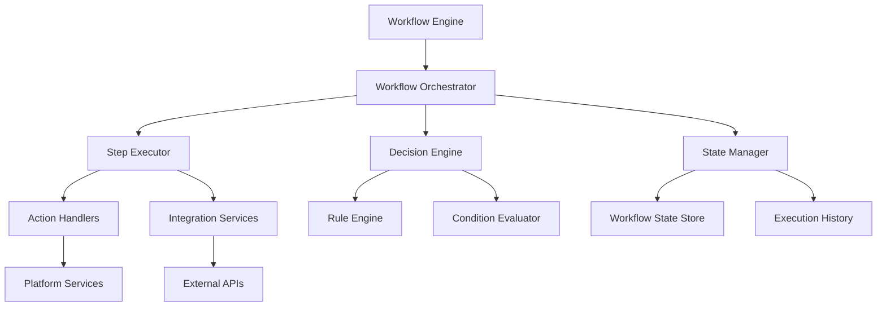

# Workflows - Standards and Conventions

This document defines the standards and conventions for creating workflows within the Token Nexus Platform. Workflows are automated business processes that orchestrate multiple steps, decisions, and integrations to accomplish complex organizational tasks.

## Table of Contents

1. [Architecture Overview](#architecture-overview)
2. [Workflow Types and Categories](#workflow-types-and-categories)
3. [Implementation Standards](#implementation-standards)
4. [Step Definition Patterns](#step-definition-patterns)
5. [Decision Logic and Branching](#decision-logic-and-branching)
6. [Error Handling and Recovery](#error-handling-and-recovery)
7. [State Management](#state-management)
8. [Integration Patterns](#integration-patterns)
9. [Monitoring and Analytics](#monitoring-and-analytics)
10. [Security and Permissions](#security-and-permissions)
11. [Testing Standards](#testing-standards)
12. [Implementation Checklist](#implementation-checklist)
13. [Examples and Templates](#examples-and-templates)

## Architecture Overview

Workflows operate within a distributed orchestration engine that manages state, execution, and coordination:



### Core Principles

1. **Reliability**: Workflows must be fault-tolerant and recoverable
2. **Scalability**: Support for concurrent execution and load distribution
3. **Observability**: Comprehensive tracking and monitoring
4. **Flexibility**: Dynamic workflow modification and branching
5. **Security**: Secure execution with proper authorization
6. **Organization Isolation**: Respect multi-tenant boundaries

## Workflow Types and Categories

### Workflow Categories

```typescript
enum WorkflowCategory {
  APPROVAL = 'approval',
  DATA_PROCESSING = 'data-processing',
  INTEGRATION = 'integration',
  NOTIFICATION = 'notification',
  ONBOARDING = 'onboarding',
  MAINTENANCE = 'maintenance',
  COMPLIANCE = 'compliance',
  CUSTOM = 'custom'
}

enum WorkflowTrigger {
  MANUAL = 'manual',
  SCHEDULED = 'scheduled',
  EVENT_DRIVEN = 'event-driven',
  API_CALL = 'api-call',
  WEBHOOK = 'webhook'
}

enum WorkflowExecutionMode {
  SYNCHRONOUS = 'synchronous',
  ASYNCHRONOUS = 'asynchronous',
  HYBRID = 'hybrid'
}
```

### Workflow Metadata Schema

```typescript
interface WorkflowMetadata {
  id: string;
  name: string;
  description: string;
  category: WorkflowCategory;
  version: string;
  enabled: boolean;
  trigger: WorkflowTriggerConfig;
  executionMode: WorkflowExecutionMode;
  timeout: number; // milliseconds
  maxRetries: number;
  permissions: string[];
  organizationScoped: boolean;
  steps: WorkflowStep[];
  variables: WorkflowVariable[];
  conditions: WorkflowCondition[];
  integrations: IntegrationConfig[];
  monitoring: WorkflowMonitoringConfig;
  tags: string[];
}

interface WorkflowTriggerConfig {
  type: WorkflowTrigger;
  configuration: {
    schedule?: string; // Cron expression
    events?: string[]; // Event names
    webhook?: WebhookConfig;
    manual?: ManualTriggerConfig;
  };
}

interface WorkflowStep {
  id: string;
  name: string;
  type: StepType;
  action: string;
  parameters: Record<string, any>;
  conditions?: StepCondition[];
  retryPolicy?: StepRetryPolicy;
  timeout?: number;
  nextSteps: string[];
  errorHandling?: ErrorHandlingConfig;
}

interface WorkflowVariable {
  name: string;
  type: 'string' | 'number' | 'boolean' | 'object' | 'array';
  defaultValue?: any;
  required: boolean;
  description: string;
}

interface WorkflowCondition {
  id: string;
  name: string;
  expression: string;
  description: string;
}
```

## Implementation Standards

### Base Workflow Class

All workflows must extend the [`BaseWorkflow`](../src/workflows/BaseWorkflow.ts) class:

```typescript
// BaseWorkflow.ts
import { WorkflowMetadata, WorkflowExecutionContext, WorkflowResult } from '@/types/workflows';
import { WorkflowStateManager } from '@/services/workflowState';
import { WorkflowSecurityService } from '@/services/workflowSecurity';
import { WorkflowMonitoringService } from '@/services/workflowMonitoring';
import { WorkflowIntegrationService } from '@/services/workflowIntegration';

export abstract class BaseWorkflow {
  protected stateManager: WorkflowStateManager;
  protected securityService: WorkflowSecurityService;
  protected monitoringService: WorkflowMonitoringService;
  protected integrationService: WorkflowIntegrationService;

  constructor(protected metadata: WorkflowMetadata) {
    this.stateManager = new WorkflowStateManager();
    this.securityService = new WorkflowSecurityService();
    this.monitoringService = new WorkflowMonitoringService();
    this.integrationService = new WorkflowIntegrationService();
  }

  // Main execution method
  async execute(context: WorkflowExecutionContext): Promise<WorkflowResult> {
    const executionId = this.generateExecutionId();
    const startTime = Date.now();

    try {
      // Initialize workflow execution
      await this.initializeExecution(context, executionId);

      // Validate security and permissions
      await this.validateSecurity(context);

      // Execute workflow steps
      const result = await this.executeWorkflowSteps(context, executionId);

      // Record successful completion
      await this.recordCompletion(executionId, result, Date.now() - startTime);

      return {
        success: true,
        executionId: executionId,
        result: result,
        executionTime: Date.now() - startTime,
        metadata: {
          workflowId: this.metadata.id,
          version: this.metadata.version,
          category: this.metadata.category
        }
      };

    } catch (error) {
      // Handle workflow error
      await this.handleWorkflowError(error, context, executionId);

      return {
        success: false,
        executionId: executionId,
        error: error instanceof Error ? error.message : 'Unknown error',
        executionTime: Date.now() - startTime,
        metadata: {
          workflowId: this.metadata.id,
          version: this.metadata.version,
          category: this.metadata.category
        }
      };
    }
  }

  // Abstract methods to be implemented by specific workflows
  protected abstract defineWorkflowSteps(): WorkflowStep[];
  protected abstract validateWorkflowSpecificSecurity(context: WorkflowExecutionContext): Promise<void>;

  // Optional methods that can be overridden
  protected async beforeWorkflowExecution(context: WorkflowExecutionContext): Promise<void> {
    // Override to add pre-execution logic
  }

  protected async afterWorkflowExecution(context: WorkflowExecutionContext, result: any): Promise<void> {
    // Override to add post-execution logic
  }

  protected async onWorkflowError(error: any, context: WorkflowExecutionContext): Promise<void> {
    // Override to add custom error handling
  }

  // Workflow execution initialization
  private async initializeExecution(
    context: WorkflowExecutionContext,
    executionId: string
  ): Promise<void> {
    // Create workflow state
    await this.stateManager.createWorkflowState({
      workflowId: this.metadata.id,
      executionId: executionId,
      context: context,
      status: 'running',
      startTime: new Date(),
      currentStep: null,
      variables: this.initializeVariables(context)
    });

    // Register execution with monitoring
    await this.monitoringService.registerExecution({
      workflowId: this.metadata.id,
      executionId: executionId,
      context: context
    });

    // Run pre-execution hooks
    await this.beforeWorkflowExecution(context);
  }

  // Security validation
  private async validateSecurity(context: WorkflowExecutionContext): Promise<void> {
    // Check if workflow is enabled
    if (!this.metadata.enabled) {
      throw new Error('Workflow is disabled');
    }

    // Validate permissions
    for (const permission of this.metadata.permissions) {
      const hasPermission = await this.securityService.checkPermission(permission, context);
      if (!hasPermission) {
        throw new Error(`Missing permission: ${permission}`);
      }
    }

    // Validate organization context
    if (this.metadata.organizationScoped) {
      await this.securityService.validateOrganizationContext(context);
    }

    // Workflow-specific security validation
    await this.validateWorkflowSpecificSecurity(context);
  }

  // Step execution orchestration
  private async executeWorkflowSteps(
    context: WorkflowExecutionContext,
    executionId: string
  ): Promise<any> {
    const steps = this.defineWorkflowSteps();
    let currentStepIds = this.findInitialSteps(steps);
    let executionResult = {};

    while (currentStepIds.length > 0) {
      const nextStepIds: string[] = [];

      // Execute current steps (potentially in parallel)
      const stepPromises = currentStepIds.map(async (stepId) => {
        const step = steps.find(s => s.id === stepId);
        if (!step) {
          throw new Error(`Step not found: ${stepId}`);
        }

        const stepResult = await this.executeStep(step, context, executionId);
        
        // Determine next steps based on result
        const nextSteps = await this.determineNextSteps(step, stepResult, context);
        nextStepIds.push(...nextSteps);

        return { stepId, result: stepResult };
      });

      const stepResults = await Promise.all(stepPromises);
      
      // Update execution result
      for (const { stepId, result } of stepResults) {
        executionResult[stepId] = result;
      }

      // Remove duplicates and prepare for next iteration
      currentStepIds = [...new Set(nextStepIds)];
    }

    return executionResult;
  }

  // Individual step execution
  private async executeStep(
    step: WorkflowStep,
    context: WorkflowExecutionContext,
    executionId: string
  ): Promise<any> {
    const stepStartTime = Date.now();

    try {
      // Update workflow state
      await this.stateManager.updateCurrentStep(executionId, step.id);

      // Check step conditions
      if (step.conditions && !await this.evaluateStepConditions(step.conditions, context)) {
        return { skipped: true, reason: 'Conditions not met' };
      }

      // Execute step action
      const stepResult = await this.executeStepAction(step, context, executionId);

      // Record step completion
      await this.monitoringService.recordStepCompletion({
        workflowId: this.metadata.id,
        executionId: executionId,
        stepId: step.id,
        result: stepResult,
        executionTime: Date.now() - stepStartTime
      });

      return stepResult;

    } catch (error) {
      // Handle step error
      const shouldRetry = await this.handleStepError(error, step, context, executionId);
      
      if (shouldRetry) {
        return this.retryStep(step, context, executionId);
      }

      throw error;
    }
  }

  // Step action execution
  private async executeStepAction(
    step: WorkflowStep,
    context: WorkflowExecutionContext,
    executionId: string
  ): Promise<any> {
    const actionHandler = this.getActionHandler(step.type);
    
    if (!actionHandler) {
      throw new Error(`No action handler found for step type: ${step.type}`);
    }

    // Prepare step parameters with variable substitution
    const parameters = await this.substituteVariables(step.parameters, context, executionId);

    // Execute the action
    return actionHandler.execute(step.action, parameters, context);
  }

  // Action handler registry
  private getActionHandler(stepType: StepType): ActionHandler | null {
    const handlers = {
      [StepType.API_CALL]: new ApiCallActionHandler(),
      [StepType.EMAIL]: new EmailActionHandler(),
      [StepType.DATABASE]: new DatabaseActionHandler(),
      [StepType.APPROVAL]: new ApprovalActionHandler(),
      [StepType.CONDITION]: new ConditionActionHandler(),
      [StepType.DELAY]: new DelayActionHandler(),
      [StepType.INTEGRATION]: new IntegrationActionHandler(),
      [StepType.CUSTOM]: new CustomActionHandler()
    };

    return handlers[stepType] || null;
  }

  // Variable management
  private initializeVariables(context: WorkflowExecutionContext): Record<string, any> {
    const variables: Record<string, any> = {};

    for (const variable of this.metadata.variables) {
      if (context.input && context.input[variable.name] !== undefined) {
        variables[variable.name] = context.input[variable.name];
      } else if (variable.defaultValue !== undefined) {
        variables[variable.name] = variable.defaultValue;
      } else if (variable.required) {
        throw new Error(`Required variable not provided: ${variable.name}`);
      }
    }

    return variables;
  }

  private async substituteVariables(
    parameters: Record<string, any>,
    context: WorkflowExecutionContext,
    executionId: string
  ): Promise<Record<string, any>> {
    const workflowState = await this.stateManager.getWorkflowState(executionId);
    const variables = workflowState.variables;

    const substituted = { ...parameters };

    for (const [key, value] of Object.entries(substituted)) {
      if (typeof value === 'string' && value.includes('{{')) {
        substituted[key] = this.replaceVariablePlaceholders(value, variables, context);
      }
    }

    return substituted;
  }

  private replaceVariablePlaceholders(
    template: string,
    variables: Record<string, any>,
    context: WorkflowExecutionContext
  ): string {
    return template.replace(/\{\{([^}]+)\}\}/g, (match, variableName) => {
      const trimmedName = variableName.trim();
      
      // Check workflow variables first
      if (variables[trimmedName] !== undefined) {
        return String(variables[trimmedName]);
      }
      
      // Check context variables
      if (context.input && context.input[trimmedName] !== undefined) {
        return String(context.input[trimmedName]);
      }
      
      // Return original placeholder if variable not found
      return match;
    });
  }

  // Condition evaluation
  private async evaluateStepConditions(
    conditions: StepCondition[],
    context: WorkflowExecutionContext
  ): Promise<boolean> {
    for (const condition of conditions) {
      const result = await this.evaluateCondition(condition, context);
      if (!result) {
        return false;
      }
    }
    return true;
  }

  private async evaluateCondition(
    condition: StepCondition,
    context: WorkflowExecutionContext
  ): Promise<boolean> {
    // Simple condition evaluation - can be extended with a proper expression engine
    const { field, operator, value } = condition;
    const fieldValue = this.getFieldValue(field, context);

    switch (operator) {
      case 'equals':
        return fieldValue === value;
      case 'not_equals':
        return fieldValue !== value;
      case 'greater_than':
        return Number(fieldValue) > Number(value);
      case 'less_than':
        return Number(fieldValue) < Number(value);
      case 'contains':
        return String(fieldValue).includes(String(value));
      case 'exists':
        return fieldValue !== undefined && fieldValue !== null;
      default:
        return true;
    }
  }

  private getFieldValue(field: string, context: WorkflowExecutionContext): any {
    const parts = field.split('.');
    let value = context.input;

    for (const part of parts) {
      if (value && typeof value === 'object') {
        value = value[part];
      } else {
        return undefined;
      }
    }

    return value;
  }

  // Next step determination
  private async determineNextSteps(
    currentStep: WorkflowStep,
    stepResult: any,
    context: WorkflowExecutionContext
  ): Promise<string[]> {
    // If step was skipped, don't proceed to next steps
    if (stepResult.skipped) {
      return [];
    }

    // If step failed and has error handling, follow error path
    if (stepResult.error && currentStep.errorHandling) {
      return currentStep.errorHandling.nextSteps || [];
    }

    // Return configured next steps
    return currentStep.nextSteps || [];
  }

  private findInitialSteps(steps: WorkflowStep[]): string[] {
    // Find steps that are not referenced as next steps by any other step
    const referencedSteps = new Set<string>();
    
    for (const step of steps) {
      for (const nextStepId of step.nextSteps) {
        referencedSteps.add(nextStepId);
      }
    }

    return steps
      .filter(step => !referencedSteps.has(step.id))
      .map(step => step.id);
  }

  // Error handling
  private async handleStepError(
    error: any,
    step: WorkflowStep,
    context: WorkflowExecutionContext,
    executionId: string
  ): Promise<boolean> {
    // Log step error
    await this.monitoringService.recordStepError({
      workflowId: this.metadata.id,
      executionId: executionId,
      stepId: step.id,
      error: error
    });

    // Check retry policy
    if (step.retryPolicy) {
      const retryCount = await this.stateManager.getStepRetryCount(executionId, step.id);
      if (retryCount < step.retryPolicy.maxRetries) {
        return true;
      }
    }

    return false;
  }

  private async retryStep(
    step: WorkflowStep,
    context: WorkflowExecutionContext,
    executionId: string
  ): Promise<any> {
    // Increment retry count
    await this.stateManager.incrementStepRetryCount(executionId, step.id);

    // Calculate delay
    const retryCount = await this.stateManager.getStepRetryCount(executionId, step.id);
    const delay = this.calculateRetryDelay(step.retryPolicy!, retryCount);

    // Wait before retry
    await this.sleep(delay);

    // Retry step execution
    return this.executeStep(step, context, executionId);
  }

  private calculateRetryDelay(retryPolicy: StepRetryPolicy, retryCount: number): number {
    const { strategy, initialDelay, maxDelay, multiplier } = retryPolicy;

    let delay = initialDelay;

    switch (strategy) {
      case 'exponential':
        delay = initialDelay * Math.pow(multiplier || 2, retryCount - 1);
        break;
      case 'linear':
        delay = initialDelay * retryCount;
        break;
      case 'fixed':
      default:
        delay = initialDelay;
        break;
    }

    return Math.min(delay, maxDelay);
  }

  // Workflow completion
  private async recordCompletion(
    executionId: string,
    result: any,
    executionTime: number
  ): Promise<void> {
    // Update workflow state
    await this.stateManager.updateWorkflowState(executionId, {
      status: 'completed',
      endTime: new Date(),
      result: result,
      executionTime: executionTime
    });

    // Record completion in monitoring
    await this.monitoringService.recordWorkflowCompletion({
      workflowId: this.metadata.id,
      executionId: executionId,
      result: result,
      executionTime: executionTime
    });

    // Run post-execution hooks
    await this.afterWorkflowExecution({} as WorkflowExecutionContext, result);
  }

  // Workflow error handling
  private async handleWorkflowError(
    error: any,
    context: WorkflowExecutionContext,
    executionId: string
  ): Promise<void> {
    // Update workflow state
    await this.stateManager.updateWorkflowState(executionId, {
      status: 'failed',
      endTime: new Date(),
      error: error.message
    });

    // Record error in monitoring
    await this.monitoringService.recordWorkflowError({
      workflowId: this.metadata.id,
      executionId: executionId,
      error: error
    });

    // Custom error handling
    await this.onWorkflowError(error, context);
  }

  // Utility methods
  protected generateExecutionId(): string {
    return `${this.metadata.id}_${Date.now()}_${Math.random().toString(36).substr(2, 9)}`;
  }

  protected async sleep(ms: number): Promise<void> {
    return new Promise(resolve => setTimeout(resolve, ms));
  }
}
```

### User Onboarding Workflow Example

```typescript
// UserOnboardingWorkflow.ts
import { BaseWorkflow } from './BaseWorkflow';
import { WorkflowExecutionContext, WorkflowStep, StepType } from '@/types/workflows';

export class UserOnboardingWorkflow extends BaseWorkflow {
  constructor() {
    super({
      id: 'user-onboarding',
      name: 'User Onboarding',
      description: 'Automated workflow for onboarding new users',
      category: WorkflowCategory.ONBOARDING,
      version: '1.0.0',
      enabled: true,
      trigger: {
        type: WorkflowTrigger.EVENT_DRIVEN,
        configuration: {
          events: ['user.created', 'user.invited']
        }
      },
      executionMode: WorkflowExecutionMode.ASYNCHRONOUS,
      timeout: 24 * 60 * 60 * 1000, // 24 hours
      maxRetries: 3,
      permissions: ['users:manage', 'notifications:send', 'workflows:execute'],
      organizationScoped: true,
      steps: [], // Defined in defineWorkflowSteps()
      variables: [
        {
          name: 'userId',
          type: 'string',
          required: true,
          description: 'ID of the user being onboarded'
        },
        {
          name: 'organizationId',
          type: 'string',
          required: true,
          description: 'ID of the organization'
        },
        {
          name: 'invitedBy',
          type: 'string',
          required: false,
          description: 'ID of the user who sent the invitation'
        },
        {
          name: 'skipWelcomeEmail',
          type: 'boolean',
          defaultValue: false,
          required: false,
          description: 'Whether to skip sending welcome email'
        }
      ],
      conditions: [],
      integrations: [
        {
          id: 'email-service',
          type: 'email',
          configuration: {
            provider: 'sendgrid',
            templates: ['welcome', 'setup-reminder', 'completion']
          }
        },
        {
          id: 'slack-integration',
          type: 'slack',
          configuration: {
            webhook: true,
            channels: ['#new-users']
          }
        }
      ],
      monitoring: {
        alertOnFailure: true,
        alertOnTimeout: true,
        successThreshold: 95,
        retentionDays: 90
      },
      tags: ['onboarding', 'users', 'automation']
    });
  }

  protected defineWorkflowSteps(): WorkflowStep[] {
    return [
      {
        id: 'validate-user',
        name: 'Validate User Data',
        type: StepType.CUSTOM,
        action: 'validateUserData',
        parameters: {
          userId: '{{userId}}',
          organizationId: '{{organizationId}}'
        },
        nextSteps: ['send-welcome-email'],
        timeout: 30000,
        retryPolicy: {
          maxRetries: 2,
          strategy: 'fixed',
          initialDelay: 5000,
          maxDelay: 10000
        }
      },
      {
        id: 'send-welcome-email',
        name: 'Send Welcome Email',
        type: StepType.EMAIL,
        action: 'sendWelcomeEmail',
        parameters: {
          userId: '{{userId}}',
          template: 'welcome',
          skipEmail: '{{skipWelcomeEmail}}'
        },
        conditions: [
          {
            field: 'skipWelcomeEmail',
            operator: 'not_equals',
            value: true
          }
        ],
        nextSteps: ['create-user-profile', 'assign-default-role'],
        timeout: 60000,
        retryPolicy: {
          maxRetries: 3,
          strategy: 'exponential',
          initialDelay: 10000,
          maxDelay: 60000,
          multiplier: 2
        }
      },
      {
        id: 'create-user-profile',
        name: 'Create User Profile',
        type: StepType.DATABASE,
        action: 'createUserProfile',
        parameters: {
          userId: '{{userId}}',
          organizationId: '{{organizationId}}',
          profileData: {
            status: 'pending_setup',
            onboardingStarted: true,
            onboardingStep: 1
          }
        },
        nextSteps: ['setup-workspace'],
        timeout: 30000
      },
      {
        id: 'assign-default-role',
        name: 'Assign Default Role',
        type: StepType.CUSTOM,
        action: 'assignDefaultRole',
        parameters: {
          userId: '{{userId}}',
          organizationId: '{{organizationId}}',
          role: 'member'
        },
        nextSteps: ['notify-team'],
        timeout: 30000
      },
      {
        id: 'setup-workspace',
        name: 'Setup User Workspace',
        type: StepType.CUSTOM,
        action: 'setupUserWorkspace',
        parameters: {
          userId: '{{userId}}',
          organizationId: '{{organizationId}}',
          workspaceTemplate: 'default'
        },
        nextSteps: ['schedule-setup-reminder'],
        timeout: 120000
      },
      {
        id: 'notify-team',
        name: 'Notify Team of New User',
        type: StepType.INTEGRATION,
        action: 'sendSlackNotification',
        parameters: {
          integration: 'slack-integration',
          channel: '#new-users',
          message: 'New user {{user.displayName}} has joined the organization',
          userId: '{{userId}}'
        },
        nextSteps: ['wait-for-setup'],
        timeout: 30000,
        errorHandling: {
          strategy: 'continue',
          nextSteps: ['wait-for-setup']
        }
      },
      {
        id: 'schedule-setup-reminder',
        name: 'Schedule Setup Reminder',
        type: StepType.DELAY,
        action: 'scheduleDelay',
        parameters: {
          delay: 86400000, // 24 hours
          reason: 'Setup reminder delay'
        },
        nextSteps: ['send-setup-reminder'],
        timeout: 5000
      },
      {
        id: 'wait-for-setup',
        name: 'Wait for User Setup Completion',
        type: StepType.CONDITION,
        action: 'waitForCondition',
        parameters: {
          condition: 'user.profile.onboardingCompleted',
          timeout: 604800000, // 7 days
          checkInterval: 3600000 // 1 hour
        },
        nextSteps: ['send-completion-email'],
        timeout: 604800000
      },
      {
        id: 'send-setup-reminder',
        name: 'Send Setup Reminder Email',
        type: StepType.EMAIL,
        action: 'sendReminderEmail',
        parameters: {
          userId: '{{userId}}',
          template: 'setup-reminder',
          reminderType: 'setup'
        },
        nextSteps: [],
        timeout: 60000
      },
      {
        id: 'send-completion-email',
        name: 'Send Onboarding Completion Email',
        type: StepType.EMAIL,
        action: 'sendCompletionEmail',
        parameters: {
          userId: '{{userId}}',
          template: 'completion',
          completionData: {
            completedAt: '{{now}}',
            nextSteps: ['explore-features', 'join-training']
          }
        },
        nextSteps: ['update-user-status'],
        timeout: 60000
      },
      {
        id: 'update-user-status',
        name: 'Update User Status to Active',
        type: StepType.DATABASE,
        action: 'updateUserStatus',
        parameters: {
          userId: '{{userId}}',
          status: 'active',
          onboardingCompleted: true,
          onboardingCompletedAt: '{{now}}'
        },
        nextSteps: [],
        timeout: 30000
      }
    ];
  }

  protected async validateWorkflowSpecificSecurity(context: WorkflowExecutionContext): Promise<void> {
    const { userId, organizationId } = context.input;

    // Validate that the user exists and belongs to the organization
    const user = await this.getUser(userId);
    if (!user) {
      throw new Error('User not found');
    }

    if (user.get('organizationId') !== organizationId) {
      throw new Error('User does not belong to the specified organization');
    }

    // Check if user is already onboarded
    const profile = await this.getUserProfile(userId);
    if (profile && profile.get('onboardingCompleted')) {
      throw new Error('User has already completed onboarding');
    }
  }

  protected async beforeWorkflowExecution(context: WorkflowExecutionContext): Promise<void> {
    // Log workflow start
    console.log(`Starting user onboarding workflow for user ${context.input.userId}`);

    // Initialize user onboarding tracking
    await this.initializeOnboardingTracking(context.input.userId);
  }

  protected async afterWorkflowExecution(context: Work