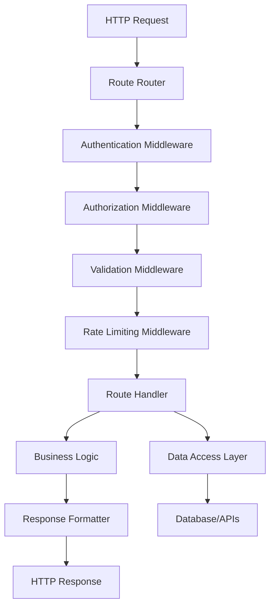

# Routes - Standards and Conventions

This document defines the standards and conventions for creating custom routes within the Token Nexus Platform. Routes provide API endpoints and URL handling for custom functionality, integrations, and specialized data access patterns.

## Table of Contents

1. [Architecture Overview](#architecture-overview)
2. [Route Types and Categories](#route-types-and-categories)
3. [Implementation Standards](#implementation-standards)
4. [URL Design Patterns](#url-design-patterns)
5. [Request/Response Handling](#requestresponse-handling)
6. [Authentication and Authorization](#authentication-and-authorization)
7. [Data Validation and Sanitization](#data-validation-and-sanitization)
8. [Error Handling](#error-handling)
9. [Rate Limiting and Throttling](#rate-limiting-and-throttling)
10. [Documentation Standards](#documentation-standards)
11. [Testing Standards](#testing-standards)
12. [Implementation Checklist](#implementation-checklist)
13. [Examples and Templates](#examples-and-templates)

## Architecture Overview

Custom routes integrate with the platform's routing system to provide secure, scalable API endpoints:



### Core Principles

1. **RESTful Design**: Follow REST conventions for predictable APIs
2. **Security First**: Comprehensive authentication and authorization
3. **Data Validation**: Strict input validation and sanitization
4. **Error Consistency**: Standardized error responses
5. **Performance**: Efficient request handling and caching
6. **Documentation**: Complete API documentation

## Route Types and Categories

### Route Categories

```typescript
enum RouteCategory {
  API = 'api',
  WEBHOOK = 'webhook',
  INTEGRATION = 'integration',
  ADMIN = 'admin',
  PUBLIC = 'public',
  INTERNAL = 'internal'
}

enum RouteMethod {
  GET = 'GET',
  POST = 'POST',
  PUT = 'PUT',
  PATCH = 'PATCH',
  DELETE = 'DELETE',
  OPTIONS = 'OPTIONS'
}

enum RouteScope {
  SYSTEM = 'system',
  ORGANIZATION = 'organization',
  USER = 'user',
  PUBLIC = 'public'
}
```

### Route Metadata Schema

```typescript
interface RouteMetadata {
  id: string;
  path: string;
  method: RouteMethod;
  category: RouteCategory;
  scope: RouteScope;
  description: string;
  version: string;
  enabled: boolean;
  authentication: AuthenticationConfig;
  authorization: AuthorizationConfig;
  validation: ValidationConfig;
  rateLimit: RateLimitConfig;
  caching: CachingConfig;
  documentation: DocumentationConfig;
  tags: string[];
}

interface AuthenticationConfig {
  required: boolean;
  methods: ('session' | 'api-key' | 'jwt' | 'oauth')[];
  allowAnonymous?: boolean;
}

interface AuthorizationConfig {
  permissions: string[];
  organizationScoped: boolean;
  roleRequired?: string;
  customValidator?: string;
}

interface ValidationConfig {
  requestSchema?: any;
  responseSchema?: any;
  sanitization: SanitizationConfig;
}

interface RateLimitConfig {
  enabled: boolean;
  requests: number;
  window: number; // seconds
  scope: 'ip' | 'user' | 'organization';
}

interface CachingConfig {
  enabled: boolean;
  ttl: number; // seconds
  varyBy: string[];
  invalidateOn: string[];
}
```

## Implementation Standards

### Base Route Handler

All route handlers must extend the [`BaseRouteHandler`](../src/routes/BaseRouteHandler.ts) class:

```typescript
// BaseRouteHandler.ts
import { RouteMetadata, RouteRequest, RouteResponse } from '@/types/routes';
import { AuthenticationService } from '@/services/authentication';
import { AuthorizationService } from '@/services/authorization';
import { ValidationService } from '@/services/validation';
import { RateLimitService } from '@/services/rateLimit';
import { CacheService } from '@/services/cache';
import { AuditService } from '@/services/audit';

export abstract class BaseRouteHandler {
  protected authService: AuthenticationService;
  protected authzService: AuthorizationService;
  protected validationService: ValidationService;
  protected rateLimitService: RateLimitService;
  protected cacheService: CacheService;
  protected auditService: AuditService;

  constructor(protected metadata: RouteMetadata) {
    this.authService = new AuthenticationService();
    this.authzService = new AuthorizationService();
    this.validationService = new ValidationService();
    this.rateLimitService = new RateLimitService();
    this.cacheService = new CacheService();
    this.auditService = new AuditService();
  }

  // Main request handling method
  async handle(request: RouteRequest): Promise<RouteResponse> {
    const startTime = Date.now();
    const requestId = this.generateRequestId();

    try {
      // Check if route is enabled
      if (!this.metadata.enabled) {
        return this.createErrorResponse(503, 'Route is disabled');
      }

      // Rate limiting
      if (this.metadata.rateLimit.enabled) {
        await this.checkRateLimit(request);
      }

      // Check cache
      if (this.metadata.caching.enabled && request.method === 'GET') {
        const cachedResponse = await this.getCachedResponse(request);
        if (cachedResponse) {
          return cachedResponse;
        }
      }

      // Authentication
      const user = await this.authenticateRequest(request);

      // Authorization
      await this.authorizeRequest(request, user);

      // Validation
      await this.validateRequest(request);

      // Execute route logic
      const result = await this.executeRouteLogic(request, user);

      // Create response
      const response = this.createSuccessResponse(result);

      // Cache response if applicable
      if (this.metadata.caching.enabled && request.method === 'GET') {
        await this.cacheResponse(request, response);
      }

      // Audit logging
      await this.auditService.logRouteAccess({
        routeId: this.metadata.id,
        requestId: requestId,
        userId: user?.id,
        method: request.method,
        path: request.path,
        statusCode: response.statusCode,
        executionTime: Date.now() - startTime
      });

      return response;

    } catch (error) {
      // Handle error
      const errorResponse = await this.handleError(error, request, requestId);

      // Audit error
      await this.auditService.logRouteError({
        routeId: this.metadata.id,
        requestId: requestId,
        error: error,
        executionTime: Date.now() - startTime
      });

      return errorResponse;
    }
  }

  // Abstract methods to be implemented by specific routes
  protected abstract executeRouteLogic(request: RouteRequest, user?: Parse.User): Promise<any>;

  // Optional methods that can be overridden
  protected async beforeRouteExecution(request: RouteRequest, user?: Parse.User): Promise<void> {
    // Override to add pre-execution logic
  }

  protected async afterRouteExecution(request: RouteRequest, result: any, user?: Parse.User): Promise<void> {
    // Override to add post-execution logic
  }

  // Authentication
  private async authenticateRequest(request: RouteRequest): Promise<Parse.User | null> {
    if (!this.metadata.authentication.required) {
      return null;
    }

    for (const method of this.metadata.authentication.methods) {
      try {
        const user = await this.authService.authenticate(request, method);
        if (user) {
          return user;
        }
      } catch (error) {
        // Try next authentication method
        continue;
      }
    }

    if (!this.metadata.authentication.allowAnonymous) {
      throw new RouteError(401, 'Authentication required');
    }

    return null;
  }

  // Authorization
  private async authorizeRequest(request: RouteRequest, user?: Parse.User): Promise<void> {
    if (!user && this.metadata.authorization.permissions.length > 0) {
      throw new RouteError(401, 'Authentication required for authorization');
    }

    // Check permissions
    for (const permission of this.metadata.authorization.permissions) {
      const hasPermission = await this.authzService.checkPermission(user, permission);
      if (!hasPermission) {
        throw new RouteError(403, `Missing permission: ${permission}`);
      }
    }

    // Check organization scope
    if (this.metadata.authorization.organizationScoped && user) {
      const organizationId = this.extractOrganizationId(request);
      if (!organizationId) {
        throw new RouteError(400, 'Organization context required');
      }

      const hasOrgAccess = await this.authzService.checkOrganizationAccess(user, organizationId);
      if (!hasOrgAccess) {
        throw new RouteError(403, 'Access denied to organization');
      }
    }

    // Check role requirement
    if (this.metadata.authorization.roleRequired && user) {
      const hasRole = await this.authzService.checkRole(user, this.metadata.authorization.roleRequired);
      if (!hasRole) {
        throw new RouteError(403, `Role required: ${this.metadata.authorization.roleRequired}`);
      }
    }

    // Custom authorization
    if (this.metadata.authorization.customValidator) {
      const isAuthorized = await this.executeCustomAuthorization(request, user);
      if (!isAuthorized) {
        throw new RouteError(403, 'Custom authorization failed');
      }
    }
  }

  // Validation
  private async validateRequest(request: RouteRequest): Promise<void> {
    if (this.metadata.validation.requestSchema) {
      const validation = await this.validationService.validate(
        request.body || request.query,
        this.metadata.validation.requestSchema
      );

      if (!validation.valid) {
        throw new RouteError(400, `Validation failed: ${validation.errors.join(', ')}`);
      }
    }

    // Sanitize input
    if (this.metadata.validation.sanitization) {
      request.body = await this.sanitizeInput(request.body);
      request.query = await this.sanitizeInput(request.query);
    }
  }

  // Rate limiting
  private async checkRateLimit(request: RouteRequest): Promise<void> {
    const { requests, window, scope } = this.metadata.rateLimit;
    const identifier = this.getRateLimitIdentifier(request, scope);

    const isAllowed = await this.rateLimitService.checkLimit(
      identifier,
      requests,
      window
    );

    if (!isAllowed) {
      throw new RouteError(429, 'Rate limit exceeded');
    }
  }

  private getRateLimitIdentifier(request: RouteRequest, scope: string): string {
    switch (scope) {
      case 'ip':
        return request.ip;
      case 'user':
        return request.user?.id || request.ip;
      case 'organization':
        return this.extractOrganizationId(request) || request.ip;
      default:
        return request.ip;
    }
  }

  // Caching
  private async getCachedResponse(request: RouteRequest): Promise<RouteResponse | null> {
    const cacheKey = this.generateCacheKey(request);
    return this.cacheService.get(cacheKey);
  }

  private async cacheResponse(request: RouteRequest, response: RouteResponse): Promise<void> {
    const cacheKey = this.generateCacheKey(request);
    await this.cacheService.set(cacheKey, response, this.metadata.caching.ttl);
  }

  private generateCacheKey(request: RouteRequest): string {
    const keyParts = [
      this.metadata.id,
      request.path,
      JSON.stringify(request.query)
    ];

    // Add vary-by parameters
    for (const varyBy of this.metadata.caching.varyBy) {
      keyParts.push(request.headers[varyBy] || '');
    }

    return keyParts.join(':');
  }

  // Response creation
  protected createSuccessResponse(data: any, statusCode: number = 200): RouteResponse {
    return {
      statusCode: statusCode,
      headers: {
        'Content-Type': 'application/json',
        'X-Route-ID': this.metadata.id,
        'X-Route-Version': this.metadata.version
      },
      body: {
        success: true,
        data: data,
        metadata: {
          timestamp: new Date().toISOString(),
          route: this.metadata.id,
          version: this.metadata.version
        }
      }
    };
  }

  protected createErrorResponse(statusCode: number, message: string, details?: any): RouteResponse {
    return {
      statusCode: statusCode,
      headers: {
        'Content-Type': 'application/json',
        'X-Route-ID': this.metadata.id,
        'X-Route-Version': this.metadata.version
      },
      body: {
        success: false,
        error: {
          code: statusCode,
          message: message,
          details: details
        },
        metadata: {
          timestamp: new Date().toISOString(),
          route: this.metadata.id,
          version: this.metadata.version
        }
      }
    };
  }

  // Error handling
  private async handleError(error: any, request: RouteRequest, requestId: string): Promise<RouteResponse> {
    if (error instanceof RouteError) {
      return this.createErrorResponse(error.statusCode, error.message, error.details);
    }

    if (error instanceof Parse.Error) {
      return this.createErrorResponse(400, error.message);
    }

    // Log unexpected errors
    console.error(`Route error [${requestId}]:`, error);

    return this.createErrorResponse(500, 'Internal server error');
  }

  // Utility methods
  protected extractOrganizationId(request: RouteRequest): string | null {
    return request.params.organizationId || 
           request.query.organizationId || 
           request.headers['x-organization-id'] ||
           null;
  }

  protected generateRequestId(): string {
    return `req_${Date.now()}_${Math.random().toString(36).substr(2, 9)}`;
  }

  private async sanitizeInput(input: any): Promise<any> {
    if (!input) return input;

    // Basic sanitization - can be extended
    if (typeof input === 'string') {
      return input.trim();
    }

    if (typeof input === 'object') {
      const sanitized = {};
      for (const [key, value] of Object.entries(input)) {
        sanitized[key] = await this.sanitizeInput(value);
      }
      return sanitized;
    }

    return input;
  }

  private async executeCustomAuthorization(request: RouteRequest, user?: Parse.User): Promise<boolean> {
    // Implementation would load and execute custom authorization logic
    return true;
  }
}

// Custom error class for routes
export class RouteError extends Error {
  constructor(
    public statusCode: number,
    message: string,
    public details?: any
  ) {
    super(message);
    this.name = 'RouteError';
  }
}
```

### API Route Example

```typescript
// UserApiRoute.ts
import { BaseRouteHandler, RouteError } from './BaseRouteHandler';
import { RouteRequest } from '@/types/routes';

export class UserApiRoute extends BaseRouteHandler {
  constructor() {
    super({
      id: 'user-api',
      path: '/api/v1/users/:userId',
      method: RouteMethod.GET,
      category: RouteCategory.API,
      scope: RouteScope.ORGANIZATION,
      description: 'Get user information by ID',
      version: '1.0.0',
      enabled: true,
      authentication: {
        required: true,
        methods: ['session', 'api-key'],
        allowAnonymous: false
      },
      authorization: {
        permissions: ['users:read'],
        organizationScoped: true
      },
      validation: {
        requestSchema: {
          type: 'object',
          properties: {
            userId: {
              type: 'string',
              pattern: '^[a-zA-Z0-9]{10}$'
            },
            include: {
              type: 'array',
              items: {
                type: 'string',
                enum: ['profile', 'roles', 'permissions', 'activity']
              }
            }
          },
          required: ['userId']
        },
        responseSchema: {
          type: 'object',
          properties: {
            user: {
              type: 'object',
              properties: {
                id: { type: 'string' },
                email: { type: 'string' },
                firstName: { type: 'string' },
                lastName: { type: 'string' },
                status: { type: 'string' },
                createdAt: { type: 'string' },
                updatedAt: { type: 'string' }
              }
            }
          }
        },
        sanitization: {
          enabled: true,
          stripHtml: true,
          trimStrings: true
        }
      },
      rateLimit: {
        enabled: true,
        requests: 100,
        window: 60,
        scope: 'user'
      },
      caching: {
        enabled: true,
        ttl: 300, // 5 minutes
        varyBy: ['authorization'],
        invalidateOn: ['user.updated', 'user.deleted']
      },
      documentation: {
        summary: 'Get user by ID',
        description: 'Retrieves detailed information about a specific user',
        parameters: [
          {
            name: 'userId',
            in: 'path',
            required: true,
            description: 'Unique identifier of the user'
          },
          {
            name: 'include',
            in: 'query',
            required: false,
            description: 'Additional data to include in response'
          }
        ],
        responses: {
          200: { description: 'User information retrieved successfully' },
          400: { description: 'Invalid request parameters' },
          401: { description: 'Authentication required' },
          403: { description: 'Access denied' },
          404: { description: 'User not found' },
          429: { description: 'Rate limit exceeded' }
        },
        examples: [
          {
            request: {
              path: '/api/v1/users/abc123def4',
              query: { include: ['profile', 'roles'] }
            },
            response: {
              user: {
                id: 'abc123def4',
                email: 'john@example.com',
                firstName: 'John',
                lastName: 'Doe',
                status: 'active'
              }
            }
          }
        ]
      },
      tags: ['users', 'api', 'v1']
    });
  }

  protected async executeRouteLogic(request: RouteRequest, user: Parse.User): Promise<any> {
    const { userId } = request.params;
    const { include } = request.query;
    const organizationId = this.extractOrganizationId(request);

    // Get user
    const targetUser = await this.getUser(userId, organizationId);
    if (!targetUser) {
      throw new RouteError(404, 'User not found');
    }

    // Check if requesting user can view target user
    await this.validateUserAccess(user, targetUser);

    // Build response data
    const userData = this.buildUserData(targetUser);

    // Include additional data if requested
    if (include && include.length > 0) {
      for (const includeItem of include) {
        switch (includeItem) {
          case 'profile':
            userData.profile = await this.getUserProfile(userId);
            break;
          case 'roles':
            userData.roles = await this.getUserRoles(userId, organizationId);
            break;
          case 'permissions':
            userData.permissions = await this.getUserPermissions(userId, organizationId);
            break;
          case 'activity':
            userData.activity = await this.getUserActivity(userId);
            break;
        }
      }
    }

    return { user: userData };
  }

  private async getUser(userId: string, organizationId: string): Promise<Parse.User | null> {
    const query = new Parse.Query(Parse.User);
    query.equalTo('objectId', userId);
    query.equalTo('organizationId', organizationId);

    return query.first({ useMasterKey: true });
  }

  private async validateUserAccess(requestingUser: Parse.User, targetUser: Parse.User): Promise<void> {
    // Users can always view their own data
    if (requestingUser.id === targetUser.id) {
      return;
    }

    // Check if requesting user has permission to view other users
    const hasPermission = await this.authzService.checkPermission(requestingUser, 'users:read:others');
    if (!hasPermission) {
      throw new RouteError(403, 'Cannot view other users');
    }
  }

  private buildUserData(user: Parse.User): any {
    return {
      id: user.id,
      email: user.get('email'),
      firstName: user.get('firstName'),
      lastName: user.get('lastName'),
      displayName: user.get('displayName'),
      status: user.get('status'),
      role: user.get('role'),
      createdAt: user.get('createdAt'),
      updatedAt: user.get('updatedAt'),
      lastLoginAt: user.get('lastLoginAt')
    };
  }

  private async getUserProfile(userId: string): Promise<any> {
    const UserProfile = Parse.Object.extend('UserProfile');
    const query = new Parse.Query(UserProfile);
    query.equalTo('userId', userId);

    const profile = await query.first({ useMasterKey: true });
    return profile ? profile.toJSON() : null;
  }

  private async getUserRoles(userId: string, organizationId: string): Promise<string[]> {
    const Role = Parse.Object.extend('Role');
    const query = new Parse.Query(Role);
    query.equalTo('users', { __type: 'Pointer', className: '_User', objectId: userId });
    query.equalTo('organizationId', organizationId);

    const roles = await query.find({ useMasterKey: true });
    return roles.map(role => role.get('name'));
  }

  private async getUserPermissions(userId: string, organizationId: string): Promise<string[]> {
    // Implementation would aggregate permissions from roles and direct assignments
    return [];
  }

  private async getUserActivity(userId: string): Promise<any> {
    const AuditLog = Parse.Object.extend('AuditLog');
    const query = new Parse.Query(AuditLog);
    query.equalTo('userId', userId);
    query.descending('createdAt');
    query.limit(10);

    const activities = await query.find({ useMasterKey: true });
    return activities.map(activity => ({
      action: activity.get('action'),
      timestamp: activity.get('createdAt'),
      details: activity.get('details')
    }));
  }

  protected async beforeRouteExecution(request: RouteRequest, user: Parse.User): Promise<void> {
    // Log user access attempt
    console.log(`User ${user.id} accessing user data for ${request.params.userId}`);
  }

  protected async afterRouteExecution(request: RouteRequest, result: any, user: Parse.User): Promise<void> {
    // Update user access statistics
    await this.updateAccessStatistics(user.id, request.params.userId);
  }

  private async updateAccessStatistics(requestingUserId: string, targetUserId: string): Promise<void> {
    // Implementation would update access tracking
  }
}

// Register the route
Parse.Cloud.define('userApiRoute', async (request) => {
  const route = new UserApiRoute();
  const routeRequest: RouteRequest = {
    method: 'GET',
    path: request.params.path,
    params: request.params,
    query: request.params.query || {},
    body: request.params.body,
    headers: request.headers || {},
    user: request.user,
    ip: request.ip
  };

  return route.handle(routeRequest);
});
```

### Webhook Route Example

```typescript
// WebhookRoute.ts
import { BaseRouteHandler, RouteError } from './BaseRouteHandler';
import { RouteRequest } from '@/types/routes';
import crypto from 'crypto';

export class WebhookRoute extends BaseRouteHandler {
  constructor() {
    super({
      id: 'external-webhook',
      path: '/webhooks/external/:provider',
      method: RouteMethod.POST,
      category: RouteCategory.WEBHOOK,
      scope: RouteScope.PUBLIC,
      description: 'Handle external webhooks from third-party services',
      version: '1.0.0',
      enabled: true,
      authentication: {
        required: false,
        methods: [],
        allowAnonymous: true
      },
      authorization: {
        permissions: [],
        organizationScoped: false,
        customValidator: 'validateWebhookSignature'
      },
      validation: {
        requestSchema: {
          type: 'object',
          properties: {
            provider: {
              type: 'string',
              enum: ['github', 'stripe', 'slack', 'sendgrid']
            }
          },
          required: ['provider']
        },
        sanitization: {
          enabled: false // Preserve raw webhook data
        }
      },
      rateLimit: {
        enabled: true,
        requests: 1000,
        window: 60,
        scope: 'ip'
      },
      caching: {
        enabled: false // Webhooks should not be cached
      },
      documentation: {
        summary: 'External webhook handler',
        description: 'Processes webhooks from external services',
        parameters: [
          {
            name: 'provider',
            in: 'path',
            required: true,
            description: 'Webhook provider identifier'
          }
        ],
        responses: {
          200: { description: 'Webhook processed successfully' },
          400: { description: 'Invalid webhook data' },
          401: { description: 'Invalid webhook signature' },
          429: { description: 'Rate limit exceeded' }
        }
      },
      tags: ['webhooks', 'integrations', 'external']
    });
  }

  protected async executeRouteLogic(request: RouteRequest): Promise<any> {
    const { provider } = request.params;
    const webhookData = request.body;

    // Validate webhook signature
    await this.validateWebhookSignature(request, provider);

    // Process webhook based on provider
    const result = await this.processWebhook(provider, webhookData, request);

    return {
      processed: true,
      provider: provider,
      eventType: result.eventType,
      timestamp: new Date().toISOString()
    };
  }

  private async validateWebhookSignature(request: RouteRequest, provider: string): Promise<void> {
    const signature = request.headers['x-webhook-signature'] || 
                     request.headers['x-hub-signature-256'] ||
                     request.headers['stripe-signature'];

    if (!signature) {
      throw new RouteError(401, 'Missing webhook signature');
    }

    const secret = await this.getWebhookSecret(provider);
    if (!secret) {
      throw new RouteError(401, 'Webhook secret not configured');
    }

    const isValid = this.verifySignature(request.body, signature, secret, provider);
    if (!isValid) {
      throw new RouteError(401, 'Invalid webhook signature');
    }
  }

  private async getWebhookSecret(provider: string): Promise<string | null> {
    // Implementation would retrieve webhook secret from secure storage
    const secrets = {
      github: process.env.GITHUB_WEBHOOK_SECRET,
      stripe: process.env.STRIPE_WEBHOOK_SECRET,
      slack: process.env.SLACK_WEBHOOK_SECRET,
      sendgrid: process.env.SENDGRID_WEBHOOK_SECRET
    };

    return secrets[provider] || null;
  }

  private verifySignature(payload: any, signature: string, secret: string, provider: string): boolean {
    let expectedSignature: string;

    switch (provider) {
      case 'github':
        expectedSignature = 'sha256=' + crypto
          .createHmac('sha256', secret)
          .update(JSON.stringify(payload))
          .digest('hex');
        break;

      case 'stripe':
        // Stripe signature verification is more complex
        return this.verifyStripeSignature(payload, signature, secret);

      case 'slack':
        expectedSignature = 'v0=' + crypto
          .createHmac('sha256', secret)
          .update(`v0:${Date.now()}:${JSON.stringify(payload)}`)
          .digest('hex');
        break;

      default:
        expectedSignature = crypto
          .createHmac('sha256', secret)
          .update(JSON.stringify(payload))
          .digest('hex');
    }

    return crypto.timingSafeEqual(
      Buffer.from(signature),
      Buffer.from(expectedSignature)
    );
  }

  private verifyStripeSignature(payload: any, signature: string, secret: string): boolean {
    // Stripe-specific signature verification
    const elements = signature.split(',');
    const signatureElements = {};

    for (const element of elements) {
      const [key, value] = element.split('=');
      signatureElements[key] = value;
    }

    const timestamp = signatureElements['t'];
    const signatures = [signatureElements['v1']];

    const expectedSignature = crypto
      .createHmac('sha256', secret)
      .update(`${timestamp}.${JSON.stringify(payload)}`)
      .digest('hex');

    return signatures.includes(expectedSignature);
  }

  private async processWebhook(provider: string, data: any, request: RouteRequest): Promise<any> {
    switch (provider) {
      case 'github':
        return this.processGitHubWebhook(data