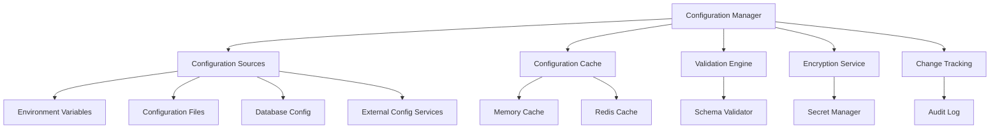

# Configuration Management - Standards and Conventions

This document defines the standards and conventions for managing configuration within the Token Nexus Platform. Configuration management ensures consistent, secure, and maintainable handling of application settings, environment variables, and runtime parameters.

## Table of Contents

1. [Architecture Overview](#architecture-overview)
2. [Configuration Types and Categories](#configuration-types-and-categories)
3. [Implementation Standards](#implementation-standards)
4. [Environment Management](#environment-management)
5. [Security and Encryption](#security-and-encryption)
6. [Validation and Schema](#validation-and-schema)
7. [Dynamic Configuration](#dynamic-configuration)
8. [Caching and Performance](#caching-and-performance)
9. [Audit and Change Tracking](#audit-and-change-tracking)
10. [Testing Standards](#testing-standards)
11. [Implementation Checklist](#implementation-checklist)
12. [Examples and Templates](#examples-and-templates)

## Architecture Overview

Configuration management operates through a hierarchical system that supports multiple sources and environments:



### Core Principles

1. **Hierarchy**: Clear precedence order for configuration sources
2. **Security**: Encrypted storage of sensitive configuration
3. **Validation**: Schema-based validation of all configuration
4. **Immutability**: Configuration changes are tracked and auditable
5. **Performance**: Efficient caching and retrieval mechanisms
6. **Environment Isolation**: Clear separation between environments

## Configuration Types and Categories

### Configuration Categories

```typescript
enum ConfigurationCategory {
  APPLICATION = 'application',
  DATABASE = 'database',
  SECURITY = 'security',
  INTEGRATION = 'integration',
  FEATURE_FLAGS = 'feature-flags',
  PERFORMANCE = 'performance',
  MONITORING = 'monitoring',
  NOTIFICATION = 'notification'
}

enum ConfigurationScope {
  SYSTEM = 'system',
  ORGANIZATION = 'organization',
  USER = 'user',
  APPLICATION = 'application'
}

enum ConfigurationSensitivity {
  PUBLIC = 'public',
  INTERNAL = 'internal',
  CONFIDENTIAL = 'confidential',
  SECRET = 'secret'
}
```

### Configuration Metadata Schema

```typescript
interface ConfigurationMetadata {
  key: string;
  category: ConfigurationCategory;
  scope: ConfigurationScope;
  sensitivity: ConfigurationSensitivity;
  description: string;
  dataType: ConfigurationDataType;
  defaultValue?: any;
  required: boolean;
  validation: ValidationConfig;
  environment: EnvironmentConfig;
  encryption: EncryptionConfig;
  caching: CachingConfig;
  audit: AuditConfig;
  tags: string[];
}

interface ValidationConfig {
  schema: any;
  customValidator?: string;
  dependencies?: string[];
}

interface EnvironmentConfig {
  environments: string[];
  overrides: Record<string, any>;
  inheritance: boolean;
}

interface EncryptionConfig {
  enabled: boolean;
  algorithm?: string;
  keyId?: string;
}

interface CachingConfig {
  enabled: boolean;
  ttl: number; // seconds
  invalidateOn: string[];
}

interface AuditConfig {
  trackChanges: boolean;
  retentionDays: number;
  notifyOnChange: boolean;
}
```

## Implementation Standards

### Base Configuration Manager

All configuration management must use the [`ConfigurationManager`](../src/config/ConfigurationManager.ts) class:

```typescript
// ConfigurationManager.ts
import { ConfigurationMetadata, ConfigurationValue, ConfigurationSource } from '@/types/configuration';
import { EncryptionService } from '@/services/encryption';
import { ValidationService } from '@/services/validation';
import { CacheService } from '@/services/cache';
import { AuditService } from '@/services/audit';

export class ConfigurationManager {
  private sources: ConfigurationSource[] = [];
  private cache: Map<string, ConfigurationValue> = new Map();
  private metadata: Map<string, ConfigurationMetadata> = new Map();
  
  private encryptionService: EncryptionService;
  private validationService: ValidationService;
  private cacheService: CacheService;
  private auditService: AuditService;

  constructor() {
    this.encryptionService = new EncryptionService();
    this.validationService = new ValidationService();
    this.cacheService = new CacheService();
    this.auditService = new AuditService();
    
    this.initializeSources();
  }

  // Get configuration value with full resolution
  async get<T = any>(key: string, context?: ConfigurationContext): Promise<T> {
    try {
      // Check cache first
      const cached = await this.getCachedValue<T>(key, context);
      if (cached !== null) {
        return cached;
      }

      // Resolve value from sources
      const value = await this.resolveValue<T>(key, context);

      // Validate value
      await this.validateValue(key, value);

      // Cache if enabled
      await this.cacheValue(key, value, context);

      return value;

    } catch (error) {
      // Log error and return default if available
      console.error(`Configuration error for key ${key}:`, error);
      
      const metadata = this.metadata.get(key);
      if (metadata?.defaultValue !== undefined) {
        return metadata.defaultValue;
      }
      
      throw error;
    }
  }

  // Set configuration value
  async set(key: string, value: any, context?: ConfigurationContext): Promise<void> {
    const metadata = this.metadata.get(key);
    if (!metadata) {
      throw new Error(`Configuration key not registered: ${key}`);
    }

    // Validate new value
    await this.validateValue(key, value);

    // Get current value for audit
    const currentValue = await this.getCurrentValue(key, context);

    // Encrypt if required
    const processedValue = await this.processValueForStorage(key, value);

    // Update in primary source
    await this.updateInSource(key, processedValue, context);

    // Invalidate cache
    await this.invalidateCache(key, context);

    // Audit change
    await this.auditConfigurationChange(key, currentValue, value, context);

    // Notify if configured
    await this.notifyConfigurationChange(key, currentValue, value, context);
  }

  // Register configuration metadata
  registerConfiguration(metadata: ConfigurationMetadata): void {
    this.metadata.set(metadata.key, metadata);
    
    // Validate metadata
    this.validateMetadata(metadata);
  }

  // Register configuration source
  registerSource(source: ConfigurationSource): void {
    this.sources.push(source);
    this.sources.sort((a, b) => a.priority - b.priority);
  }

  // Bulk configuration operations
  async getMultiple(keys: string[], context?: ConfigurationContext): Promise<Record<string, any>> {
    const results: Record<string, any> = {};
    
    // Process in parallel for better performance
    const promises = keys.map(async (key) => {
      try {
        const value = await this.get(key, context);
        results[key] = value;
      } catch (error) {
        console.error(`Failed to get configuration ${key}:`, error);
        // Continue with other keys
      }
    });

    await Promise.all(promises);
    return results;
  }

  async setMultiple(values: Record<string, any>, context?: ConfigurationContext): Promise<void> {
    // Validate all values first
    for (const [key, value] of Object.entries(values)) {
      await this.validateValue(key, value);
    }

    // Apply changes
    const promises = Object.entries(values).map(([key, value]) => 
      this.set(key, value, context)
    );

    await Promise.all(promises);
  }

  // Value resolution with source hierarchy
  private async resolveValue<T>(key: string, context?: ConfigurationContext): Promise<T> {
    const metadata = this.metadata.get(key);
    if (!metadata) {
      throw new Error(`Configuration key not registered: ${key}`);
    }

    // Try each source in priority order
    for (const source of this.sources) {
      try {
        const value = await source.getValue(key, context);
        if (value !== undefined && value !== null) {
          // Decrypt if necessary
          return await this.processValueFromStorage<T>(key, value);
        }
      } catch (error) {
        console.warn(`Source ${source.name} failed for key ${key}:`, error);
        // Continue to next source
      }
    }

    // Return default value if available
    if (metadata.defaultValue !== undefined) {
      return metadata.defaultValue;
    }

    // Throw error if required and no value found
    if (metadata.required) {
      throw new Error(`Required configuration not found: ${key}`);
    }

    return null as T;
  }

  // Value processing for storage/retrieval
  private async processValueForStorage(key: string, value: any): Promise<any> {
    const metadata = this.metadata.get(key);
    if (!metadata) {
      return value;
    }

    // Encrypt sensitive values
    if (metadata.encryption.enabled && metadata.sensitivity === ConfigurationSensitivity.SECRET) {
      return await this.encryptionService.encrypt(value, metadata.encryption.keyId);
    }

    return value;
  }

  private async processValueFromStorage<T>(key: string, value: any): Promise<T> {
    const metadata = this.metadata.get(key);
    if (!metadata) {
      return value;
    }

    // Decrypt if encrypted
    if (metadata.encryption.enabled && typeof value === 'string' && value.startsWith('encrypted:')) {
      return await this.encryptionService.decrypt(value, metadata.encryption.keyId);
    }

    // Type conversion
    return this.convertValue<T>(value, metadata.dataType);
  }

  // Type conversion
  private convertValue<T>(value: any, dataType: ConfigurationDataType): T {
    switch (dataType) {
      case ConfigurationDataType.STRING:
        return String(value) as T;
      
      case ConfigurationDataType.NUMBER:
        return Number(value) as T;
      
      case ConfigurationDataType.BOOLEAN:
        if (typeof value === 'string') {
          return (value.toLowerCase() === 'true') as T;
        }
        return Boolean(value) as T;
      
      case ConfigurationDataType.JSON:
        if (typeof value === 'string') {
          return JSON.parse(value) as T;
        }
        return value as T;
      
      case ConfigurationDataType.ARRAY:
        if (typeof value === 'string') {
          return value.split(',').map(v => v.trim()) as T;
        }
        return Array.isArray(value) ? value as T : [value] as T;
      
      default:
        return value as T;
    }
  }

  // Validation
  private async validateValue(key: string, value: any): Promise<void> {
    const metadata = this.metadata.get(key);
    if (!metadata) {
      return;
    }

    // Schema validation
    if (metadata.validation.schema) {
      const validation = await this.validationService.validate(value, metadata.validation.schema);
      if (!validation.valid) {
        throw new Error(`Configuration validation failed for ${key}: ${validation.errors.join(', ')}`);
      }
    }

    // Custom validation
    if (metadata.validation.customValidator) {
      const isValid = await this.executeCustomValidator(metadata.validation.customValidator, key, value);
      if (!isValid) {
        throw new Error(`Custom validation failed for ${key}`);
      }
    }

    // Dependency validation
    if (metadata.validation.dependencies) {
      await this.validateDependencies(key, value, metadata.validation.dependencies);
    }
  }

  private validateMetadata(metadata: ConfigurationMetadata): void {
    // Validate required fields
    if (!metadata.key || !metadata.category || !metadata.scope) {
      throw new Error('Configuration metadata missing required fields');
    }

    // Validate key format
    if (!/^[a-zA-Z][a-zA-Z0-9._-]*$/.test(metadata.key)) {
      throw new Error(`Invalid configuration key format: ${metadata.key}`);
    }

    // Validate encryption settings
    if (metadata.encryption.enabled && metadata.sensitivity !== ConfigurationSensitivity.SECRET) {
      console.warn(`Encryption enabled for non-secret configuration: ${metadata.key}`);
    }
  }

  // Caching
  private async getCachedValue<T>(key: string, context?: ConfigurationContext): Promise<T | null> {
    const metadata = this.metadata.get(key);
    if (!metadata?.caching.enabled) {
      return null;
    }

    const cacheKey = this.generateCacheKey(key, context);
    return await this.cacheService.get<T>(cacheKey);
  }

  private async cacheValue(key: string, value: any, context?: ConfigurationContext): Promise<void> {
    const metadata = this.metadata.get(key);
    if (!metadata?.caching.enabled) {
      return;
    }

    const cacheKey = this.generateCacheKey(key, context);
    await this.cacheService.set(cacheKey, value, metadata.caching.ttl);
  }

  private async invalidateCache(key: string, context?: ConfigurationContext): Promise<void> {
    const metadata = this.metadata.get(key);
    if (!metadata?.caching.enabled) {
      return;
    }

    const cacheKey = this.generateCacheKey(key, context);
    await this.cacheService.delete(cacheKey);

    // Invalidate related keys
    for (const invalidateKey of metadata.caching.invalidateOn) {
      const relatedCacheKey = this.generateCacheKey(invalidateKey, context);
      await this.cacheService.delete(relatedCacheKey);
    }
  }

  private generateCacheKey(key: string, context?: ConfigurationContext): string {
    const parts = ['config', key];
    
    if (context?.organizationId) {
      parts.push('org', context.organizationId);
    }
    
    if (context?.userId) {
      parts.push('user', context.userId);
    }
    
    if (context?.environment) {
      parts.push('env', context.environment);
    }
    
    return parts.join(':');
  }

  // Audit and change tracking
  private async auditConfigurationChange(
    key: string,
    oldValue: any,
    newValue: any,
    context?: ConfigurationContext
  ): Promise<void> {
    const metadata = this.metadata.get(key);
    if (!metadata?.audit.trackChanges) {
      return;
    }

    await this.auditService.logConfigurationChange({
      key: key,
      oldValue: this.sanitizeValueForAudit(oldValue, metadata),
      newValue: this.sanitizeValueForAudit(newValue, metadata),
      changedBy: context?.userId,
      organizationId: context?.organizationId,
      timestamp: new Date(),
      metadata: {
        category: metadata.category,
        scope: metadata.scope,
        sensitivity: metadata.sensitivity
      }
    });
  }

  private sanitizeValueForAudit(value: any, metadata: ConfigurationMetadata): any {
    // Don't log sensitive values
    if (metadata.sensitivity === ConfigurationSensitivity.SECRET) {
      return '[REDACTED]';
    }
    
    if (metadata.sensitivity === ConfigurationSensitivity.CONFIDENTIAL) {
      return '[CONFIDENTIAL]';
    }
    
    return value;
  }

  // Notification
  private async notifyConfigurationChange(
    key: string,
    oldValue: any,
    newValue: any,
    context?: ConfigurationContext
  ): Promise<void> {
    const metadata = this.metadata.get(key);
    if (!metadata?.audit.notifyOnChange) {
      return;
    }

    // Implementation would send notifications to relevant parties
    console.log(`Configuration changed: ${key}`);
  }

  // Source management
  private initializeSources(): void {
    // Register default sources in priority order
    this.registerSource(new EnvironmentVariableSource(1));
    this.registerSource(new DatabaseConfigurationSource(2));
    this.registerSource(new FileConfigurationSource(3));
    this.registerSource(new DefaultValueSource(4));
  }

  private async updateInSource(key: string, value: any, context?: ConfigurationContext): Promise<void> {
    // Find the first writable source
    for (const source of this.sources) {
      if (source.writable) {
        await source.setValue(key, value, context);
        return;
      }
    }
    
    throw new Error('No writable configuration source available');
  }

  private async getCurrentValue(key: string, context?: ConfigurationContext): Promise<any> {
    try {
      return await this.get(key, context);
    } catch (error) {
      return undefined;
    }
  }

  // Custom validation
  private async executeCustomValidator(validatorName: string, key: string, value: any): Promise<boolean> {
    // Implementation would load and execute custom validator
    return true;
  }

  private async validateDependencies(key: string, value: any, dependencies: string[]): Promise<void> {
    // Implementation would validate configuration dependencies
  }
}

// Configuration data types
export enum ConfigurationDataType {
  STRING = 'string',
  NUMBER = 'number',
  BOOLEAN = 'boolean',
  JSON = 'json',
  ARRAY = 'array'
}

// Configuration context
export interface ConfigurationContext {
  organizationId?: string;
  userId?: string;
  environment?: string;
  applicationId?: string;
}

// Configuration value wrapper
export interface ConfigurationValue {
  value: any;
  source: string;
  timestamp: Date;
  encrypted: boolean;
}
```

### Configuration Sources

```typescript
// Configuration source implementations
export abstract class ConfigurationSource {
  constructor(
    public name: string,
    public priority: number,
    public writable: boolean = false
  ) {}

  abstract getValue(key: string, context?: ConfigurationContext): Promise<any>;
  
  async setValue(key: string, value: any, context?: ConfigurationContext): Promise<void> {
    if (!this.writable) {
      throw new Error(`Configuration source ${this.name} is not writable`);
    }
    throw new Error('setValue not implemented');
  }
}

// Environment variable source
export class EnvironmentVariableSource extends ConfigurationSource {
  constructor(priority: number) {
    super('environment', priority, false);
  }

  async getValue(key: string, context?: ConfigurationContext): Promise<any> {
    // Convert key to environment variable format
    const envKey = this.keyToEnvVar(key);
    return process.env[envKey];
  }

  private keyToEnvVar(key: string): string {
    return key.toUpperCase().replace(/[.-]/g, '_');
  }
}

// Database configuration source
export class DatabaseConfigurationSource extends ConfigurationSource {
  constructor(priority: number) {
    super('database', priority, true);
  }

  async getValue(key: string, context?: ConfigurationContext): Promise<any> {
    const Configuration = Parse.Object.extend('Configuration');
    const query = new Parse.Query(Configuration);
    
    query.equalTo('key', key);
    
    // Add context filters
    if (context?.organizationId) {
      query.equalTo('organizationId', context.organizationId);
    }
    
    if (context?.userId) {
      query.equalTo('userId', context.userId);
    }
    
    if (context?.environment) {
      query.equalTo('environment', context.environment);
    }

    const config = await query.first({ useMasterKey: true });
    return config ? config.get('value') : undefined;
  }

  async setValue(key: string, value: any, context?: ConfigurationContext): Promise<void> {
    const Configuration = Parse.Object.extend('Configuration');
    
    // Try to find existing configuration
    const query = new Parse.Query(Configuration);
    query.equalTo('key', key);
    
    if (context?.organizationId) {
      query.equalTo('organizationId', context.organizationId);
    }
    
    if (context?.userId) {
      query.equalTo('userId', context.userId);
    }
    
    if (context?.environment) {
      query.equalTo('environment', context.environment);
    }

    let config = await query.first({ useMasterKey: true });
    
    if (!config) {
      config = new Configuration();
      config.set('key', key);
      
      if (context?.organizationId) {
        config.set('organizationId', context.organizationId);
      }
      
      if (context?.userId) {
        config.set('userId', context.userId);
      }
      
      if (context?.environment) {
        config.set('environment', context.environment);
      }
    }
    
    config.set('value', value);
    config.set('updatedAt', new Date());
    
    await config.save(null, { useMasterKey: true });
  }
}

// File configuration source
export class FileConfigurationSource extends ConfigurationSource {
  private configData: Record<string, any> = {};

  constructor(priority: number, configPath?: string) {
    super('file', priority, false);
    this.loadConfigFile(configPath);
  }

  async getValue(key: string, context?: ConfigurationContext): Promise<any> {
    return this.getNestedValue(this.configData, key);
  }

  private loadConfigFile(configPath?: string): void {
    try {
      const path = configPath || './config/default.json';
      const fs = require('fs');
      
      if (fs.existsSync(path)) {
        const content = fs.readFileSync(path, 'utf8');
        this.configData = JSON.parse(content);
      }
    } catch (error) {
      console.warn('Failed to load configuration file:', error);
    }
  }

  private getNestedValue(obj: any, key: string): any {
    const keys = key.split('.');
    let current = obj;
    
    for (const k of keys) {
      if (current && typeof current === 'object' && k in current) {
        current = current[k];
      } else {
        return undefined;
      }
    }
    
    return current;
  }
}

// Default value source (fallback)
export class DefaultValueSource extends ConfigurationSource {
  constructor(priority: number) {
    super('default', priority, false);
  }

  async getValue(key: string, context?: ConfigurationContext): Promise<any> {
    // This source provides default values defined in metadata
    // Implementation would return the default value for the key
    return undefined;
  }
}
```

### Application Configuration Example

```typescript
// ApplicationConfiguration.ts
import { ConfigurationManager, ConfigurationMetadata } from './ConfigurationManager';

export class ApplicationConfiguration {
  private configManager: ConfigurationManager;

  constructor() {
    this.configManager = new ConfigurationManager();
    this.registerConfigurations();
  }

  private registerConfigurations(): void {
    // Database configuration
    this.configManager.registerConfiguration({
      key: 'database.url',
      category: ConfigurationCategory.DATABASE,
      scope: ConfigurationScope.SYSTEM,
      sensitivity: ConfigurationSensitivity.CONFIDENTIAL,
      description: 'Database connection URL',
      dataType: ConfigurationDataType.STRING,
      required: true,
      validation: {
        schema: {
          type: 'string',
          pattern: '^(mongodb|postgresql)://.+'
        }
      },
      environment: {
        environments: ['development', 'staging', 'production'],
        overrides: {},
        inheritance: false
      },
      encryption: {
        enabled: true,
        algorithm: 'AES-256-GCM'
      },
      caching: {
        enabled: true,
        ttl: 3600,
        invalidateOn: []
      },
      audit: {
        trackChanges: true,
        retentionDays: 90,
        notifyOnChange: true
      },
      tags: ['database', 'connection']
    });

    // API configuration
    this.configManager.registerConfiguration({
      key: 'api.rateLimit.requests',
      category: ConfigurationCategory.PERFORMANCE,
      scope: ConfigurationScope.SYSTEM,
      sensitivity: ConfigurationSensitivity.INTERNAL,
      description: 'API rate limit requests per minute',
      dataType: ConfigurationDataType.NUMBER,
      defaultValue: 1000,
      required: false,
      validation: {
        schema: {
          type: 'number',
          minimum: 1,
          maximum: 10000
        }
      },
      environment: {
        environments: ['development', 'staging', 'production'],
        overrides: {
          development: 10000,
          staging: 5000,
          production: 1000
        },
        inheritance: true
      },
      encryption: {
        enabled: false
      },
      caching: {
        enabled: true,
        ttl: 300,
        invalidateOn: ['api.rateLimit.window']
      },
      audit: {
        trackChanges: true,
        retentionDays: 30,
        notifyOnChange: false
      },
      tags: ['api', 'rate-limit', 'performance']
    });

    // Feature flags
    this.configManager.registerConfiguration({
      key: 'features.newDashboard.enabled',
      category: ConfigurationCategory.FEATURE_FLAGS,
      scope: ConfigurationScope.ORGANIZATION,
      sensitivity: ConfigurationSensitivity.INTERNAL,
      description: 'Enable new dashboard interface',
      dataType: ConfigurationDataType.BOOLEAN,
      defaultValue: false,
      required: false,
      validation: {
        schema: {
          type: 'boolean'
        }
      },
      environment: {
        environments: ['development', 'staging', 'production'],
        overrides: {
          development: true,
          staging: true,
          production: false
        },
        inheritance: false
      },
      encryption: {
        enabled: false
      },
      caching: {
        enabled: true,
        ttl: 60,
        invalidateOn: []
      },
      audit: {
        trackChanges: true,
        retentionDays: 365,
        notifyOnChange: true
      },
      tags: ['feature-flag', 'dashboard', 'ui']
    });

    // Integration configuration
    this.configManager.registerConfiguration({
      key: 'integrations.slack.webhook.url',
      category: ConfigurationCategory.INTEGRATION,
      scope: ConfigurationScope.ORGANIZATION,
      sensitivity: ConfigurationSensitivity.SECRET,
      description: 'Slack webhook URL for notifications',
      dataType: ConfigurationDataType.STRING,
      required: false,
      validation: {
        schema: {
          type: 'string',
          format: 'uri',
          pattern: '^https://hooks\\.slack\\.com/services/.+'
        }
      },
      environment: {
        environments: ['development', 'staging', 'production'],
        overrides: {},
        inheritance: false
      },
      encryption: {
        enabled: true,
        algorithm: 'AES-256-GCM'
      },
      caching: {
        enabled: true,
        ttl: 1800,
        invalidateOn: []
      },
      audit: {
        trackChanges: true,
        retentionDays: 90,
        notifyOnChange: true
      },
      tags: ['integration', 'slack', 'webhook', 'notifications']
    });
  }

  // Convenience methods for common configurations
  async getDatabaseUrl(): Promise<string> {
    return this.configManager.get<string>('database.url');
  }

  async getApiRateLimit(): Promise<number> {
    return this.configManager.get<number>('api.rateLimit.requests');
  }

  async isFeatureEnabled(feature: string, organizationId?: string): Promise<boolean> {
    const context = organizationId ? { organizationId } : undefined;
    return this.configManager.get<boolean>(`features.${feature}.enabled`, context);
  }

  async getIntegrationConfig(integration: string, organizationId: string): Promise<any> {
    const context = { organizationId };
    return this.configManager.getMultiple([
      `integrations.${integration}.enabled`,
      `integrations.${integration}.apiKey`,
      `integrations.${integration}.webhook.url`
    ], context);
  }

  // Bulk operations
  async getEnvironmentConfig(environment: string): Promise<Record<string, any>> {
    const context = { environment };
    
    const keys = [
      'database.url',
      'api.rateLimit.requests',
      'api.rateLimit.window',
      'security.jwt.secret',
      'monitoring.enabled',
      'logging.level'
    ];

    return this.configManager.getMultiple(keys, context);
  }

  async updateOrganizationConfig(
    organizationId: string,
    updates: Record<string, any>
  ): Promise<void> {
    const context = { organizationId };
    await this.configManager.setMultiple(updates, context);
  }

  // Configuration validation
  async validateConfiguration(): Promise<ValidationResult> {
    const errors: string[] = [];
    const warnings: string[] = [];

    try {
      // Validate required system configurations
      const systemConfigs = [
        'database.url',
        'security.jwt.secret',
        'api.baseUrl'
      ];

      for (const key of systemConfigs) {
        try {
          await this.configManager.get(key);
        } catch (error) {
          errors.push(`Missing required configuration: ${key}`);
        }
      }

      // Validate configuration consistency
      const rateLimit = await this.configManager.get<number>('api.rateLimit.requests');
      const rateLimitWindow = await this.configManager.get<number>('api.rateLimit.window');
      
      if (rateLimit && rateLimitWindow && rateLimit / rateLimitWindow > 100) {
        warnings.push('API rate limit may be too high for the configured window');
      }

      return {
        valid: errors.length === 0,
        errors,
        warnings
      };

    } catch (error) {
      return {
        valid: false,
        errors: [`Configuration validation failed: ${error.message}`],
        warnings
      };
    }
  }
}

// Global configuration instance
export const appConfig = new ApplicationConfiguration();

// Convenience functions
export async function getConfig<T = any>(key: string, context?: ConfigurationContext): Promise<T> {
  return appConfig['configManager'].get<T>(key, context);
}

export async function setConfig(key: string, value: any, context?: ConfigurationContext): Promise<void> {
  return appConfig['configManager'].set(key, value, context);
}

export async function isFeatureEnabled(feature: string, organizationId?: string): Promise<boolean> {
  return appConfig.isFeatureEnabled(feature, organizationId);
}

interface ValidationResult {
  valid: boolean;
  errors: string[];