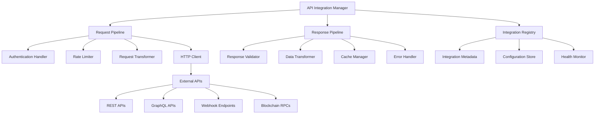

# API Integrations - Standards and Conventions

This document defines the standards and conventions for integrating with external APIs and services within the Token Nexus Platform. API integrations enable the platform to connect with third-party services, blockchain networks, and external data sources.

## Table of Contents

1. [Architecture Overview](#architecture-overview)
2. [Integration Types and Categories](#integration-types-and-categories)
3. [Implementation Standards](#implementation-standards)
4. [Authentication and Security](#authentication-and-security)
5. [Rate Limiting and Throttling](#rate-limiting-and-throttling)
6. [Error Handling and Retry Logic](#error-handling-and-retry-logic)
7. [Data Transformation and Validation](#data-transformation-and-validation)
8. [Caching and Performance](#caching-and-performance)
9. [Monitoring and Observability](#monitoring-and-observability)
10. [Testing Standards](#testing-standards)
11. [Implementation Checklist](#implementation-checklist)
12. [Examples and Templates](#examples-and-templates)

## Architecture Overview

API integrations operate through a layered architecture that provides consistent patterns for external service communication:



### Core Principles

1. **Consistency**: Standardized patterns for all external integrations
2. **Reliability**: Robust error handling and retry mechanisms
3. **Security**: Secure authentication and data transmission
4. **Performance**: Efficient caching and request optimization
5. **Observability**: Comprehensive monitoring and logging
6. **Maintainability**: Clear separation of concerns and testable code

## Integration Types and Categories

### Integration Categories

```typescript
enum IntegrationType {
  REST_API = 'rest-api',
  GRAPHQL_API = 'graphql-api',
  WEBHOOK = 'webhook',
  BLOCKCHAIN_RPC = 'blockchain-rpc',
  DATABASE = 'database',
  MESSAGE_QUEUE = 'message-queue',
  FILE_STORAGE = 'file-storage',
  AUTHENTICATION = 'authentication',
  PAYMENT = 'payment',
  NOTIFICATION = 'notification',
  ANALYTICS = 'analytics',
  AI_SERVICE = 'ai-service'
}

enum IntegrationScope {
  SYSTEM = 'system',
  ORGANIZATION = 'organization',
  USER = 'user',
  APPLICATION = 'application'
}

enum IntegrationSecurity {
  PUBLIC = 'public',
  AUTHENTICATED = 'authenticated',
  PRIVATE = 'private'
}

enum IntegrationReliability {
  CRITICAL = 'critical',
  HIGH = 'high',
  MEDIUM = 'medium',
  LOW = 'low'
}
```

### Integration Metadata Schema

```typescript
interface IntegrationMetadata {
  id: string;
  name: string;
  type: IntegrationType;
  scope: IntegrationScope;
  security: IntegrationSecurity;
  reliability: IntegrationReliability;
  description: string;
  version: string;
  baseUrl: string;
  authentication: AuthenticationConfig;
  rateLimit: RateLimitConfig;
  retry: RetryConfig;
  timeout: TimeoutConfig;
  caching: CachingConfig;
  monitoring: MonitoringConfig;
  transformation: TransformationConfig;
  validation: ValidationConfig;
  tags: string[];
  dependencies: string[];
  healthCheck: HealthCheckConfig;
}

interface AuthenticationConfig {
  type: AuthenticationType;
  credentials: CredentialConfig;
  refreshable: boolean;
  expirationHandling: ExpirationHandling;
}

interface RateLimitConfig {
  enabled: boolean;
  requests: number;
  window: number; // seconds
  burst: number;
  strategy: RateLimitStrategy;
}

interface RetryConfig {
  enabled: boolean;
  maxAttempts: number;
  backoffStrategy: BackoffStrategy;
  retryableErrors: string[];
  nonRetryableErrors: string[];
}

interface TimeoutConfig {
  connect: number; // milliseconds
  request: number; // milliseconds
  response: number; // milliseconds
}

interface CachingConfig {
  enabled: boolean;
  ttl: number; // seconds
  strategy: CacheStrategy;
  keyPattern: string;
  invalidationRules: InvalidationRule[];
}

interface MonitoringConfig {
  enabled: boolean;
  metrics: MetricConfig[];
  alerts: AlertConfig[];
  logging: LoggingConfig;
}

interface TransformationConfig {
  request: TransformationRule[];
  response: TransformationRule[];
  errorMapping: ErrorMappingRule[];
}

interface ValidationConfig {
  request: ValidationRule[];
  response: ValidationRule[];
  strict: boolean;
}

interface HealthCheckConfig {
  enabled: boolean;
  endpoint: string;
  interval: number; // seconds
  timeout: number; // milliseconds
  healthyThreshold: number;
  unhealthyThreshold: number;
}
```

## Implementation Standards

### Base Integration Manager

All API integrations must use the [`IntegrationManager`](../src/integrations/IntegrationManager.ts) class:

```typescript
// IntegrationManager.ts
import { IntegrationMetadata, IntegrationRequest, IntegrationResponse } from '@/types/integration';
import { AuthenticationService } from '@/services/authentication';
import { RateLimiter } from '@/services/rate-limiter';
import { CacheService } from '@/services/cache';
import { MonitoringService } from '@/services/monitoring';
import { ValidationService } from '@/services/validation';
import { TransformationService } from '@/services/transformation';

export class IntegrationManager {
  private integrations: Map<string, IntegrationMetadata> = new Map();
  private clients: Map<string, HttpClient> = new Map();
  private rateLimiters: Map<string, RateLimiter> = new Map();
  
  private authService: AuthenticationService;
  private cacheService: CacheService;
  private monitoringService: MonitoringService;
  private validationService: ValidationService;
  private transformationService: TransformationService;

  constructor() {
    this.authService = new AuthenticationService();
    this.cacheService = new CacheService();
    this.monitoringService = new MonitoringService();
    this.validationService = new ValidationService();
    this.transformationService = new TransformationService();
  }

  // Register integration
  registerIntegration(metadata: IntegrationMetadata): void {
    this.validateIntegrationMetadata(metadata);
    this.integrations.set(metadata.id, metadata);
    
    // Initialize HTTP client
    this.initializeClient(metadata);
    
    // Initialize rate limiter
    if (metadata.rateLimit.enabled) {
      this.initializeRateLimiter(metadata);
    }
    
    // Start health monitoring
    if (metadata.healthCheck.enabled) {
      this.startHealthMonitoring(metadata);
    }
  }

  // Execute integration request
  async execute<T = any>(
    integrationId: string,
    request: IntegrationRequest,
    context?: IntegrationContext
  ): Promise<IntegrationResponse<T>> {
    const startTime = Date.now();
    const metadata = this.getIntegrationMetadata(integrationId);
    
    try {
      // Pre-execution validation
      await this.validateRequest(metadata, request);
      
      // Check cache first
      const cachedResponse = await this.getCachedResponse<T>(metadata, request, context);
      if (cachedResponse) {
        this.recordMetrics(metadata, 'cache_hit', Date.now() - startTime);
        return cachedResponse;
      }

      // Rate limiting
      await this.checkRateLimit(metadata, context);

      // Authentication
      const authenticatedRequest = await this.authenticateRequest(metadata, request, context);

      // Request transformation
      const transformedRequest = await this.transformRequest(metadata, authenticatedRequest);

      // Execute request
      const response = await this.executeRequest<T>(metadata, transformedRequest, context);

      // Response transformation
      const transformedResponse = await this.transformResponse(metadata, response);

      // Response validation
      await this.validateResponse(metadata, transformedResponse);

      // Cache response
      await this.cacheResponse(metadata, request, transformedResponse, context);

      // Record metrics
      this.recordMetrics(metadata, 'success', Date.now() - startTime);

      return transformedResponse;

    } catch (error) {
      // Error handling and retry logic
      const handledError = await this.handleError(metadata, error, request, context);
      
      // Record error metrics
      this.recordMetrics(metadata, 'error', Date.now() - startTime, handledError);
      
      throw handledError;
    }
  }

  // Batch execution
  async executeBatch<T = any>(
    requests: BatchIntegrationRequest[]
  ): Promise<BatchIntegrationResponse<T>> {
    const results: IntegrationResponse<T>[] = [];
    const errors: IntegrationError[] = [];

    // Group requests by integration for optimization
    const groupedRequests = this.groupRequestsByIntegration(requests);

    for (const [integrationId, integrationRequests] of groupedRequests) {
      const metadata = this.getIntegrationMetadata(integrationId);
      
      // Execute requests in parallel with concurrency control
      const concurrency = metadata.rateLimit.burst || 5;
      const chunks = this.chunkArray(integrationRequests, concurrency);

      for (const chunk of chunks) {
        const promises = chunk.map(async (req) => {
          try {
            const response = await this.execute<T>(integrationId, req.request, req.context);
            results.push(response);
          } catch (error) {
            errors.push({
              requestId: req.id,
              integrationId,
              error: error as Error
            });
          }
        });

        await Promise.all(promises);
      }
    }

    return {
      results,
      errors,
      totalRequests: requests.length,
      successCount: results.length,
      errorCount: errors.length
    };
  }

  // Request execution with retry logic
  private async executeRequest<T>(
    metadata: IntegrationMetadata,
    request: IntegrationRequest,
    context?: IntegrationContext
  ): Promise<IntegrationResponse<T>> {
    const client = this.getClient(metadata.id);
    let lastError: Error;

    for (let attempt = 1; attempt <= (metadata.retry.maxAttempts || 1); attempt++) {
      try {
        const response = await client.request<T>({
          method: request.method,
          url: request.url,
          headers: request.headers,
          data: request.data,
          timeout: metadata.timeout.request
        });

        return {
          data: response.data,
          status: response.status,
          headers: response.headers,
          metadata: {
            integrationId: metadata.id,
            attempt,
            timestamp: new Date(),
            cached: false
          }
        };

      } catch (error) {
        lastError = error as Error;
        
        // Check if error is retryable
        if (!this.isRetryableError(metadata, error as Error) || attempt === metadata.retry.maxAttempts) {
          throw error;
        }

        // Calculate backoff delay
        const delay = this.calculateBackoffDelay(metadata.retry.backoffStrategy, attempt);
        await this.sleep(delay);
      }
    }

    throw lastError!;
  }

  // Authentication handling
  private async authenticateRequest(
    metadata: IntegrationMetadata,
    request: IntegrationRequest,
    context?: IntegrationContext
  ): Promise<IntegrationRequest> {
    if (metadata.authentication.type === AuthenticationType.NONE) {
      return request;
    }

    const credentials = await this.getCredentials(metadata, context);
    const authenticatedRequest = { ...request };

    switch (metadata.authentication.type) {
      case AuthenticationType.API_KEY:
        authenticatedRequest.headers = {
          ...authenticatedRequest.headers,
          'Authorization': `Bearer ${credentials.apiKey}`
        };
        break;

      case AuthenticationType.OAUTH2:
        const accessToken = await this.getOAuth2Token(metadata, credentials, context);
        authenticatedRequest.headers = {
          ...authenticatedRequest.headers,
          'Authorization': `Bearer ${accessToken}`
        };
        break;

      case AuthenticationType.BASIC:
        const basicAuth = Buffer.from(`${credentials.username}:${credentials.password}`).toString('base64');
        authenticatedRequest.headers = {
          ...authenticatedRequest.headers,
          'Authorization': `Basic ${basicAuth}`
        };
        break;

      case AuthenticationType.CUSTOM:
        return await this.applyCustomAuthentication(metadata, authenticatedRequest, credentials);

      default:
        throw new Error(`Unsupported authentication type: ${metadata.authentication.type}`);
    }

    return authenticatedRequest;
  }

  // Rate limiting
  private async checkRateLimit(metadata: IntegrationMetadata, context?: IntegrationContext): Promise<void> {
    if (!metadata.rateLimit.enabled) {
      return;
    }

    const rateLimiter = this.rateLimiters.get(metadata.id);
    if (!rateLimiter) {
      throw new Error(`Rate limiter not found for integration: ${metadata.id}`);
    }

    const key = this.generateRateLimitKey(metadata, context);
    const allowed = await rateLimiter.checkLimit(key);

    if (!allowed) {
      throw new RateLimitError(`Rate limit exceeded for integration: ${metadata.id}`);
    }
  }

  // Caching
  private async getCachedResponse<T>(
    metadata: IntegrationMetadata,
    request: IntegrationRequest,
    context?: IntegrationContext
  ): Promise<IntegrationResponse<T> | null> {
    if (!metadata.caching.enabled) {
      return null;
    }

    const cacheKey = this.generateCacheKey(metadata, request, context);
    const cached = await this.cacheService.get<IntegrationResponse<T>>(cacheKey);

    if (cached) {
      // Update metadata to indicate cached response
      cached.metadata.cached = true;
      cached.metadata.timestamp = new Date();
    }

    return cached;
  }

  private async cacheResponse<T>(
    metadata: IntegrationMetadata,
    request: IntegrationRequest,
    response: IntegrationResponse<T>,
    context?: IntegrationContext
  ): Promise<void> {
    if (!metadata.caching.enabled) {
      return;
    }

    const cacheKey = this.generateCacheKey(metadata, request, context);
    await this.cacheService.set(cacheKey, response, metadata.caching.ttl);
  }

  // Request/Response transformation
  private async transformRequest(
    metadata: IntegrationMetadata,
    request: IntegrationRequest
  ): Promise<IntegrationRequest> {
    if (!metadata.transformation.request.length) {
      return request;
    }

    let transformedRequest = { ...request };

    for (const rule of metadata.transformation.request) {
      transformedRequest = await this.transformationService.applyRule(transformedRequest, rule);
    }

    return transformedRequest;
  }

  private async transformResponse<T>(
    metadata: IntegrationMetadata,
    response: IntegrationResponse<T>
  ): Promise<IntegrationResponse<T>> {
    if (!metadata.transformation.response.length) {
      return response;
    }

    let transformedResponse = { ...response };

    for (const rule of metadata.transformation.response) {
      transformedResponse = await this.transformationService.applyRule(transformedResponse, rule);
    }

    return transformedResponse;
  }

  // Validation
  private async validateRequest(metadata: IntegrationMetadata, request: IntegrationRequest): Promise<void> {
    for (const rule of metadata.validation.request) {
      const validation = await this.validationService.validate(request, rule.schema);
      if (!validation.valid) {
        throw new ValidationError(`Request validation failed: ${validation.errors.join(', ')}`);
      }
    }
  }

  private async validateResponse<T>(
    metadata: IntegrationMetadata,
    response: IntegrationResponse<T>
  ): Promise<void> {
    for (const rule of metadata.validation.response) {
      const validation = await this.validationService.validate(response.data, rule.schema);
      if (!validation.valid && metadata.validation.strict) {
        throw new ValidationError(`Response validation failed: ${validation.errors.join(', ')}`);
      }
    }
  }

  // Error handling
  private async handleError(
    metadata: IntegrationMetadata,
    error: Error,
    request: IntegrationRequest,
    context?: IntegrationContext
  ): Promise<IntegrationError> {
    // Map error to standard format
    const mappedError = this.mapError(metadata, error);

    // Log error
    this.logError(metadata, mappedError, request, context);

    // Check if error should trigger circuit breaker
    await this.updateCircuitBreaker(metadata, mappedError);

    return mappedError;
  }

  private mapError(metadata: IntegrationMetadata, error: Error): IntegrationError {
    // Apply error mapping rules
    for (const rule of metadata.transformation.errorMapping) {
      if (this.matchesErrorPattern(error, rule.pattern)) {
        return new IntegrationError(
          rule.message || error.message,
          rule.code || 'INTEGRATION_ERROR',
          error,
          metadata.id
        );
      }
    }

    // Default error mapping
    if (error.name === 'TimeoutError') {
      return new IntegrationError(
        'Integration request timed out',
        'TIMEOUT_ERROR',
        error,
        metadata.id
      );
    }

    if (error.name === 'NetworkError') {
      return new IntegrationError(
        'Network error occurred',
        'NETWORK_ERROR',
        error,
        metadata.id
      );
    }

    return new IntegrationError(
      error.message,
      'INTEGRATION_ERROR',
      error,
      metadata.id
    );
  }

  // Utility methods
  private getIntegrationMetadata(integrationId: string): IntegrationMetadata {
    const metadata = this.integrations.get(integrationId);
    if (!metadata) {
      throw new Error(`Integration not found: ${integrationId}`);
    }
    return metadata;
  }

  private getClient(integrationId: string): HttpClient {
    const client = this.clients.get(integrationId);
    if (!client) {
      throw new Error(`HTTP client not found for integration: ${integrationId}`);
    }
    return client;
  }

  private initializeClient(metadata: IntegrationMetadata): void {
    const client = new HttpClient({
      baseURL: metadata.baseUrl,
      timeout: metadata.timeout.request,
      headers: {
        'User-Agent': 'TokenNexus/1.0',
        'Content-Type': 'application/json'
      }
    });

    this.clients.set(metadata.id, client);
  }

  private initializeRateLimiter(metadata: IntegrationMetadata): void {
    const rateLimiter = new RateLimiter({
      requests: metadata.rateLimit.requests,
      window: metadata.rateLimit.window,
      burst: metadata.rateLimit.burst,
      strategy: metadata.rateLimit.strategy
    });

    this.rateLimiters.set(metadata.id, rateLimiter);
  }

  private generateCacheKey(
    metadata: IntegrationMetadata,
    request: IntegrationRequest,
    context?: IntegrationContext
  ): string {
    const parts = [
      'integration',
      metadata.id,
      request.method,
      request.url,
      this.hashObject(request.data || {}),
      context?.organizationId || 'system',
      context?.userId || 'anonymous'
    ];

    return parts.join(':');
  }

  private generateRateLimitKey(metadata: IntegrationMetadata, context?: IntegrationContext): string {
    const parts = ['rate_limit', metadata.id];
    
    if (context?.organizationId) {
      parts.push('org', context.organizationId);
    }
    
    if (context?.userId) {
      parts.push('user', context.userId);
    }
    
    return parts.join(':');
  }

  private hashObject(obj: any): string {
    const crypto = require('crypto');
    return crypto.createHash('md5').update(JSON.stringify(obj)).digest('hex');
  }

  private isRetryableError(metadata: IntegrationMetadata, error: Error): boolean {
    // Check non-retryable errors first
    for (const pattern of metadata.retry.nonRetryableErrors) {
      if (this.matchesErrorPattern(error, pattern)) {
        return false;
      }
    }

    // Check retryable errors
    for (const pattern of metadata.retry.retryableErrors) {
      if (this.matchesErrorPattern(error, pattern)) {
        return true;
      }
    }

    // Default retryable errors
    const retryableErrors = ['TimeoutError', 'NetworkError', 'ConnectionError'];
    return retryableErrors.includes(error.name);
  }

  private matchesErrorPattern(error: Error, pattern: string): boolean {
    const regex = new RegExp(pattern, 'i');
    return regex.test(error.message) || regex.test(error.name);
  }

  private calculateBackoffDelay(strategy: BackoffStrategy, attempt: number): number {
    switch (strategy) {
      case BackoffStrategy.FIXED:
        return 1000; // 1 second

      case BackoffStrategy.LINEAR:
        return attempt * 1000;

      case BackoffStrategy.EXPONENTIAL:
        return Math.pow(2, attempt - 1) * 1000;

      case BackoffStrategy.EXPONENTIAL_JITTER:
        const exponential = Math.pow(2, attempt - 1) * 1000;
        const jitter = Math.random() * 0.1 * exponential;
        return exponential + jitter;

      default:
        return 1000;
    }
  }

  private sleep(ms: number): Promise<void> {
    return new Promise(resolve => setTimeout(resolve, ms));
  }

  private chunkArray<T>(array: T[], size: number): T[][] {
    const chunks: T[][] = [];
    for (let i = 0; i < array.length; i += size) {
      chunks.push(array.slice(i, i + size));
    }
    return chunks;
  }

  private groupRequestsByIntegration(
    requests: BatchIntegrationRequest[]
  ): Map<string, BatchIntegrationRequest[]> {
    const grouped = new Map<string, BatchIntegrationRequest[]>();
    
    for (const request of requests) {
      const existing = grouped.get(request.integrationId) || [];
      existing.push(request);
      grouped.set(request.integrationId, existing);
    }
    
    return grouped;
  }

  private recordMetrics(
    metadata: IntegrationMetadata,
    type: string,
    duration: number,
    error?: IntegrationError
  ): void {
    this.monitoringService.recordMetric({
      name: 'integration_request',
      value: 1,
      tags: {
        integration_id: metadata.id,
        integration_type: metadata.type,
        result: type,
        error_code: error?.code
      },
      timestamp: new Date()
    });

    this.monitoringService.recordMetric({
      name: 'integration_duration',
      value: duration,
      tags: {
        integration_id: metadata.id,
        integration_type: metadata.type
      },
      timestamp: new Date()
    });
  }

  private logError(
    metadata: IntegrationMetadata,
    error: IntegrationError,
    request: IntegrationRequest,
    context?: IntegrationContext
  ): void {
    console.error('Integration error:', {
      integrationId: metadata.id,
      error: error.message,
      code: error.code,
      request: {
        method: request.method,
        url: request.url
      },
      context
    });
  }

  private validateIntegrationMetadata(metadata: IntegrationMetadata): void {
    if (!metadata.id || !metadata.name || !metadata.type) {
      throw new Error('Integration metadata missing required fields');
    }

    if (!metadata.baseUrl) {
      throw new Error('Integration base URL is required');
    }

    // Validate URL format
    try {
      new URL(metadata.baseUrl);
    } catch (error) {
      throw new Error(`Invalid base URL: ${metadata.baseUrl}`);
    }
  }

  private async startHealthMonitoring(metadata: IntegrationMetadata): Promise<void> {
    // Implementation would start periodic health checks
    console.log(`Starting health monitoring for integration: ${metadata.id}`);
  }

  private async updateCircuitBreaker(metadata: IntegrationMetadata, error: IntegrationError): Promise<void> {
    // Implementation would update circuit breaker state
    console.log(`Updating circuit breaker for integration: ${metadata.id}`);
  }

  private async getCredentials(metadata: IntegrationMetadata, context?: IntegrationContext): Promise<any> {
    // Implementation would retrieve credentials from secure storage
    return {};
  }

  private async getOAuth2Token(
    metadata: IntegrationMetadata,
    credentials: any,
    context?: IntegrationContext
  ): Promise<string> {
    // Implementation would handle OAuth2 token retrieval/refresh
    return 'oauth2_token';
  }

  private async applyCustomAuthentication(
    metadata: IntegrationMetadata,
    request: IntegrationRequest,
    credentials: any
  ): Promise<IntegrationRequest> {
    // Implementation would apply custom authentication logic
    return request;
  }
}

// Supporting types and enums
export enum AuthenticationType {
  NONE = 'none',
  API_KEY = 'api-key',
  OAUTH2 = 'oauth2',
  BASIC = 'basic',
  CUSTOM = 'custom'
}

export enum BackoffStrategy {
  FIXED = 'fixed',
  LINEAR = 'linear',
  EXPONENTIAL = 'exponential',
  EXPONENTIAL_JITTER = 'exponential-jitter'
}

export enum RateLimitStrategy {
  FIXED_WINDOW = 'fixed-window',
  SLIDING_WINDOW = 'sliding-window',
  TOKEN_BUCKET = 'token-bucket'
}

export enum CacheStrategy {
  TTL = 'ttl',
  LRU = 'lru',
  CONDITIONAL = 'conditional'
}

// Error classes
export class IntegrationError extends Error {
  constructor(
    message: string,
    public code: string,
    public originalError?: Error,
    public integrationId?: string
  ) {
    super(message);
    this.name = 'IntegrationError';
  }
}

export class RateLimitError extends IntegrationError {
  constructor(message: string) {
    super(message, 'RATE_LIMIT_EXCEEDED');
    this.name = 'RateLimitError';
  }
}

export class ValidationError extends IntegrationError {
  constructor(message: string) {
    super(message, 'VALIDATION_ERROR');
    this.name = 'ValidationError';
  }
}

// Request/Response interfaces
export interface IntegrationRequest {
  method: string;
  url: string;
  headers?: Record<string, string>;
  data?: any;
  params?: Record<string, any>;
}

export interface IntegrationResponse<T = any> {
  data: T;
  status: number;
  headers: Record<string, string>;
  metadata: ResponseMetadata;
}

export interface ResponseMetadata {
  integrationId: string;
  attempt: number;
  timestamp: Date;
  cached: boolean;
}

export interface IntegrationContext {
  organizationId?: string;
  userId?: string;
  applicationId?: string;
  requestId?: string;
}

export interface BatchIntegrationRequest {
  id: string;
  integrationId: string;
  request: IntegrationRequest;
  context?: IntegrationContext;
}

export interface BatchIntegrationResponse<T = any> {
  results: IntegrationResponse<T>[];
  errors: IntegrationError[];
  totalRequests: number;
  successCount: number;
  errorCount: number;
}
```

### Specific Integration Examples

```typescript
// SlackIntegration.ts
import { IntegrationManager, IntegrationMetadata } from './IntegrationManager';

export class SlackIntegration {
  private integrationManager: IntegrationManager;
  private readonly integrationId = 'slack-api';

  constructor(integrationManager: IntegrationManager) {
    this.integrationManager = integrationManager;
    this.registerIntegration();
  }

  private registerIntegration(): void {
    const metadata: IntegrationMetadata = {
      id: this.integrationId,
      name: 'Slack API',
      type: IntegrationType.REST_API,
      scope: IntegrationScope.ORGANIZATION,
      security: IntegrationSecurity.AUTHENTICATED,
      reliability: IntegrationReliability.HIGH,
      description: 'Slack messaging and notification integration',
      version: '1.0.0',
      baseUrl: 'https://slack.com/api',
      authentication: {
        type: AuthenticationType.API_KEY,
        credentials: {
          source: 'organization_config',
          key: 'slack.bot_token'
        },
        refreshable: false,
        expirationHandling: ExpirationHandling.NONE
      },
      rateLimit: {
        enabled: true,
        requests: 50,
        window: 60,
        burst: 10,
        strategy: RateLimitStrategy.SLIDING_WINDOW
      },
      retry: {
        enabled: true,
        maxAttempts: 3,
        backoffStrategy: BackoffStrategy.EXPONENTIAL_JITTER,
        retryableErrors: ['rate_limited', 'timeout', 'server_error'],
        nonRetryableErrors: ['invalid_auth', 'not_found', 'invalid_arguments']
      },
      timeout: {
        connect: 5000,
        request: 30000,
        response: 30000
      },
      caching: {
        enabled: true,
        ttl: 300,
        strategy: CacheStrategy.TTL,
        keyPattern: 'slack:{method}:{url}:{hash}',
        invalidationRules: []
      },
      monitoring: {
        enabled: true,
        metrics: [
          { name: 'slack_messages_sent', type: 'counter' },
          { name: 'slack_api_latency', type: 'histogram' }
        ],