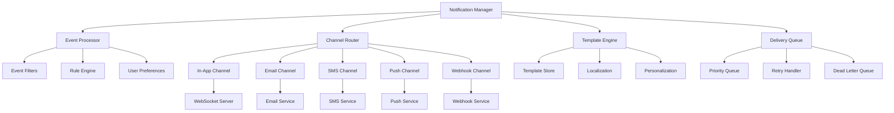

# Notification Systems - Standards and Conventions

This document defines the standards and conventions for implementing notification systems within the Token Nexus Platform. Notification systems enable real-time communication with users through multiple channels including in-app notifications, email, SMS, push notifications, and webhooks.

## Table of Contents

1. [Architecture Overview](#architecture-overview)
2. [Notification Types and Categories](#notification-types-and-categories)
3. [Implementation Standards](#implementation-standards)
4. [Channel Management](#channel-management)
5. [Template System](#template-system)
6. [Delivery and Retry Logic](#delivery-and-retry-logic)
7. [User Preferences and Subscriptions](#user-preferences-and-subscriptions)
8. [Real-time Notifications](#real-time-notifications)
9. [Analytics and Tracking](#analytics-and-tracking)
10. [Testing Standards](#testing-standards)
11. [Implementation Checklist](#implementation-checklist)
12. [Examples and Templates](#examples-and-templates)

## Architecture Overview

The notification system operates through a multi-channel architecture that supports various delivery mechanisms and user preferences:



### Core Principles

1. **Multi-Channel**: Support for various notification channels
2. **User-Centric**: Respect user preferences and subscription settings
3. **Reliable Delivery**: Robust retry mechanisms and failure handling
4. **Real-Time**: Immediate delivery for time-sensitive notifications
5. **Scalable**: Handle high-volume notification scenarios
6. **Personalized**: Context-aware and personalized content
7. **Compliant**: Respect privacy regulations and opt-out requirements

## Notification Types and Categories

### Notification Categories

```typescript
enum NotificationCategory {
  SYSTEM = 'system',
  SECURITY = 'security',
  WORKFLOW = 'workflow',
  COLLABORATION = 'collaboration',
  MARKETING = 'marketing',
  TRANSACTIONAL = 'transactional',
  REMINDER = 'reminder',
  ALERT = 'alert',
  UPDATE = 'update',
  SOCIAL = 'social'
}

enum NotificationPriority {
  CRITICAL = 'critical',
  HIGH = 'high',
  MEDIUM = 'medium',
  LOW = 'low'
}

enum NotificationChannel {
  IN_APP = 'in-app',
  EMAIL = 'email',
  SMS = 'sms',
  PUSH = 'push',
  WEBHOOK = 'webhook',
  SLACK = 'slack',
  TEAMS = 'teams'
}

enum NotificationStatus {
  PENDING = 'pending',
  PROCESSING = 'processing',
  SENT = 'sent',
  DELIVERED = 'delivered',
  READ = 'read',
  FAILED = 'failed',
  CANCELLED = 'cancelled'
}

enum DeliveryStrategy {
  IMMEDIATE = 'immediate',
  BATCHED = 'batched',
  SCHEDULED = 'scheduled',
  DIGEST = 'digest'
}
```

### Notification Metadata Schema

```typescript
interface NotificationMetadata {
  id: string;
  type: string;
  category: NotificationCategory;
  priority: NotificationPriority;
  title: string;
  message: string;
  data: Record<string, any>;
  channels: NotificationChannel[];
  recipients: NotificationRecipient[];
  sender: NotificationSender;
  template: TemplateConfig;
  delivery: DeliveryConfig;
  tracking: TrackingConfig;
  expiration: ExpirationConfig;
  localization: LocalizationConfig;
  personalization: PersonalizationConfig;
  compliance: ComplianceConfig;
  organizationId?: string;
  applicationId?: string;
  workflowId?: string;
  tags: string[];
  createdAt: Date;
  scheduledAt?: Date;
}

interface NotificationRecipient {
  id: string;
  type: RecipientType;
  address: string;
  preferences: UserPreferences;
  context: RecipientContext;
}

interface NotificationSender {
  id: string;
  name: string;
  email?: string;
  avatar?: string;
  type: SenderType;
}

interface TemplateConfig {
  templateId: string;
  variables: Record<string, any>;
  fallback: FallbackTemplate;
}

interface DeliveryConfig {
  strategy: DeliveryStrategy;
  delay: number;
  batchSize: number;
  retryPolicy: RetryPolicy;
  channels: ChannelConfig[];
}

interface TrackingConfig {
  enabled: boolean;
  events: TrackingEvent[];
  analytics: AnalyticsConfig;
}

interface ExpirationConfig {
  enabled: boolean;
  ttl: number; // seconds
  action: ExpirationAction;
}

interface LocalizationConfig {
  enabled: boolean;
  defaultLocale: string;
  supportedLocales: string[];
  autoDetect: boolean;
}

interface PersonalizationConfig {
  enabled: boolean;
  rules: PersonalizationRule[];
  fallback: PersonalizationFallback;
}

interface ComplianceConfig {
  gdprCompliant: boolean;
  canSpamCompliant: boolean;
  optOutRequired: boolean;
  dataRetention: number; // days
}
```

## Implementation Standards

### Base Notification Manager

All notification functionality must use the [`NotificationManager`](../src/notifications/NotificationManager.ts) class:

```typescript
// NotificationManager.ts
import { NotificationMetadata, NotificationRequest, NotificationResult } from '@/types/notification';
import { ChannelManager } from './ChannelManager';
import { TemplateEngine } from './TemplateEngine';
import { UserPreferencesService } from '@/services/user-preferences';
import { QueueService } from '@/services/queue';
import { AnalyticsService } from '@/services/analytics';
import { ComplianceService } from '@/services/compliance';

export class NotificationManager {
  private channels: Map<NotificationChannel, ChannelHandler> = new Map();
  private templates: TemplateEngine;
  private userPreferences: UserPreferencesService;
  private queue: QueueService;
  private analytics: AnalyticsService;
  private compliance: ComplianceService;

  constructor() {
    this.templates = new TemplateEngine();
    this.userPreferences = new UserPreferencesService();
    this.queue = new QueueService();
    this.analytics = new AnalyticsService();
    this.compliance = new ComplianceService();
    
    this.initializeChannels();
  }

  // Send notification
  async send(request: NotificationRequest): Promise<NotificationResult> {
    try {
      // Validate request
      await this.validateRequest(request);

      // Check compliance
      await this.checkCompliance(request);

      // Process recipients and preferences
      const processedRecipients = await this.processRecipients(request);

      // Create notification metadata
      const notification = await this.createNotification(request, processedRecipients);

      // Route to appropriate delivery strategy
      const result = await this.routeNotification(notification);

      // Track notification creation
      await this.trackNotificationEvent(notification, 'created');

      return result;

    } catch (error) {
      console.error('Notification send failed:', error);
      throw new NotificationError(`Failed to send notification: ${error.message}`);
    }
  }

  // Send bulk notifications
  async sendBulk(requests: NotificationRequest[]): Promise<BulkNotificationResult> {
    const results: NotificationResult[] = [];
    const errors: NotificationError[] = [];

    // Process in batches for better performance
    const batchSize = 100;
    const batches = this.chunkArray(requests, batchSize);

    for (const batch of batches) {
      const promises = batch.map(async (request) => {
        try {
          const result = await this.send(request);
          results.push(result);
        } catch (error) {
          errors.push(new NotificationError(error.message, request.id));
        }
      });

      await Promise.all(promises);
    }

    return {
      results,
      errors,
      totalRequests: requests.length,
      successCount: results.length,
      errorCount: errors.length
    };
  }

  // Schedule notification
  async schedule(request: NotificationRequest, scheduledAt: Date): Promise<ScheduledNotificationResult> {
    try {
      // Validate scheduling parameters
      if (scheduledAt <= new Date()) {
        throw new Error('Scheduled time must be in the future');
      }

      // Create scheduled notification
      const notification = await this.createNotification(request, []);
      notification.scheduledAt = scheduledAt;
      notification.status = NotificationStatus.PENDING;

      // Store in database
      await this.storeScheduledNotification(notification);

      // Schedule in queue
      const delay = scheduledAt.getTime() - Date.now();
      await this.queue.schedule('notification-delivery', notification, delay);

      return {
        notificationId: notification.id,
        scheduledAt: scheduledAt,
        status: 'scheduled'
      };

    } catch (error) {
      throw new NotificationError(`Failed to schedule notification: ${error.message}`);
    }
  }

  // Cancel notification
  async cancel(notificationId: string): Promise<void> {
    try {
      // Update notification status
      await this.updateNotificationStatus(notificationId, NotificationStatus.CANCELLED);

      // Remove from queue if pending
      await this.queue.remove('notification-delivery', notificationId);

      // Track cancellation
      await this.trackNotificationEvent({ id: notificationId } as NotificationMetadata, 'cancelled');

    } catch (error) {
      throw new NotificationError(`Failed to cancel notification: ${error.message}`);
    }
  }

  // Get notification status
  async getStatus(notificationId: string): Promise<NotificationStatusResult> {
    try {
      const notification = await this.getNotification(notificationId);
      const deliveryStatus = await this.getDeliveryStatus(notificationId);

      return {
        notificationId,
        status: notification.status,
        createdAt: notification.createdAt,
        scheduledAt: notification.scheduledAt,
        deliveredAt: deliveryStatus.deliveredAt,
        readAt: deliveryStatus.readAt,
        channels: deliveryStatus.channels,
        recipients: deliveryStatus.recipients
      };

    } catch (error) {
      throw new NotificationError(`Failed to get notification status: ${error.message}`);
    }
  }

  // Process notification routing
  private async routeNotification(notification: NotificationMetadata): Promise<NotificationResult> {
    switch (notification.delivery.strategy) {
      case DeliveryStrategy.IMMEDIATE:
        return await this.deliverImmediate(notification);

      case DeliveryStrategy.BATCHED:
        return await this.deliverBatched(notification);

      case DeliveryStrategy.SCHEDULED:
        return await this.deliverScheduled(notification);

      case DeliveryStrategy.DIGEST:
        return await this.deliverDigest(notification);

      default:
        throw new Error(`Unsupported delivery strategy: ${notification.delivery.strategy}`);
    }
  }

  // Immediate delivery
  private async deliverImmediate(notification: NotificationMetadata): Promise<NotificationResult> {
    const deliveryResults: ChannelDeliveryResult[] = [];

    // Process each channel in parallel
    const channelPromises = notification.channels.map(async (channel) => {
      try {
        const handler = this.getChannelHandler(channel);
        const result = await handler.deliver(notification);
        deliveryResults.push(result);
      } catch (error) {
        deliveryResults.push({
          channel,
          status: 'failed',
          error: error.message,
          timestamp: new Date()
        });
      }
    });

    await Promise.all(channelPromises);

    // Update notification status
    const overallStatus = this.calculateOverallStatus(deliveryResults);
    await this.updateNotificationStatus(notification.id, overallStatus);

    return {
      notificationId: notification.id,
      status: overallStatus,
      channels: deliveryResults,
      timestamp: new Date()
    };
  }

  // Batched delivery
  private async deliverBatched(notification: NotificationMetadata): Promise<NotificationResult> {
    // Add to batch queue
    await this.queue.add('notification-batch', notification, {
      delay: notification.delivery.delay,
      priority: this.getPriorityScore(notification.priority)
    });

    return {
      notificationId: notification.id,
      status: NotificationStatus.PROCESSING,
      channels: [],
      timestamp: new Date()
    };
  }

  // Scheduled delivery
  private async deliverScheduled(notification: NotificationMetadata): Promise<NotificationResult> {
    if (!notification.scheduledAt) {
      throw new Error('Scheduled delivery requires scheduledAt timestamp');
    }

    const delay = notification.scheduledAt.getTime() - Date.now();
    
    await this.queue.schedule('notification-delivery', notification, delay);

    return {
      notificationId: notification.id,
      status: NotificationStatus.PENDING,
      channels: [],
      timestamp: new Date()
    };
  }

  // Digest delivery
  private async deliverDigest(notification: NotificationMetadata): Promise<NotificationResult> {
    // Add to digest queue grouped by recipient and category
    for (const recipient of notification.recipients) {
      const digestKey = `${recipient.id}:${notification.category}`;
      await this.queue.add('notification-digest', {
        digestKey,
        notification,
        recipient
      });
    }

    return {
      notificationId: notification.id,
      status: NotificationStatus.PROCESSING,
      channels: [],
      timestamp: new Date()
    };
  }

  // Recipient processing
  private async processRecipients(request: NotificationRequest): Promise<NotificationRecipient[]> {
    const processedRecipients: NotificationRecipient[] = [];

    for (const recipient of request.recipients) {
      // Get user preferences
      const preferences = await this.userPreferences.getPreferences(recipient.id);

      // Check if user has opted out of this category
      if (this.isOptedOut(preferences, request.category)) {
        continue;
      }

      // Filter channels based on preferences
      const allowedChannels = this.filterChannelsByPreferences(request.channels, preferences);

      if (allowedChannels.length === 0) {
        continue;
      }

      processedRecipients.push({
        ...recipient,
        preferences,
        allowedChannels
      });
    }

    return processedRecipients;
  }

  // Template processing
  private async processTemplate(
    notification: NotificationMetadata,
    channel: NotificationChannel,
    recipient: NotificationRecipient
  ): Promise<ProcessedTemplate> {
    try {
      // Get template for channel
      const template = await this.templates.getTemplate(
        notification.template.templateId,
        channel,
        recipient.preferences.locale
      );

      // Prepare template variables
      const variables = {
        ...notification.template.variables,
        recipient: {
          name: recipient.name,
          email: recipient.email,
          preferences: recipient.preferences
        },
        sender: notification.sender,
        organization: await this.getOrganizationContext(notification.organizationId),
        notification: {
          id: notification.id,
          category: notification.category,
          priority: notification.priority
        }
      };

      // Render template
      const rendered = await this.templates.render(template, variables);

      // Apply personalization
      const personalized = await this.applyPersonalization(rendered, notification, recipient);

      return personalized;

    } catch (error) {
      // Fall back to default template
      console.warn(`Template processing failed, using fallback: ${error.message}`);
      return await this.getFallbackTemplate(notification, channel, recipient);
    }
  }

  // Channel management
  private getChannelHandler(channel: NotificationChannel): ChannelHandler {
    const handler = this.channels.get(channel);
    if (!handler) {
      throw new Error(`Channel handler not found: ${channel}`);
    }
    return handler;
  }

  private initializeChannels(): void {
    this.channels.set(NotificationChannel.IN_APP, new InAppChannelHandler());
    this.channels.set(NotificationChannel.EMAIL, new EmailChannelHandler());
    this.channels.set(NotificationChannel.SMS, new SMSChannelHandler());
    this.channels.set(NotificationChannel.PUSH, new PushChannelHandler());
    this.channels.set(NotificationChannel.WEBHOOK, new WebhookChannelHandler());
    this.channels.set(NotificationChannel.SLACK, new SlackChannelHandler());
    this.channels.set(NotificationChannel.TEAMS, new TeamsChannelHandler());
  }

  // User preferences
  private isOptedOut(preferences: UserPreferences, category: NotificationCategory): boolean {
    return preferences.optOuts?.includes(category) || false;
  }

  private filterChannelsByPreferences(
    channels: NotificationChannel[],
    preferences: UserPreferences
  ): NotificationChannel[] {
    return channels.filter(channel => {
      const channelPrefs = preferences.channels?.[channel];
      return channelPrefs?.enabled !== false;
    });
  }

  // Compliance checking
  private async checkCompliance(request: NotificationRequest): Promise<void> {
    // Check GDPR compliance
    if (request.compliance?.gdprCompliant) {
      await this.compliance.validateGDPRCompliance(request);
    }

    // Check CAN-SPAM compliance
    if (request.compliance?.canSpamCompliant) {
      await this.compliance.validateCanSpamCompliance(request);
    }

    // Check opt-out requirements
    if (request.compliance?.optOutRequired) {
      await this.compliance.validateOptOutCompliance(request);
    }
  }

  // Analytics and tracking
  private async trackNotificationEvent(
    notification: NotificationMetadata,
    event: string,
    data?: any
  ): Promise<void> {
    await this.analytics.track({
      event: `notification_${event}`,
      properties: {
        notificationId: notification.id,
        type: notification.type,
        category: notification.category,
        priority: notification.priority,
        channels: notification.channels,
        recipientCount: notification.recipients.length,
        organizationId: notification.organizationId,
        ...data
      },
      timestamp: new Date()
    });
  }

  // Utility methods
  private calculateOverallStatus(results: ChannelDeliveryResult[]): NotificationStatus {
    if (results.every(r => r.status === 'delivered')) {
      return NotificationStatus.DELIVERED;
    }
    
    if (results.some(r => r.status === 'delivered' || r.status === 'sent')) {
      return NotificationStatus.SENT;
    }
    
    if (results.every(r => r.status === 'failed')) {
      return NotificationStatus.FAILED;
    }
    
    return NotificationStatus.PROCESSING;
  }

  private getPriorityScore(priority: NotificationPriority): number {
    switch (priority) {
      case NotificationPriority.CRITICAL: return 100;
      case NotificationPriority.HIGH: return 75;
      case NotificationPriority.MEDIUM: return 50;
      case NotificationPriority.LOW: return 25;
      default: return 50;
    }
  }

  private chunkArray<T>(array: T[], size: number): T[][] {
    const chunks: T[][] = [];
    for (let i = 0; i < array.length; i += size) {
      chunks.push(array.slice(i, i + size));
    }
    return chunks;
  }

  private async createNotification(
    request: NotificationRequest,
    recipients: NotificationRecipient[]
  ): Promise<NotificationMetadata> {
    return {
      id: this.generateNotificationId(),
      type: request.type,
      category: request.category,
      priority: request.priority || NotificationPriority.MEDIUM,
      title: request.title,
      message: request.message,
      data: request.data || {},
      channels: request.channels,
      recipients,
      sender: request.sender,
      template: request.template,
      delivery: request.delivery || { strategy: DeliveryStrategy.IMMEDIATE },
      tracking: request.tracking || { enabled: true, events: [] },
      expiration: request.expiration,
      localization: request.localization,
      personalization: request.personalization,
      compliance: request.compliance,
      organizationId: request.organizationId,
      applicationId: request.applicationId,
      workflowId: request.workflowId,
      tags: request.tags || [],
      createdAt: new Date(),
      scheduledAt: request.scheduledAt
    };
  }

  private generateNotificationId(): string {
    return `notif_${Date.now()}_${Math.random().toString(36).substr(2, 9)}`;
  }

  private async validateRequest(request: NotificationRequest): Promise<void> {
    if (!request.type || !request.title || !request.message) {
      throw new Error('Notification request missing required fields');
    }

    if (!request.recipients || request.recipients.length === 0) {
      throw new Error('Notification request must have at least one recipient');
    }

    if (!request.channels || request.channels.length === 0) {
      throw new Error('Notification request must specify at least one channel');
    }
  }

  private async storeScheduledNotification(notification: NotificationMetadata): Promise<void> {
    // Implementation would store in database
    console.log(`Storing scheduled notification: ${notification.id}`);
  }

  private async updateNotificationStatus(notificationId: string, status: NotificationStatus): Promise<void> {
    // Implementation would update in database
    console.log(`Updating notification ${notificationId} status to ${status}`);
  }

  private async getNotification(notificationId: string): Promise<NotificationMetadata> {
    // Implementation would retrieve from database
    throw new Error('Not implemented');
  }

  private async getDeliveryStatus(notificationId: string): Promise<any> {
    // Implementation would retrieve delivery status
    return {};
  }

  private async getOrganizationContext(organizationId?: string): Promise<any> {
    // Implementation would retrieve organization context
    return {};
  }

  private async applyPersonalization(
    template: ProcessedTemplate,
    notification: NotificationMetadata,
    recipient: NotificationRecipient
  ): Promise<ProcessedTemplate> {
    // Implementation would apply personalization rules
    return template;
  }

  private async getFallbackTemplate(
    notification: NotificationMetadata,
    channel: NotificationChannel,
    recipient: NotificationRecipient
  ): Promise<ProcessedTemplate> {
    // Implementation would return fallback template
    return {
      subject: notification.title,
      body: notification.message,
      html: `<p>${notification.message}</p>`
    };
  }
}

// Channel handlers
export abstract class ChannelHandler {
  abstract deliver(notification: NotificationMetadata): Promise<ChannelDeliveryResult>;
  
  protected async processTemplate(
    notification: NotificationMetadata,
    channel: NotificationChannel
  ): Promise<ProcessedTemplate> {
    // Common template processing logic
    return {
      subject: notification.title,
      body: notification.message,
      html: `<p>${notification.message}</p>`
    };
  }
}

// In-app notification handler
export class InAppChannelHandler extends ChannelHandler {
  async deliver(notification: NotificationMetadata): Promise<ChannelDeliveryResult> {
    try {
      // Store in database for in-app display
      await this.storeInAppNotification(notification);

      // Send real-time update via WebSocket
      await this.sendRealTimeUpdate(notification);

      return {
        channel: NotificationChannel.IN_APP,
        status: 'delivered',
        timestamp: new Date(),
        metadata: {
          stored: true,
          realTime: true
        }
      };

    } catch (error) {
      return {
        channel: NotificationChannel.IN_APP,
        status: 'failed',
        error: error.message,
        timestamp: new Date()
      };
    }
  }

  private async storeInAppNotification(notification: NotificationMetadata): Promise<void> {
    // Implementation would store in database
    console.log(`Storing in-app notification: ${notification.id}`);
  }

  private async sendRealTimeUpdate(notification: NotificationMetadata): Promise<void> {
    // Implementation would send via WebSocket
    console.log(`Sending real-time update: ${notification.id}`);
  }
}

// Email notification handler
export class EmailChannelHandler extends ChannelHandler {
  async deliver(notification: NotificationMetadata): Promise<ChannelDeliveryResult> {
    try {
      const template = await this.processTemplate(notification, NotificationChannel.EMAIL);

      // Send email via email service
      const result = await this.sendEmail(notification, template);

      return {
        channel: NotificationChannel.EMAIL,
        status: 'sent',
        timestamp: new Date(),
        metadata: {
          messageId: result.messageId,
          provider: result.provider
        }
      };

    } catch (error) {
      return {
        channel: NotificationChannel.EMAIL,
        status: 'failed',
        error: error.message,
        timestamp: new Date()
      };
    }
  }

  private async sendEmail(notification: NotificationMetadata, template: ProcessedTemplate): Promise<any> {
    // Implementation would send via email service (SendGrid, SES, etc.)
    return {
      messageId: 'email_123',
      provider: 'sendgrid'
    };
  }
}

// Supporting types and interfaces
export interface NotificationRequest {
  id?: string;
  type: string;
  category: NotificationCategory;
  priority?: NotificationPriority;
  title: string;
  message: string;
  data?: Record<string, any>;
  channels: NotificationChannel[];
  recipients: NotificationRecipient[];
  sender: NotificationSender;
  template: TemplateConfig;
  delivery?: DeliveryConfig;
  tracking?: TrackingConfig;
  expiration?: ExpirationConfig;
  localization?: LocalizationConfig;
  personalization?: PersonalizationConfig;
  compliance?: ComplianceConfig;
  organizationId?: string;
  applicationId?: string;
  workflowId?: string;
  tags?: string[];
  scheduledAt?: Date;
}

export interface NotificationResult {
  notificationId: string;
  status: NotificationStatus;
  channels: ChannelDeliveryResult[];
  timestamp: Date;
}

export interface ChannelDeliveryResult {
  channel: NotificationChannel;
  status: 'sent' | 'delivered' | 'failed' | 'pending';
  timestamp: Date;
  error?: string;
  metadata?: Record<string, any>;
}

export interface ProcessedTemplate {
  subject: string;
  body: string;
  html?: string;
  attachments?: Attachment[];
}

export interface BulkNotificationResult {
  results: NotificationResult[];
  errors: NotificationError[];
  totalRequests: number;
  successCount: number;
  errorCount: number;
}

export interface ScheduledNotificationResult {
  notificationId: string;
  scheduledAt: Date;
  status: string;
}

export interface NotificationStatusResult {
  notificationId: string;
  status: NotificationStatus;
  createdAt: Date;
  scheduledAt?: Date;
  deliveredAt?: Date;
  readAt?: Date;
  channels: ChannelDeliveryResult[];
  recipients: RecipientStatus[];
}

// Error classes
export class NotificationError extends Error {
  constructor(message: string, public requestId?: string) {
    super(message);
    this.name = 'NotificationError';
  }
}

// Global notification instance
export const notificationManager = new NotificationManager();

// Convenience functions
export async function sendNotification(request: NotificationRequest): Promise<NotificationResult> {
  return notificationManager.send(request);
}

export async function scheduleNotification(
  request: NotificationRequest,
  scheduledAt: Date
): Promise<ScheduledNotificationResult> {
  return notificationManager.schedule(request, scheduledAt);
}

export async function cancelNotification(notificationId: string): Promise<void> {
  return notificationManager.cancel(notificationId);
}

export async function getNotificationStatus(notificationId: string): Promise<NotificationStatusResult> {
  return notificationManager.getStatus(notificationId);
}
```

### Real-time Notification Example

```typescript
// RealTimeNotificationService.ts
import { WebSocketServer } from 'ws';
import { NotificationMetadata } from './NotificationManager';

export class RealTimeNotificationService {
  private wss: WebSocketServer;
  private connections: Map<string, WebSocket[]> = new Map();

  constructor(port: number = 8080) {
    this.wss = new WebSocketServer({ port });
    this.setupWebSocketServer();
  }

  private setupWebSocketServer(): void {
    this.wss.on('connection', (ws, request) => {
      // Extract user ID from authentication
      const userId = this.extractUserIdFromRequest(request);
      
      if (!userId) {
        ws.close(1008, 'Authentication required');
        return;
      }

      // Store connection
      this.addConnection(userId, ws);

      // Handle connection events
      ws.on('close', () => {
        this.removeConnection(userId, ws);
      });

      ws.on('error', (error) => {
        console.error(`WebSocket error for user ${userId}:`, error);
        this.removeConnection(userId, ws);
      });

      // Send initial connection confirmation
      ws.send(JSON.stringify({
        type: 'connection_established',
        userId,
        timestamp: new Date()
      }));
    });
  }

  // Send real-time notification to user
  async sendToUser(userId: string, notification: NotificationMetadata): Promise<void> {
    const connections = this.connections.get(userId) || [];
    
    const message = JSON.stringify({
      type: 'notification',
      data: {
        id: notification.id,
        title: notification.title,
        message: notification.message,
        category: notification.category,
        priority: notification.priority,
        data: notification.data,
        timestamp: notification.createdAt
      }
    });

    // Send to all active connections for the user
    const promises = connections.map(async (ws) => {
      if (ws.readyState === WebSocket.OPEN) {
        try {
          ws.send(message);
        } catch (error) {
          console.error(`Failed to send notification to user ${userId}:`, error);
          this.remove