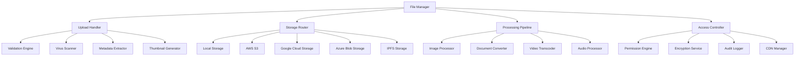

# File Management - Standards and Conventions

This document defines the standards and conventions for file management within the Token Nexus Platform. File management encompasses file uploads, storage, processing, versioning, security, and lifecycle management across various storage providers and use cases.

## Table of Contents

1. [Architecture Overview](#architecture-overview)
2. [File Types and Categories](#file-types-and-categories)
3. [Implementation Standards](#implementation-standards)
4. [Storage Providers](#storage-providers)
5. [Upload and Processing](#upload-and-processing)
6. [Security and Access Control](#security-and-access-control)
7. [Versioning and History](#versioning-and-history)
8. [Metadata and Indexing](#metadata-and-indexing)
9. [Lifecycle Management](#lifecycle-management)
10. [Testing Standards](#testing-standards)
11. [Implementation Checklist](#implementation-checklist)
12. [Examples and Templates](#examples-and-templates)

## Architecture Overview

The file management system operates through a multi-layered architecture that supports various storage providers and processing pipelines:



### Core Principles

1. **Multi-Provider**: Support for various storage backends
2. **Security-First**: Comprehensive security and access controls
3. **Scalable**: Handle high-volume file operations
4. **Efficient**: Optimized storage and delivery mechanisms
5. **Versioned**: Complete file history and version management
6. **Processed**: Automatic file processing and optimization
7. **Compliant**: Meet data retention and privacy requirements

## File Types and Categories

### File Categories

```typescript
enum FileCategory {
  DOCUMENT = 'document',
  IMAGE = 'image',
  VIDEO = 'video',
  AUDIO = 'audio',
  ARCHIVE = 'archive',
  CODE = 'code',
  DATA = 'data',
  TEMPLATE = 'template',
  ASSET = 'asset',
  BACKUP = 'backup'
}

enum FileScope {
  PUBLIC = 'public',
  ORGANIZATION = 'organization',
  PRIVATE = 'private',
  SYSTEM = 'system'
}

enum FileStatus {
  UPLOADING = 'uploading',
  PROCESSING = 'processing',
  AVAILABLE = 'available',
  ARCHIVED = 'archived',
  DELETED = 'deleted',
  QUARANTINED = 'quarantined'
}

enum StorageProvider {
  LOCAL = 'local',
  AWS_S3 = 'aws-s3',
  GOOGLE_CLOUD = 'google-cloud',
  AZURE_BLOB = 'azure-blob',
  IPFS = 'ipfs',
  CDN = 'cdn'
}

enum ProcessingStatus {
  PENDING = 'pending',
  PROCESSING = 'processing',
  COMPLETED = 'completed',
  FAILED = 'failed',
  SKIPPED = 'skipped'
}
```

### File Metadata Schema

```typescript
interface FileMetadata {
  id: string;
  name: string;
  originalName: string;
  category: FileCategory;
  mimeType: string;
  size: number;
  hash: string;
  scope: FileScope;
  status: FileStatus;
  storage: StorageConfig;
  processing: ProcessingConfig;
  security: SecurityConfig;
  versioning: VersioningConfig;
  lifecycle: LifecycleConfig;
  access: AccessConfig;
  metadata: ExtractedMetadata;
  tags: string[];
  organizationId?: string;
  userId: string;
  applicationId?: string;
  parentId?: string;
  createdAt: Date;
  updatedAt: Date;
  expiresAt?: Date;
}

interface StorageConfig {
  provider: StorageProvider;
  bucket: string;
  key: string;
  region?: string;
  endpoint?: string;
  cdn?: CDNConfig;
  backup?: BackupConfig;
}

interface ProcessingConfig {
  enabled: boolean;
  pipeline: ProcessingStep[];
  status: ProcessingStatus;
  results: ProcessingResult[];
  retryCount: number;
  maxRetries: number;
}

interface SecurityConfig {
  encrypted: boolean;
  encryptionKey?: string;
  virusScanned: boolean;
  scanResult?: ScanResult;
  accessLevel: AccessLevel;
  permissions: FilePermission[];
}

interface VersioningConfig {
  enabled: boolean;
  version: number;
  previousVersions: VersionInfo[];
  maxVersions: number;
  retentionDays: number;
}

interface LifecycleConfig {
  rules: LifecycleRule[];
  archiveAfter?: number; // days
  deleteAfter?: number; // days
  autoCleanup: boolean;
}

interface AccessConfig {
  publicUrl?: string;
  signedUrl?: string;
  downloadCount: number;
  lastAccessed?: Date;
  accessLog: AccessLogEntry[];
}

interface ExtractedMetadata {
  dimensions?: ImageDimensions;
  duration?: number; // for video/audio
  pages?: number; // for documents
  encoding?: string;
  format?: string;
  exif?: ExifData;
  custom: Record<string, any>;
}
```

## Implementation Standards

### Base File Manager

All file management must use the [`FileManager`](../src/files/FileManager.ts) class:

```typescript
// FileManager.ts
import { FileMetadata, FileUploadRequest, FileUploadResult } from '@/types/file';
import { StorageProvider } from './providers/StorageProvider';
import { ProcessingPipeline } from './processing/ProcessingPipeline';
import { SecurityService } from '@/services/security';
import { MetadataExtractor } from './metadata/MetadataExtractor';
import { AccessController } from './access/AccessController';
import { VersionManager } from './versioning/VersionManager';

export class FileManager {
  private storageProviders: Map<StorageProvider, StorageProviderInterface> = new Map();
  private processingPipeline: ProcessingPipeline;
  private securityService: SecurityService;
  private metadataExtractor: MetadataExtractor;
  private accessController: AccessController;
  private versionManager: VersionManager;

  constructor() {
    this.processingPipeline = new ProcessingPipeline();
    this.securityService = new SecurityService();
    this.metadataExtractor = new MetadataExtractor();
    this.accessController = new AccessController();
    this.versionManager = new VersionManager();
    
    this.initializeStorageProviders();
  }

  // Upload file
  async upload(request: FileUploadRequest): Promise<FileUploadResult> {
    try {
      // Validate upload request
      await this.validateUploadRequest(request);

      // Create file metadata
      const fileMetadata = await this.createFileMetadata(request);

      // Security scanning
      await this.performSecurityScan(fileMetadata, request.buffer);

      // Extract metadata
      const extractedMetadata = await this.extractMetadata(fileMetadata, request.buffer);
      fileMetadata.metadata = extractedMetadata;

      // Determine storage provider
      const provider = this.selectStorageProvider(fileMetadata);

      // Upload to storage
      const storageResult = await this.uploadToStorage(provider, fileMetadata, request.buffer);
      fileMetadata.storage = storageResult;

      // Save file metadata
      await this.saveFileMetadata(fileMetadata);

      // Queue for processing
      if (fileMetadata.processing.enabled) {
        await this.queueForProcessing(fileMetadata);
      }

      // Generate access URLs
      const accessUrls = await this.generateAccessUrls(fileMetadata);

      return {
        fileId: fileMetadata.id,
        name: fileMetadata.name,
        size: fileMetadata.size,
        mimeType: fileMetadata.mimeType,
        status: fileMetadata.status,
        urls: accessUrls,
        metadata: fileMetadata.metadata
      };

    } catch (error) {
      console.error('File upload failed:', error);
      throw new FileError(`Upload failed: ${error.message}`);
    }
  }

  // Upload multiple files
  async uploadMultiple(requests: FileUploadRequest[]): Promise<FileUploadResult[]> {
    const results: FileUploadResult[] = [];
    const errors: FileError[] = [];

    // Process uploads in parallel with concurrency control
    const concurrency = 5;
    const chunks = this.chunkArray(requests, concurrency);

    for (const chunk of chunks) {
      const promises = chunk.map(async (request) => {
        try {
          const result = await this.upload(request);
          results.push(result);
        } catch (error) {
          errors.push(new FileError(error.message, request.name));
        }
      });

      await Promise.all(promises);
    }

    if (errors.length > 0) {
      console.warn(`${errors.length} file uploads failed:`, errors);
    }

    return results;
  }

  // Get file
  async getFile(fileId: string, context?: FileContext): Promise<FileMetadata> {
    try {
      // Retrieve file metadata
      const fileMetadata = await this.getFileMetadata(fileId);

      // Check access permissions
      await this.accessController.checkAccess(fileMetadata, context);

      // Update access log
      await this.logFileAccess(fileMetadata, context, 'view');

      return fileMetadata;

    } catch (error) {
      throw new FileError(`Failed to get file: ${error.message}`);
    }
  }

  // Download file
  async downloadFile(fileId: string, context?: FileContext): Promise<FileDownloadResult> {
    try {
      const fileMetadata = await this.getFile(fileId, context);

      // Check download permissions
      await this.accessController.checkDownloadAccess(fileMetadata, context);

      // Get storage provider
      const provider = this.getStorageProvider(fileMetadata.storage.provider);

      // Generate download stream or signed URL
      const downloadResult = await provider.getDownloadUrl(fileMetadata);

      // Update download count and access log
      await this.updateDownloadStats(fileMetadata, context);

      return {
        fileId: fileMetadata.id,
        name: fileMetadata.name,
        mimeType: fileMetadata.mimeType,
        size: fileMetadata.size,
        url: downloadResult.url,
        expiresAt: downloadResult.expiresAt
      };

    } catch (error) {
      throw new FileError(`Download failed: ${error.message}`);
    }
  }

  // Update file
  async updateFile(fileId: string, updates: FileUpdateRequest, context?: FileContext): Promise<FileMetadata> {
    try {
      const fileMetadata = await this.getFile(fileId, context);

      // Check update permissions
      await this.accessController.checkUpdateAccess(fileMetadata, context);

      // Create new version if versioning is enabled
      if (fileMetadata.versioning.enabled && updates.buffer) {
        await this.versionManager.createVersion(fileMetadata);
      }

      // Apply updates
      const updatedMetadata = await this.applyFileUpdates(fileMetadata, updates);

      // Re-upload if buffer provided
      if (updates.buffer) {
        const provider = this.getStorageProvider(fileMetadata.storage.provider);
        await provider.upload(updatedMetadata, updates.buffer);
        
        // Queue for reprocessing
        if (updatedMetadata.processing.enabled) {
          await this.queueForProcessing(updatedMetadata);
        }
      }

      // Save updated metadata
      await this.saveFileMetadata(updatedMetadata);

      // Log update
      await this.logFileAccess(updatedMetadata, context, 'update');

      return updatedMetadata;

    } catch (error) {
      throw new FileError(`Update failed: ${error.message}`);
    }
  }

  // Delete file
  async deleteFile(fileId: string, context?: FileContext): Promise<void> {
    try {
      const fileMetadata = await this.getFile(fileId, context);

      // Check delete permissions
      await this.accessController.checkDeleteAccess(fileMetadata, context);

      // Soft delete or hard delete based on configuration
      if (fileMetadata.lifecycle.autoCleanup) {
        await this.softDeleteFile(fileMetadata);
      } else {
        await this.hardDeleteFile(fileMetadata);
      }

      // Log deletion
      await this.logFileAccess(fileMetadata, context, 'delete');

    } catch (error) {
      throw new FileError(`Delete failed: ${error.message}`);
    }
  }

  // Search files
  async searchFiles(query: FileSearchQuery, context?: FileContext): Promise<FileSearchResult> {
    try {
      // Build search criteria
      const searchCriteria = await this.buildSearchCriteria(query, context);

      // Execute search
      const results = await this.executeFileSearch(searchCriteria);

      // Filter by permissions
      const filteredResults = await this.filterByPermissions(results, context);

      return {
        files: filteredResults,
        totalCount: filteredResults.length,
        query: query,
        facets: await this.generateSearchFacets(filteredResults)
      };

    } catch (error) {
      throw new FileError(`Search failed: ${error.message}`);
    }
  }

  // File processing
  async processFile(fileId: string, processingOptions?: ProcessingOptions): Promise<ProcessingResult> {
    try {
      const fileMetadata = await this.getFileMetadata(fileId);

      // Configure processing pipeline
      const pipeline = await this.configurePipeline(fileMetadata, processingOptions);

      // Execute processing
      const result = await this.processingPipeline.process(fileMetadata, pipeline);

      // Update file metadata with processing results
      await this.updateProcessingResults(fileMetadata, result);

      return result;

    } catch (error) {
      throw new FileError(`Processing failed: ${error.message}`);
    }
  }

  // Batch operations
  async batchOperation(operation: BatchOperation, fileIds: string[], context?: FileContext): Promise<BatchOperationResult> {
    const results: OperationResult[] = [];
    const errors: FileError[] = [];

    for (const fileId of fileIds) {
      try {
        let result: any;

        switch (operation.type) {
          case 'delete':
            await this.deleteFile(fileId, context);
            result = { fileId, status: 'deleted' };
            break;

          case 'move':
            result = await this.moveFile(fileId, operation.destination, context);
            break;

          case 'copy':
            result = await this.copyFile(fileId, operation.destination, context);
            break;

          case 'process':
            result = await this.processFile(fileId, operation.processingOptions);
            break;

          default:
            throw new Error(`Unsupported batch operation: ${operation.type}`);
        }

        results.push(result);

      } catch (error) {
        errors.push(new FileError(error.message, fileId));
      }
    }

    return {
      results,
      errors,
      totalFiles: fileIds.length,
      successCount: results.length,
      errorCount: errors.length
    };
  }

  // File validation
  private async validateUploadRequest(request: FileUploadRequest): Promise<void> {
    // Check file size limits
    const maxSize = await this.getMaxFileSize(request.category);
    if (request.buffer.length > maxSize) {
      throw new FileError(`File size exceeds limit: ${maxSize} bytes`);
    }

    // Check file type restrictions
    const allowedTypes = await this.getAllowedMimeTypes(request.category);
    if (!allowedTypes.includes(request.mimeType)) {
      throw new FileError(`File type not allowed: ${request.mimeType}`);
    }

    // Check filename
    if (!this.isValidFilename(request.name)) {
      throw new FileError(`Invalid filename: ${request.name}`);
    }

    // Check quota limits
    await this.checkQuotaLimits(request);
  }

  // Security scanning
  private async performSecurityScan(fileMetadata: FileMetadata, buffer: Buffer): Promise<void> {
    try {
      // Virus scanning
      const scanResult = await this.securityService.scanForVirus(buffer);
      
      fileMetadata.security.virusScanned = true;
      fileMetadata.security.scanResult = scanResult;

      if (scanResult.infected) {
        fileMetadata.status = FileStatus.QUARANTINED;
        throw new FileError(`File infected with virus: ${scanResult.virus}`);
      }

      // Content validation
      await this.validateFileContent(fileMetadata, buffer);

    } catch (error) {
      fileMetadata.status = FileStatus.QUARANTINED;
      throw error;
    }
  }

  // Metadata extraction
  private async extractMetadata(fileMetadata: FileMetadata, buffer: Buffer): Promise<ExtractedMetadata> {
    try {
      return await this.metadataExtractor.extract(fileMetadata.category, buffer);
    } catch (error) {
      console.warn(`Metadata extraction failed for ${fileMetadata.id}:`, error);
      return { custom: {} };
    }
  }

  // Storage provider selection
  private selectStorageProvider(fileMetadata: FileMetadata): StorageProvider {
    // Select based on file category, size, and configuration
    if (fileMetadata.size > 100 * 1024 * 1024) { // > 100MB
      return StorageProvider.AWS_S3;
    }

    if (fileMetadata.category === FileCategory.IMAGE && fileMetadata.scope === FileScope.PUBLIC) {
      return StorageProvider.CDN;
    }

    if (fileMetadata.scope === FileScope.SYSTEM) {
      return StorageProvider.LOCAL;
    }

    return StorageProvider.AWS_S3; // Default
  }

  // Storage operations
  private async uploadToStorage(
    provider: StorageProvider,
    fileMetadata: FileMetadata,
    buffer: Buffer
  ): Promise<StorageConfig> {
    const storageProvider = this.getStorageProvider(provider);
    return await storageProvider.upload(fileMetadata, buffer);
  }

  private getStorageProvider(provider: StorageProvider): StorageProviderInterface {
    const storageProvider = this.storageProviders.get(provider);
    if (!storageProvider) {
      throw new Error(`Storage provider not found: ${provider}`);
    }
    return storageProvider;
  }

  // File metadata operations
  private async createFileMetadata(request: FileUploadRequest): Promise<FileMetadata> {
    const fileId = this.generateFileId();
    const hash = this.calculateFileHash(request.buffer);

    return {
      id: fileId,
      name: this.sanitizeFilename(request.name),
      originalName: request.name,
      category: request.category,
      mimeType: request.mimeType,
      size: request.buffer.length,
      hash: hash,
      scope: request.scope || FileScope.PRIVATE,
      status: FileStatus.UPLOADING,
      storage: {} as StorageConfig,
      processing: {
        enabled: this.shouldProcessFile(request.category),
        pipeline: [],
        status: ProcessingStatus.PENDING,
        results: [],
        retryCount: 0,
        maxRetries: 3
      },
      security: {
        encrypted: request.encrypted || false,
        virusScanned: false,
        accessLevel: request.accessLevel || AccessLevel.PRIVATE,
        permissions: request.permissions || []
      },
      versioning: {
        enabled: request.versioning || false,
        version: 1,
        previousVersions: [],
        maxVersions: 10,
        retentionDays: 365
      },
      lifecycle: {
        rules: request.lifecycleRules || [],
        autoCleanup: true
      },
      access: {
        downloadCount: 0,
        accessLog: []
      },
      metadata: { custom: {} },
      tags: request.tags || [],
      organizationId: request.organizationId,
      userId: request.userId,
      applicationId: request.applicationId,
      parentId: request.parentId,
      createdAt: new Date(),
      updatedAt: new Date(),
      expiresAt: request.expiresAt
    };
  }

  private async saveFileMetadata(fileMetadata: FileMetadata): Promise<void> {
    // Implementation would save to database
    console.log(`Saving file metadata: ${fileMetadata.id}`);
  }

  private async getFileMetadata(fileId: string): Promise<FileMetadata> {
    // Implementation would retrieve from database
    throw new Error('Not implemented');
  }

  // Access control and logging
  private async logFileAccess(
    fileMetadata: FileMetadata,
    context: FileContext | undefined,
    action: string
  ): Promise<void> {
    const logEntry: AccessLogEntry = {
      action,
      userId: context?.userId,
      organizationId: context?.organizationId,
      ipAddress: context?.ipAddress,
      userAgent: context?.userAgent,
      timestamp: new Date()
    };

    fileMetadata.access.accessLog.push(logEntry);
    fileMetadata.access.lastAccessed = new Date();

    await this.saveFileMetadata(fileMetadata);
  }

  // Utility methods
  private generateFileId(): string {
    return `file_${Date.now()}_${Math.random().toString(36).substr(2, 9)}`;
  }

  private calculateFileHash(buffer: Buffer): string {
    const crypto = require('crypto');
    return crypto.createHash('sha256').update(buffer).digest('hex');
  }

  private sanitizeFilename(filename: string): string {
    // Remove dangerous characters and normalize
    return filename.replace(/[^a-zA-Z0-9._-]/g, '_').toLowerCase();
  }

  private isValidFilename(filename: string): boolean {
    // Check for valid filename patterns
    const invalidPatterns = [/^\./, /\.\.$/, /[<>:"/\\|?*]/];
    return !invalidPatterns.some(pattern => pattern.test(filename));
  }

  private shouldProcessFile(category: FileCategory): boolean {
    const processableCategories = [
      FileCategory.IMAGE,
      FileCategory.VIDEO,
      FileCategory.AUDIO,
      FileCategory.DOCUMENT
    ];
    return processableCategories.includes(category);
  }

  private chunkArray<T>(array: T[], size: number): T[][] {
    const chunks: T[][] = [];
    for (let i = 0; i < array.length; i += size) {
      chunks.push(array.slice(i, i + size));
    }
    return chunks;
  }

  private async initializeStorageProviders(): Promise<void> {
    // Initialize storage providers
    this.storageProviders.set(StorageProvider.LOCAL, new LocalStorageProvider());
    this.storageProviders.set(StorageProvider.AWS_S3, new S3StorageProvider());
    this.storageProviders.set(StorageProvider.GOOGLE_CLOUD, new GCSStorageProvider());
    this.storageProviders.set(StorageProvider.AZURE_BLOB, new AzureBlobStorageProvider());
    this.storageProviders.set(StorageProvider.IPFS, new IPFSStorageProvider());
  }

  // Placeholder methods for complex operations
  private async getMaxFileSize(category: FileCategory): Promise<number> {
    // Implementation would return category-specific size limits
    return 100 * 1024 * 1024; // 100MB default
  }

  private async getAllowedMimeTypes(category: FileCategory): Promise<string[]> {
    // Implementation would return allowed MIME types for category
    return ['*/*']; // Allow all by default
  }

  private async checkQuotaLimits(request: FileUploadRequest): Promise<void> {
    // Implementation would check user/organization quota limits
  }

  private async validateFileContent(fileMetadata: FileMetadata, buffer: Buffer): Promise<void> {
    // Implementation would validate file content matches MIME type
  }

  private async queueForProcessing(fileMetadata: FileMetadata): Promise<void> {
    // Implementation would queue file for background processing
    console.log(`Queuing file for processing: ${fileMetadata.id}`);
  }

  private async generateAccessUrls(fileMetadata: FileMetadata): Promise<FileAccessUrls> {
    // Implementation would generate access URLs
    return {
      download: `https://api.example.com/files/${fileMetadata.id}/download`,
      view: `https://api.example.com/files/${fileMetadata.id}/view`,
      thumbnail: `https://api.example.com/files/${fileMetadata.id}/thumbnail`
    };
  }

  private async softDeleteFile(fileMetadata: FileMetadata): Promise<void> {
    fileMetadata.status = FileStatus.DELETED;
    fileMetadata.updatedAt = new Date();
    await this.saveFileMetadata(fileMetadata);
  }

  private async hardDeleteFile(fileMetadata: FileMetadata): Promise<void> {
    // Delete from storage
    const provider = this.getStorageProvider(fileMetadata.storage.provider);
    await provider.delete(fileMetadata);

    // Delete metadata
    await this.deleteFileMetadata(fileMetadata.id);
  }

  private async deleteFileMetadata(fileId: string): Promise<void> {
    // Implementation would delete from database
    console.log(`Deleting file metadata: ${fileId}`);
  }

  private async updateDownloadStats(fileMetadata: FileMetadata, context?: FileContext): Promise<void> {
    fileMetadata.access.downloadCount++;
    await this.logFileAccess(fileMetadata, context, 'download');
  }

  private async applyFileUpdates(
    fileMetadata: FileMetadata,
    updates: FileUpdateRequest
  ): Promise<FileMetadata> {
    // Apply updates to file metadata
    if (updates.name) {
      fileMetadata.name = this.sanitizeFilename(updates.name);
    }
    
    if (updates.tags) {
      fileMetadata.tags = updates.tags;
    }
    
    if (updates.metadata) {
      fileMetadata.metadata.custom = { ...fileMetadata.metadata.custom, ...updates.metadata };
    }
    
    fileMetadata.updatedAt = new Date();
    
    return fileMetadata;
  }

  private async buildSearchCriteria(query: FileSearchQuery, context?: FileContext): Promise<any> {
    // Implementation would build search criteria
    return {};
  }

  private async executeFileSearch(criteria: any): Promise<FileMetadata[]> {
    // Implementation would execute search
    return [];
  }

  private async filterByPermissions(files: FileMetadata[], context?: FileContext): Promise<FileMetadata[]> {
    // Implementation would filter files by permissions
    return files;
  }

  private async generateSearchFacets(files: FileMetadata[]): Promise<SearchFacet[]> {
    // Implementation would generate search facets
    return [];
  }

  private async configurePipeline(
    fileMetadata: FileMetadata,
    options?: ProcessingOptions
  ): Promise<ProcessingStep[]> {
    // Implementation would configure processing pipeline
    return [];
  }

  private async updateProcessingResults(
    fileMetadata: FileMetadata,
    result: ProcessingResult
  ): Promise<void> {
    fileMetadata.processing.status = result.status;
    fileMetadata.processing.results.push(result);
    await this.saveFileMetadata(fileMetadata);
  }

  private async moveFile(fileId: string, destination: string, context?: FileContext): Promise<any> {
    // Implementation would move file
    return { fileId, status: 'moved', destination };
  }

  private async copyFile(fileId: string, destination: string, context?: FileContext): Promise<any> {
    // Implementation would copy file
    return { fileId, status: 'copied', destination };
  }
}

// Storage provider interface
export interface StorageProviderInterface {
  upload(fileMetadata: FileMetadata, buffer: Buffer): Promise<StorageConfig>;
  download(fileMetadata: FileMetadata): Promise<Buffer>;
  getDownloadUrl(fileMetadata: FileMetadata): Promise<{ url: string; expiresAt: Date }>;
  delete(fileMetadata: FileMetadata): Promise<void>;
  exists(fileMetadata: FileMetadata): Promise<boolean>;
}

// Supporting types and interfaces
export interface FileUploadRequest {
  name: string;
  buffer: Buffer;
  mimeType: string;
  category: FileCategory;
  scope?: FileScope;
  userId: string;
  organizationId?: string;
  applicationId?: string;
  parentId?: string;
  tags?: string[];
  metadata?: Record<string, any>;
  encrypted?: boolean;
  versioning?: boolean;
  accessLevel?: AccessLevel;
  permissions?: FilePermission[];
  lifecycleRules?: LifecycleRule[];
  expiresAt?: Date;
}

export interface FileUploadResult {
  fileId: string;
  name: string;
  size: number;
  mimeType: string;
  status: FileStatus;
  urls: FileAccessUrls;
  metadata: ExtractedMetadata;
}

export interface FileDownloadResult {
  fileId: string;
  name: string;
  mimeType: string;
  size: number;
  url: string;
  expiresAt: Date;
}

export interface FileAccessUrls {
  download: string;
  view: string;
  thumbnail?: string;
}

export interface FileContext {
  userId?: string;
  organizationId?: string;
  applicationId?: string;
  ipAddress?: string;
  userAgent?: string;
}

export interface FileUpdateRequest {
  name?: string;
  tags?: string[];
  metadata?: Record<string, any>;
  buffer?: Buffer;
}

export interface FileSearchQuery {
  query?: string;
  category?: FileCategory;
  mimeType?: string;
  tags?: string[];
  dateRange?: DateRange;
  sizeRange?: SizeRange;
  organizationId?: string;
  userId?: string;
  limit?: number;
  offset?: number;
}

export interface FileSearchResult {
  files: FileMetadata[];
  totalCount: number;
  query: FileSearchQuery;
  facets: SearchFacet[];
}

// Error classes
export class FileError extends Error {
  constructor(message: string, public fileId?: string) {
    super(message);
    this.name = 'FileError';
  }
}

// Global file manager instance
export const fileManager = new FileManager();

// Convenience functions
export async function uploadFile(request: FileUploadRequest): Promise<FileUploadResult> {
  return fileManager.upload(request);
}

export async function downloadFile(fileId: string, context?: FileContext): Promise<FileDownloadResult> {
  return