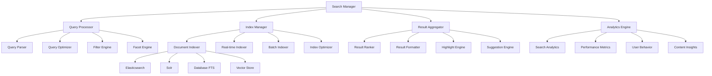

# Search and Indexing - Standards and Conventions

This document defines the standards and conventions for implementing search functionality and data indexing within the Token Nexus Platform. Search and indexing enable users to quickly find and discover content across all platform data including files, documents, workflows, and application data.

## Table of Contents

1. [Architecture Overview](#architecture-overview)
2. [Search Types and Categories](#search-types-and-categories)
3. [Implementation Standards](#implementation-standards)
4. [Indexing Strategies](#indexing-strategies)
5. [Query Processing](#query-processing)
6. [Relevance and Ranking](#relevance-and-ranking)
7. [Real-time Updates](#real-time-updates)
8. [Performance Optimization](#performance-optimization)
9. [Analytics and Insights](#analytics-and-insights)
10. [Testing Standards](#testing-standards)
11. [Implementation Checklist](#implementation-checklist)
12. [Examples and Templates](#examples-and-templates)

## Architecture Overview

The search and indexing system operates through a distributed architecture that supports multiple search engines and indexing strategies:



### Core Principles

1. **Multi-Engine**: Support for various search backends
2. **Real-Time**: Immediate indexing of content changes
3. **Scalable**: Handle large volumes of data and queries
4. **Relevant**: Intelligent ranking and relevance scoring
5. **Fast**: Sub-second query response times
6. **Flexible**: Support for various query types and filters
7. **Secure**: Respect access controls and permissions

## Search Types and Categories

### Search Categories

```typescript
enum SearchType {
  FULL_TEXT = 'full-text',
  SEMANTIC = 'semantic',
  FACETED = 'faceted',
  AUTOCOMPLETE = 'autocomplete',
  FUZZY = 'fuzzy',
  EXACT = 'exact',
  RANGE = 'range',
  GEOSPATIAL = 'geospatial',
  VECTOR = 'vector'
}

enum ContentType {
  DOCUMENT = 'document',
  FILE = 'file',
  WORKFLOW = 'workflow',
  USER = 'user',
  ORGANIZATION = 'organization',
  APPLICATION = 'application',
  WIDGET = 'widget',
  PAGE = 'page',
  COMMENT = 'comment',
  ACTIVITY = 'activity'
}

enum IndexType {
  PRIMARY = 'primary',
  SECONDARY = 'secondary',
  ANALYTICS = 'analytics',
  SUGGESTION = 'suggestion',
  VECTOR = 'vector'
}

enum SearchScope {
  GLOBAL = 'global',
  ORGANIZATION = 'organization',
  APPLICATION = 'application',
  USER = 'user',
  CUSTOM = 'custom'
}

enum IndexingStrategy {
  REAL_TIME = 'real-time',
  BATCH = 'batch',
  INCREMENTAL = 'incremental',
  FULL_REBUILD = 'full-rebuild'
}
```

### Search Configuration Schema

```typescript
interface SearchConfiguration {
  id: string;
  name: string;
  type: SearchType;
  contentTypes: ContentType[];
  scope: SearchScope;
  indexing: IndexingConfig;
  query: QueryConfig;
  ranking: RankingConfig;
  filtering: FilterConfig;
  faceting: FacetConfig;
  highlighting: HighlightConfig;
  suggestions: SuggestionConfig;
  analytics: AnalyticsConfig;
  security: SecurityConfig;
  performance: PerformanceConfig;
  enabled: boolean;
  organizationId?: string;
  applicationId?: string;
}

interface IndexingConfig {
  strategy: IndexingStrategy;
  engine: SearchEngine;
  index: IndexConfig;
  mapping: MappingConfig;
  pipeline: ProcessingPipeline;
  schedule: ScheduleConfig;
  realTime: RealTimeConfig;
}

interface QueryConfig {
  defaultOperator: QueryOperator;
  fields: SearchField[];
  boosts: FieldBoost[];
  analyzers: AnalyzerConfig[];
  filters: DefaultFilter[];
  sorts: SortConfig[];
  pagination: PaginationConfig;
}

interface RankingConfig {
  algorithm: RankingAlgorithm;
  factors: RankingFactor[];
  personalization: PersonalizationConfig;
  freshness: FreshnessConfig;
  popularity: PopularityConfig;
  relevance: RelevanceConfig;
}

interface FilterConfig {
  available: FilterDefinition[];
  defaults: DefaultFilter[];
  dynamic: boolean;
  faceted: boolean;
}

interface FacetConfig {
  enabled: boolean;
  fields: FacetField[];
  maxValues: number;
  minCount: number;
  sorting: FacetSorting;
}

interface HighlightConfig {
  enabled: boolean;
  fields: string[];
  fragmentSize: number;
  maxFragments: number;
  preTag: string;
  postTag: string;
}

interface SuggestionConfig {
  enabled: boolean;
  types: SuggestionType[];
  sources: SuggestionSource[];
  maxSuggestions: number;
  minQueryLength: number;
}

interface AnalyticsConfig {
  enabled: boolean;
  trackQueries: boolean;
  trackResults: boolean;
  trackClicks: boolean;
  trackConversions: boolean;
  retention: number; // days
}

interface SecurityConfig {
  enforcePermissions: boolean;
  fieldSecurity: FieldSecurityConfig[];
  documentSecurity: DocumentSecurityConfig;
  auditLogging: boolean;
}

interface PerformanceConfig {
  caching: CacheConfig;
  timeout: number; // milliseconds
  maxResults: number;
  sharding: ShardingConfig;
  replication: ReplicationConfig;
}
```

## Implementation Standards

### Base Search Manager

All search functionality must use the [`SearchManager`](../src/search/SearchManager.ts) class:

```typescript
// SearchManager.ts
import { SearchConfiguration, SearchRequest, SearchResult } from '@/types/search';
import { IndexManager } from './IndexManager';
import { QueryProcessor } from './QueryProcessor';
import { ResultAggregator } from './ResultAggregator';
import { AnalyticsService } from '@/services/analytics';
import { SecurityService } from '@/services/security';
import { CacheService } from '@/services/cache';

export class SearchManager {
  private configurations: Map<string, SearchConfiguration> = new Map();
  private engines: Map<SearchEngine, SearchEngineInterface> = new Map();
  private indexManager: IndexManager;
  private queryProcessor: QueryProcessor;
  private resultAggregator: ResultAggregator;
  private analytics: AnalyticsService;
  private security: SecurityService;
  private cache: CacheService;

  constructor() {
    this.indexManager = new IndexManager();
    this.queryProcessor = new QueryProcessor();
    this.resultAggregator = new ResultAggregator();
    this.analytics = new AnalyticsService();
    this.security = new SecurityService();
    this.cache = new CacheService();
    
    this.initializeSearchEngines();
  }

  // Register search configuration
  registerConfiguration(config: SearchConfiguration): void {
    this.validateConfiguration(config);
    this.configurations.set(config.id, config);
    
    // Initialize index if needed
    if (config.enabled) {
      this.indexManager.initializeIndex(config);
    }
  }

  // Execute search
  async search(request: SearchRequest): Promise<SearchResult> {
    const startTime = Date.now();
    
    try {
      // Get search configuration
      const config = this.getConfiguration(request.configId);

      // Validate request
      await this.validateSearchRequest(request, config);

      // Check cache first
      const cachedResult = await this.getCachedResult(request, config);
      if (cachedResult) {
        await this.trackSearchEvent(request, cachedResult, 'cache_hit');
        return cachedResult;
      }

      // Process query
      const processedQuery = await this.queryProcessor.process(request, config);

      // Apply security filters
      const secureQuery = await this.applySecurityFilters(processedQuery, request.context);

      // Execute search
      const rawResults = await this.executeSearch(secureQuery, config);

      // Aggregate and rank results
      const aggregatedResults = await this.resultAggregator.aggregate(rawResults, config);

      // Format results
      const formattedResults = await this.formatResults(aggregatedResults, config);

      // Cache results
      await this.cacheResults(request, formattedResults, config);

      // Track analytics
      await this.trackSearchEvent(request, formattedResults, 'search');

      return formattedResults;

    } catch (error) {
      console.error('Search execution failed:', error);
      await this.trackSearchEvent(request, null, 'error', error);
      throw new SearchError(`Search failed: ${error.message}`);
    } finally {
      const duration = Date.now() - startTime;
      await this.recordPerformanceMetrics(request, duration);
    }
  }

  // Multi-search across configurations
  async multiSearch(requests: MultiSearchRequest[]): Promise<MultiSearchResult> {
    const results: SearchResult[] = [];
    const errors: SearchError[] = [];

    // Execute searches in parallel
    const promises = requests.map(async (req) => {
      try {
        const result = await this.search(req.request);
        results.push({
          ...result,
          configId: req.configId,
          requestId: req.id
        });
      } catch (error) {
        errors.push(new SearchError(error.message, req.id));
      }
    });

    await Promise.all(promises);

    return {
      results,
      errors,
      totalRequests: requests.length,
      successCount: results.length,
      errorCount: errors.length
    };
  }

  // Autocomplete/suggestions
  async suggest(request: SuggestionRequest): Promise<SuggestionResult> {
    try {
      const config = this.getConfiguration(request.configId);

      if (!config.suggestions.enabled) {
        return { suggestions: [] };
      }

      // Process suggestion query
      const processedQuery = await this.processSuggestionQuery(request, config);

      // Get suggestions from various sources
      const suggestions = await this.getSuggestions(processedQuery, config);

      // Rank and filter suggestions
      const rankedSuggestions = await this.rankSuggestions(suggestions, request);

      // Track suggestion event
      await this.trackSuggestionEvent(request, rankedSuggestions);

      return {
        suggestions: rankedSuggestions,
        query: request.query,
        totalCount: rankedSuggestions.length
      };

    } catch (error) {
      console.error('Suggestion failed:', error);
      throw new SearchError(`Suggestion failed: ${error.message}`);
    }
  }

  // Index document
  async indexDocument(document: SearchDocument, configId?: string): Promise<IndexResult> {
    try {
      // Determine which configurations should index this document
      const configs = configId 
        ? [this.getConfiguration(configId)]
        : this.getConfigurationsForDocument(document);

      const results: IndexOperationResult[] = [];

      for (const config of configs) {
        try {
          const result = await this.indexManager.indexDocument(document, config);
          results.push(result);
        } catch (error) {
          console.error(`Indexing failed for config ${config.id}:`, error);
          results.push({
            configId: config.id,
            success: false,
            error: error.message
          });
        }
      }

      return {
        documentId: document.id,
        results,
        timestamp: new Date()
      };

    } catch (error) {
      throw new SearchError(`Document indexing failed: ${error.message}`);
    }
  }

  // Update document in index
  async updateDocument(document: SearchDocument, configId?: string): Promise<IndexResult> {
    try {
      // Remove old version first
      await this.removeDocument(document.id, configId);

      // Index new version
      return await this.indexDocument(document, configId);

    } catch (error) {
      throw new SearchError(`Document update failed: ${error.message}`);
    }
  }

  // Remove document from index
  async removeDocument(documentId: string, configId?: string): Promise<RemoveResult> {
    try {
      const configs = configId 
        ? [this.getConfiguration(configId)]
        : Array.from(this.configurations.values());

      const results: RemoveOperationResult[] = [];

      for (const config of configs) {
        try {
          const result = await this.indexManager.removeDocument(documentId, config);
          results.push(result);
        } catch (error) {
          console.error(`Document removal failed for config ${config.id}:`, error);
          results.push({
            configId: config.id,
            success: false,
            error: error.message
          });
        }
      }

      return {
        documentId,
        results,
        timestamp: new Date()
      };

    } catch (error) {
      throw new SearchError(`Document removal failed: ${error.message}`);
    }
  }

  // Batch indexing operations
  async batchIndex(operations: BatchIndexOperation[]): Promise<BatchIndexResult> {
    const results: IndexResult[] = [];
    const errors: SearchError[] = [];

    // Process in batches for better performance
    const batchSize = 100;
    const batches = this.chunkArray(operations, batchSize);

    for (const batch of batches) {
      const promises = batch.map(async (operation) => {
        try {
          let result: IndexResult;

          switch (operation.type) {
            case 'index':
              result = await this.indexDocument(operation.document, operation.configId);
              break;

            case 'update':
              result = await this.updateDocument(operation.document, operation.configId);
              break;

            case 'delete':
              result = await this.removeDocument(operation.documentId!, operation.configId) as any;
              break;

            default:
              throw new Error(`Unsupported operation type: ${operation.type}`);
          }

          results.push(result);

        } catch (error) {
          errors.push(new SearchError(error.message, operation.document?.id || operation.documentId));
        }
      });

      await Promise.all(promises);
    }

    return {
      results,
      errors,
      totalOperations: operations.length,
      successCount: results.length,
      errorCount: errors.length
    };
  }

  // Rebuild index
  async rebuildIndex(configId: string): Promise<RebuildResult> {
    try {
      const config = this.getConfiguration(configId);
      
      // Start rebuild process
      const result = await this.indexManager.rebuildIndex(config);

      // Track rebuild event
      await this.trackIndexEvent(configId, 'rebuild', result);

      return result;

    } catch (error) {
      throw new SearchError(`Index rebuild failed: ${error.message}`);
    }
  }

  // Get search analytics
  async getAnalytics(request: AnalyticsRequest): Promise<AnalyticsResult> {
    try {
      return await this.analytics.getSearchAnalytics(request);
    } catch (error) {
      throw new SearchError(`Analytics retrieval failed: ${error.message}`);
    }
  }

  // Query processing
  private async executeSearch(query: ProcessedQuery, config: SearchConfiguration): Promise<RawSearchResult> {
    const engine = this.getSearchEngine(config.indexing.engine);
    return await engine.search(query, config);
  }

  private async processSuggestionQuery(
    request: SuggestionRequest,
    config: SearchConfiguration
  ): Promise<ProcessedSuggestionQuery> {
    return {
      query: request.query,
      field: request.field || 'title',
      maxSuggestions: request.maxSuggestions || config.suggestions.maxSuggestions,
      types: request.types || config.suggestions.types,
      context: request.context
    };
  }

  private async getSuggestions(
    query: ProcessedSuggestionQuery,
    config: SearchConfiguration
  ): Promise<Suggestion[]> {
    const suggestions: Suggestion[] = [];

    // Get suggestions from each configured source
    for (const source of config.suggestions.sources) {
      try {
        const sourceSuggestions = await this.getSuggestionsFromSource(query, source, config);
        suggestions.push(...sourceSuggestions);
      } catch (error) {
        console.warn(`Suggestion source ${source.type} failed:`, error);
      }
    }

    return suggestions;
  }

  private async getSuggestionsFromSource(
    query: ProcessedSuggestionQuery,
    source: SuggestionSource,
    config: SearchConfiguration
  ): Promise<Suggestion[]> {
    const engine = this.getSearchEngine(config.indexing.engine);
    return await engine.getSuggestions(query, source, config);
  }

  private async rankSuggestions(
    suggestions: Suggestion[],
    request: SuggestionRequest
  ): Promise<RankedSuggestion[]> {
    // Remove duplicates
    const uniqueSuggestions = this.deduplicateSuggestions(suggestions);

    // Score and rank suggestions
    const scoredSuggestions = uniqueSuggestions.map(suggestion => ({
      ...suggestion,
      score: this.calculateSuggestionScore(suggestion, request)
    }));

    // Sort by score
    scoredSuggestions.sort((a, b) => b.score - a.score);

    // Limit results
    const maxSuggestions = request.maxSuggestions || 10;
    return scoredSuggestions.slice(0, maxSuggestions);
  }

  // Security and permissions
  private async applySecurityFilters(
    query: ProcessedQuery,
    context?: SearchContext
  ): Promise<ProcessedQuery> {
    if (!context) {
      return query;
    }

    // Add organization filter
    if (context.organizationId) {
      query.filters.push({
        field: 'organizationId',
        value: context.organizationId,
        operator: 'equals'
      });
    }

    // Add user permissions filter
    if (context.userId) {
      const userPermissions = await this.security.getUserPermissions(context.userId);
      query.filters.push({
        field: 'permissions',
        value: userPermissions,
        operator: 'intersects'
      });
    }

    // Add access level filter
    query.filters.push({
      field: 'accessLevel',
      value: ['public', 'internal'],
      operator: 'in'
    });

    return query;
  }

  // Caching
  private async getCachedResult(
    request: SearchRequest,
    config: SearchConfiguration
  ): Promise<SearchResult | null> {
    if (!config.performance.caching.enabled) {
      return null;
    }

    const cacheKey = this.generateCacheKey(request, config);
    return await this.cache.get<SearchResult>(cacheKey);
  }

  private async cacheResults(
    request: SearchRequest,
    results: SearchResult,
    config: SearchConfiguration
  ): Promise<void> {
    if (!config.performance.caching.enabled) {
      return;
    }

    const cacheKey = this.generateCacheKey(request, config);
    const ttl = config.performance.caching.ttl || 300; // 5 minutes default
    
    await this.cache.set(cacheKey, results, ttl);
  }

  private generateCacheKey(request: SearchRequest, config: SearchConfiguration): string {
    const keyParts = [
      'search',
      config.id,
      request.query || '',
      JSON.stringify(request.filters || {}),
      JSON.stringify(request.sort || {}),
      request.page || 1,
      request.size || 20,
      request.context?.organizationId || 'global',
      request.context?.userId || 'anonymous'
    ];

    const crypto = require('crypto');
    return crypto.createHash('md5').update(keyParts.join(':')).digest('hex');
  }

  // Analytics and tracking
  private async trackSearchEvent(
    request: SearchRequest,
    result: SearchResult | null,
    eventType: string,
    error?: Error
  ): Promise<void> {
    await this.analytics.track({
      event: `search_${eventType}`,
      properties: {
        configId: request.configId,
        query: request.query,
        filters: request.filters,
        resultCount: result?.totalCount || 0,
        duration: result?.metadata?.duration,
        error: error?.message,
        userId: request.context?.userId,
        organizationId: request.context?.organizationId
      },
      timestamp: new Date()
    });
  }

  private async trackSuggestionEvent(
    request: SuggestionRequest,
    result: RankedSuggestion[]
  ): Promise<void> {
    await this.analytics.track({
      event: 'search_suggestion',
      properties: {
        configId: request.configId,
        query: request.query,
        suggestionCount: result.length,
        userId: request.context?.userId,
        organizationId: request.context?.organizationId
      },
      timestamp: new Date()
    });
  }

  private async trackIndexEvent(
    configId: string,
    eventType: string,
    result: any
  ): Promise<void> {
    await this.analytics.track({
      event: `index_${eventType}`,
      properties: {
        configId,
        success: result.success,
        documentCount: result.documentCount,
        duration: result.duration,
        error: result.error
      },
      timestamp: new Date()
    });
  }

  private async recordPerformanceMetrics(request: SearchRequest, duration: number): Promise<void> {
    await this.analytics.recordMetric({
      name: 'search_duration',
      value: duration,
      tags: {
        config_id: request.configId,
        query_length: request.query?.length || 0,
        filter_count: Object.keys(request.filters || {}).length
      },
      timestamp: new Date()
    });
  }

  // Utility methods
  private getConfiguration(configId: string): SearchConfiguration {
    const config = this.configurations.get(configId);
    if (!config) {
      throw new Error(`Search configuration not found: ${configId}`);
    }
    return config;
  }

  private getSearchEngine(engine: SearchEngine): SearchEngineInterface {
    const engineInstance = this.engines.get(engine);
    if (!engineInstance) {
      throw new Error(`Search engine not found: ${engine}`);
    }
    return engineInstance;
  }

  private getConfigurationsForDocument(document: SearchDocument): SearchConfiguration[] {
    return Array.from(this.configurations.values()).filter(config => 
      config.enabled && 
      config.contentTypes.includes(document.type) &&
      this.matchesScope(config, document)
    );
  }

  private matchesScope(config: SearchConfiguration, document: SearchDocument): boolean {
    switch (config.scope) {
      case SearchScope.GLOBAL:
        return true;
      
      case SearchScope.ORGANIZATION:
        return config.organizationId === document.organizationId;
      
      case SearchScope.APPLICATION:
        return config.applicationId === document.applicationId;
      
      case SearchScope.USER:
        return config.userId === document.userId;
      
      default:
        return true;
    }
  }

  private validateConfiguration(config: SearchConfiguration): void {
    if (!config.id || !config.name || !config.type) {
      throw new Error('Search configuration missing required fields');
    }

    if (!config.contentTypes || config.contentTypes.length === 0) {
      throw new Error('Search configuration must specify content types');
    }
  }

  private async validateSearchRequest(
    request: SearchRequest,
    config: SearchConfiguration
  ): Promise<void> {
    if (!request.query && !request.filters) {
      throw new Error('Search request must include query or filters');
    }

    if (request.size && request.size > config.performance.maxResults) {
      throw new Error(`Result size exceeds maximum: ${config.performance.maxResults}`);
    }
  }

  private async formatResults(
    results: AggregatedSearchResult,
    config: SearchConfiguration
  ): Promise<SearchResult> {
    return {
      documents: results.documents,
      totalCount: results.totalCount,
      facets: results.facets,
      suggestions: results.suggestions,
      highlights: results.highlights,
      metadata: {
        query: results.query,
        duration: results.duration,
        configId: config.id,
        cached: false
      }
    };
  }

  private deduplicateSuggestions(suggestions: Suggestion[]): Suggestion[] {
    const seen = new Set<string>();
    return suggestions.filter(suggestion => {
      const key = `${suggestion.text}:${suggestion.type}`;
      if (seen.has(key)) {
        return false;
      }
      seen.add(key);
      return true;
    });
  }

  private calculateSuggestionScore(suggestion: Suggestion, request: SuggestionRequest): number {
    let score = suggestion.frequency || 1;

    // Boost exact matches
    if (suggestion.text.toLowerCase() === request.query.toLowerCase()) {
      score *= 10;
    }

    // Boost prefix matches
    if (suggestion.text.toLowerCase().startsWith(request.query.toLowerCase())) {
      score *= 5;
    }

    // Boost by suggestion type priority
    const typePriority = {
      [SuggestionType.QUERY]: 3,
      [SuggestionType.DOCUMENT]: 2,
      [SuggestionType.TAG]: 1
    };
    score *= typePriority[suggestion.type] || 1;

    return score;
  }

  private chunkArray<T>(array: T[], size: number): T[][] {
    const chunks: T[][] = [];
    for (let i = 0; i < array.length; i += size) {
      chunks.push(array.slice(i, i + size));
    }
    return chunks;
  }

  private initializeSearchEngines(): void {
    this.engines.set(SearchEngine.ELASTICSEARCH, new ElasticsearchEngine());
    this.engines.set(SearchEngine.SOLR, new SolrEngine());
    this.engines.set(SearchEngine.DATABASE, new DatabaseEngine());
    this.engines.set(SearchEngine.VECTOR, new VectorEngine());
  }
}

// Search engine interface
export interface SearchEngineInterface {
  search(query: ProcessedQuery, config: SearchConfiguration): Promise<RawSearchResult>;
  getSuggestions(query: ProcessedSuggestionQuery, source: SuggestionSource, config: SearchConfiguration): Promise<Suggestion[]>;
  indexDocument(document: SearchDocument, config: SearchConfiguration): Promise<IndexOperationResult>;
  removeDocument(documentId: string, config: SearchConfiguration): Promise<RemoveOperationResult>;
  rebuildIndex(config: SearchConfiguration): Promise<RebuildResult>;
}

// Supporting types and enums
export enum SearchEngine {
  ELASTICSEARCH = 'elasticsearch',
  SOLR = 'solr',
  DATABASE = 'database',
  VECTOR = 'vector'
}

export enum QueryOperator {
  AND = 'and',
  OR = 'or'
}

export enum RankingAlgorithm {
  TF_IDF = 'tf-idf',
  BM25 = 'bm25',
  LEARNING_TO_RANK = 'learning-to-rank',
  CUSTOM = 'custom'
}

export enum SuggestionType {
  QUERY = 'query',
  DOCUMENT = 'document',
  TAG = 'tag',
  USER = 'user'
}

// Request/Response interfaces
export interface SearchRequest {
  configId: string;
  query?: string;
  filters?: SearchFilter[];
  sort?: SortOption[];
  page?: number;
  size?: number;
  facets?: string[];
  highlight?: boolean;
  context?: SearchContext;
}

export interface SearchResult {
  documents: SearchDocument[];
  totalCount: number;
  facets?: SearchFacet[];
  suggestions?: RankedSuggestion[];
  highlights?: SearchHighlight[];
  metadata: SearchMetadata;
}

export interface SearchDocument {
  id: string;
  type: ContentType;
  title: string;
  content: string;
  url?: string;
  organizationId?: string;
  applicationId?: string;
  userId?: string;
  tags: string[];
  metadata: Record<string, any>;
  createdAt: Date;
  updatedAt: Date;
  score?: number;
}

export interface SearchContext {
  userId?: string;
  organizationId?: string;
  applicationId?: string;
  permissions?: string[];
  preferences?: UserPreferences;
}

// Error classes
export class SearchError extends Error {
  constructor(message: string, public requestId?: string) {
    super(message);
    this.name = 'SearchError';
  }
}

// Global search manager instance
export const searchManager = new SearchManager();

// Convenience functions
export async function search(request: SearchRequest): Promise<SearchResult> {
  return searchManager.search(request);
}

export async function suggest(request: SuggestionRequest): Promise<SuggestionResult> {
  return searchManager.suggest(request);
}

export async function indexDocument(document: SearchDocument, configId?: string): Promise<IndexResult> {
  return searchManager.indexDocument(document, configId);
}

export async function removeDocument(documentId: string, configId?: string): Promise<RemoveResult> {
  return searchManager.removeDocument(documentId, configId);
}
```

### Elasticsearch Implementation Example

```typescript
// ElasticsearchEngine.ts
import { Client } from '@elastic/elasticsearch';
import { SearchEngineInterface } from './SearchManager';

export class ElasticsearchEngine implements SearchEngineInterface {
  private client: Client;

  constructor() {
    this.client = new Client({
      node: process.env.ELASTICSEARCH_URL || 'http://localhost:9200'
    });
  }

  async search(query: ProcessedQuery, config: SearchConfiguration): Promise<RawSearchResult> {
    try {
      const searchBody = this.buildElasticsearchQuery(query, config);
      
      const response = await this.client.search({
        index: config.indexing.index.name,
        body: searchBody
      });

      return this.parseElasticsearchResponse(response