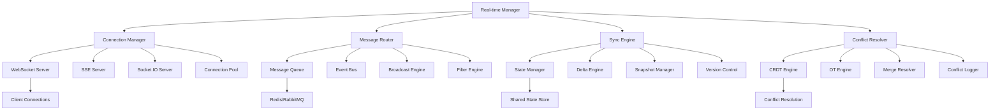

# Real-time Features - Standards and Conventions

This document defines the standards and conventions for implementing real-time features within the Token Nexus Platform. Real-time features enable live updates, collaborative editing, instant notifications, and interactive user experiences through WebSockets, Server-Sent Events, and other real-time technologies.

## Table of Contents

1. [Architecture Overview](#architecture-overview)
2. [Real-time Types and Categories](#real-time-types-and-categories)
3. [Implementation Standards](#implementation-standards)
4. [Connection Management](#connection-management)
5. [Message Protocols](#message-protocols)
6. [Synchronization Strategies](#synchronization-strategies)
7. [Conflict Resolution](#conflict-resolution)
8. [Performance and Scaling](#performance-and-scaling)
9. [Security and Authentication](#security-and-authentication)
10. [Testing Standards](#testing-standards)
11. [Implementation Checklist](#implementation-checklist)
12. [Examples and Templates](#examples-and-templates)

## Architecture Overview

The real-time system operates through a distributed architecture that supports multiple connection types and synchronization strategies:



### Core Principles

1. **Low Latency**: Sub-100ms message delivery for critical updates
2. **Scalable**: Support thousands of concurrent connections
3. **Reliable**: Guaranteed message delivery with fallback mechanisms
4. **Consistent**: Maintain data consistency across all clients
5. **Secure**: Authenticated and authorized real-time connections
6. **Resilient**: Automatic reconnection and state recovery
7. **Collaborative**: Support for multi-user collaborative features

## Real-time Types and Categories

### Real-time Categories

```typescript
enum RealTimeFeature {
  LIVE_UPDATES = 'live-updates',
  COLLABORATIVE_EDITING = 'collaborative-editing',
  INSTANT_MESSAGING = 'instant-messaging',
  NOTIFICATIONS = 'notifications',
  PRESENCE = 'presence',
  ACTIVITY_FEED = 'activity-feed',
  LIVE_DASHBOARD = 'live-dashboard',
  CURSOR_TRACKING = 'cursor-tracking',
  VOICE_CHAT = 'voice-chat',
  VIDEO_CHAT = 'video-chat',
  SCREEN_SHARING = 'screen-sharing',
  WHITEBOARD = 'whiteboard'
}

enum ConnectionType {
  WEBSOCKET = 'websocket',
  SERVER_SENT_EVENTS = 'sse',
  SOCKET_IO = 'socket-io',
  WEBRTC = 'webrtc',
  LONG_POLLING = 'long-polling'
}

enum MessageType {
  DATA_UPDATE = 'data-update',
  USER_ACTION = 'user-action',
  SYSTEM_EVENT = 'system-event',
  NOTIFICATION = 'notification',
  PRESENCE_UPDATE = 'presence-update',
  CURSOR_MOVE = 'cursor-move',
  SELECTION_CHANGE = 'selection-change',
  DOCUMENT_CHANGE = 'document-change',
  HEARTBEAT = 'heartbeat',
  ERROR = 'error'
}

enum SyncStrategy {
  OPERATIONAL_TRANSFORM = 'operational-transform',
  CONFLICT_FREE_REPLICATED_DATA_TYPE = 'crdt',
  LAST_WRITER_WINS = 'last-writer-wins',
  MANUAL_MERGE = 'manual-merge',
  SNAPSHOT_BASED = 'snapshot-based'
}

enum PresenceStatus {
  ONLINE = 'online',
  AWAY = 'away',
  BUSY = 'busy',
  OFFLINE = 'offline',
  INVISIBLE = 'invisible'
}
```

### Real-time Configuration Schema

```typescript
interface RealTimeConfiguration {
  id: string;
  name: string;
  feature: RealTimeFeature;
  connectionType: ConnectionType;
  syncStrategy: SyncStrategy;
  scope: RealTimeScope;
  security: SecurityConfig;
  performance: PerformanceConfig;
  collaboration: CollaborationConfig;
  presence: PresenceConfig;
  messaging: MessagingConfig;
  persistence: PersistenceConfig;
  scaling: ScalingConfig;
  monitoring: MonitoringConfig;
  enabled: boolean;
  organizationId?: string;
  applicationId?: string;
}

interface RealTimeScope {
  type: ScopeType;
  resourceId?: string;
  permissions: Permission[];
  filters: ScopeFilter[];
}

interface SecurityConfig {
  authentication: AuthenticationConfig;
  authorization: AuthorizationConfig;
  encryption: EncryptionConfig;
  rateLimit: RateLimitConfig;
  validation: ValidationConfig;
}

interface PerformanceConfig {
  maxConnections: number;
  messageQueueSize: number;
  heartbeatInterval: number; // milliseconds
  reconnectTimeout: number; // milliseconds
  maxReconnectAttempts: number;
  compressionEnabled: boolean;
  batchingEnabled: boolean;
  batchSize: number;
  batchTimeout: number; // milliseconds
}

interface CollaborationConfig {
  maxCollaborators: number;
  conflictResolution: ConflictResolutionConfig;
  operationalTransform: OTConfig;
  crdt: CRDTConfig;
  lockingStrategy: LockingStrategy;
  mergeStrategy: MergeStrategy;
}

interface PresenceConfig {
  enabled: boolean;
  statusTypes: PresenceStatus[];
  timeout: number; // milliseconds
  broadcastInterval: number; // milliseconds
  includeMetadata: boolean;
  customFields: PresenceField[];
}

interface MessagingConfig {
  enabled: boolean;
  messageTypes: MessageType[];
  persistence: boolean;
  encryption: boolean;
  moderation: ModerationConfig;
  fileSharing: FileShareConfig;
}

interface PersistenceConfig {
  enabled: boolean;
  strategy: PersistenceStrategy;
  retention: number; // days
  compression: boolean;
  snapshotInterval: number; // minutes
}

interface ScalingConfig {
  horizontal: HorizontalScalingConfig;
  loadBalancing: LoadBalancingConfig;
  clustering: ClusteringConfig;
  sharding: ShardingConfig;
}

interface MonitoringConfig {
  enabled: boolean;
  metrics: MetricConfig[];
  alerts: AlertConfig[];
  logging: LoggingConfig;
  analytics: AnalyticsConfig;
}
```

## Implementation Standards

### Base Real-time Manager

All real-time functionality must use the [`RealTimeManager`](../src/realtime/RealTimeManager.ts) class:

```typescript
// RealTimeManager.ts
import { RealTimeConfiguration, RealTimeConnection, RealTimeMessage } from '@/types/realtime';
import { ConnectionManager } from './ConnectionManager';
import { MessageRouter } from './MessageRouter';
import { SyncEngine } from './SyncEngine';
import { PresenceManager } from './PresenceManager';
import { SecurityService } from '@/services/security';
import { AnalyticsService } from '@/services/analytics';

export class RealTimeManager {
  private configurations: Map<string, RealTimeConfiguration> = new Map();
  private connectionManager: ConnectionManager;
  private messageRouter: MessageRouter;
  private syncEngine: SyncEngine;
  private presenceManager: PresenceManager;
  private security: SecurityService;
  private analytics: AnalyticsService;

  constructor() {
    this.connectionManager = new ConnectionManager();
    this.messageRouter = new MessageRouter();
    this.syncEngine = new SyncEngine();
    this.presenceManager = new PresenceManager();
    this.security = new SecurityService();
    this.analytics = new AnalyticsService();
    
    this.initializeEventHandlers();
  }

  // Register real-time configuration
  registerConfiguration(config: RealTimeConfiguration): void {
    this.validateConfiguration(config);
    this.configurations.set(config.id, config);
    
    if (config.enabled) {
      this.initializeFeature(config);
    }
  }

  // Create real-time connection
  async createConnection(request: ConnectionRequest): Promise<RealTimeConnection> {
    try {
      // Get configuration
      const config = this.getConfiguration(request.configId);

      // Authenticate connection
      await this.authenticateConnection(request, config);

      // Create connection
      const connection = await this.connectionManager.createConnection(request, config);

      // Initialize presence if enabled
      if (config.presence.enabled) {
        await this.presenceManager.addUser(connection);
      }

      // Set up message routing
      await this.messageRouter.addConnection(connection);

      // Track connection event
      await this.trackConnectionEvent(connection, 'connected');

      return connection;

    } catch (error) {
      console.error('Connection creation failed:', error);
      throw new RealTimeError(`Connection failed: ${error.message}`);
    }
  }

  // Send message to connection(s)
  async sendMessage(message: RealTimeMessage, targets?: ConnectionTarget[]): Promise<SendResult> {
    try {
      // Validate message
      await this.validateMessage(message);

      // Get target connections
      const connections = targets 
        ? await this.resolveTargets(targets)
        : await this.getConnectionsForScope(message.scope);

      // Filter by permissions
      const authorizedConnections = await this.filterByPermissions(connections, message);

      // Route message
      const results = await this.messageRouter.sendMessage(message, authorizedConnections);

      // Track message event
      await this.trackMessageEvent(message, results);

      return {
        messageId: message.id,
        targetCount: authorizedConnections.length,
        successCount: results.filter(r => r.success).length,
        failureCount: results.filter(r => !r.success).length,
        results
      };

    } catch (error) {
      throw new RealTimeError(`Message send failed: ${error.message}`);
    }
  }

  // Broadcast message to all connections in scope
  async broadcast(message: RealTimeMessage, scope: BroadcastScope): Promise<BroadcastResult> {
    try {
      // Get all connections in scope
      const connections = await this.getConnectionsInScope(scope);

      // Send to all connections
      const sendResult = await this.sendMessage(message, 
        connections.map(conn => ({ type: 'connection', id: conn.id }))
      );

      return {
        scope,
        messageId: message.id,
        connectionCount: connections.length,
        successCount: sendResult.successCount,
        failureCount: sendResult.failureCount
      };

    } catch (error) {
      throw new RealTimeError(`Broadcast failed: ${error.message}`);
    }
  }

  // Handle collaborative editing
  async handleCollaborativeEdit(operation: CollaborativeOperation): Promise<OperationResult> {
    try {
      const config = this.getConfiguration(operation.configId);

      // Apply synchronization strategy
      const result = await this.syncEngine.applyOperation(operation, config);

      // Broadcast operation to other collaborators
      if (result.success) {
        await this.broadcastOperation(operation, result);
      }

      return result;

    } catch (error) {
      throw new RealTimeError(`Collaborative edit failed: ${error.message}`);
    }
  }

  // Update user presence
  async updatePresence(connectionId: string, presence: PresenceUpdate): Promise<void> {
    try {
      const connection = await this.connectionManager.getConnection(connectionId);
      const config = this.getConfiguration(connection.configId);

      if (!config.presence.enabled) {
        return;
      }

      // Update presence
      await this.presenceManager.updatePresence(connection, presence);

      // Broadcast presence update
      await this.broadcastPresenceUpdate(connection, presence);

    } catch (error) {
      throw new RealTimeError(`Presence update failed: ${error.message}`);
    }
  }

  // Get current presence information
  async getPresence(scope: PresenceScope): Promise<PresenceInfo[]> {
    try {
      return await this.presenceManager.getPresence(scope);
    } catch (error) {
      throw new RealTimeError(`Get presence failed: ${error.message}`);
    }
  }

  // Close connection
  async closeConnection(connectionId: string, reason?: string): Promise<void> {
    try {
      const connection = await this.connectionManager.getConnection(connectionId);

      // Remove from presence
      await this.presenceManager.removeUser(connection);

      // Remove from message routing
      await this.messageRouter.removeConnection(connection);

      // Close connection
      await this.connectionManager.closeConnection(connectionId, reason);

      // Track disconnection event
      await this.trackConnectionEvent(connection, 'disconnected', { reason });

    } catch (error) {
      console.error('Connection close failed:', error);
    }
  }

  // Get real-time analytics
  async getAnalytics(request: RealTimeAnalyticsRequest): Promise<RealTimeAnalyticsResult> {
    try {
      return await this.analytics.getRealTimeAnalytics(request);
    } catch (error) {
      throw new RealTimeError(`Analytics retrieval failed: ${error.message}`);
    }
  }

  // Connection management
  private async authenticateConnection(
    request: ConnectionRequest,
    config: RealTimeConfiguration
  ): Promise<void> {
    // Validate authentication token
    const user = await this.security.validateToken(request.token);
    if (!user) {
      throw new Error('Invalid authentication token');
    }

    // Check authorization
    const authorized = await this.security.checkPermission(
      user.id,
      config.security.authorization.resource,
      config.security.authorization.action
    );

    if (!authorized) {
      throw new Error('Insufficient permissions');
    }

    // Rate limiting
    await this.checkRateLimit(user.id, config);
  }

  private async checkRateLimit(userId: string, config: RealTimeConfiguration): Promise<void> {
    const rateLimitKey = `realtime:${config.id}:${userId}`;
    const currentConnections = await this.connectionManager.getConnectionCount(userId, config.id);

    if (currentConnections >= config.performance.maxConnections) {
      throw new Error('Connection limit exceeded');
    }
  }

  // Message handling
  private async validateMessage(message: RealTimeMessage): Promise<void> {
    if (!message.id || !message.type || !message.data) {
      throw new Error('Invalid message format');
    }

    // Validate message size
    const messageSize = JSON.stringify(message).length;
    if (messageSize > 1024 * 1024) { // 1MB limit
      throw new Error('Message size exceeds limit');
    }

    // Validate message type
    const allowedTypes = Object.values(MessageType);
    if (!allowedTypes.includes(message.type)) {
      throw new Error(`Invalid message type: ${message.type}`);
    }
  }

  private async resolveTargets(targets: ConnectionTarget[]): Promise<RealTimeConnection[]> {
    const connections: RealTimeConnection[] = [];

    for (const target of targets) {
      switch (target.type) {
        case 'connection':
          const connection = await this.connectionManager.getConnection(target.id);
          if (connection) {
            connections.push(connection);
          }
          break;

        case 'user':
          const userConnections = await this.connectionManager.getConnectionsByUser(target.id);
          connections.push(...userConnections);
          break;

        case 'room':
          const roomConnections = await this.connectionManager.getConnectionsByRoom(target.id);
          connections.push(...roomConnections);
          break;

        case 'organization':
          const orgConnections = await this.connectionManager.getConnectionsByOrganization(target.id);
          connections.push(...orgConnections);
          break;
      }
    }

    return connections;
  }

  private async filterByPermissions(
    connections: RealTimeConnection[],
    message: RealTimeMessage
  ): Promise<RealTimeConnection[]> {
    const authorizedConnections: RealTimeConnection[] = [];

    for (const connection of connections) {
      try {
        const authorized = await this.security.checkMessagePermission(
          connection.userId,
          message,
          connection.scope
        );

        if (authorized) {
          authorizedConnections.push(connection);
        }
      } catch (error) {
        console.warn(`Permission check failed for connection ${connection.id}:`, error);
      }
    }

    return authorizedConnections;
  }

  // Collaborative editing
  private async broadcastOperation(
    operation: CollaborativeOperation,
    result: OperationResult
  ): Promise<void> {
    const message: RealTimeMessage = {
      id: this.generateMessageId(),
      type: MessageType.DOCUMENT_CHANGE,
      data: {
        operation: result.transformedOperation || operation,
        documentId: operation.documentId,
        userId: operation.userId,
        timestamp: new Date()
      },
      scope: {
        type: 'document',
        resourceId: operation.documentId
      },
      timestamp: new Date()
    };

    // Get collaborators (exclude the operation author)
    const collaborators = await this.getCollaborators(operation.documentId);
    const targets = collaborators
      .filter(c => c.userId !== operation.userId)
      .map(c => ({ type: 'user' as const, id: c.userId }));

    await this.sendMessage(message, targets);
  }

  private async getCollaborators(documentId: string): Promise<Collaborator[]> {
    // Implementation would get active collaborators for document
    return [];
  }

  // Presence management
  private async broadcastPresenceUpdate(
    connection: RealTimeConnection,
    presence: PresenceUpdate
  ): Promise<void> {
    const message: RealTimeMessage = {
      id: this.generateMessageId(),
      type: MessageType.PRESENCE_UPDATE,
      data: {
        userId: connection.userId,
        status: presence.status,
        metadata: presence.metadata,
        timestamp: new Date()
      },
      scope: connection.scope,
      timestamp: new Date()
    };

    // Broadcast to users in the same scope
    const scopeConnections = await this.getConnectionsForScope(connection.scope);
    const targets = scopeConnections
      .filter(c => c.id !== connection.id)
      .map(c => ({ type: 'connection' as const, id: c.id }));

    await this.sendMessage(message, targets);
  }

  // Utility methods
  private getConfiguration(configId: string): RealTimeConfiguration {
    const config = this.configurations.get(configId);
    if (!config) {
      throw new Error(`Real-time configuration not found: ${configId}`);
    }
    return config;
  }

  private async getConnectionsForScope(scope: MessageScope): Promise<RealTimeConnection[]> {
    return await this.connectionManager.getConnectionsByScope(scope);
  }

  private async getConnectionsInScope(scope: BroadcastScope): Promise<RealTimeConnection[]> {
    switch (scope.type) {
      case 'global':
        return await this.connectionManager.getAllConnections();
      
      case 'organization':
        return await this.connectionManager.getConnectionsByOrganization(scope.id);
      
      case 'application':
        return await this.connectionManager.getConnectionsByApplication(scope.id);
      
      case 'room':
        return await this.connectionManager.getConnectionsByRoom(scope.id);
      
      default:
        return [];
    }
  }

  private generateMessageId(): string {
    return `msg_${Date.now()}_${Math.random().toString(36).substr(2, 9)}`;
  }

  private validateConfiguration(config: RealTimeConfiguration): void {
    if (!config.id || !config.name || !config.feature) {
      throw new Error('Real-time configuration missing required fields');
    }

    if (!config.connectionType) {
      throw new Error('Connection type is required');
    }

    if (config.performance.maxConnections <= 0) {
      throw new Error('Max connections must be greater than 0');
    }
  }

  private async initializeFeature(config: RealTimeConfiguration): Promise<void> {
    // Initialize feature-specific components
    switch (config.feature) {
      case RealTimeFeature.COLLABORATIVE_EDITING:
        await this.syncEngine.initializeCollaborativeEditing(config);
        break;
      
      case RealTimeFeature.PRESENCE:
        await this.presenceManager.initialize(config);
        break;
      
      case RealTimeFeature.INSTANT_MESSAGING:
        await this.messageRouter.initializeMessaging(config);
        break;
    }
  }

  private initializeEventHandlers(): void {
    // Connection events
    this.connectionManager.on('connection:created', this.handleConnectionCreated.bind(this));
    this.connectionManager.on('connection:closed', this.handleConnectionClosed.bind(this));
    this.connectionManager.on('connection:error', this.handleConnectionError.bind(this));

    // Message events
    this.messageRouter.on('message:sent', this.handleMessageSent.bind(this));
    this.messageRouter.on('message:failed', this.handleMessageFailed.bind(this));

    // Sync events
    this.syncEngine.on('conflict:detected', this.handleConflictDetected.bind(this));
    this.syncEngine.on('operation:applied', this.handleOperationApplied.bind(this));
  }

  private async handleConnectionCreated(connection: RealTimeConnection): Promise<void> {
    console.log(`Connection created: ${connection.id}`);
  }

  private async handleConnectionClosed(connection: RealTimeConnection): Promise<void> {
    console.log(`Connection closed: ${connection.id}`);
  }

  private async handleConnectionError(connection: RealTimeConnection, error: Error): Promise<void> {
    console.error(`Connection error for ${connection.id}:`, error);
  }

  private async handleMessageSent(message: RealTimeMessage, connection: RealTimeConnection): Promise<void> {
    // Track successful message delivery
  }

  private async handleMessageFailed(message: RealTimeMessage, connection: RealTimeConnection, error: Error): Promise<void> {
    console.error(`Message failed for ${connection.id}:`, error);
  }

  private async handleConflictDetected(conflict: ConflictInfo): Promise<void> {
    console.warn('Conflict detected:', conflict);
  }

  private async handleOperationApplied(operation: CollaborativeOperation, result: OperationResult): Promise<void> {
    // Track successful operation
  }

  // Analytics and tracking
  private async trackConnectionEvent(
    connection: RealTimeConnection,
    event: string,
    data?: any
  ): Promise<void> {
    await this.analytics.track({
      event: `realtime_connection_${event}`,
      properties: {
        connectionId: connection.id,
        configId: connection.configId,
        userId: connection.userId,
        organizationId: connection.organizationId,
        connectionType: connection.type,
        ...data
      },
      timestamp: new Date()
    });
  }

  private async trackMessageEvent(
    message: RealTimeMessage,
    results: MessageDeliveryResult[]
  ): Promise<void> {
    await this.analytics.track({
      event: 'realtime_message_sent',
      properties: {
        messageId: message.id,
        messageType: message.type,
        targetCount: results.length,
        successCount: results.filter(r => r.success).length,
        failureCount: results.filter(r => !r.success).length,
        messageSize: JSON.stringify(message).length
      },
      timestamp: new Date()
    });
  }
}

// Connection Manager
export class ConnectionManager extends EventEmitter {
  private connections: Map<string, RealTimeConnection> = new Map();
  private userConnections: Map<string, Set<string>> = new Map();
  private roomConnections: Map<string, Set<string>> = new Map();

  async createConnection(request: ConnectionRequest, config: RealTimeConfiguration): Promise<RealTimeConnection> {
    const connectionId = this.generateConnectionId();
    
    const connection: RealTimeConnection = {
      id: connectionId,
      configId: config.id,
      userId: request.userId,
      organizationId: request.organizationId,
      type: config.connectionType,
      scope: request.scope,
      socket: request.socket,
      metadata: request.metadata || {},
      createdAt: new Date(),
      lastActivity: new Date(),
      status: 'connected'
    };

    // Store connection
    this.connections.set(connectionId, connection);
    
    // Index by user
    if (!this.userConnections.has(request.userId)) {
      this.userConnections.set(request.userId, new Set());
    }
    this.userConnections.get(request.userId)!.add(connectionId);

    // Index by room if applicable
    if (request.scope.type === 'room') {
      if (!this.roomConnections.has(request.scope.resourceId!)) {
        this.roomConnections.set(request.scope.resourceId!, new Set());
      }
      this.roomConnections.get(request.scope.resourceId!)!.add(connectionId);
    }

    // Set up socket event handlers
    this.setupSocketHandlers(connection);

    this.emit('connection:created', connection);
    return connection;
  }

  async getConnection(connectionId: string): Promise<RealTimeConnection | null> {
    return this.connections.get(connectionId) || null;
  }

  async getConnectionsByUser(userId: string): Promise<RealTimeConnection[]> {
    const connectionIds = this.userConnections.get(userId) || new Set();
    return Array.from(connectionIds)
      .map(id => this.connections.get(id))
      .filter(conn => conn !== undefined) as RealTimeConnection[];
  }

  async getConnectionsByRoom(roomId: string): Promise<RealTimeConnection[]> {
    const connectionIds = this.roomConnections.get(roomId) || new Set();
    return Array.from(connectionIds)
      .map(id => this.connections.get(id))
      .filter(conn => conn !== undefined) as RealTimeConnection[];
  }

  async closeConnection(connectionId: string, reason?: string): Promise<void> {
    const connection = this.connections.get(connectionId);
    if (!connection) {
      return;
    }

    // Close socket
    if (connection.socket && connection.socket.readyState === WebSocket.OPEN) {
      connection.socket.close(1000, reason);
    }

    // Remove from indexes
    this.removeConnectionFromIndexes(connection);

    // Remove from storage
    this.connections.delete(connectionId);

    this.emit('connection:closed', connection);
  }

  private setupSocketHandlers(connection: RealTimeConnection): void {
    if (!connection.socket) {
      return;
    }

    connection.socket.on('message', (data) => {
      this.handleSocketMessage(connection, data);
    });

    connection.socket.on('close', () => {
      this.closeConnection(connection.id);
    });

    connection.socket.on('error', (error) => {
      this.emit('connection:error', connection, error);
    });

    // Heartbeat
    const heartbeatInterval = setInterval(() => {
      if (connection.socket?.readyState === WebSocket.OPEN) {
        connection.socket.ping();
        connection.lastActivity = new Date();
      } else {
        clearInterval(heartbeatInterval);
      }
    }, 30000); // 30 seconds
  }

  private handleSocketMessage(connection: RealTimeConnection, data: any): void {
    try {
      const message = JSON.parse(data.toString());
      connection.lastActivity = new Date();
      
      // Emit message event for processing
      this.emit('message:received', connection, message);
      
    } catch (error) {
      console.error(`Invalid message from connection ${connection.id}:`, error);
    }
  }

  private removeConnectionFromIndexes(connection: RealTimeConnection): void {
    // Remove from user index
    const userConnections = this.userConnections.get(connection.userId);
    if (userConnections) {
      userConnections.delete(connection.id);
      if (userConnections.size === 0) {
        this.userConnections.delete(connection.userId);
      }
    }

    // Remove from room index
    if (connection.scope.type === 'room' && connection.scope.resourceId) {
      const roomConnections = this.roomConnections.get(connection.scope.resourceId);
      if (roomConnections) {
        roomConnections.delete(connection.id);
        if (roomConnections.size === 0) {
          this.roomConnections.delete(connection.scope.resourceId);
        }
      }
    }
  }

  private generateConnectionId(): string {
    return `conn_${Date.now()}_${Math.random().toString(36).substr(2, 9)}`;
  }

  // Additional methods for querying connections
  async getAllConnections(): Promise<RealTimeConnection[]> {
    return Array.from(this.connections.values());
  }

  async getConnectionsByScope(scope: MessageScope): Promise<RealTimeConnection[]> {
    return Array.from(this.connections.values()).filter(conn => 
      this.matchesScope(conn.scope, scope)
    );
  }

  async getConnectionsByOrganization(organizationId: string): Promise<RealTimeConnection[]> {
    return Array.from(this.connections.values()).filter(conn => 
      conn.organizationId === organizationId
    );
  }

  async getConnectionsByApplication(applicationId: string): Promise<RealTimeConnection[]> {
    return Array.from(this.connections.values()).filter(conn => 
      conn.scope.type === 'application' && conn.scope.resourceId === applicationId
    );
  }

  async getConnectionCount(userId: string, configId: string): Promise<number> {
    const userConnections = await this.getConnectionsByUser(userId);
    return userConnections.filter(conn => conn.configId === configId).length;
  }

  private matchesScope(connectionScope: RealTimeScope, messageScope: MessageScope): boolean {
    if (connectionScope.type !== messageScope.type) {
      return false;
    }

    if (messageScope.resourceId && connectionScope.resourceId !== messageScope.resourceId) {
      return false;
    }

    return true;
  }
}

// Supporting types and interfaces
export interface ConnectionRequest {
  configId: string;
  userId: string;
  organizationId?: string;
  token: string;
  scope