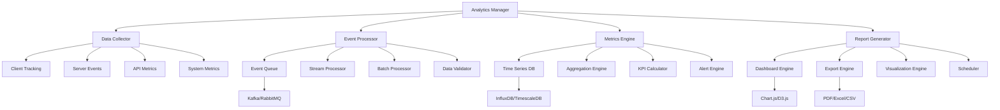

# Analytics and Reporting - Standards and Conventions

This document defines the standards and conventions for implementing analytics and reporting within the Token Nexus Platform. Analytics and reporting enable data-driven insights, performance monitoring, user behavior analysis, and business intelligence across all platform components.

## Table of Contents

1. [Architecture Overview](#architecture-overview)
2. [Analytics Types and Categories](#analytics-types-and-categories)
3. [Implementation Standards](#implementation-standards)
4. [Data Collection](#data-collection)
5. [Metrics and KPIs](#metrics-and-kpis)
6. [Report Generation](#report-generation)
7. [Real-time Analytics](#real-time-analytics)
8. [Data Privacy and Compliance](#data-privacy-and-compliance)
9. [Performance Optimization](#performance-optimization)
10. [Testing Standards](#testing-standards)
11. [Implementation Checklist](#implementation-checklist)
12. [Examples and Templates](#examples-and-templates)

## Architecture Overview

The analytics and reporting system operates through a comprehensive data pipeline that collects, processes, and visualizes data across the platform:



### Core Principles

1. **Privacy-First**: Respect user privacy and data protection regulations
2. **Real-Time**: Support both real-time and batch analytics
3. **Scalable**: Handle high-volume data collection and processing
4. **Accurate**: Ensure data quality and measurement accuracy
5. **Actionable**: Provide meaningful insights and recommendations
6. **Flexible**: Support custom metrics and reporting requirements
7. **Performant**: Minimal impact on application performance

## Analytics Types and Categories

### Analytics Categories

```typescript
enum AnalyticsCategory {
  USER_BEHAVIOR = 'user-behavior',
  PERFORMANCE = 'performance',
  BUSINESS = 'business',
  TECHNICAL = 'technical',
  SECURITY = 'security',
  ENGAGEMENT = 'engagement',
  CONVERSION = 'conversion',
  RETENTION = 'retention',
  REVENUE = 'revenue',
  OPERATIONAL = 'operational'
}

enum EventType {
  PAGE_VIEW = 'page-view',
  USER_ACTION = 'user-action',
  API_CALL = 'api-call',
  ERROR = 'error',
  PERFORMANCE = 'performance',
  BUSINESS_EVENT = 'business-event',
  SYSTEM_EVENT = 'system-event',
  SECURITY_EVENT = 'security-event',
  CUSTOM = 'custom'
}

enum MetricType {
  COUNTER = 'counter',
  GAUGE = 'gauge',
  HISTOGRAM = 'histogram',
  TIMER = 'timer',
  RATE = 'rate',
  PERCENTAGE = 'percentage',
  RATIO = 'ratio'
}

enum ReportType {
  DASHBOARD = 'dashboard',
  SCHEDULED = 'scheduled',
  AD_HOC = 'ad-hoc',
  ALERT = 'alert',
  EXPORT = 'export',
  REAL_TIME = 'real-time'
}

enum DataRetention {
  REAL_TIME = 'real-time', // 1 hour
  SHORT_TERM = 'short-term', // 7 days
  MEDIUM_TERM = 'medium-term', // 30 days
  LONG_TERM = 'long-term', // 1 year
  ARCHIVE = 'archive' // 7 years
}
```

### Analytics Configuration Schema

```typescript
interface AnalyticsConfiguration {
  id: string;
  name: string;
  category: AnalyticsCategory;
  enabled: boolean;
  collection: CollectionConfig;
  processing: ProcessingConfig;
  storage: StorageConfig;
  reporting: ReportingConfig;
  privacy: PrivacyConfig;
  performance: PerformanceConfig;
  alerts: AlertConfig[];
  organizationId?: string;
  applicationId?: string;
}

interface CollectionConfig {
  events: EventConfig[];
  sampling: SamplingConfig;
  filtering: FilterConfig;
  enrichment: EnrichmentConfig;
  validation: ValidationConfig;
  batching: BatchingConfig;
}

interface EventConfig {
  type: EventType;
  name: string;
  properties: PropertyConfig[];
  required: boolean;
  sampling: number; // 0-1
  retention: DataRetention;
  pii: boolean;
}

interface PropertyConfig {
  name: string;
  type: PropertyType;
  required: boolean;
  validation: PropertyValidation;
  transformation: PropertyTransformation;
  privacy: PropertyPrivacy;
}

interface ProcessingConfig {
  realTime: RealTimeProcessingConfig;
  batch: BatchProcessingConfig;
  aggregation: AggregationConfig;
  enrichment: EnrichmentConfig;
}

interface StorageConfig {
  primary: StorageBackend;
  backup: StorageBackend;
  retention: RetentionConfig;
  compression: CompressionConfig;
  partitioning: PartitioningConfig;
}

interface ReportingConfig {
  dashboards: DashboardConfig[];
  scheduledReports: ScheduledReportConfig[];
  exports: ExportConfig[];
  visualizations: VisualizationConfig[];
}

interface PrivacyConfig {
  anonymization: AnonymizationConfig;
  consent: ConsentConfig;
  dataSubjectRights: DataSubjectRightsConfig;
  retention: RetentionConfig;
  encryption: EncryptionConfig;
}

interface PerformanceConfig {
  maxEventsPerSecond: number;
  maxBatchSize: number;
  processingTimeout: number;
  caching: CachingConfig;
  optimization: OptimizationConfig;
}

interface AlertConfig {
  id: string;
  name: string;
  metric: string;
  condition: AlertCondition;
  threshold: number;
  channels: NotificationChannel[];
  enabled: boolean;
}
```

## Implementation Standards

### Base Analytics Manager

All analytics functionality must use the [`AnalyticsManager`](../src/analytics/AnalyticsManager.ts) class:

```typescript
// AnalyticsManager.ts
import { AnalyticsConfiguration, AnalyticsEvent, MetricDefinition } from '@/types/analytics';
import { DataCollector } from './DataCollector';
import { EventProcessor } from './EventProcessor';
import { MetricsEngine } from './MetricsEngine';
import { ReportGenerator } from './ReportGenerator';
import { PrivacyService } from '@/services/privacy';
import { StorageService } from '@/services/storage';

export class AnalyticsManager {
  private configurations: Map<string, AnalyticsConfiguration> = new Map();
  private dataCollector: DataCollector;
  private eventProcessor: EventProcessor;
  private metricsEngine: MetricsEngine;
  private reportGenerator: ReportGenerator;
  private privacyService: PrivacyService;
  private storageService: StorageService;

  constructor() {
    this.dataCollector = new DataCollector();
    this.eventProcessor = new EventProcessor();
    this.metricsEngine = new MetricsEngine();
    this.reportGenerator = new ReportGenerator();
    this.privacyService = new PrivacyService();
    this.storageService = new StorageService();
    
    this.initializeEventHandlers();
  }

  // Register analytics configuration
  registerConfiguration(config: AnalyticsConfiguration): void {
    this.validateConfiguration(config);
    this.configurations.set(config.id, config);
    
    if (config.enabled) {
      this.initializeConfiguration(config);
    }
  }

  // Track event
  async track(event: AnalyticsEvent): Promise<TrackingResult> {
    try {
      // Validate event
      await this.validateEvent(event);

      // Apply privacy filters
      const filteredEvent = await this.applyPrivacyFilters(event);

      // Enrich event data
      const enrichedEvent = await this.enrichEvent(filteredEvent);

      // Collect event
      const result = await this.dataCollector.collect(enrichedEvent);

      // Process in real-time if configured
      if (this.shouldProcessRealTime(enrichedEvent)) {
        await this.eventProcessor.processRealTime(enrichedEvent);
      }

      return {
        eventId: enrichedEvent.id,
        status: 'tracked',
        timestamp: enrichedEvent.timestamp
      };

    } catch (error) {
      console.error('Event tracking failed:', error);
      throw new AnalyticsError(`Tracking failed: ${error.message}`);
    }
  }

  // Track multiple events
  async trackBatch(events: AnalyticsEvent[]): Promise<BatchTrackingResult> {
    const results: TrackingResult[] = [];
    const errors: AnalyticsError[] = [];

    // Process events in batches
    const batchSize = 100;
    const batches = this.chunkArray(events, batchSize);

    for (const batch of batches) {
      const promises = batch.map(async (event) => {
        try {
          const result = await this.track(event);
          results.push(result);
        } catch (error) {
          errors.push(new AnalyticsError(error.message, event.id));
        }
      });

      await Promise.all(promises);
    }

    return {
      results,
      errors,
      totalEvents: events.length,
      successCount: results.length,
      errorCount: errors.length
    };
  }

  // Record metric
  async recordMetric(metric: MetricRecord): Promise<void> {
    try {
      // Validate metric
      await this.validateMetric(metric);

      // Record in metrics engine
      await this.metricsEngine.record(metric);

      // Check for alerts
      await this.checkAlerts(metric);

    } catch (error) {
      console.error('Metric recording failed:', error);
      throw new AnalyticsError(`Metric recording failed: ${error.message}`);
    }
  }

  // Get metrics
  async getMetrics(query: MetricsQuery): Promise<MetricsResult> {
    try {
      // Validate query
      await this.validateMetricsQuery(query);

      // Execute query
      const result = await this.metricsEngine.query(query);

      // Apply privacy filters to result
      const filteredResult = await this.applyPrivacyFiltersToResult(result, query.context);

      return filteredResult;

    } catch (error) {
      throw new AnalyticsError(`Metrics query failed: ${error.message}`);
    }
  }

  // Generate report
  async generateReport(request: ReportRequest): Promise<ReportResult> {
    try {
      // Validate request
      await this.validateReportRequest(request);

      // Check permissions
      await this.checkReportPermissions(request);

      // Generate report
      const report = await this.reportGenerator.generate(request);

      // Apply privacy filters
      const filteredReport = await this.applyPrivacyFiltersToReport(report, request.context);

      return filteredReport;

    } catch (error) {
      throw new AnalyticsError(`Report generation failed: ${error.message}`);
    }
  }

  // Schedule report
  async scheduleReport(schedule: ReportSchedule): Promise<ScheduleResult> {
    try {
      // Validate schedule
      await this.validateReportSchedule(schedule);

      // Create scheduled job
      const result = await this.reportGenerator.schedule(schedule);

      return {
        scheduleId: result.id,
        nextRun: result.nextRun,
        status: 'scheduled'
      };

    } catch (error) {
      throw new AnalyticsError(`Report scheduling failed: ${error.message}`);
    }
  }

  // Get dashboard data
  async getDashboardData(request: DashboardRequest): Promise<DashboardData> {
    try {
      // Validate request
      await this.validateDashboardRequest(request);

      // Get dashboard configuration
      const config = await this.getDashboardConfig(request.dashboardId);

      // Collect data for all widgets
      const widgets = await this.collectWidgetData(config.widgets, request.context);

      return {
        dashboardId: request.dashboardId,
        widgets,
        metadata: {
          generatedAt: new Date(),
          refreshInterval: config.refreshInterval,
          dataRange: request.dateRange
        }
      };

    } catch (error) {
      throw new AnalyticsError(`Dashboard data retrieval failed: ${error.message}`);
    }
  }

  // Export data
  async exportData(request: ExportRequest): Promise<ExportResult> {
    try {
      // Validate request
      await this.validateExportRequest(request);

      // Check export permissions
      await this.checkExportPermissions(request);

      // Generate export
      const exportResult = await this.reportGenerator.export(request);

      return exportResult;

    } catch (error) {
      throw new AnalyticsError(`Data export failed: ${error.message}`);
    }
  }

  // Real-time analytics
  async getRealtimeMetrics(query: RealtimeQuery): Promise<RealtimeMetrics> {
    try {
      // Get real-time data
      const metrics = await this.metricsEngine.getRealtimeMetrics(query);

      return {
        metrics,
        timestamp: new Date(),
        refreshInterval: query.refreshInterval || 5000
      };

    } catch (error) {
      throw new AnalyticsError(`Real-time metrics failed: ${error.message}`);
    }
  }

  // Event validation and processing
  private async validateEvent(event: AnalyticsEvent): Promise<void> {
    if (!event.id || !event.type || !event.timestamp) {
      throw new Error('Event missing required fields');
    }

    // Validate event type
    const config = this.getConfigurationForEvent(event);
    if (!config) {
      throw new Error(`No configuration found for event type: ${event.type}`);
    }

    // Validate event properties
    await this.validateEventProperties(event, config);
  }

  private async validateEventProperties(event: AnalyticsEvent, config: AnalyticsConfiguration): Promise<void> {
    const eventConfig = config.collection.events.find(e => e.type === event.type);
    if (!eventConfig) {
      return;
    }

    for (const propertyConfig of eventConfig.properties) {
      if (propertyConfig.required && !(propertyConfig.name in event.properties)) {
        throw new Error(`Required property missing: ${propertyConfig.name}`);
      }

      if (propertyConfig.name in event.properties) {
        const value = event.properties[propertyConfig.name];
        await this.validatePropertyValue(value, propertyConfig);
      }
    }
  }

  private async validatePropertyValue(value: any, config: PropertyConfig): Promise<void> {
    // Type validation
    if (!this.isValidPropertyType(value, config.type)) {
      throw new Error(`Invalid property type for ${config.name}: expected ${config.type}`);
    }

    // Custom validation
    if (config.validation) {
      const isValid = await this.executePropertyValidation(value, config.validation);
      if (!isValid) {
        throw new Error(`Property validation failed for ${config.name}`);
      }
    }
  }

  // Privacy and compliance
  private async applyPrivacyFilters(event: AnalyticsEvent): Promise<AnalyticsEvent> {
    const config = this.getConfigurationForEvent(event);
    if (!config || !config.privacy.anonymization.enabled) {
      return event;
    }

    // Apply anonymization
    const anonymizedEvent = await this.privacyService.anonymizeEvent(event, config.privacy);

    // Check consent
    if (config.privacy.consent.required) {
      const hasConsent = await this.privacyService.checkConsent(event.userId, event.type);
      if (!hasConsent) {
        throw new Error('User consent required for this event type');
      }
    }

    return anonymizedEvent;
  }

  private async applyPrivacyFiltersToResult(result: MetricsResult, context?: AnalyticsContext): Promise<MetricsResult> {
    // Apply data masking and filtering based on user permissions
    return await this.privacyService.filterMetricsResult(result, context);
  }

  // Event enrichment
  private async enrichEvent(event: AnalyticsEvent): Promise<AnalyticsEvent> {
    const enrichedEvent = { ...event };

    // Add session information
    if (event.sessionId) {
      const sessionData = await this.getSessionData(event.sessionId);
      enrichedEvent.properties = { ...enrichedEvent.properties, ...sessionData };
    }

    // Add user information
    if (event.userId) {
      const userData = await this.getUserData(event.userId);
      enrichedEvent.properties = { ...enrichedEvent.properties, ...userData };
    }

    // Add organization information
    if (event.organizationId) {
      const orgData = await this.getOrganizationData(event.organizationId);
      enrichedEvent.properties = { ...enrichedEvent.properties, ...orgData };
    }

    // Add geolocation
    if (event.ipAddress) {
      const geoData = await this.getGeolocationData(event.ipAddress);
      enrichedEvent.properties = { ...enrichedEvent.properties, ...geoData };
    }

    // Add device information
    if (event.userAgent) {
      const deviceData = await this.parseUserAgent(event.userAgent);
      enrichedEvent.properties = { ...enrichedEvent.properties, ...deviceData };
    }

    return enrichedEvent;
  }

  // Metrics and KPIs
  private async checkAlerts(metric: MetricRecord): Promise<void> {
    const config = this.getConfigurationForMetric(metric);
    if (!config) {
      return;
    }

    for (const alertConfig of config.alerts) {
      if (alertConfig.enabled && alertConfig.metric === metric.name) {
        const shouldAlert = await this.evaluateAlertCondition(metric, alertConfig);
        if (shouldAlert) {
          await this.triggerAlert(alertConfig, metric);
        }
      }
    }
  }

  private async evaluateAlertCondition(metric: MetricRecord, alert: AlertConfig): Promise<boolean> {
    switch (alert.condition.type) {
      case 'greater_than':
        return metric.value > alert.threshold;
      
      case 'less_than':
        return metric.value < alert.threshold;
      
      case 'equals':
        return metric.value === alert.threshold;
      
      case 'percentage_change':
        const previousValue = await this.getPreviousMetricValue(metric);
        const change = ((metric.value - previousValue) / previousValue) * 100;
        return Math.abs(change) > alert.threshold;
      
      default:
        return false;
    }
  }

  private async triggerAlert(alert: AlertConfig, metric: MetricRecord): Promise<void> {
    // Send alert notifications
    for (const channel of alert.channels) {
      try {
        await this.sendAlertNotification(channel, alert, metric);
      } catch (error) {
        console.error(`Alert notification failed for channel ${channel}:`, error);
      }
    }
  }

  // Report generation
  private async collectWidgetData(widgets: WidgetConfig[], context?: AnalyticsContext): Promise<WidgetData[]> {
    const widgetData: WidgetData[] = [];

    for (const widget of widgets) {
      try {
        const data = await this.getWidgetData(widget, context);
        widgetData.push(data);
      } catch (error) {
        console.error(`Widget data collection failed for ${widget.id}:`, error);
        widgetData.push({
          widgetId: widget.id,
          type: widget.type,
          data: null,
          error: error.message
        });
      }
    }

    return widgetData;
  }

  private async getWidgetData(widget: WidgetConfig, context?: AnalyticsContext): Promise<WidgetData> {
    const query: MetricsQuery = {
      metrics: widget.metrics,
      filters: widget.filters,
      groupBy: widget.groupBy,
      dateRange: widget.dateRange,
      context
    };

    const result = await this.getMetrics(query);

    return {
      widgetId: widget.id,
      type: widget.type,
      data: result.data,
      metadata: {
        title: widget.title,
        description: widget.description,
        lastUpdated: new Date()
      }
    };
  }

  // Utility methods
  private getConfigurationForEvent(event: AnalyticsEvent): AnalyticsConfiguration | null {
    for (const config of this.configurations.values()) {
      if (config.enabled && this.eventMatchesConfiguration(event, config)) {
        return config;
      }
    }
    return null;
  }

  private getConfigurationForMetric(metric: MetricRecord): AnalyticsConfiguration | null {
    for (const config of this.configurations.values()) {
      if (config.enabled && this.metricMatchesConfiguration(metric, config)) {
        return config;
      }
    }
    return null;
  }

  private eventMatchesConfiguration(event: AnalyticsEvent, config: AnalyticsConfiguration): boolean {
    // Check if event type is configured
    const eventConfig = config.collection.events.find(e => e.type === event.type);
    if (!eventConfig) {
      return false;
    }

    // Check organization scope
    if (config.organizationId && event.organizationId !== config.organizationId) {
      return false;
    }

    // Check application scope
    if (config.applicationId && event.applicationId !== config.applicationId) {
      return false;
    }

    return true;
  }

  private metricMatchesConfiguration(metric: MetricRecord, config: AnalyticsConfiguration): boolean {
    // Implementation would check if metric matches configuration
    return true;
  }

  private shouldProcessRealTime(event: AnalyticsEvent): boolean {
    const config = this.getConfigurationForEvent(event);
    return config?.processing.realTime.enabled || false;
  }

  private isValidPropertyType(value: any, type: PropertyType): boolean {
    switch (type) {
      case PropertyType.STRING:
        return typeof value === 'string';
      case PropertyType.NUMBER:
        return typeof value === 'number';
      case PropertyType.BOOLEAN:
        return typeof value === 'boolean';
      case PropertyType.OBJECT:
        return typeof value === 'object' && value !== null;
      case PropertyType.ARRAY:
        return Array.isArray(value);
      default:
        return true;
    }
  }

  private chunkArray<T>(array: T[], size: number): T[][] {
    const chunks: T[][] = [];
    for (let i = 0; i < array.length; i += size) {
      chunks.push(array.slice(i, i + size));
    }
    return chunks;
  }

  private validateConfiguration(config: AnalyticsConfiguration): void {
    if (!config.id || !config.name || !config.category) {
      throw new Error('Analytics configuration missing required fields');
    }

    if (!config.collection.events || config.collection.events.length === 0) {
      throw new Error('Analytics configuration must define at least one event type');
    }
  }

  private async initializeConfiguration(config: AnalyticsConfiguration): Promise<void> {
    // Initialize data collection
    await this.dataCollector.initialize(config);

    // Initialize event processing
    await this.eventProcessor.initialize(config);

    // Initialize metrics engine
    await this.metricsEngine.initialize(config);

    // Initialize report generator
    await this.reportGenerator.initialize(config);
  }

  private initializeEventHandlers(): void {
    // Set up event handlers for data pipeline
    this.dataCollector.on('event:collected', this.handleEventCollected.bind(this));
    this.eventProcessor.on('event:processed', this.handleEventProcessed.bind(this));
    this.metricsEngine.on('metric:recorded', this.handleMetricRecorded.bind(this));
  }

  private async handleEventCollected(event: AnalyticsEvent): Promise<void> {
    // Handle successful event collection
  }

  private async handleEventProcessed(event: AnalyticsEvent): Promise<void> {
    // Handle successful event processing
  }

  private async handleMetricRecorded(metric: MetricRecord): Promise<void> {
    // Handle successful metric recording
  }

  // Placeholder methods for complex operations
  private async executePropertyValidation(value: any, validation: PropertyValidation): Promise<boolean> {
    // Implementation would execute custom validation logic
    return true;
  }

  private async getSessionData(sessionId: string): Promise<Record<string, any>> {
    // Implementation would retrieve session data
    return {};
  }

  private async getUserData(userId: string): Promise<Record<string, any>> {
    // Implementation would retrieve user data
    return {};
  }

  private async getOrganizationData(organizationId: string): Promise<Record<string, any>> {
    // Implementation would retrieve organization data
    return {};
  }

  private async getGeolocationData(ipAddress: string): Promise<Record<string, any>> {
    // Implementation would get geolocation from IP
    return {};
  }

  private async parseUserAgent(userAgent: string): Promise<Record<string, any>> {
    // Implementation would parse user agent string
    return {};
  }

  private async getPreviousMetricValue(metric: MetricRecord): Promise<number> {
    // Implementation would get previous metric value
    return 0;
  }

  private async sendAlertNotification(channel: NotificationChannel, alert: AlertConfig, metric: MetricRecord): Promise<void> {
    // Implementation would send alert notification
  }

  private async getDashboardConfig(dashboardId: string): Promise<DashboardConfig> {
    // Implementation would retrieve dashboard configuration
    throw new Error('Not implemented');
  }

  private async validateMetric(metric: MetricRecord): Promise<void> {
    // Implementation would validate metric
  }

  private async validateMetricsQuery(query: MetricsQuery): Promise<void> {
    // Implementation would validate metrics query
  }

  private async validateReportRequest(request: ReportRequest): Promise<void> {
    // Implementation would validate report request
  }

  private async validateReportSchedule(schedule: ReportSchedule): Promise<void> {
    // Implementation would validate report schedule
  }

  private async validateDashboardRequest(request: DashboardRequest): Promise<void> {
    // Implementation would validate dashboard request
  }

  private async validateExportRequest(request: ExportRequest): Promise<void> {
    // Implementation would validate export request
  }

  private async checkReportPermissions(request: ReportRequest): Promise<void> {
    // Implementation would check report permissions
  }

  private async checkExportPermissions(request: ExportRequest): Promise<void> {
    // Implementation would check export permissions
  }

  private async applyPrivacyFiltersToReport(report: ReportResult, context?: AnalyticsContext): Promise<ReportResult> {
    // Implementation would apply privacy filters to report
    return report;
  }
}

// Supporting types and enums
export enum PropertyType {
  STRING = 'string',
  NUMBER = 'number',
  BOOLEAN = 'boolean',
  OBJECT = 'object',
  ARRAY = 'array'
}

export enum NotificationChannel {
  EMAIL = 'email',
  SLACK = 'slack',
  WEBHOOK = 'webhook',
  SMS = 'sms'
}

// Request/Response interfaces
export interface AnalyticsEvent {
  id: string;
  type: EventType;
  name: string;
  properties: Record<string, any>;
  userId?: string;
  sessionId?: string;
  organizationId?: string;
  applicationId?: string;
  ipAddress?: string;
  userAgent?: string;
  timestamp: Date;
}

export interface MetricRecord {
  name: string;
  value: number;
  type: MetricType;
  tags: Record<string, string>;
  timestamp: Date;
}

export interface TrackingResult {
  eventId: string;
  status: string;
  timestamp: Date;
}

export interface BatchTrackingResult {
  results: TrackingResult[];
  errors: AnalyticsError[];
  totalEvents: number;
  successCount: number;
  errorCount: number;
}

// Error classes
export class AnalyticsError extends Error {
  constructor(message: string, public eventId?: string) {
    super(message);
    this.name = 'AnalyticsError';
  }
}

// Global analytics manager instance
export const analyticsManager = new AnalyticsManager();

// Convenience functions
export async function track(event: AnalyticsEvent): Promise<TrackingResult> {
  return analyticsManager.track(event);
}

export async function recordMetric(metric: MetricRecord): Promise<void> {
  return analyticsManager.recordMetric(metric);
}

export async function getMetrics(query: MetricsQuery): Promise<MetricsResult> {
  return analyticsManager.getMetrics(query);
}

export async function generateReport(request: ReportRequest): Promise<ReportResult> {
  return analyticsManager.generateReport(request);
}
```

### Usage Examples

```typescript
// Example: Track user behavior
await track({
  id: 'evt_123',
  type: EventType.USER_ACTION,
  name: 'button_click',
  properties: {
    buttonId: 'save-document',
    documentId: 'doc_456',
    page: '/documents/edit'
  },
  userId: 'user_789',
  organizationId: 'org_101',
  timestamp: new Date()
});

// Example: Record performance metric
await recordMetric({
  name: 'api_response_time',
  value: 250,
  type: MetricType.TIMER,
  tags: {
    endpoint: '/api/documents',
    method: 'GET',
    status: '200'
  },
  timestamp: new Date()
});

// Example: Generate dashboard data
const dashboardData = await analyticsManager.getDashboardData({
  dashboardId: 'dashboard_123',
  dateRange: {
    start: new Date('2024-01-01'),
    end: new Date('2024-01-31')
  },
  context: {
    userId: 'user_789',
    organizationId: 'org_101'
  }
});
```

This comprehensive analytics and reporting system provides:

1. **Event Tracking**: Comprehensive event collection with privacy controls
2. **Metrics Engine**: Real-time and batch metric processing
3. **Report Generation**: Flexible reporting with scheduling capabilities
4. **Dashboard Support**: Real-time dashboard data with customizable widgets
5. **Privacy