# Security and Compliance - Standards and Conventions

This document defines the standards and conventions for implementing security and compliance within the Token Nexus Platform. Security and compliance ensure data protection, regulatory adherence, threat prevention, and maintain user trust through comprehensive security measures.

## Table of Contents

1. [Architecture Overview](#architecture-overview)
2. [Security Framework](#security-framework)
3. [Implementation Standards](#implementation-standards)
4. [Authentication and Authorization](#authentication-and-authorization)
5. [Data Protection](#data-protection)
6. [Threat Prevention](#threat-prevention)
7. [Compliance Management](#compliance-management)
8. [Security Monitoring](#security-monitoring)
9. [Incident Response](#incident-response)
10. [Testing Standards](#testing-standards)
11. [Implementation Checklist](#implementation-checklist)
12. [Examples and Templates](#examples-and-templates)

## Architecture Overview

The security and compliance system operates through a multi-layered defense architecture that protects all platform components:

```mermaid
graph TB
    A[Security Manager] --> B[Authentication Service]
    A --> C[Authorization Engine]
    A --> D[Encryption Service]
    A --> E[Threat Detection]
    
    B --> F[Identity Provider]
    B --> G[MFA Service]
    B --> H[Session Manager]
    B --> I[Token Service]
    
    C --> J[RBAC Engine]
    C --> K[ABAC Engine]
    C --> L[Permission Store]
    C --> M[Policy Engine]
    
    D --> N[Key Management]
    D --> O[Data Encryption]
    D --> P[Transport Security]
    D --> Q[Field Encryption]
    
    E --> R[WAF]
    E --> S[IDS/IPS]
    E --> T[Anomaly Detection]
    E --> U[Vulnerability Scanner]
    
    A --> V[Compliance Engine]
    V --> W[GDPR Module]
    V --> X[SOC2 Module]
    V --> Y[HIPAA Module]
    V --> Z[Audit Logger]
```



### Core Principles

1. **Zero Trust**: Never trust, always verify every request
2. **Defense in Depth**: Multiple layers of security controls
3. **Least Privilege**: Minimum necessary access rights
4. **Privacy by Design**: Built-in privacy protection
5. **Continuous Monitoring**: Real-time threat detection
6. **Compliance First**: Regulatory requirements embedded
7. **Incident Ready**: Prepared response procedures

## Security Framework

### Security Categories

```typescript
enum SecurityDomain {
  IDENTITY_ACCESS = 'identity-access',
  DATA_PROTECTION = 'data-protection',
  NETWORK_SECURITY = 'network-security',
  APPLICATION_SECURITY = 'application-security',
  INFRASTRUCTURE_SECURITY = 'infrastructure-security',
  OPERATIONAL_SECURITY = 'operational-security',
  COMPLIANCE = 'compliance',
  INCIDENT_RESPONSE = 'incident-response'
}

enum ThreatLevel {
  CRITICAL = 'critical',
  HIGH = 'high',
  MEDIUM = 'medium',
  LOW = 'low',
  INFO = 'info'
}

enum ComplianceFramework {
  GDPR = 'gdpr',
  SOC2 = 'soc2',
  HIPAA = 'hipaa',
  PCI_DSS = 'pci-dss',
  ISO27001 = 'iso27001',
  NIST = 'nist',
  CCPA = 'ccpa'
}

enum SecurityEventType {
  AUTHENTICATION_FAILURE = 'auth-failure',
  AUTHORIZATION_VIOLATION = 'authz-violation',
  DATA_ACCESS = 'data-access',
  PRIVILEGE_ESCALATION = 'privilege-escalation',
  SUSPICIOUS_ACTIVITY = 'suspicious-activity',
  SECURITY_VIOLATION = 'security-violation',
  COMPLIANCE_VIOLATION = 'compliance-violation',
  SYSTEM_COMPROMISE = 'system-compromise'
}

enum EncryptionAlgorithm {
  AES_256_GCM = 'aes-256-gcm',
  AES_256_CBC = 'aes-256-cbc',
  RSA_4096 = 'rsa-4096',
  ECDSA_P256 = 'ecdsa-p256',
  CHACHA20_POLY1305 = 'chacha20-poly1305'
}
```

### Security Configuration Schema

```typescript
interface SecurityConfiguration {
  id: string;
  name: string;
  domain: SecurityDomain;
  enabled: boolean;
  authentication: AuthenticationConfig;
  authorization: AuthorizationConfig;
  encryption: EncryptionConfig;
  monitoring: SecurityMonitoringConfig;
  compliance: ComplianceConfig;
  threatDetection: ThreatDetectionConfig;
  incidentResponse: IncidentResponseConfig;
  auditLogging: AuditLoggingConfig;
  organizationId?: string;
  applicationId?: string;
}

interface AuthenticationConfig {
  providers: AuthProvider[];
  mfa: MFAConfig;
  passwordPolicy: PasswordPolicyConfig;
  sessionManagement: SessionConfig;
  tokenManagement: TokenConfig;
  sso: SSOConfig;
}

interface AuthorizationConfig {
  model: AuthorizationModel;
  rbac: RBACConfig;
  abac: ABACConfig;
  policies: PolicyConfig[];
  enforcement: EnforcementConfig;
  delegation: DelegationConfig;
}

interface EncryptionConfig {
  dataAtRest: DataEncryptionConfig;
  dataInTransit: TransportEncryptionConfig;
  keyManagement: KeyManagementConfig;
  fieldLevel: FieldEncryptionConfig;
  algorithms: AlgorithmConfig[];
}

interface SecurityMonitoringConfig {
  realTimeMonitoring: boolean;
  threatIntelligence: ThreatIntelConfig;
  anomalyDetection: AnomalyDetectionConfig;
  vulnerabilityScanning: VulnScanConfig;
  securityMetrics: SecurityMetricsConfig;
}

interface ComplianceConfig {
  frameworks: ComplianceFramework[];
  dataRetention: RetentionConfig;
  dataSubjectRights: DataSubjectRightsConfig;
  consentManagement: ConsentConfig;
  privacyControls: PrivacyControlsConfig;
  auditRequirements: AuditRequirementsConfig;
}

interface ThreatDetectionConfig {
  waf: WAFConfig;
  idsIps: IDSIPSConfig;
  malwareDetection: MalwareDetectionConfig;
  behaviorAnalysis: BehaviorAnalysisConfig;
  threatHunting: ThreatHuntingConfig;
}

interface IncidentResponseConfig {
  enabled: boolean;
  playbooks: PlaybookConfig[];
  escalation: EscalationConfig;
  communication: CommunicationConfig;
  forensics: ForensicsConfig;
  recovery: RecoveryConfig;
}

interface AuditLoggingConfig {
  enabled: boolean;
  events: AuditEventConfig[];
  retention: number; // days
  encryption: boolean;
  integrity: IntegrityConfig;
  compliance: ComplianceLoggingConfig;
}
```

## Implementation Standards

### Base Security Manager

All security functionality must use the [`SecurityManager`](../src/security/SecurityManager.ts) class:

```typescript
// SecurityManager.ts
import { SecurityConfiguration, SecurityEvent, ThreatAssessment } from '@/types/security';
import { AuthenticationService } from './AuthenticationService';
import { AuthorizationService } from './AuthorizationService';
import { EncryptionService } from './EncryptionService';
import { ThreatDetectionService } from './ThreatDetectionService';
import { ComplianceService } from './ComplianceService';
import { AuditService } from './AuditService';
import { IncidentResponseService } from './IncidentResponseService';

export class SecurityManager {
  private configurations: Map<string, SecurityConfiguration> = new Map();
  private authenticationService: AuthenticationService;
  private authorizationService: AuthorizationService;
  private encryptionService: EncryptionService;
  private threatDetectionService: ThreatDetectionService;
  private complianceService: ComplianceService;
  private auditService: AuditService;
  private incidentResponseService: IncidentResponseService;

  constructor() {
    this.authenticationService = new AuthenticationService();
    this.authorizationService = new AuthorizationService();
    this.encryptionService = new EncryptionService();
    this.threatDetectionService = new ThreatDetectionService();
    this.complianceService = new ComplianceService();
    this.auditService = new AuditService();
    this.incidentResponseService = new IncidentResponseService();
    
    this.initializeSecurityServices();
  }

  // Register security configuration
  registerConfiguration(config: SecurityConfiguration): void {
    this.validateSecurityConfiguration(config);
    this.configurations.set(config.id, config);
    
    if (config.enabled) {
      this.initializeSecurityConfiguration(config);
    }
  }

  // Authenticate user
  async authenticate(request: AuthenticationRequest): Promise<AuthenticationResult> {
    try {
      // Log authentication attempt
      await this.auditService.logSecurityEvent({
        type: SecurityEventType.AUTHENTICATION_FAILURE,
        userId: request.identifier,
        ipAddress: request.ipAddress,
        userAgent: request.userAgent,
        timestamp: new Date(),
        details: { method: request.method }
      });

      // Validate request
      await this.validateAuthenticationRequest(request);

      // Check for suspicious activity
      await this.checkSuspiciousActivity(request);

      // Perform authentication
      const result = await this.authenticationService.authenticate(request);

      // Apply MFA if required
      if (result.mfaRequired) {
        return await this.handleMFAChallenge(result, request);
      }

      // Create session
      const session = await this.createSecureSession(result.user, request);

      // Log successful authentication
      await this.auditService.logSecurityEvent({
        type: SecurityEventType.DATA_ACCESS,
        userId: result.user.id,
        ipAddress: request.ipAddress,
        timestamp: new Date(),
        details: { success: true, sessionId: session.id }
      });

      return {
        success: true,
        user: result.user,
        session: session,
        token: session.token
      };

    } catch (error) {
      // Log failed authentication
      await this.auditService.logSecurityEvent({
        type: SecurityEventType.AUTHENTICATION_FAILURE,
        userId: request.identifier,
        ipAddress: request.ipAddress,
        timestamp: new Date(),
        details: { error: error.message }
      });

      throw new SecurityError(`Authentication failed: ${error.message}`);
    }
  }

  // Authorize action
  async authorize(request: AuthorizationRequest): Promise<AuthorizationResult> {
    try {
      // Validate session
      const session = await this.validateSession(request.sessionToken);

      // Check permissions
      const authorized = await this.authorizationService.checkPermission(
        session.userId,
        request.resource,
        request.action,
        request.context
      );

      // Log authorization attempt
      await this.auditService.logSecurityEvent({
        type: authorized ? SecurityEventType.DATA_ACCESS : SecurityEventType.AUTHORIZATION_VIOLATION,
        userId: session.userId,
        resource: request.resource,
        action: request.action,
        timestamp: new Date(),
        details: { authorized, context: request.context }
      });

      if (!authorized) {
        throw new SecurityError('Access denied: insufficient permissions');
      }

      return {
        authorized: true,
        permissions: await this.authorizationService.getUserPermissions(session.userId),
        context: request.context
      };

    } catch (error) {
      throw new SecurityError(`Authorization failed: ${error.message}`);
    }
  }

  // Encrypt data
  async encryptData(data: any, config: EncryptionRequest): Promise<EncryptionResult> {
    try {
      // Validate encryption request
      await this.validateEncryptionRequest(config);

      // Perform encryption
      const result = await this.encryptionService.encrypt(data, config);

      // Log encryption event
      await this.auditService.logSecurityEvent({
        type: SecurityEventType.DATA_ACCESS,
        userId: config.userId,
        timestamp: new Date(),
        details: {
          operation: 'encrypt',
          algorithm: config.algorithm,
          keyId: config.keyId
        }
      });

      return result;

    } catch (error) {
      throw new SecurityError(`Encryption failed: ${error.message}`);
    }
  }

  // Decrypt data
  async decryptData(encryptedData: string, config: DecryptionRequest): Promise<DecryptionResult> {
    try {
      // Validate decryption request
      await this.validateDecryptionRequest(config);

      // Check access permissions for key
      await this.checkKeyAccess(config.keyId, config.userId);

      // Perform decryption
      const result = await this.encryptionService.decrypt(encryptedData, config);

      // Log decryption event
      await this.auditService.logSecurityEvent({
        type: SecurityEventType.DATA_ACCESS,
        userId: config.userId,
        timestamp: new Date(),
        details: {
          operation: 'decrypt',
          keyId: config.keyId
        }
      });

      return result;

    } catch (error) {
      throw new SecurityError(`Decryption failed: ${error.message}`);
    }
  }

  // Detect threats
  async detectThreats(request: ThreatDetectionRequest): Promise<ThreatAssessment> {
    try {
      // Analyze request for threats
      const assessment = await this.threatDetectionService.analyze(request);

      // Log threat detection
      if (assessment.threatLevel !== ThreatLevel.INFO) {
        await this.auditService.logSecurityEvent({
          type: SecurityEventType.SUSPICIOUS_ACTIVITY,
          userId: request.userId,
          ipAddress: request.ipAddress,
          timestamp: new Date(),
          details: {
            threatLevel: assessment.threatLevel,
            threats: assessment.threats,
            confidence: assessment.confidence
          }
        });
      }

      // Trigger incident response if critical
      if (assessment.threatLevel === ThreatLevel.CRITICAL) {
        await this.triggerIncidentResponse(assessment);
      }

      return assessment;

    } catch (error) {
      throw new SecurityError(`Threat detection failed: ${error.message}`);
    }
  }

  // Validate compliance
  async validateCompliance(request: ComplianceValidationRequest): Promise<ComplianceResult> {
    try {
      // Check compliance requirements
      const result = await this.complianceService.validate(request);

      // Log compliance check
      await this.auditService.logSecurityEvent({
        type: result.compliant ? SecurityEventType.DATA_ACCESS : SecurityEventType.COMPLIANCE_VIOLATION,
        userId: request.userId,
        timestamp: new Date(),
        details: {
          framework: request.framework,
          compliant: result.compliant,
          violations: result.violations
        }
      });

      return result;

    } catch (error) {
      throw new SecurityError(`Compliance validation failed: ${error.message}`);
    }
  }

  // Handle security incident
  async handleSecurityIncident(incident: SecurityIncident): Promise<IncidentResponse> {
    try {
      // Validate incident
      await this.validateSecurityIncident(incident);

      // Trigger incident response
      const response = await this.incidentResponseService.handle(incident);

      // Log incident
      await this.auditService.logSecurityEvent({
        type: SecurityEventType.SYSTEM_COMPROMISE,
        timestamp: new Date(),
        details: {
          incidentId: incident.id,
          severity: incident.severity,
          type: incident.type,
          responseId: response.id
        }
      });

      return response;

    } catch (error) {
      throw new SecurityError(`Incident handling failed: ${error.message}`);
    }
  }

  // Get security metrics
  async getSecurityMetrics(request: SecurityMetricsRequest): Promise<SecurityMetricsResult> {
    try {
      // Validate request
      await this.validateSecurityMetricsRequest(request);

      // Collect metrics
      const metrics = await this.collectSecurityMetrics(request);

      return {
        metrics,
        period: request.period,
        generatedAt: new Date()
      };

    } catch (error) {
      throw new SecurityError(`Security metrics collection failed: ${error.message}`);
    }
  }

  // Authentication helpers
  private async validateAuthenticationRequest(request: AuthenticationRequest): Promise<void> {
    // Check rate limiting
    await this.checkAuthenticationRateLimit(request.identifier, request.ipAddress);

    // Validate input format
    if (!this.isValidIdentifier(request.identifier)) {
      throw new Error('Invalid identifier format');
    }

    // Check for blocked IPs
    if (await this.isBlockedIP(request.ipAddress)) {
      throw new Error('IP address is blocked');
    }

    // Check for account lockout
    if (await this.isAccountLocked(request.identifier)) {
      throw new Error('Account is locked');
    }
  }

  private async checkSuspiciousActivity(request: AuthenticationRequest): Promise<void> {
    const threatAssessment = await this.detectThreats({
      type: 'authentication',
      userId: request.identifier,
      ipAddress: request.ipAddress,
      userAgent: request.userAgent,
      timestamp: new Date()
    });

    if (threatAssessment.threatLevel === ThreatLevel.HIGH || threatAssessment.threatLevel === ThreatLevel.CRITICAL) {
      throw new Error('Suspicious activity detected');
    }
  }

  private async handleMFAChallenge(result: AuthenticationResult, request: AuthenticationRequest): Promise<AuthenticationResult> {
    // Generate MFA challenge
    const challenge = await this.authenticationService.generateMFAChallenge(result.user);

    return {
      success: false,
      mfaRequired: true,
      mfaChallenge: challenge,
      user: result.user
    };
  }

  private async createSecureSession(user: User, request: AuthenticationRequest): Promise<Session> {
    const session = await this.authenticationService.createSession({
      userId: user.id,
      ipAddress: request.ipAddress,
      userAgent: request.userAgent,
      organizationId: user.organizationId
    });

    // Set security headers
    session.securityHeaders = {
      'Strict-Transport-Security': 'max-age=31536000; includeSubDomains',
      'X-Content-Type-Options': 'nosniff',
      'X-Frame-Options': 'DENY',
      'X-XSS-Protection': '1; mode=block',
      'Content-Security-Policy': this.generateCSP()
    };

    return session;
  }

  // Authorization helpers
  private async validateSession(sessionToken: string): Promise<Session> {
    const session = await this.authenticationService.validateSession(sessionToken);
    
    if (!session || session.expired) {
      throw new Error('Invalid or expired session');
    }

    // Check for session hijacking
    await this.checkSessionSecurity(session);

    return session;
  }

  private async checkSessionSecurity(session: Session): Promise<void> {
    // Check for concurrent sessions
    const activeSessions = await this.authenticationService.getActiveSessions(session.userId);
    
    if (activeSessions.length > 5) { // Max 5 concurrent sessions
      throw new Error('Too many active sessions');
    }

    // Check for IP changes
    if (session.lastIpAddress && session.lastIpAddress !== session.currentIpAddress) {
      // Log potential session hijacking
      await this.auditService.logSecurityEvent({
        type: SecurityEventType.SUSPICIOUS_ACTIVITY,
        userId: session.userId,
        timestamp: new Date(),
        details: {
          event: 'ip_change',
          oldIp: session.lastIpAddress,
          newIp: session.currentIpAddress
        }
      });
    }
  }

  // Encryption helpers
  private async validateEncryptionRequest(config: EncryptionRequest): Promise<void> {
    // Validate algorithm
    if (!this.isSupportedAlgorithm(config.algorithm)) {
      throw new Error(`Unsupported encryption algorithm: ${config.algorithm}`);
    }

    // Validate key access
    await this.checkKeyAccess(config.keyId, config.userId);
  }

  private async validateDecryptionRequest(config: DecryptionRequest): Promise<void> {
    // Validate key access
    await this.checkKeyAccess(config.keyId, config.userId);

    // Check decryption permissions
    const authorized = await this.authorizationService.checkPermission(
      config.userId,
      'encryption:key',
      'decrypt',
      { keyId: config.keyId }
    );

    if (!authorized) {
      throw new Error('Insufficient permissions for decryption');
    }
  }

  private async checkKeyAccess(keyId: string, userId: string): Promise<void> {
    const hasAccess = await this.encryptionService.checkKeyAccess(keyId, userId);
    
    if (!hasAccess) {
      throw new Error('Access denied to encryption key');
    }
  }

  // Threat detection helpers
  private async triggerIncidentResponse(assessment: ThreatAssessment): Promise<void> {
    const incident: SecurityIncident = {
      id: this.generateIncidentId(),
      type: 'threat_detected',
      severity: this.mapThreatLevelToSeverity(assessment.threatLevel),
      description: `Critical threat detected: ${assessment.threats.join(', ')}`,
      source: assessment.source,
      timestamp: new Date(),
      status: 'open'
    };

    await this.handleSecurityIncident(incident);
  }

  // Compliance helpers
  private async collectSecurityMetrics(request: SecurityMetricsRequest): Promise<SecurityMetric[]> {
    const metrics: SecurityMetric[] = [];

    // Authentication metrics
    if (request.categories.includes('authentication')) {
      const authMetrics = await this.getAuthenticationMetrics(request.period);
      metrics.push(...authMetrics);
    }

    // Authorization metrics
    if (request.categories.includes('authorization')) {
      const authzMetrics = await this.getAuthorizationMetrics(request.period);
      metrics.push(...authzMetrics);
    }

    // Threat detection metrics
    if (request.categories.includes('threats')) {
      const threatMetrics = await this.getThreatMetrics(request.period);
      metrics.push(...threatMetrics);
    }

    // Compliance metrics
    if (request.categories.includes('compliance')) {
      const complianceMetrics = await this.getComplianceMetrics(request.period);
      metrics.push(...complianceMetrics);
    }

    return metrics;
  }

  // Utility methods
  private isSupportedAlgorithm(algorithm: EncryptionAlgorithm): boolean {
    const supportedAlgorithms = [
      EncryptionAlgorithm.AES_256_GCM,
      EncryptionAlgorithm.AES_256_CBC,
      EncryptionAlgorithm.RSA_4096,
      EncryptionAlgorithm.ECDSA_P256,
      EncryptionAlgorithm.CHACHA20_POLY1305
    ];
    return supportedAlgorithms.includes(algorithm);
  }

  private isValidIdentifier(identifier: string): boolean {
    // Email format validation
    const emailRegex = /^[^\s@]+@[^\s@]+\.[^\s@]+$/;
    return emailRegex.test(identifier);
  }

  private generateCSP(): string {
    return "default-src 'self'; script-src 'self' 'unsafe-inline'; style-src 'self' 'unsafe-inline'; img-src 'self' data: https:; font-src 'self' https:; connect-src 'self' https:; frame-ancestors 'none';";
  }

  private generateIncidentId(): string {
    return `inc_${Date.now()}_${Math.random().toString(36).substr(2, 9)}`;
  }

  private mapThreatLevelToSeverity(threatLevel: ThreatLevel): string {
    switch (threatLevel) {
      case ThreatLevel.CRITICAL: return 'critical';
      case ThreatLevel.HIGH: return 'high';
      case ThreatLevel.MEDIUM: return 'medium';
      case ThreatLevel.LOW: return 'low';
      default: return 'info';
    }
  }

  private validateSecurityConfiguration(config: SecurityConfiguration): void {
    if (!config.id || !config.name || !config.domain) {
      throw new Error('Security configuration missing required fields');
    }

    if (!config.authentication && !config.authorization && !config.encryption) {
      throw new Error('Security configuration must define at least one security control');
    }
  }

  private async initializeSecurityConfiguration(config: SecurityConfiguration): Promise<void> {
    // Initialize authentication
    if (config.authentication) {
      await this.authenticationService.initialize(config.authentication);
    }

    // Initialize authorization
    if (config.authorization) {
      await this.authorizationService.initialize(config.authorization);
    }

    // Initialize encryption
    if (config.encryption) {
      await this.encryptionService.initialize(config.encryption);
    }

    // Initialize threat detection
    if (config.threatDetection) {
      await this.threatDetectionService.initialize(config.threatDetection);
    }

    // Initialize compliance
    if (config.compliance) {
      await this.complianceService.initialize(config.compliance);
    }
  }

  private initializeSecurityServices(): void {
    // Set up event handlers
    this.threatDetectionService.on('threat:detected', this.handleThreatDetected.bind(this));
    this.authenticationService.on('auth:failed', this.handleAuthenticationFailed.bind(this));
    this.authorizationService.on('authz:denied', this.handleAuthorizationDenied.bind(this));
  }

  private async handleThreatDetected(threat: ThreatAssessment): Promise<void> {
    if (threat.threatLevel === ThreatLevel.CRITICAL || threat.threatLevel === ThreatLevel.HIGH) {
      await this.triggerIncidentResponse(threat);
    }
  }

  private async handleAuthenticationFailed(event: AuthenticationEvent): Promise<void> {
    // Implement account lockout logic
    await this.checkAccountLockout(event.identifier);
  }

  private async handleAuthorizationDenied(event: AuthorizationEvent): Promise<void> {
    // Log potential privilege escalation attempt
    await this.auditService.logSecurityEvent({
      type: SecurityEventType.PRIVILEGE_ESCALATION,
      userId: event.userId,
      resource: event.resource,
      action: event.action,
      timestamp: new Date(),
      details: { denied: true }
    });
  }

  // Placeholder methods for complex operations
  private async checkAuthenticationRateLimit(identifier: string, ipAddress: string): Promise<void> {
    // Implementation would check rate limits
  }

  private async isBlockedIP(ipAddress: string): Promise<boolean> {
    // Implementation would check IP blocklist
    return false;
  }

  private async isAccountLocked(identifier: string): Promise<boolean> {
    // Implementation would check account lockout status
    return false;
  }

  private async checkAccountLockout(identifier: string): Promise<void> {
    // Implementation would handle account lockout logic
  }

  private async validateSecurityIncident(incident: SecurityIncident): Promise<void> {
    // Implementation would validate incident
  }

  private async validateSecurityMetricsRequest(request: SecurityMetricsRequest): Promise<void> {
    // Implementation would validate metrics request
  }

  private async getAuthenticationMetrics(period: TimePeriod): Promise<SecurityMetric[]> {
    // Implementation would collect authentication metrics
    return [];
  }

  private async getAuthorizationMetrics(period: TimePeriod): Promise<SecurityMetric[]> {
    // Implementation would collect authorization metrics
    return [];
  }

  private async getThreatMetrics(period: TimePeriod): Promise<SecurityMetric[]> {
    // Implementation would collect threat metrics
    return [];
  }

  private async getComplianceMetrics(period: TimePeriod): Promise<SecurityMetric[]> {
    // Implementation would collect compliance metrics
    return [];
  }
}

// Authentication Service
export class AuthenticationService extends EventEmitter {
  async authenticate(request: AuthenticationRequest): Promise<AuthenticationResult> {
    // Implementation would handle authentication
    throw new Error('Not implemented');
  }

  async generateMFAChallenge(user: User): Promise<MFAChallenge> {
    // Implementation would generate MFA challenge
    throw new Error('Not implemented');
  }

  async createSession(request: SessionRequest): Promise<Session> {
    // Implementation would create session
    throw new Error('Not implemented');
  }

  async validateSession(token: string): Promise<Session | null> {
    // Implementation would validate session
    return null;
  }

  async getActiveSessions(userId: string): Promise<Session[]> {
    // Implementation would get active sessions
    return [];
  }

  async initialize(config: AuthenticationConfig): Promise<void> {
    // Implementation would initialize authentication
  }
}

// Authorization Service
export class AuthorizationService extends EventEmitter {
  async checkPermission(userId: string, resource: string, action: string, context?: any): Promise<boolean> {
    // Implementation would check permissions
    return false;
  }

  async getUserPermissions(userId: string): Promise<Permission[]> {
    // Implementation would get user permissions
    return [];
  }

  async initialize(config: