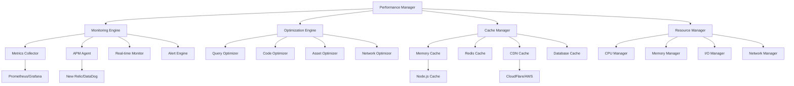

# Performance Optimization - Standards and Conventions

This document defines the standards and conventions for implementing performance optimization within the Token Nexus Platform. Performance optimization ensures fast response times, efficient resource utilization, and scalable operations across all platform components.

## Table of Contents

1. [Architecture Overview](#architecture-overview)
2. [Performance Categories](#performance-categories)
3. [Implementation Standards](#implementation-standards)
4. [Monitoring and Metrics](#monitoring-and-metrics)
5. [Caching Strategies](#caching-strategies)
6. [Database Optimization](#database-optimization)
7. [Frontend Optimization](#frontend-optimization)
8. [API Optimization](#api-optimization)
9. [Resource Management](#resource-management)
10. [Testing Standards](#testing-standards)
11. [Implementation Checklist](#implementation-checklist)
12. [Examples and Templates](#examples-and-templates)

## Architecture Overview

The performance optimization system operates through a comprehensive monitoring and optimization framework that covers all platform layers:



### Core Principles

1. **Measure First**: Always measure before optimizing
2. **Bottleneck Focus**: Identify and address critical bottlenecks
3. **Progressive Enhancement**: Optimize incrementally
4. **User-Centric**: Prioritize user-perceived performance
5. **Resource Efficient**: Minimize resource consumption
6. **Scalable Design**: Build for growth and scale
7. **Continuous Improvement**: Ongoing optimization process

## Performance Categories

### Performance Domains

```typescript
enum PerformanceDomain {
  FRONTEND = 'frontend',
  BACKEND = 'backend',
  DATABASE = 'database',
  NETWORK = 'network',
  CACHE = 'cache',
  STORAGE = 'storage',
  COMPUTE = 'compute',
  MEMORY = 'memory'
}

enum MetricType {
  RESPONSE_TIME = 'response-time',
  THROUGHPUT = 'throughput',
  ERROR_RATE = 'error-rate',
  RESOURCE_UTILIZATION = 'resource-utilization',
  USER_EXPERIENCE = 'user-experience',
  AVAILABILITY = 'availability',
  SCALABILITY = 'scalability'
}

enum OptimizationStrategy {
  CACHING = 'caching',
  COMPRESSION = 'compression',
  MINIFICATION = 'minification',
  LAZY_LOADING = 'lazy-loading',
  CODE_SPLITTING = 'code-splitting',
  DATABASE_INDEXING = 'database-indexing',
  QUERY_OPTIMIZATION = 'query-optimization',
  RESOURCE_POOLING = 'resource-pooling',
  LOAD_BALANCING = 'load-balancing',
  CDN_OPTIMIZATION = 'cdn-optimization'
}

enum CacheStrategy {
  CACHE_ASIDE = 'cache-aside',
  WRITE_THROUGH = 'write-through',
  WRITE_BEHIND = 'write-behind',
  REFRESH_AHEAD = 'refresh-ahead',
  TIME_BASED = 'time-based',
  LRU = 'lru',
  LFU = 'lfu'
}

enum PerformanceThreshold {
  EXCELLENT = 'excellent',
  GOOD = 'good',
  NEEDS_IMPROVEMENT = 'needs-improvement',
  POOR = 'poor'
}
```

### Performance Configuration Schema

```typescript
interface PerformanceConfiguration {
  id: string;
  name: string;
  domain: PerformanceDomain;
  enabled: boolean;
  monitoring: MonitoringConfig;
  optimization: OptimizationConfig;
  caching: CachingConfig;
  thresholds: ThresholdConfig;
  alerts: AlertConfig[];
  reporting: ReportingConfig;
  testing: PerformanceTestingConfig;
  organizationId?: string;
  applicationId?: string;
}

interface MonitoringConfig {
  realTime: boolean;
  sampling: SamplingConfig;
  metrics: MetricConfig[];
  apm: APMConfig;
  profiling: ProfilingConfig;
  tracing: TracingConfig;
}

interface OptimizationConfig {
  strategies: OptimizationStrategy[];
  autoOptimization: AutoOptimizationConfig;
  resourceLimits: ResourceLimitsConfig;
  compression: CompressionConfig;
  minification: MinificationConfig;
  bundling: BundlingConfig;
}

interface CachingConfig {
  enabled: boolean;
  strategies: CacheStrategyConfig[];
  layers: CacheLayerConfig[];
  invalidation: InvalidationConfig;
  warming: WarmingConfig;
  monitoring: CacheMonitoringConfig;
}

interface ThresholdConfig {
  responseTime: ThresholdValues;
  throughput: ThresholdValues;
  errorRate: ThresholdValues;
  resourceUtilization: ThresholdValues;
  userExperience: UXThresholdConfig;
}

interface ThresholdValues {
  excellent: number;
  good: number;
  needsImprovement: number;
  poor: number;
}

interface UXThresholdConfig {
  firstContentfulPaint: ThresholdValues;
  largestContentfulPaint: ThresholdValues;
  firstInputDelay: ThresholdValues;
  cumulativeLayoutShift: ThresholdValues;
  timeToInteractive: ThresholdValues;
}

interface AlertConfig {
  id: string;
  name: string;
  metric: string;
  condition: AlertCondition;
  threshold: number;
  duration: number; // seconds
  channels: NotificationChannel[];
  enabled: boolean;
}

interface ReportingConfig {
  enabled: boolean;
  frequency: ReportFrequency;
  recipients: string[];
  dashboards: DashboardConfig[];
  exports: ExportConfig[];
}

interface PerformanceTestingConfig {
  loadTesting: LoadTestingConfig;
  stressTesting: StressTestingConfig;
  enduranceTesting: EnduranceTestingConfig;
  spikeTesting: SpikeTestingConfig;
  automation: TestAutomationConfig;
}
```

## Implementation Standards

### Base Performance Manager

All performance optimization must use the [`PerformanceManager`](../src/performance/PerformanceManager.ts) class:

```typescript
// PerformanceManager.ts
import { PerformanceConfiguration, PerformanceMetric, OptimizationResult } from '@/types/performance';
import { MonitoringEngine } from './MonitoringEngine';
import { OptimizationEngine } from './OptimizationEngine';
import { CacheManager } from './CacheManager';
import { ResourceManager } from './ResourceManager';
import { AlertService } from '@/services/alert';
import { AnalyticsService } from '@/services/analytics';

export class PerformanceManager {
  private configurations: Map<string, PerformanceConfiguration> = new Map();
  private monitoringEngine: MonitoringEngine;
  private optimizationEngine: OptimizationEngine;
  private cacheManager: CacheManager;
  private resourceManager: ResourceManager;
  private alertService: AlertService;
  private analytics: AnalyticsService;

  constructor() {
    this.monitoringEngine = new MonitoringEngine();
    this.optimizationEngine = new OptimizationEngine();
    this.cacheManager = new CacheManager();
    this.resourceManager = new ResourceManager();
    this.alertService = new AlertService();
    this.analytics = new AnalyticsService();
    
    this.initializePerformanceMonitoring();
  }

  // Register performance configuration
  registerConfiguration(config: PerformanceConfiguration): void {
    this.validatePerformanceConfiguration(config);
    this.configurations.set(config.id, config);
    
    if (config.enabled) {
      this.initializePerformanceConfiguration(config);
    }
  }

  // Start performance monitoring
  async startMonitoring(configId: string): Promise<MonitoringSession> {
    try {
      const config = this.getConfiguration(configId);
      
      // Initialize monitoring session
      const session = await this.monitoringEngine.startSession(config);

      // Set up real-time monitoring
      if (config.monitoring.realTime) {
        await this.setupRealTimeMonitoring(session);
      }

      // Configure alerts
      await this.setupPerformanceAlerts(config, session);

      return session;

    } catch (error) {
      throw new PerformanceError(`Monitoring start failed: ${error.message}`);
    }
  }

  // Record performance metric
  async recordMetric(metric: PerformanceMetric): Promise<void> {
    try {
      // Validate metric
      await this.validateMetric(metric);

      // Record in monitoring engine
      await this.monitoringEngine.recordMetric(metric);

      // Check thresholds
      await this.checkPerformanceThresholds(metric);

      // Trigger optimization if needed
      await this.triggerOptimizationIfNeeded(metric);

    } catch (error) {
      console.error('Metric recording failed:', error);
      throw new PerformanceError(`Metric recording failed: ${error.message}`);
    }
  }

  // Get performance metrics
  async getMetrics(query: PerformanceQuery): Promise<PerformanceMetricsResult> {
    try {
      // Validate query
      await this.validatePerformanceQuery(query);

      // Execute query
      const metrics = await this.monitoringEngine.queryMetrics(query);

      // Calculate aggregations
      const aggregations = await this.calculateAggregations(metrics, query);

      // Generate insights
      const insights = await this.generatePerformanceInsights(metrics, aggregations);

      return {
        metrics,
        aggregations,
        insights,
        query,
        generatedAt: new Date()
      };

    } catch (error) {
      throw new PerformanceError(`Metrics query failed: ${error.message}`);
    }
  }

  // Optimize performance
  async optimize(request: OptimizationRequest): Promise<OptimizationResult> {
    try {
      // Validate request
      await this.validateOptimizationRequest(request);

      // Analyze current performance
      const analysis = await this.analyzePerformance(request);

      // Generate optimization plan
      const plan = await this.generateOptimizationPlan(analysis);

      // Execute optimizations
      const result = await this.executeOptimizations(plan);

      // Measure impact
      const impact = await this.measureOptimizationImpact(result);

      return {
        optimizationId: result.id,
        plan,
        executedOptimizations: result.optimizations,
        impact,
        timestamp: new Date()
      };

    } catch (error) {
      throw new PerformanceError(`Optimization failed: ${error.message}`);
    }
  }

  // Cache operations
  async cacheData(key: string, data: any, options?: CacheOptions): Promise<CacheResult> {
    try {
      // Validate cache request
      await this.validateCacheRequest(key, data, options);

      // Determine cache strategy
      const strategy = this.determineCacheStrategy(key, data, options);

      // Execute caching
      const result = await this.cacheManager.set(key, data, strategy, options);

      // Track cache metrics
      await this.trackCacheMetric('cache_set', key, result);

      return result;

    } catch (error) {
      throw new PerformanceError(`Cache operation failed: ${error.message}`);
    }
  }

  async getCachedData(key: string, options?: CacheOptions): Promise<CacheRetrievalResult> {
    try {
      // Get from cache
      const result = await this.cacheManager.get(key, options);

      // Track cache metrics
      await this.trackCacheMetric(result.hit ? 'cache_hit' : 'cache_miss', key, result);

      return result;

    } catch (error) {
      throw new PerformanceError(`Cache retrieval failed: ${error.message}`);
    }
  }

  async invalidateCache(pattern: string): Promise<InvalidationResult> {
    try {
      // Execute invalidation
      const result = await this.cacheManager.invalidate(pattern);

      // Track invalidation
      await this.trackCacheMetric('cache_invalidation', pattern, result);

      return result;

    } catch (error) {
      throw new PerformanceError(`Cache invalidation failed: ${error.message}`);
    }
  }

  // Resource management
  async manageResources(request: ResourceManagementRequest): Promise<ResourceManagementResult> {
    try {
      // Analyze resource usage
      const usage = await this.resourceManager.analyzeUsage(request);

      // Optimize resource allocation
      const optimization = await this.resourceManager.optimize(usage);

      // Apply resource limits
      await this.resourceManager.applyLimits(optimization.limits);

      return {
        usage,
        optimization,
        appliedAt: new Date()
      };

    } catch (error) {
      throw new PerformanceError(`Resource management failed: ${error.message}`);
    }
  }

  // Performance testing
  async runPerformanceTest(test: PerformanceTest): Promise<PerformanceTestResult> {
    try {
      // Validate test configuration
      await this.validatePerformanceTest(test);

      // Execute test
      const result = await this.executePerformanceTest(test);

      // Analyze results
      const analysis = await this.analyzeTestResults(result);

      // Generate recommendations
      const recommendations = await this.generateRecommendations(analysis);

      return {
        testId: result.id,
        configuration: test,
        results: result.metrics,
        analysis,
        recommendations,
        executedAt: new Date()
      };

    } catch (error) {
      throw new PerformanceError(`Performance test failed: ${error.message}`);
    }
  }

  // Performance analysis
  private async analyzePerformance(request: OptimizationRequest): Promise<PerformanceAnalysis> {
    // Collect current metrics
    const metrics = await this.monitoringEngine.getCurrentMetrics(request.scope);

    // Identify bottlenecks
    const bottlenecks = await this.identifyBottlenecks(metrics);

    // Analyze resource utilization
    const resourceAnalysis = await this.resourceManager.analyzeUtilization(request.scope);

    // Check cache performance
    const cacheAnalysis = await this.cacheManager.analyzePerformance(request.scope);

    return {
      metrics,
      bottlenecks,
      resourceAnalysis,
      cacheAnalysis,
      timestamp: new Date()
    };
  }

  private async generateOptimizationPlan(analysis: PerformanceAnalysis): Promise<OptimizationPlan> {
    const optimizations: PlannedOptimization[] = [];

    // Database optimizations
    if (analysis.bottlenecks.some(b => b.type === 'database')) {
      optimizations.push(...await this.planDatabaseOptimizations(analysis));
    }

    // Cache optimizations
    if (analysis.cacheAnalysis.hitRate < 0.8) {
      optimizations.push(...await this.planCacheOptimizations(analysis));
    }

    // Frontend optimizations
    if (analysis.bottlenecks.some(b => b.type === 'frontend')) {
      optimizations.push(...await this.planFrontendOptimizations(analysis));
    }

    // API optimizations
    if (analysis.bottlenecks.some(b => b.type === 'api')) {
      optimizations.push(...await this.planAPIOptimizations(analysis));
    }

    // Resource optimizations
    if (analysis.resourceAnalysis.efficiency < 0.7) {
      optimizations.push(...await this.planResourceOptimizations(analysis));
    }

    return {
      optimizations,
      estimatedImpact: await this.estimateOptimizationImpact(optimizations),
      priority: this.prioritizeOptimizations(optimizations),
      timeline: await this.estimateTimeline(optimizations)
    };
  }

  private async executeOptimizations(plan: OptimizationPlan): Promise<OptimizationExecution> {
    const executedOptimizations: ExecutedOptimization[] = [];
    const errors: OptimizationError[] = [];

    // Execute optimizations in priority order
    for (const optimization of plan.optimizations) {
      try {
        const result = await this.executeOptimization(optimization);
        executedOptimizations.push(result);
      } catch (error) {
        errors.push({
          optimizationId: optimization.id,
          error: error.message,
          timestamp: new Date()
        });
      }
    }

    return {
      id: this.generateExecutionId(),
      optimizations: executedOptimizations,
      errors,
      startedAt: new Date(),
      completedAt: new Date()
    };
  }

  private async executeOptimization(optimization: PlannedOptimization): Promise<ExecutedOptimization> {
    switch (optimization.strategy) {
      case OptimizationStrategy.CACHING:
        return await this.executeCacheOptimization(optimization);
      
      case OptimizationStrategy.DATABASE_INDEXING:
        return await this.executeDatabaseOptimization(optimization);
      
      case OptimizationStrategy.CODE_SPLITTING:
        return await this.executeCodeOptimization(optimization);
      
      case OptimizationStrategy.COMPRESSION:
        return await this.executeCompressionOptimization(optimization);
      
      case OptimizationStrategy.CDN_OPTIMIZATION:
        return await this.executeCDNOptimization(optimization);
      
      default:
        throw new Error(`Unsupported optimization strategy: ${optimization.strategy}`);
    }
  }

  // Threshold monitoring
  private async checkPerformanceThresholds(metric: PerformanceMetric): Promise<void> {
    const config = this.getConfigurationForMetric(metric);
    if (!config) {
      return;
    }

    const threshold = this.getThresholdForMetric(metric, config);
    if (!threshold) {
      return;
    }

    const status = this.evaluateThreshold(metric.value, threshold);
    
    if (status === PerformanceThreshold.POOR || status === PerformanceThreshold.NEEDS_IMPROVEMENT) {
      await this.triggerPerformanceAlert(metric, status, config);
    }
  }

  private evaluateThreshold(value: number, threshold: ThresholdValues): PerformanceThreshold {
    if (value <= threshold.excellent) {
      return PerformanceThreshold.EXCELLENT;
    } else if (value <= threshold.good) {
      return PerformanceThreshold.GOOD;
    } else if (value <= threshold.needsImprovement) {
      return PerformanceThreshold.NEEDS_IMPROVEMENT;
    } else {
      return PerformanceThreshold.POOR;
    }
  }

  private async triggerPerformanceAlert(
    metric: PerformanceMetric,
    status: PerformanceThreshold,
    config: PerformanceConfiguration
  ): Promise<void> {
    const alert = config.alerts.find(a => a.metric === metric.name && a.enabled);
    if (!alert) {
      return;
    }

    await this.alertService.sendAlert({
      id: this.generateAlertId(),
      type: 'performance',
      severity: this.mapThresholdToSeverity(status),
      title: `Performance threshold exceeded: ${metric.name}`,
      message: `${metric.name} value ${metric.value} exceeds ${status} threshold`,
      metric,
      timestamp: new Date(),
      channels: alert.channels
    });
  }

  // Cache management
  private determineCacheStrategy(key: string, data: any, options?: CacheOptions): CacheStrategy {
    // Determine strategy based on data characteristics
    if (options?.strategy) {
      return options.strategy;
    }

    // Default strategy based on data type and size
    const dataSize = JSON.stringify(data).length;
    
    if (dataSize > 1024 * 1024) { // > 1MB
      return CacheStrategy.WRITE_BEHIND;
    }
    
    if (key.includes('user:') || key.includes('session:')) {
      return CacheStrategy.WRITE_THROUGH;
    }
    
    return CacheStrategy.CACHE_ASIDE;
  }

  private async trackCacheMetric(operation: string, key: string, result: any): Promise<void> {
    await this.recordMetric({
      name: `cache_${operation}`,
      value: 1,
      type: MetricType.THROUGHPUT,
      tags: {
        operation,
        key_pattern: this.extractKeyPattern(key),
        cache_layer: result.layer || 'unknown'
      },
      timestamp: new Date()
    });
  }

  private extractKeyPattern(key: string): string {
    // Extract pattern from cache key for grouping
    return key.replace(/:\d+/g, ':*').replace(/:[a-f0-9-]{36}/g, ':*');
  }

  // Optimization strategies
  private async planDatabaseOptimizations(analysis: PerformanceAnalysis): Promise<PlannedOptimization[]> {
    const optimizations: PlannedOptimization[] = [];

    // Identify slow queries
    const slowQueries = analysis.bottlenecks.filter(b => b.type === 'database' && b.severity === 'high');
    
    for (const query of slowQueries) {
      optimizations.push({
        id: this.generateOptimizationId(),
        strategy: OptimizationStrategy.QUERY_OPTIMIZATION,
        target: query.resource,
        description: `Optimize slow query: ${query.description}`,
        estimatedImpact: 'high',
        effort: 'medium',
        priority: 1
      });
    }

    // Check for missing indexes
    const missingIndexes = await this.identifyMissingIndexes(analysis);
    
    for (const index of missingIndexes) {
      optimizations.push({
        id: this.generateOptimizationId(),
        strategy: OptimizationStrategy.DATABASE_INDEXING,
        target: index.table,
        description: `Add index on ${index.columns.join(', ')}`,
        estimatedImpact: 'medium',
        effort: 'low',
        priority: 2
      });
    }

    return optimizations;
  }

  private async planCacheOptimizations(analysis: PerformanceAnalysis): Promise<PlannedOptimization[]> {
    const optimizations: PlannedOptimization[] = [];

    // Improve cache hit rate
    if (analysis.cacheAnalysis.hitRate < 0.8) {
      optimizations.push({
        id: this.generateOptimizationId(),
        strategy: OptimizationStrategy.CACHING,
        target: 'cache_strategy',
        description: 'Implement cache warming and better invalidation',
        estimatedImpact: 'high',
        effort: 'medium',
        priority: 1
      });
    }

    // Add missing cache layers
    const missedOpportunities = await this.identifyMissedCacheOpportunities(analysis);
    
    for (const opportunity of missedOpportunities) {
      optimizations.push({
        id: this.generateOptimizationId(),
        strategy: OptimizationStrategy.CACHING,
        target: opportunity.endpoint,
        description: `Add caching for ${opportunity.endpoint}`,
        estimatedImpact: opportunity.impact,
        effort: 'low',
        priority: 3
      });
    }

    return optimizations;
  }

  private async planFrontendOptimizations(analysis: PerformanceAnalysis): Promise<PlannedOptimization[]> {
    const optimizations: PlannedOptimization[] = [];

    // Code splitting opportunities
    const largeBundles = analysis.bottlenecks.filter(b => 
      b.type === 'frontend' && b.resource.includes('bundle') && b.value > 1024 * 1024
    );

    for (const bundle of largeBundles) {
      optimizations.push({
        id: this.generateOptimizationId(),
        strategy: OptimizationStrategy.CODE_SPLITTING,
        target: bundle.resource,
        description: `Split large bundle: ${bundle.resource}`,
        estimatedImpact: 'medium',
        effort: 'high',
        priority: 2
      });
    }

    // Lazy loading opportunities
    const heavyComponents = await this.identifyHeavyComponents(analysis);
    
    for (const component of heavyComponents) {
      optimizations.push({
        id: this.generateOptimizationId(),
        strategy: OptimizationStrategy.LAZY_LOADING,
        target: component.name,
        description: `Implement lazy loading for ${component.name}`,
        estimatedImpact: 'medium',
        effort: 'medium',
        priority: 3
      });
    }

    return optimizations;
  }

  private async planAPIOptimizations(analysis: PerformanceAnalysis): Promise<PlannedOptimization[]> {
    const optimizations: PlannedOptimization[] = [];

    // Slow API endpoints
    const slowEndpoints = analysis.bottlenecks.filter(b => 
      b.type === 'api' && b.value > 1000 // > 1 second
    );

    for (const endpoint of slowEndpoints) {
      optimizations.push({
        id: this.generateOptimizationId(),
        strategy: OptimizationStrategy.QUERY_OPTIMIZATION,
        target: endpoint.resource,
        description: `Optimize slow API endpoint: ${endpoint.resource}`,
        estimatedImpact: 'high',
        effort: 'medium',
        priority: 1
      });
    }

    return optimizations;
  }

  private async planResourceOptimizations(analysis: PerformanceAnalysis): Promise<PlannedOptimization[]> {
    const optimizations: PlannedOptimization[] = [];

    // Memory optimization
    if (analysis.resourceAnalysis.memory.utilization > 0.8) {
      optimizations.push({
        id: this.generateOptimizationId(),
        strategy: OptimizationStrategy.RESOURCE_POOLING,
        target: 'memory',
        description: 'Optimize memory usage and implement pooling',
        estimatedImpact: 'medium',
        effort: 'high',
        priority: 2
      });
    }

    // CPU optimization
    if (analysis.resourceAnalysis.cpu.utilization > 0.8) {
      optimizations.push({
        id: this.generateOptimizationId(),
        strategy: OptimizationStrategy.LOAD_BALANCING,
        target: 'cpu',
        description: 'Implement better load balancing and CPU optimization',
        estimatedImpact: 'high',
        effort: 'high',
        priority: 1
      });
    }

    return optimizations;
  }

  // Utility methods
  private getConfiguration(configId: string): PerformanceConfiguration {
    const config = this.configurations.get(configId);
    if (!config) {
      throw new Error(`Performance configuration not found: ${configId}`);
    }
    return config;
  }

  private getConfigurationForMetric(metric: PerformanceMetric): PerformanceConfiguration | null {
    for (const config of this.configurations.values()) {
      if (config.enabled && this.metricMatchesConfiguration(metric, config)) {
        return config;
      }
    }
    return null;
  }

  private metricMatchesConfiguration(metric: PerformanceMetric, config: PerformanceConfiguration): boolean {
    // Check if metric matches configuration scope
    if (config.organizationId && metric.organizationId !== config.organizationId) {
      return false;
    }

    if (config.applicationId && metric.applicationId !== config.applicationId) {
      return false;
    }

    return true;
  }

  private getThresholdForMetric(metric: PerformanceMetric, config: PerformanceConfiguration): ThresholdValues | null {
    switch (metric.name) {
      case 'response_time':
        return config.thresholds.responseTime;
      case 'throughput':
        return config.thresholds.throughput;
      case 'error_rate':
        return config.thresholds.errorRate;
      default:
        return null;
    }
  }

  private mapThresholdToSeverity(threshold: PerformanceThreshold): string {
    switch (threshold) {
      case PerformanceThreshold.POOR:
        return 'critical';
      case PerformanceThreshold.NEEDS_IMPROVEMENT:
        return 'warning';
      default:
        return 'info';
    }
  }

  private generateExecutionId(): string {
    return `exec_${Date.now()}_${Math.random().toString(36).substr(2, 9)}`;
  }

  private generateOptimizationId(): string {
    return `opt_${Date.now()}_${Math.random().toString(36).substr(2, 9)}`;
  }

  private generateAlertId(): string {
    return `alert_${Date.now()}_${Math.random().toString(36).substr(2, 9)}`;
  }

  private prioritizeOptimizations(optimizations: PlannedOptimization[]): PlannedOptimization[] {
    return optimizations.sort((a, b) => {
      // Sort by priority, then by estimated impact
      if (a.priority !== b.priority) {
        return a.priority - b.priority;
      }
      
      const impactOrder = { high: 3, medium: 2, low: 1 };
      return impactOrder[b.estimatedImpact] - impactOrder[a.estimatedImpact];
    });
  }

  private validatePerformanceConfiguration(config: PerformanceConfiguration): void {
    if (!config.id || !config.name || !config.domain) {
      throw new Error('Performance configuration missing required fields');
    }

    if (!config.monitoring && !config.optimization && !config.caching) {
      throw new Error('Performance configuration must define at least one capability');
    }
  }

  private async initializePerformanceConfiguration(config: PerformanceConfiguration): Promise<void> {
    // Initialize monitoring
    if (config.monitoring) {
      await this.monitoringEngine.initialize(config.monitoring);
    }

    // Initialize optimization
    if (config.optimization) {
      await this.optimizationEngine.initialize(config.optimization);
    }

    // Initialize caching
    if (config.caching) {
      await this.cacheManager.initialize(config.caching);
    }
  }

  private initializePerformanceMonitoring(): void {
    // Set up event handlers
    this.monitoringEngine.on('metric:threshol